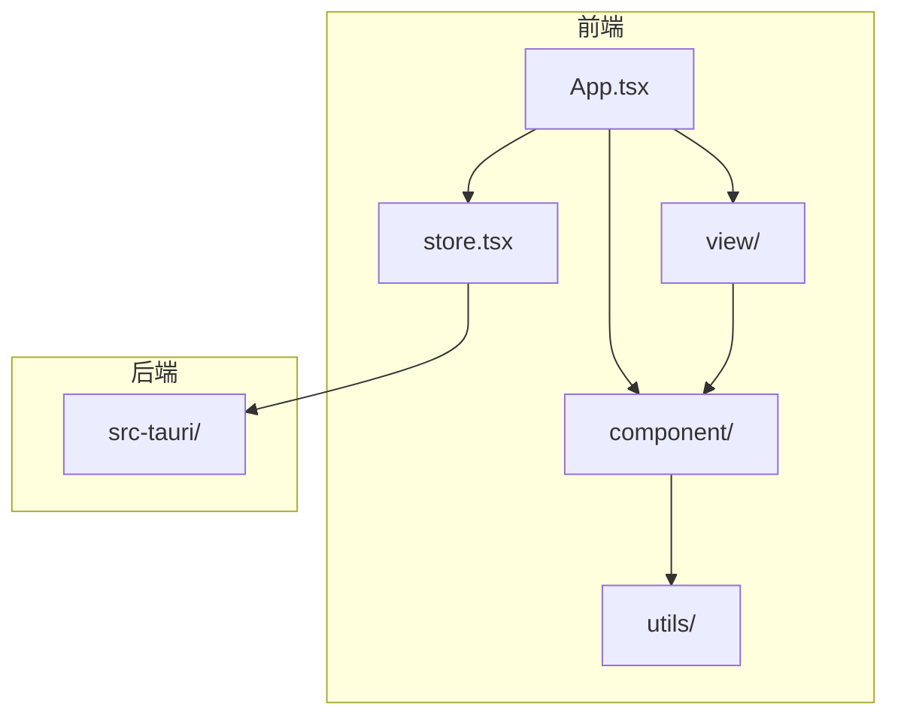
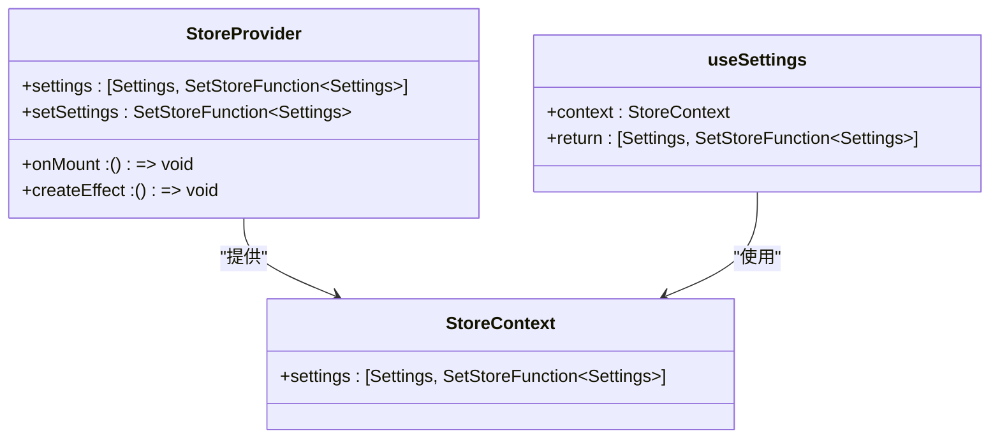
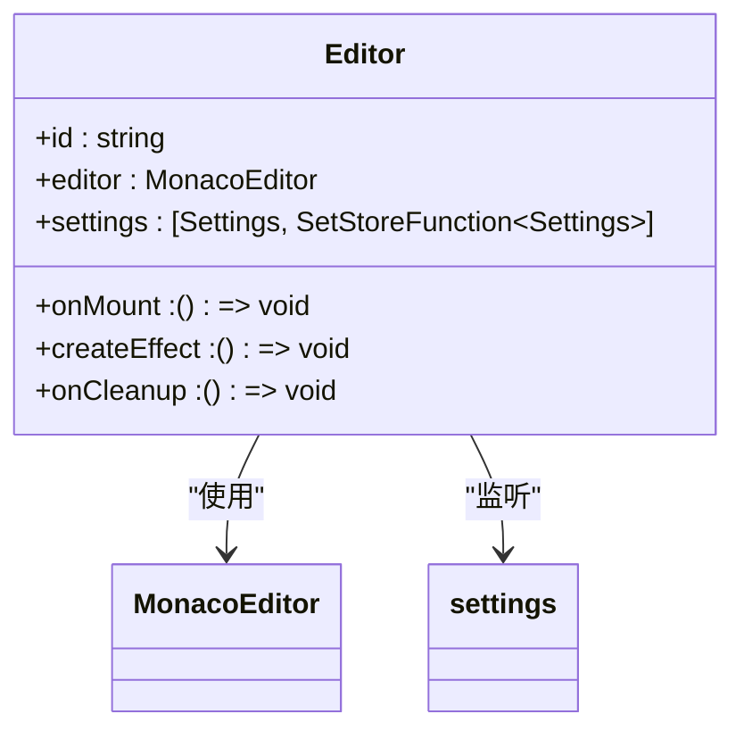
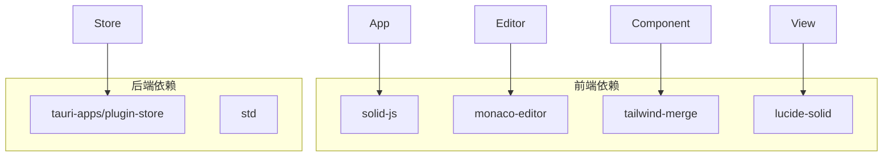

# 性能优化

<cite>
**本文档中引用的文件**  
- [store.tsx](file://src/store.tsx)
- [settings.tsx](file://src/view/settings.tsx)
- [Editor.tsx](file://src/component/Editor.tsx)
- [Config/index.tsx](file://src/component/Config/index.tsx)
- [App.tsx](file://src/App.tsx)
- [index.tsx](file://src/index.tsx)
</cite>

## 目录
1. [简介](#简介)
2. [项目结构](#项目结构)
3. [核心组件](#核心组件)
4. [架构概述](#架构概述)
5. [详细组件分析](#详细组件分析)
6. [依赖分析](#依赖分析)
7. [性能考虑](#性能考虑)
8. [故障排除指南](#故障排除指南)
9. [结论](#结论)

## 简介
本文档详细阐述了devkimi项目中响应式更新的性能优化策略。重点介绍如何通过`untracked`函数避免不必要的计算和渲染，分析在`store.tsx`中状态更新函数的实现如何确保变更的原子性以减少渲染次数。探讨批量更新、惰性计算等优化技术的应用场景和实现方式。提供实际代码示例，展示在复杂状态更新场景下如何优化性能，确保应用的流畅性。

## 项目结构
devkimi项目采用模块化设计，主要分为`src`和`src-tauri`两个目录。`src`目录包含前端组件、视图、工具和状态管理，而`src-tauri`目录则负责后端逻辑和系统集成。前端部分使用SolidJS框架，结合Tauri实现跨平台桌面应用。



**图示来源**
- [App.tsx](file://src/App.tsx#L1-L47)
- [store.tsx](file://src/store.tsx#L1-L88)

**节来源**
- [App.tsx](file://src/App.tsx#L1-L47)
- [store.tsx](file://src/store.tsx#L1-L88)

## 核心组件
devkimi项目的核心组件包括状态管理、配置组件和编辑器组件。状态管理通过`store.tsx`实现，配置组件通过`Config/`目录下的各个组件实现，编辑器组件通过`Editor.tsx`实现。

**节来源**
- [store.tsx](file://src/store.tsx#L1-L88)
- [Editor.tsx](file://src/component/Editor.tsx#L1-L139)
- [Config/index.tsx](file://src/component/Config/index.tsx#L1-L14)

## 架构概述
devkimi项目的架构采用前后端分离的设计，前端使用SolidJS框架，后端使用Tauri框架。前端通过`store.tsx`管理全局状态，通过`App.tsx`作为入口点，加载各个视图和组件。后端通过`src-tauri`目录下的Rust代码实现系统集成和文件操作。


**图示来源**
- [App.tsx](file://src/App.tsx#L1-L47)
- [store.tsx](file://src/store.tsx#L1-L88)

## 详细组件分析
### 状态管理分析
`store.tsx`文件通过`createStore`和`SetStoreFunction`实现状态管理。使用`trackStore`函数来跟踪状态变化，确保只有在状态发生变化时才触发重新渲染。



**图示来源**
- [store.tsx](file://src/store.tsx#L1-L88)

**节来源**
- [store.tsx](file://src/store.tsx#L1-L88)

### 配置组件分析
配置组件通过`Config/`目录下的各个组件实现，包括`Input.tsx`、`Select.tsx`和`Switch.tsx`。这些组件通过`props`接收状态和回调函数，实现用户交互。

```mermaid
classDiagram
class Input {
+value : string
+onInput : (value : string) => void
}
class NumberInput {
+value : number
+onInput : (value : number) => void
}
class Select {
+value : string
+options : {label : string, value : string}[]
+onChange : (value : string) => void
}
class Switch {
+value : boolean
+onChange : (value : boolean) => void
}
Input --> Config : "包含"
NumberInput --> Config : "包含"
Select --> Config : "包含"
Switch --> Config : "包含"
```

**图示来源**
- [Input.tsx](file://src/component/Config/Input.tsx#L1-L37)
- [Select.tsx](file://src/component/Config/Select.tsx#L1-L30)
- [Switch.tsx](file://src/component/Config/Switch.tsx#L1-L24)

**节来源**
- [Input.tsx](file://src/component/Config/Input.tsx#L1-L37)
- [Select.tsx](file://src/component/Config/Select.tsx#L1-L30)
- [Switch.tsx](file://src/component/Config/Switch.tsx#L1-L24)

### 编辑器组件分析
`Editor.tsx`文件通过`monaco-editor`实现代码编辑功能。使用`createEffect`和`onMount`来初始化编辑器和监听状态变化。



**图示来源**
- [Editor.tsx](file://src/component/Editor.tsx#L1-L139)

**节来源**
- [Editor.tsx](file://src/component/Editor.tsx#L1-L139)

## 依赖分析
devkimi项目依赖多个第三方库，包括`solid-js`、`monaco-editor`、`tailwind-merge`等。这些库通过`package.json`和`pnpm-lock.yaml`进行管理。



**图示来源**
- [package.json](file://package.json)
- [pnpm-lock.yaml](file://pnpm-lock.yaml)

**节来源**
- [package.json](file://package.json)
- [pnpm-lock.yaml](file://pnpm-lock.yaml)

## 性能考虑
devkimi项目通过多种方式优化性能，包括使用`untracked`函数避免不必要的计算和渲染，确保状态更新的原子性，减少渲染次数。此外，通过`createEffect`和`onMount`来优化组件的生命周期管理。

**节来源**
- [store.tsx](file://src/store.tsx#L1-L88)
- [Editor.tsx](file://src/component/Editor.tsx#L1-L139)

## 故障排除指南
在开发过程中，可能会遇到一些常见问题，如状态更新不及时、组件渲染异常等。可以通过检查`store.tsx`中的状态管理逻辑，确保`trackStore`函数正确使用，以及检查`Editor.tsx`中的编辑器初始化逻辑。

**节来源**
- [store.tsx](file://src/store.tsx#L1-L88)
- [Editor.tsx](file://src/component/Editor.tsx#L1-L139)

## 结论
devkimi项目通过合理的状态管理和组件设计，实现了高效的响应式更新。通过使用`untracked`函数和`trackStore`函数，有效避免了不必要的计算和渲染，确保了应用的流畅性。未来可以进一步优化批量更新和惰性计算，提升应用性能。