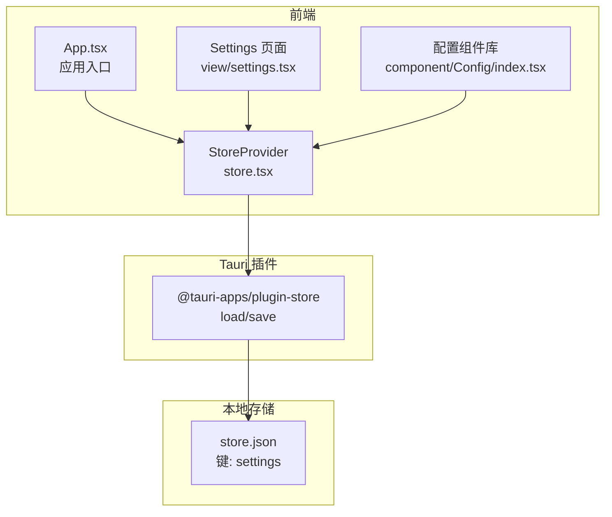
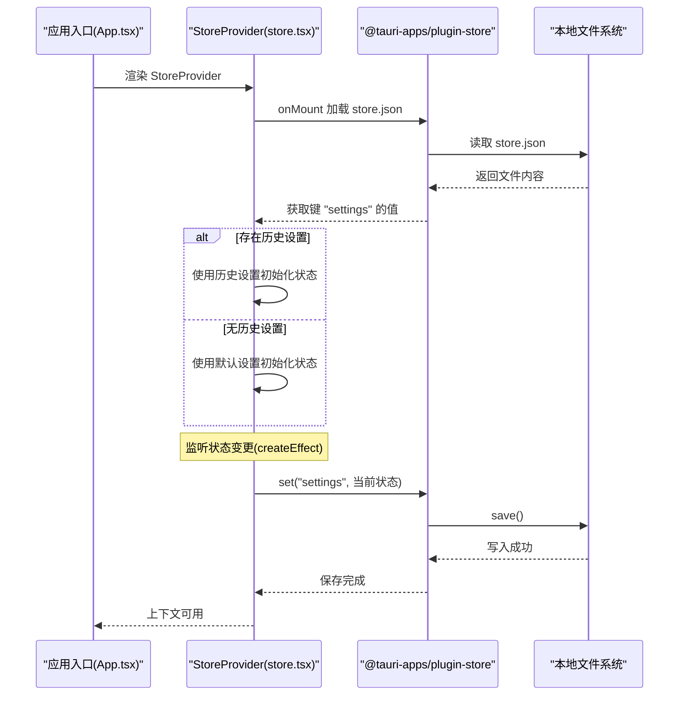
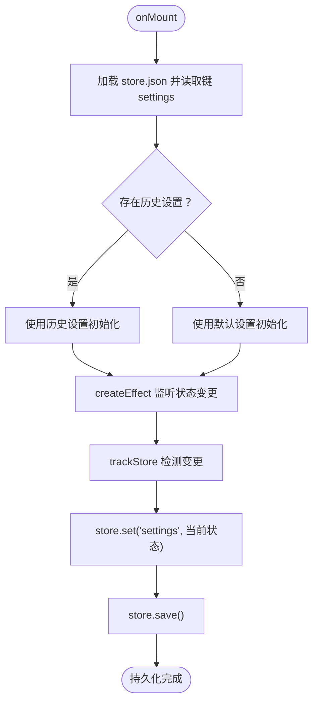
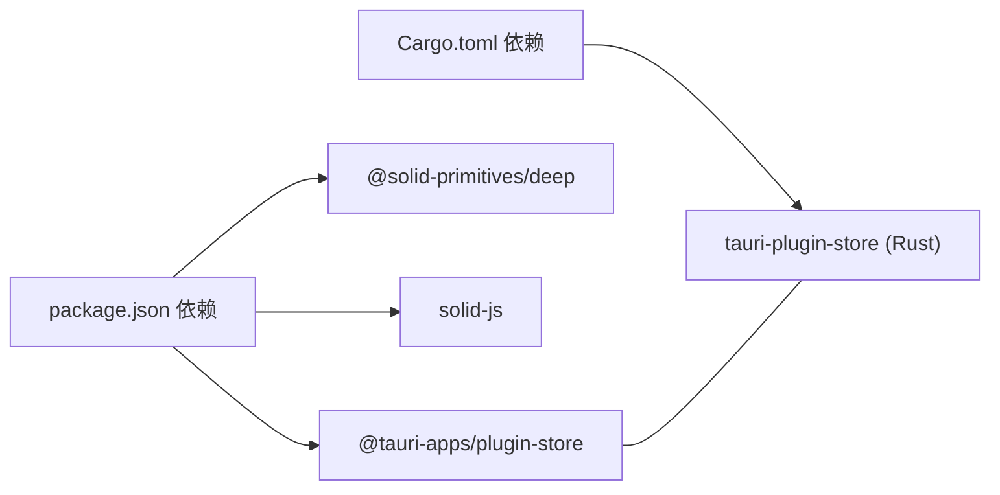

# 持久化机制

<cite>
**本文引用的文件**
- [src/store.tsx](file://src/store.tsx)
- [src/App.tsx](file://src/App.tsx)
- [src/view/settings.tsx](file://src/view/settings.tsx)
- [src/component/Config/index.tsx](file://src/component/Config/index.tsx)
- [package.json](file://package.json)
- [src-tauri/Cargo.toml](file://src-tauri/Cargo.toml)
- [src-tauri/tauri.conf.json](file://src-tauri/tauri.conf.json)
</cite>

## 目录
1. [简介](#简介)
2. [项目结构](#项目结构)
3. [核心组件](#核心组件)
4. [架构总览](#架构总览)
5. [详细组件分析](#详细组件分析)
6. [依赖关系分析](#依赖关系分析)
7. [性能考量](#性能考量)
8. [故障排查指南](#故障排查指南)
9. [结论](#结论)
10. [附录](#附录)

## 简介
本文件系统性地文档化 devkimi 项目的状态持久化机制，重点聚焦于用户设置（如主题偏好、编辑器配置）如何通过 Tauri 插件 store 在本地持久化与恢复。我们将深入解析 store.tsx 中的实现，包括：
- 状态结构与默认值设计
- 序列化与存储键名策略
- 启动时从本地存储恢复状态
- 变更时的同步写入与错误处理
- 数据迁移与兼容性策略
- 安全性与可扩展性建议（如加密、跨设备同步）

同时，结合应用入口与设置页面的使用方式，说明该机制在运行时如何生效，并给出最佳实践与排障建议。

## 项目结构
devkimi 使用 Tauri 作为桌面应用框架，前端采用 SolidJS 构建。状态持久化由 Tauri 的 store 插件负责，前端通过上下文提供者 StoreProvider 提供全局设置状态，应用启动时加载并监听状态变更进行持久化。

图表来源
- [src/App.tsx](file://src/App.tsx#L1-L47)
- [src/store.tsx](file://src/store.tsx#L1-L88)
- [src/view/settings.tsx](file://src/view/settings.tsx#L1-L122)
- [src/component/Config/index.tsx](file://src/component/Config/index.tsx#L1-L37)
- [package.json](file://package.json#L26-L42)
- [src-tauri/Cargo.toml](file://src-tauri/Cargo.toml#L48-L54)

章节来源
- [src/App.tsx](file://src/App.tsx#L1-L47)
- [src/store.tsx](file://src/store.tsx#L1-L88)
- [src/view/settings.tsx](file://src/view/settings.tsx#L1-L122)
- [src/component/Config/index.tsx](file://src/component/Config/index.tsx#L1-L37)
- [package.json](file://package.json#L26-L42)
- [src-tauri/Cargo.toml](file://src-tauri/Cargo.toml#L48-L54)

## 核心组件
- StoreProvider：创建并管理 Settings 状态，负责初始化加载、变更监听与持久化写入。
- useSettings：消费上下文，返回可读写的 settings 元组。
- Settings 页面与配置组件：通过 setSettings 修改设置，触发持久化流程。
- Tauri Store 插件：提供 load、set、save 等方法，用于读取/写入本地 JSON 文件。

章节来源
- [src/store.tsx](file://src/store.tsx#L1-L88)
- [src/view/settings.tsx](file://src/view/settings.tsx#L1-L122)
- [src/component/Config/index.tsx](file://src/component/Config/index.tsx#L1-L37)
- [package.json](file://package.json#L26-L42)
- [src-tauri/Cargo.toml](file://src-tauri/Cargo.toml#L48-L54)

## 架构总览
下面的时序图展示了应用启动与状态持久化的关键流程。

图表来源
- [src/App.tsx](file://src/App.tsx#L1-L47)
- [src/store.tsx](file://src/store.tsx#L45-L88)
- [package.json](file://package.json#L26-L42)
- [src-tauri/Cargo.toml](file://src-tauri/Cargo.toml#L48-L54)

## 详细组件分析

### StoreProvider 与 useSettings 实现
- 状态结构与默认值
  - Settings 类型包含 common 与 editor 两部分，分别承载主题、配置折叠状态与编辑器字体、自动换行等配置。
  - 默认值在初始化时注入，确保首次运行有可用的初始状态。
- 初始化加载
  - onMount 生命周期内异步加载 store.json 并读取键 "settings"；若不存在则回退到默认值。
- 变更监听与持久化
  - 使用 createEffect + trackStore 监听深层状态变更，一旦检测到变化，立即 set("settings", ...) 并 save() 写入本地存储。
  - 写入过程包含基本的错误捕获与日志输出，便于定位问题。
- 主题联动
  - 另一个 createEffect 将 settings.common.theme 同步到 DOM 属性，实现主题即时切换。

图表来源
- [src/store.tsx](file://src/store.tsx#L45-L88)

章节来源
- [src/store.tsx](file://src/store.tsx#L1-L88)

### Settings 页面与配置组件的交互
- Settings 页面通过 useSettings 获取当前设置，并在用户修改时调用 setSettings 进行更新。
- 配置组件（如 Config.Card、Config.Select、Config.Switch 等）内部也消费 useSettings，从而实现统一的状态来源。
- 编辑器预览会根据 settings.editor 的变化动态更新选项（字体、字号、自动换行），体现设置的即时反馈。

章节来源
- [src/view/settings.tsx](file://src/view/settings.tsx#L1-L122)
- [src/component/Config/index.tsx](file://src/component/Config/index.tsx#L1-L37)

### 应用入口与上下文提供
- App.tsx 作为根组件，在其渲染树顶层包裹 StoreProvider，确保整个应用树内的组件都能访问到设置上下文。
- StoreProvider 仅负责状态与持久化，不直接渲染 UI，职责清晰。

章节来源
- [src/App.tsx](file://src/App.tsx#L1-L47)
- [src/store.tsx](file://src/store.tsx#L45-L78)

## 依赖关系分析
- 前端依赖
  - @tauri-apps/plugin-store：提供本地 JSON 文件的读写能力。
  - @solid-primitives/deep：提供 trackStore，用于深度监听 store 变更。
  - solid-js：提供 createStore、createEffect、useContext 等能力。
- Tauri 侧依赖
  - tauri-plugin-store：Rust 侧插件，与前端插件协同工作，负责底层文件 IO。
- 配置文件
  - tauri.conf.json：定义应用构建与安全策略，与 store 无直接耦合，但影响资源协议与作用域。

图表来源
- [package.json](file://package.json#L26-L42)
- [src-tauri/Cargo.toml](file://src-tauri/Cargo.toml#L48-L54)

章节来源
- [package.json](file://package.json#L26-L42)
- [src-tauri/Cargo.toml](file://src-tauri/Cargo.toml#L48-L54)
- [src-tauri/tauri.conf.json](file://src-tauri/tauri.conf.json#L1-L46)

## 性能考量
- 深度监听开销
  - 使用 trackStore 对深层状态进行变更追踪，避免不必要的重渲染；但频繁变更仍可能触发多次写入，建议在高频变更场景下评估节流/去抖策略。
- I/O 次数控制
  - 当前实现每次变更都会执行一次 set + save，对于高频率的设置项（如实时预览）可考虑合并写入或延迟批量保存。
- 初始化成本
  - onMount 一次性读取 store.json，避免重复 IO；若设置项规模扩大，可考虑分段存储或按需加载。

[本节为通用性能讨论，无需特定文件引用]

## 故障排查指南
- 无法读取历史设置
  - 现象：应用启动后未恢复上次主题或编辑器配置。
  - 排查要点：
    - 确认 store.json 是否存在且可读（路径由 Tauri 插件决定）。
    - 检查键 "settings" 是否存在且为合法 JSON。
    - 若键缺失或格式异常，将回退到默认设置。
- 保存失败
  - 现象：控制台出现保存失败日志。
  - 排查要点：
    - 检查文件权限与磁盘空间。
    - 确认 store.json 所在目录可写。
    - 查看 catch 分支的日志输出，定位具体错误原因。
- 主题切换无效
  - 现象：切换主题后 UI 未变化。
  - 排查要点：
    - 确认 StoreProvider 中的主题 effect 已执行。
    - 检查 DOM 属性 data-theme 是否被正确设置。
- 编辑器配置未生效
  - 现象：修改字体/字号/自动换行后预览未更新。
  - 排查要点：
    - 确认 Settings 页面已调用 setSettings。
    - 检查 trackStore 是否正确监听到 editor 子树变更。

章节来源
- [src/store.tsx](file://src/store.tsx#L45-L88)
- [src/view/settings.tsx](file://src/view/settings.tsx#L1-L122)

## 结论
devkimi 的持久化机制以 Tauri Store 插件为核心，通过 StoreProvider 在应用启动时加载历史设置，并在状态变更时自动写回本地存储。该方案具备以下特点：
- 简洁可靠：仅需一个键 "settings" 即可承载全部用户偏好。
- 即时生效：变更监听与写入流程紧密集成，用户体验流畅。
- 易于扩展：未来可在同一 store.json 中新增键或拆分子键，以支持更多设置项与迁移策略。

同时，建议在高频变更场景下引入节流/去抖与批量保存策略，以进一步降低 I/O 开销；在安全性方面，可考虑对敏感设置进行加密存储，并为跨设备同步预留扩展接口。

[本节为总结性内容，无需特定文件引用]

## 附录

### 关键实现路径参考
- 状态结构与默认值定义：[Settings 类型与默认值](file://src/store.tsx#L17-L39)
- 上下文与 Provider：[StoreContext 与 StoreProvider](file://src/store.tsx#L41-L78)
- 初始化加载与持久化写入：[onMount 与 createEffect](file://src/store.tsx#L49-L65)
- 主题同步到 DOM：[主题 effect](file://src/store.tsx#L67-L72)
- 设置页面使用示例：[Settings 页面与配置组件](file://src/view/settings.tsx#L1-L122)
- 配置组件消费设置：[Config.Card 使用 useSettings](file://src/component/Config/index.tsx#L10-L14)
- 应用入口包裹 Provider：[App.tsx](file://src/App.tsx#L26-L40)

### 安全性与可扩展性建议
- 数据加密
  - 对于包含敏感信息的设置，可在写入前进行加密存储，并在读取时解密。
- 存储空间管理
  - 控制 store.json 的体积增长，定期清理无效键或压缩冗余字段。
- 跨设备同步
  - 可通过云端服务或设备间共享目录实现同步；为避免冲突，建议引入版本号与合并策略。
- 数据迁移
  - 当 Settings 结构升级时，可在加载阶段检测旧版本并进行平滑迁移，保证向后兼容。

[本节为通用建议，无需特定文件引用]