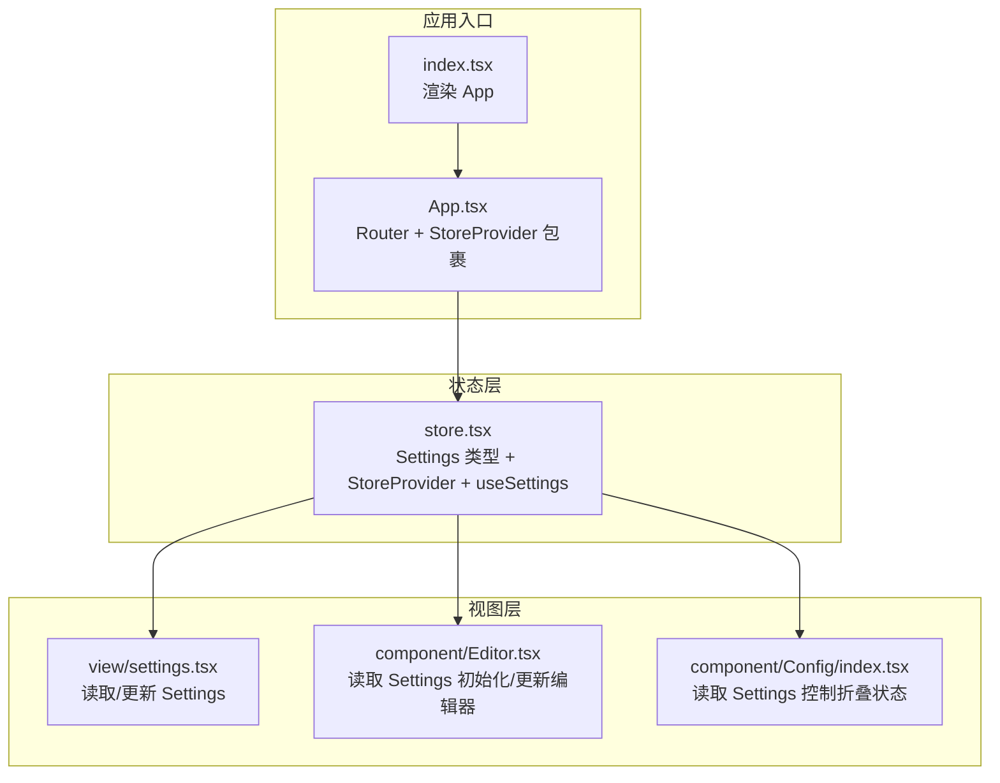
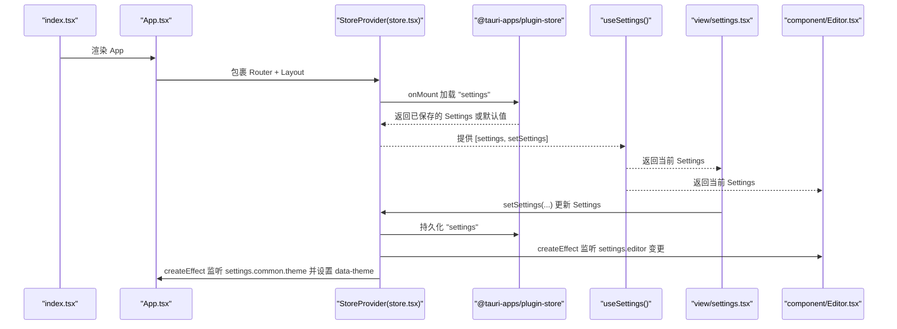
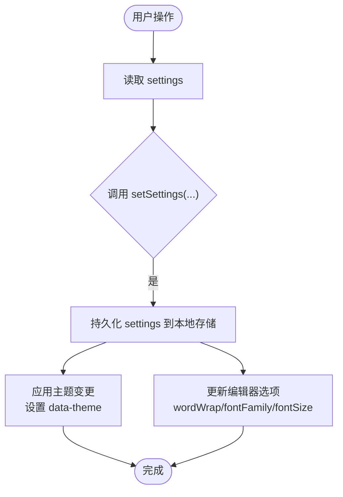
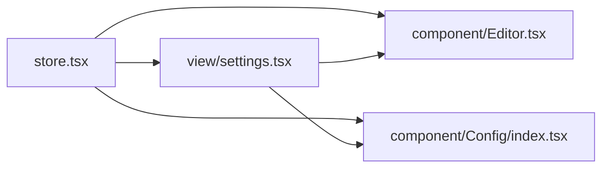

# 状态定义

<cite>
**本文引用的文件**
- [src/store.tsx](file://src/store.tsx)
- [src/App.tsx](file://src/App.tsx)
- [src/index.tsx](file://src/index.tsx)
- [src/view/settings.tsx](file://src/view/settings.tsx)
- [src/component/Editor.tsx](file://src/component/Editor.tsx)
- [src/component/Config/index.tsx](file://src/component/Config/index.tsx)
</cite>

## 目录
1. [简介](#简介)
2. [项目结构](#项目结构)
3. [核心组件](#核心组件)
4. [架构总览](#架构总览)
5. [详细组件分析](#详细组件分析)
6. [依赖关系分析](#依赖关系分析)
7. [性能考量](#性能考量)
8. [故障排查指南](#故障排查指南)
9. [结论](#结论)

## 简介
本文件聚焦于 devkimi 项目中基于 SolidJS 的状态管理机制，重点解析 store.tsx 中定义的全局状态模型与上下文提供者。该状态体系围绕“主题模式（theme）”、“编辑器配置（editorConfig）”、“最近使用的工具（recentTools）”等维度展开，采用类型安全的 Settings 结构体与 SolidJS 的 createStore 提供的响应式状态，结合 @solid-primitives/deep 的深度追踪能力，实现跨组件的统一状态读取与持久化存储。本文将从数据结构设计、初始值设定、类型定义、最佳实践、引用与访问方式等方面进行系统化说明，并给出可直接定位到源码位置的参考路径。

## 项目结构
devkimi 使用 SolidJS + Tauri 架构，应用入口在 index.tsx 中渲染 App；App 将 StoreProvider 作为根级上下文提供者包裹布局与路由；具体视图组件通过 useSettings 钩子从上下文中读取与更新 Settings 状态。编辑器组件 Editor 在初始化时读取 Settings 并在运行期根据状态变化动态更新其选项。

图表来源
- [src/index.tsx](file://src/index.tsx#L1-L37)
- [src/App.tsx](file://src/App.tsx#L1-L47)
- [src/store.tsx](file://src/store.tsx#L1-L88)
- [src/view/settings.tsx](file://src/view/settings.tsx#L1-L122)
- [src/component/Editor.tsx](file://src/component/Editor.tsx#L1-L139)
- [src/component/Config/index.tsx](file://src/component/Config/index.tsx#L1-L37)

章节来源
- [src/index.tsx](file://src/index.tsx#L1-L37)
- [src/App.tsx](file://src/App.tsx#L1-L47)

## 核心组件
本节聚焦 store.tsx 中的状态定义与上下文提供者，涵盖：
- 类型定义：Settings、WordWrap
- 初始值：defaultSettings
- 上下文提供者：StoreProvider
- 访问钩子：useSettings
- 持久化与主题联动：@tauri-apps/plugin-store、trackStore、onMount

关键要点
- Settings 是一个嵌套对象，包含 common 与 editor 两个子域，分别承载主题与编辑器配置。
- WordWrap 为字面量联合类型，限定编辑器换行策略枚举。
- defaultSettings 为 Settings 的默认值，用于首次加载与回退。
- StoreProvider 使用 createStore 创建响应式状态，并在 onMount 时从本地存储加载 Settings；通过 createEffect 与 trackStore 监听变更并持久化。
- useSettings 返回 [settings, setSettings] 元组，供子树组件读取与更新。

章节来源
- [src/store.tsx](file://src/store.tsx#L1-L88)

## 架构总览
下面以序列图展示 Settings 的生命周期：从应用启动、StoreProvider 初始化、状态持久化到主题与编辑器联动更新。

图表来源
- [src/index.tsx](file://src/index.tsx#L1-L37)
- [src/App.tsx](file://src/App.tsx#L1-L47)
- [src/store.tsx](file://src/store.tsx#L1-L88)
- [src/view/settings.tsx](file://src/view/settings.tsx#L1-L122)
- [src/component/Editor.tsx](file://src/component/Editor.tsx#L1-L139)

## 详细组件分析

### 状态模型与类型定义
- Settings 类型
  - 字段：common（主题、配置面板默认展开）、editor（wordWrap、font.family、font.size）
  - 设计意图：将界面主题与编辑器配置分层，便于按需监听与更新
- WordWrap 类型
  - 值域：字面量联合类型，约束编辑器换行策略
- defaultSettings
  - 默认主题：dark
  - 默认编辑器：wordWrap 关闭，字体家族与字号提供合理默认值
- StoreProvider
  - 使用 createStore 初始化 Settings
  - onMount 从本地存储加载 Settings，若无则回退至 defaultSettings
  - createEffect + trackStore 监听 settings 变化并持久化
  - createEffect 监听 settings.common.theme，设置 documentElement 的 data-theme 属性，驱动全局主题切换
- useSettings
  - 从 StoreContext 中取出 [settings, setSettings]，并在未提供 Provider 时抛出错误，避免误用

章节来源
- [src/store.tsx](file://src/store.tsx#L1-L88)

### 状态读取与更新流程（以 Settings 页面为例）
- 读取：在 view/settings.tsx 中通过 useSettings 获取 [settings, setSettings]
- 更新：通过 Config 组件的输入控件触发 setSettings 的路径式更新，例如：
  - 切换主题：setSettings("common", "theme", 新值)
  - 切换配置面板默认展开：setSettings("common", "openConfigCollapse", 新值)
  - 编辑器字体：setSettings("editor", "font", "family", 新值)
  - 编辑器字号：setSettings("editor", "font", "size", 新值)
  - 编辑器换行：setSettings("editor", "wordWrap", 新值)
- 效果：上述更新会触发 Provider 内部的持久化逻辑与主题/编辑器联动效果

图表来源
- [src/view/settings.tsx](file://src/view/settings.tsx#L1-L122)
- [src/store.tsx](file://src/store.tsx#L1-L88)

章节来源
- [src/view/settings.tsx](file://src/view/settings.tsx#L1-L122)

### 编辑器组件对 Settings 的使用
- 初始化：Editor 在 onMount 时读取 settings.common.theme、settings.editor.font.family、settings.editor.font.size、settings.editor.wordWrap，并传入 monaco.editor.create 的构造选项
- 运行期更新：
  - 当 settings.common.theme 变化时，Editor 通过 updateOptions 动态切换编辑器主题
  - 当 settings.editor 发生变化时，Editor 通过 trackStore 监听并批量更新 wordWrap、fontSize、fontFamily 等选项
- 与 Config 卡片联动：Config.Card 读取 settings.common.openConfigCollapse 控制折叠状态，从而影响用户交互体验

章节来源
- [src/component/Editor.tsx](file://src/component/Editor.tsx#L1-L139)
- [src/component/Config/index.tsx](file://src/component/Config/index.tsx#L1-L37)

### 最佳实践与设计建议
- 组织相关状态
  - 将界面主题与编辑器配置拆分为 common 与 editor 子域，降低耦合度，便于按需监听与更新
  - 对于布尔类配置（如 openConfigCollapse），采用语义明确的字段名，提升可读性
- 嵌套信号与路径式更新
  - 使用 createStore 的路径式 set 方法（如 setSettings("editor", "font", "size", 值)）更新嵌套对象，避免手动深拷贝
  - 对于复杂对象，优先使用嵌套结构而非扁平化，减少不必要的重渲染
- 类型系统保障一致性
  - 通过 Settings 与 WordWrap 的字面量联合类型约束，确保状态值域合法
  - 在 Provider 外层统一暴露 useSettings，避免各组件直接依赖底层存储库
- 持久化与副作用
  - 使用 trackStore + createEffect 实现细粒度监听与最小化写入
  - 将主题切换等副作用集中在 Provider 内部，避免分散在多个组件中
- 性能优化
  - 对编辑器等重型组件，仅在必要字段变化时调用 updateOptions，减少重绘
  - 合理拆分 createEffect，避免单个 effect 执行过多无关逻辑

章节来源
- [src/store.tsx](file://src/store.tsx#L1-L88)
- [src/view/settings.tsx](file://src/view/settings.tsx#L1-L122)
- [src/component/Editor.tsx](file://src/component/Editor.tsx#L1-L139)

## 依赖关系分析
- store.tsx
  - 依赖：SolidJS createStore、createEffect、onMount、useContext、createContext
  - 依赖：@solid-primitives/deep 的 trackStore
  - 依赖：@tauri-apps/plugin-store 的 Store.load/save
- view/settings.tsx
  - 依赖：useSettings、Config 组件族、Monaco Editor
- component/Editor.tsx
  - 依赖：useSettings、monaco-editor
- component/Config/index.tsx
  - 依赖：useSettings、Config 组件族

图表来源
- [src/store.tsx](file://src/store.tsx#L1-L88)
- [src/view/settings.tsx](file://src/view/settings.tsx#L1-L122)
- [src/component/Editor.tsx](file://src/component/Editor.tsx#L1-L139)
- [src/component/Config/index.tsx](file://src/component/Config/index.tsx#L1-L37)

章节来源
- [src/store.tsx](file://src/store.tsx#L1-L88)
- [src/view/settings.tsx](file://src/view/settings.tsx#L1-L122)
- [src/component/Editor.tsx](file://src/component/Editor.tsx#L1-L139)
- [src/component/Config/index.tsx](file://src/component/Config/index.tsx#L1-L37)

## 性能考量
- 监听粒度
  - 使用 trackStore 精准监听 settings.editor，避免对整个 settings 的全量重渲染
- 副作用最小化
  - 主题切换与编辑器更新均在 Provider 内部集中处理，减少组件内重复逻辑
- 初始化时机
  - onMount 一次性加载并设置初始状态，避免首屏闪烁或重复请求
- 编辑器更新策略
  - 仅在必要时调用 updateOptions，避免频繁重建编辑器实例

[本节为通用指导，不直接分析具体文件]

## 故障排查指南
- 缺少 StoreProvider
  - 现象：调用 useSettings 抛出异常
  - 排查：确认 App.tsx 已将 StoreProvider 作为根级 Provider 包裹
  - 参考路径：[src/App.tsx](file://src/App.tsx#L1-L47)
- 本地存储读取失败
  - 现象：设置未生效或恢复默认值
  - 排查：检查 @tauri-apps/plugin-store 的 load/save 是否成功；确认文件权限与路径正确
  - 参考路径：[src/store.tsx](file://src/store.tsx#L1-L88)
- 主题未切换
  - 现象：切换主题后页面未变色
  - 排查：确认 Provider 内部的 createEffect 已监听 settings.common.theme 并设置 data-theme
  - 参考路径：[src/store.tsx](file://src/store.tsx#L1-L88)
- 编辑器未随设置更新
  - 现象：修改字体/字号/换行后编辑器未变化
  - 排查：确认 Editor 组件已读取最新 settings，并在 Provider 内部有针对 settings.editor 的监听与更新
  - 参考路径：[src/component/Editor.tsx](file://src/component/Editor.tsx#L1-L139)，[src/store.tsx](file://src/store.tsx#L1-L88)

章节来源
- [src/App.tsx](file://src/App.tsx#L1-L47)
- [src/store.tsx](file://src/store.tsx#L1-L88)
- [src/component/Editor.tsx](file://src/component/Editor.tsx#L1-L139)

## 结论
devkimi 的状态管理以 Settings 为核心，借助 SolidJS 的 createStore 与 @solid-primitives/deep 的 trackStore，实现了类型安全、可维护且高性能的全局状态体系。通过 StoreProvider 将状态持久化与主题/编辑器联动封装在统一入口，配合 useSettings 钩子，使各视图与组件能够以声明式的方式读取与更新状态。遵循本文所述的最佳实践（嵌套结构、路径式更新、类型约束、副作用集中），可在保持代码清晰的同时获得良好的扩展性与可维护性。