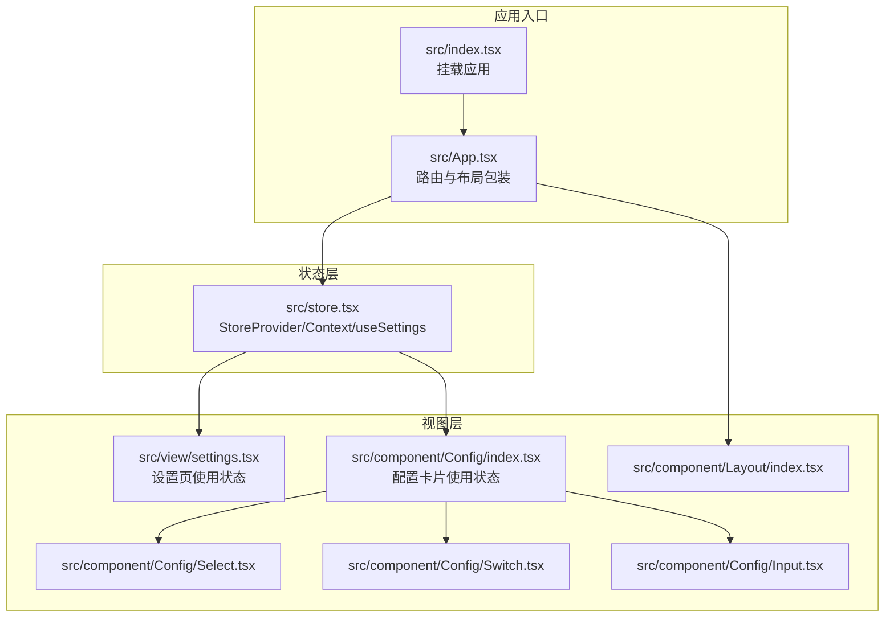
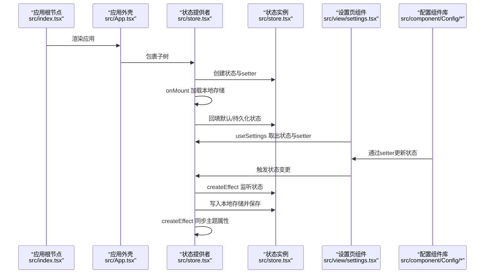
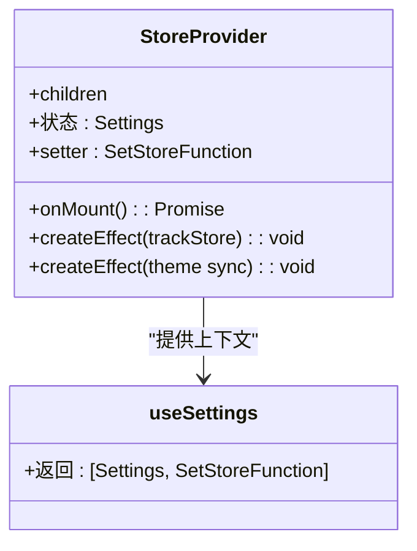
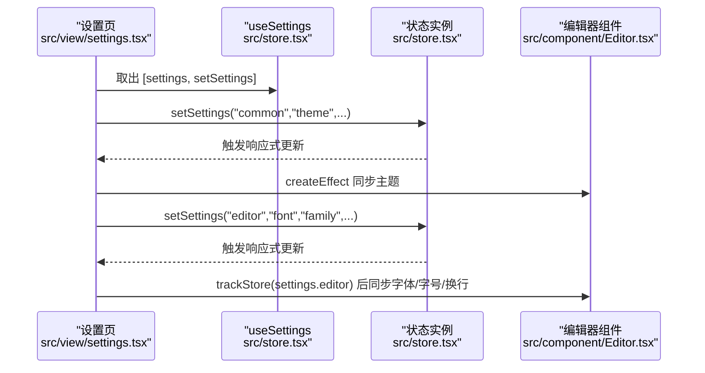
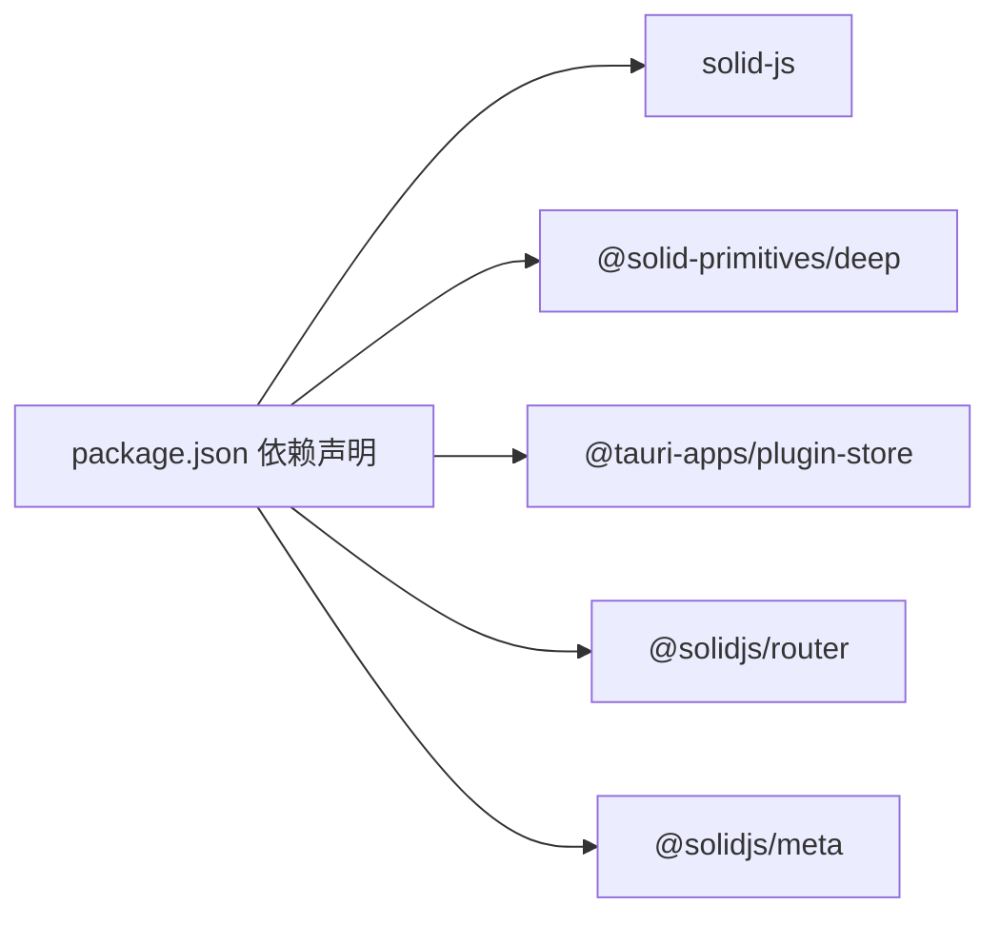

# 状态管理

<cite>
**本文引用的文件**
- [src/store.tsx](file://src/store.tsx)
- [src/App.tsx](file://src/App.tsx)
- [src/index.tsx](file://src/index.tsx)
- [src/view/settings.tsx](file://src/view/settings.tsx)
- [src/component/Config/index.tsx](file://src/component/Config/index.tsx)
- [src/component/Config/Select.tsx](file://src/component/Config/Select.tsx)
- [src/component/Config/Switch.tsx](file://src/component/Config/Switch.tsx)
- [src/component/Config/Input.tsx](file://src/component/Config/Input.tsx)
- [src/component/Layout/index.tsx](file://src/component/Layout/index.tsx)
- [package.json](file://package.json)
- [tsconfig.json](file://tsconfig.json)
- [vite.config.ts](file://vite.config.ts)
</cite>

## 目录
1. [简介](#简介)
2. [项目结构](#项目结构)
3. [核心组件](#核心组件)
4. [架构总览](#架构总览)
5. [详细组件分析](#详细组件分析)
6. [依赖分析](#依赖分析)
7. [性能考虑](#性能考虑)
8. [故障排查指南](#故障排查指南)
9. [结论](#结论)
10. [附录](#附录)

## 简介
本文件系统性梳理 devkimi 项目的全局状态管理实现，聚焦于基于 SolidJS 信号与 store 的响应式状态模型。重点说明：
- 全局状态 Store 的定义、初始化、更新与持久化流程
- 主题、编辑器配置等状态如何在应用内共享与驱动 UI 响应
- 状态与 UI 组件的绑定原理，以及如何避免不必要的重新渲染
- 状态流与依赖关系的可视化架构图，并给出实际使用路径示例

## 项目结构
围绕状态管理的关键文件组织如下：
- 状态定义与提供者：src/store.tsx
- 应用入口与路由：src/index.tsx、src/App.tsx
- 设置页与配置组件：src/view/settings.tsx、src/component/Config/*
- 构建与运行配置：vite.config.ts、tsconfig.json、package.json

图表来源
- [src/index.tsx](file://src/index.tsx#L1-L37)
- [src/App.tsx](file://src/App.tsx#L1-L47)
- [src/store.tsx](file://src/store.tsx#L1-L88)
- [src/view/settings.tsx](file://src/view/settings.tsx#L1-L122)
- [src/component/Config/index.tsx](file://src/component/Config/index.tsx#L1-L14)
- [src/component/Config/Select.tsx](file://src/component/Config/Select.tsx#L1-L30)
- [src/component/Config/Switch.tsx](file://src/component/Config/Switch.tsx#L1-L24)
- [src/component/Config/Input.tsx](file://src/component/Config/Input.tsx#L1-L37)
- [src/component/Layout/index.tsx](file://src/component/Layout/index.tsx#L1-L26)

章节来源
- [src/index.tsx](file://src/index.tsx#L1-L37)
- [src/App.tsx](file://src/App.tsx#L1-L47)
- [src/store.tsx](file://src/store.tsx#L1-L88)

## 核心组件
- 全局状态类型与默认值：定义主题、编辑器换行、字体家族与字号等字段，并提供默认值。
- StoreProvider：创建并持有全局状态，负责：
  - 初始化：启动时加载本地持久化数据并回填到状态
  - 持久化：监听状态变化，将最新状态写入本地存储并保存
  - 主题同步：根据状态变更动态设置页面主题属性
- useSettings Hook：从上下文中读取状态与 setter，供组件消费

章节来源
- [src/store.tsx](file://src/store.tsx#L1-L88)

## 架构总览
下图展示了状态流与依赖关系，体现“初始化—更新—持久化—主题同步”的闭环。

图表来源
- [src/index.tsx](file://src/index.tsx#L1-L37)
- [src/App.tsx](file://src/App.tsx#L1-L47)
- [src/store.tsx](file://src/store.tsx#L1-L88)
- [src/view/settings.tsx](file://src/view/settings.tsx#L1-L122)
- [src/component/Config/index.tsx](file://src/component/Config/index.tsx#L1-L14)

## 详细组件分析

### StoreProvider 与 useSettings
- 提供者职责
  - 使用 SolidJS 的 createStore 创建可响应的 Settings 结构
  - 在 onMount 生命周期中加载本地存储并回填状态
  - 使用 createEffect 与 trackStore 监听状态深层变化，异步写入本地存储并保存
  - 使用另一个 createEffect 将当前主题同步到 html 根元素的 data-theme 属性
- Hook 使用
  - useSettings 返回 [settings, setSettings]，组件通过解构直接消费与更新

图表来源
- [src/store.tsx](file://src/store.tsx#L1-L88)

章节来源
- [src/store.tsx](file://src/store.tsx#L1-L88)

### 设置页 Settings 与配置组件
- 设置页通过 useSettings 获取状态与 setter
- 使用 createEffect 监听主题变化并同步到编辑器
- 使用 trackStore(settings.editor) 仅对编辑器子树进行深度跟踪，减少无关重渲染
- 配置组件库提供 Select、Switch、NumberInput 等，均通过 setter 更新对应字段

图表来源
- [src/view/settings.tsx](file://src/view/settings.tsx#L1-L122)
- [src/store.tsx](file://src/store.tsx#L1-L88)

章节来源
- [src/view/settings.tsx](file://src/view/settings.tsx#L1-L122)
- [src/component/Config/Select.tsx](file://src/component/Config/Select.tsx#L1-L30)
- [src/component/Config/Switch.tsx](file://src/component/Config/Switch.tsx#L1-L24)
- [src/component/Config/Input.tsx](file://src/component/Config/Input.tsx#L1-L37)

### 布局与上下文传播
- App.tsx 作为路由根包装，内部以 StoreProvider 包裹 Layout 与路由内容，确保所有子树均可访问状态
- Layout 作为容器组件，承载侧边栏与内容区，不直接消费状态，但处于状态可见范围内

章节来源
- [src/App.tsx](file://src/App.tsx#L1-L47)
- [src/component/Layout/index.tsx](file://src/component/Layout/index.tsx#L1-L26)

## 依赖分析
- 运行时依赖
  - @solid-primitives/deep：提供深度跟踪能力，用于精确触发编辑器相关更新
  - @tauri-apps/plugin-store：提供跨平台本地存储能力，支持 JSON 文件持久化
  - @solidjs/router：路由系统，配合 Suspense 实现懒加载与错误边界
  - @solidjs/meta：页面元信息管理
- 构建与开发依赖
  - vite-plugin-solid：SolidJS 开发体验增强
  - solid-devtools：调试工具
  - tailwindcss 系列：样式工具链

图表来源
- [package.json](file://package.json#L1-L43)

章节来源
- [package.json](file://package.json#L1-L43)

## 性能考虑
- 深度跟踪与最小化更新
  - 对编辑器配置使用 trackStore(settings.editor)，仅在编辑器子树发生变化时触发更新，避免整树重渲染
- 效果与资源的合理使用
  - createEffect 用于副作用（持久化与主题同步），避免在渲染阶段执行昂贵逻辑
  - createResource 用于异步获取系统字体列表，避免阻塞渲染
- 响应式粒度
  - 通过按路径更新（如 setSettings("common","theme",...)）实现细粒度状态变更，降低不必要的订阅者刷新
- 构建与运行时优化
  - Vite + Solid 插件提供快速热更新与按需打包
  - Tailwind 工具链减少样式开销

章节来源
- [src/store.tsx](file://src/store.tsx#L1-L88)
- [src/view/settings.tsx](file://src/view/settings.tsx#L1-L122)
- [vite.config.ts](file://vite.config.ts#L1-L14)
- [tsconfig.json](file://tsconfig.json#L1-L20)

## 故障排查指南
- 缺少 StoreProvider
  - 症状：调用 useSettings 抛出异常
  - 排查：确认 App.tsx 中已包裹 StoreProvider
- 本地存储读取失败
  - 症状：初始化时未回填预期状态
  - 排查：检查 onMount 加载逻辑与文件权限；确认 store.json 存在且可读
- 持久化失败
  - 症状：控制台出现保存失败日志
  - 排查：检查 store.set(...).save(...) 的调用链与 catch 分支；确认插件可用
- 主题未生效
  - 症状：切换主题后 UI 无变化
  - 排查：确认 createEffect 是否执行；检查 html 根元素 data-theme 属性是否更新

章节来源
- [src/store.tsx](file://src/store.tsx#L1-L88)
- [src/App.tsx](file://src/App.tsx#L1-L47)

## 结论
devkimi 的状态管理以 SolidJS 为核心，结合 @solid-primitives/deep 的深度跟踪与 @tauri-apps/plugin-store 的本地持久化，实现了：
- 明确的初始化—更新—持久化—主题同步闭环
- 精准的响应式绑定与最小化重渲染
- 良好的扩展性与可维护性

建议在新增状态时：
- 明确状态粒度，优先使用路径式更新
- 对复杂子树使用深度跟踪，避免整树刷新
- 将副作用放入 createEffect，保持渲染纯函数特性

## 附录
- 状态使用模式与最佳实践
  - 在组件中通过 useSettings 获取 [settings, setSettings]
  - 使用路径式 setter 更新具体字段，如 setSettings("common","theme",...)
  - 对编辑器配置使用 trackStore(settings.editor) 进行深度跟踪
  - 将持久化与主题同步放在 createEffect 中，避免在渲染阶段执行
  - 通过 StoreProvider 将状态注入至路由根，保证全应用可用

章节来源
- [src/store.tsx](file://src/store.tsx#L1-L88)
- [src/view/settings.tsx](file://src/view/settings.tsx#L1-L122)
- [src/component/Config/index.tsx](file://src/component/Config/index.tsx#L1-L14)