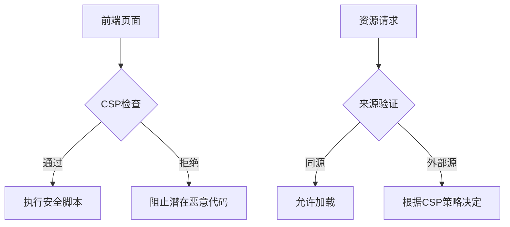
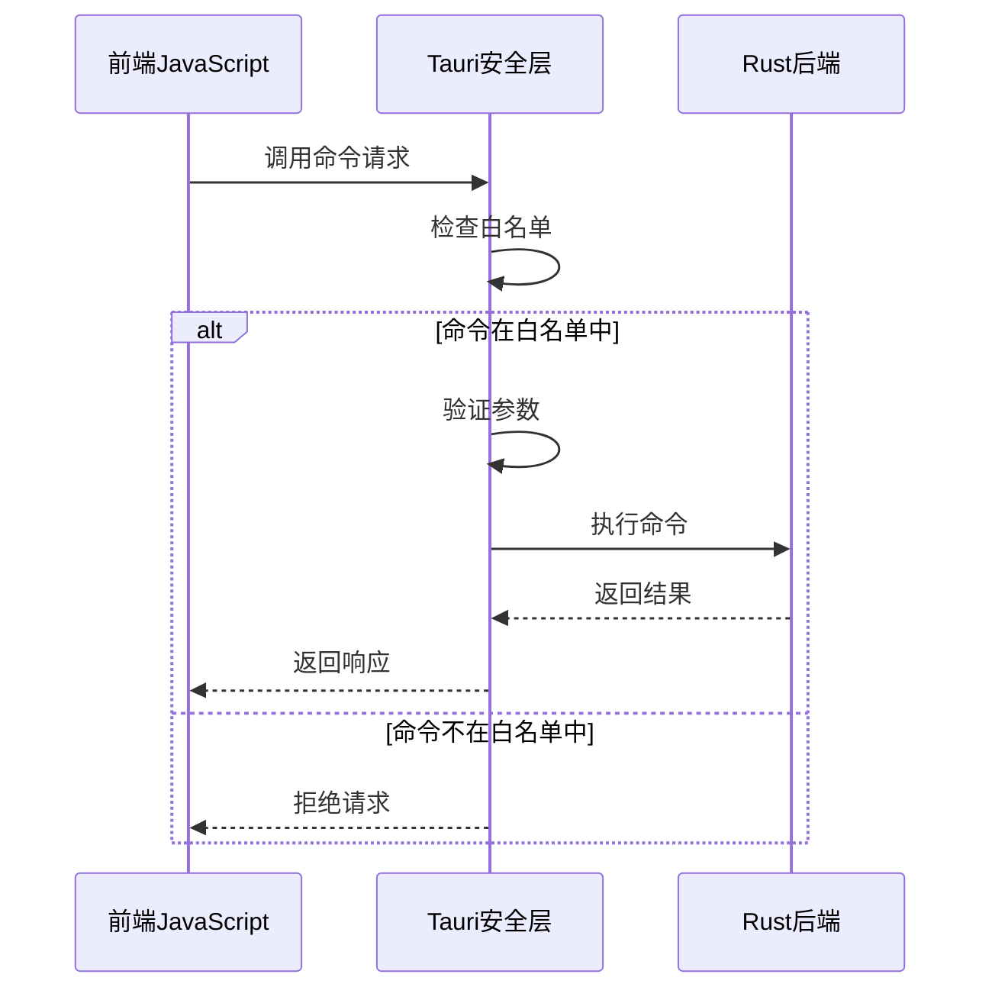
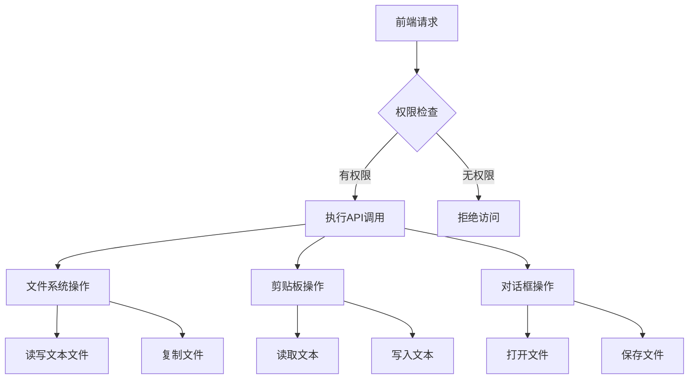
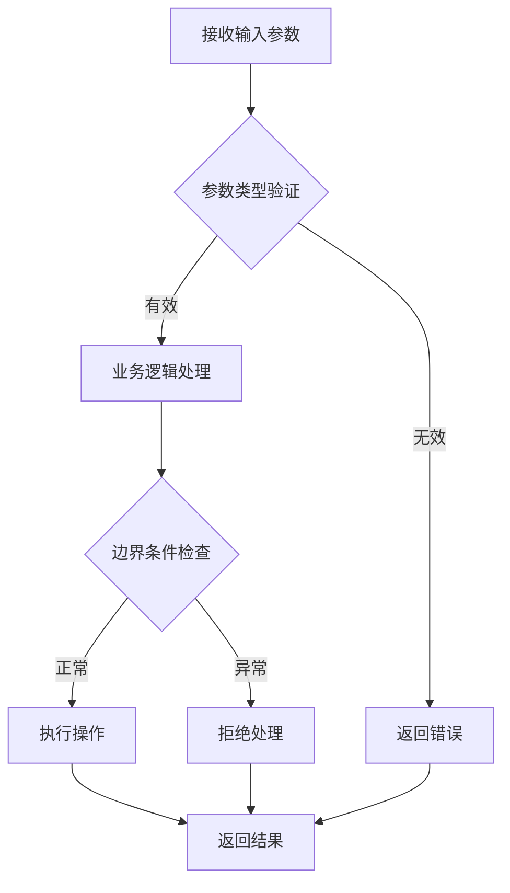
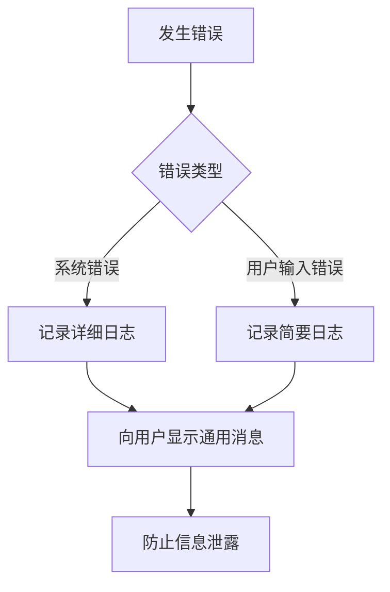

# 安全控制

<cite>
**本文档中引用的文件**  
- [tauri.conf.json](file://src-tauri/tauri.conf.json)
- [lib.rs](file://src-tauri/src/lib.rs)
- [main.rs](file://src-tauri/src/main.rs)
- [default.json](file://src-tauri/capabilities/default.json)
- [fs.rs](file://src-tauri/src/command/fs.rs)
- [password.rs](file://src-tauri/src/command/generator/password.rs)
- [jsonpath.rs](file://src-tauri/src/command/text/jsonpath.rs)
- [rsa.rs](file://src-tauri/src/command/crypto/rsa.rs)
- [error.rs](file://src-tauri/src/error.rs)
- [desktop-schema.json](file://src-tauri/gen/schemas/desktop-schema.json)
- [base64_text.ts](file://src/command/codec/base64_text.ts)
- [fs.ts](file://src/command/fs.ts)
</cite>

## 目录
1. [引言](#引言)
2. [Tauri安全模型概述](#tauri安全模型概述)
3. [tauri.conf.json安全配置](#tauriconfjson安全配置)
4. [命令白名单机制](#命令白名单机制)
5. [核心API访问控制](#核心api访问控制)
6. [事件监听器权限控制](#事件监听器权限控制)
7. [输入验证与注入防护](#输入验证与注入防护)
8. [安全配置最佳实践](#安全配置最佳实践)
9. [结论](#结论)

## 引言

devkimi项目是一个基于Tauri框架构建的桌面应用程序，旨在提供多种开发工具功能。本文档深入分析该项目的通信安全控制机制，重点关注Tauri框架的安全模型和配置策略。通过详细解析tauri.conf.json中的安全配置项、命令白名单机制、核心API访问控制以及输入验证策略，本文档为开发者提供了全面的安全实践指南，确保应用程序在提供强大功能的同时保持高水平的安全性。

**中文(中文)**

## Tauri安全模型概述

Tauri框架采用了一种基于能力的安全模型，通过严格的权限控制和隔离机制来保护桌面应用程序。该模型的核心思想是"最小权限原则"，即只授予应用程序组件完成其功能所必需的最低权限。Tauri通过前端与后端之间的安全通信通道实现这一目标，所有从JavaScript到Rust的调用都必须经过明确的授权和验证。

在devkimi项目中，Tauri的安全模型体现在多个层面：配置文件中的安全策略、Rust后端的命令注册机制、能力系统（capabilities）的权限分配，以及前端与后端之间的通信协议。这种多层次的安全架构有效防止了未经授权的系统访问和潜在的安全漏洞。

**Section sources**
- [tauri.conf.json](file://src-tauri/tauri.conf.json)
- [lib.rs](file://src-tauri/src/lib.rs)

## tauri.conf.json安全配置

### CSP（内容安全策略）

在devkimi项目的tauri.conf.json配置文件中，CSP（内容安全策略）被设置为null，这意味着应用程序使用Tauri的默认CSP策略。Tauri的默认CSP提供了基本的防护，禁止内联脚本执行和eval函数调用，有效防止跨站脚本（XSS）攻击。虽然当前配置未自定义CSP，但在生产环境中建议设置更严格的策略，例如：

```json
"csp": "default-src 'self'; script-src 'self'; object-src 'none';"
```

这种策略进一步限制了资源加载来源，只允许从应用程序自身加载内容，增强了安全性。

### localhostAccess和securityDistPath

在当前配置中，`localhostAccess`并未显式设置，因此遵循Tauri的默认行为。`assetProtocol`配置启用了对临时目录的访问，范围限定在`$TEMP/**`，这为应用程序提供了必要的临时文件操作能力，同时限制了访问范围，防止对系统其他区域的未授权访问。

`securityDistPath`在配置中未直接出现，但通过`build.frontendDist`设置为"../dist"，这定义了生产环境下的前端资源路径。正确的分发路径配置对于防止路径遍历攻击至关重要，确保只有预期的静态资源被提供服务。



**Diagram sources**
- [tauri.conf.json](file://src-tauri/tauri.conf.json)

**Section sources**
- [tauri.conf.json](file://src-tauri/tauri.conf.json)

## 命令白名单机制

### 命令注册与调用控制

Tauri框架的核心安全特性之一是命令白名单机制，该机制防止未授权的Rust函数调用。在devkimi项目中，所有可从JavaScript调用的Rust函数都必须通过`tauri::generate_handler!`宏显式注册。这种白名单方法确保只有经过审查和授权的函数才能被前端调用。

在src-tauri/src/lib.rs文件中，可以看到所有暴露给前端的命令都被明确列出：

```rust
.invoke_handler(tauri::generate_handler![
    command::fs::open_file,
    command::fs::copy_file,
    command::formatter::json::format_json,
    // ... 其他命令
])
```

这种方法有效防止了任意代码执行攻击，因为攻击者无法调用未在白名单中声明的Rust函数。

### 命令执行流程

当JavaScript代码尝试调用Rust命令时，Tauri会执行以下安全检查流程：
1. 验证命令是否在白名单中注册
2. 检查调用上下文是否具有执行该命令的权限
3. 验证参数类型和格式是否符合预期
4. 执行命令并返回结果

这种严格的执行流程确保了只有合法的、预期的函数调用才能成功执行。



**Diagram sources**
- [lib.rs](file://src-tauri/src/lib.rs)

**Section sources**
- [lib.rs](file://src-tauri/src/lib.rs)

## 核心API访问控制

### Allowlist配置与API启用

Tauri通过allowlist配置来控制对核心API的访问。在devkimi项目中，通过插件系统按需启用特定功能，而不是全局开放所有API。这种细粒度的访问控制策略显著降低了安全风险。

在lib.rs文件中，可以看到项目通过插件方式启用了多个核心功能：

```rust
.plugin(tauri_plugin_store::Builder::new().build())
.plugin(tauri_plugin_opener::init())
.plugin(tauri_plugin_fs::init())
.plugin(tauri_plugin_clipboard_manager::init())
.plugin(tauri_plugin_dialog::init())
```

每个插件都代表一组相关的API功能，开发者可以根据需要选择性启用。

### 安全考量与权限分配

通过capabilities/default.json文件，项目定义了详细的权限分配策略：

```json
"permissions": [
    "core:default",
    "clipboard-manager:allow-write-text",
    "clipboard-manager:allow-read-text",
    "dialog:allow-open",
    "dialog:allow-save",
    "fs:allow-read-text-file",
    "fs:allow-write-text-file",
    "fs:allow-copy-file"
]
```

这种基于能力的权限系统允许精确控制每个功能的访问级别。例如：
- 文件系统访问被限制为读写文本文件和复制文件
- 剪贴板操作被明确授权读写文本
- 对话框功能仅允许打开和保存操作

这种最小权限分配原则确保了即使某个组件被攻破，攻击者也无法获得超出其功能需求的系统权限。



**Diagram sources**
- [lib.rs](file://src-tauri/src/lib.rs)
- [default.json](file://src-tauri/capabilities/default.json)

**Section sources**
- [lib.rs](file://src-tauri/src/lib.rs)
- [default.json](file://src-tauri/capabilities/default.json)

## 事件监听器权限控制

### Setup函数中的事件管理

在Tauri应用的setup函数中，可以配置事件监听器的权限控制。虽然devkimi项目在当前setup实现中主要处理调试日志插件的初始化，但Tauri框架提供了强大的事件权限控制机制。

通过schema文件中的权限定义，可以控制事件相关的操作：

```json
"core:event:deny-emit"
"core:event:deny-emit-to"
"core:event:deny-listen"
"core:event:deny-unlisten"
```

这些权限设置允许开发者禁止前端代码发射事件、向特定目标发射事件或监听事件，从而防止潜在的事件驱动攻击。

### 事件安全策略

合理的事件安全策略应该：
1. 默认禁止不必要的事件操作
2. 只允许特定组件监听关键事件
3. 验证事件载荷的内容和格式
4. 限制事件的传播范围

虽然当前项目未显式配置这些限制，但在复杂应用中实施这些策略可以有效防止事件劫持和滥用。

**Section sources**
- [lib.rs](file://src-tauri/src/lib.rs)
- [desktop-schema.json](file://src-tauri/gen/schemas/desktop-schema.json)

## 输入验证与注入防护

### 自定义命令的输入验证

在devkimi项目中，各个Rust命令实现了适当的输入验证机制来防止注入攻击。以文件操作命令为例，fs.rs文件中的copy_file函数对输入路径进行了验证：

```rust
pub fn copy_file(from: &str, to: &str) -> Result<(), Error> {
    let from = PathBuf::from(from);
    let mut to = PathBuf::from(to);
    // ... 路径验证逻辑
}
```

该函数将字符串路径转换为PathBuf类型，这有助于防止简单的路径遍历攻击。同时，函数内部对目标路径是否为目录进行了检查，并相应地处理文件名。

### 参数验证模式

分析各个命令实现，可以总结出以下输入验证模式：

1. **密码生成命令**（password.rs）：
   - 验证密码长度和大小参数
   - 检查字符集选择的有效性
   - 过滤排除字符

2. **JSONPath解析命令**（jsonpath.rs）：
   - 使用serde_json验证JSON格式
   - 验证JSONPath表达式语法
   - 处理解析错误

3. **RSA加密命令**（rsa.rs）：
   - 验证密钥格式
   - 检查密钥大小
   - 验证Base64编码

这些验证机制共同构成了多层次的输入防护体系，有效防止了各种注入攻击。



**Diagram sources**
- [fs.rs](file://src-tauri/src/command/fs.rs)
- [password.rs](file://src-tauri/src/command/generator/password.rs)
- [jsonpath.rs](file://src-tauri/src/command/text/jsonpath.rs)
- [rsa.rs](file://src-tauri/src/command/crypto/rsa.rs)

**Section sources**
- [fs.rs](file://src-tauri/src/command/fs.rs)
- [password.rs](file://src-tauri/src/command/generator/password.rs)
- [jsonpath.rs](file://src-tauri/src/command/text/jsonpath.rs)
- [rsa.rs](file://src-tauri/src/command/crypto/rsa.rs)

## 安全配置最佳实践

### 生产环境CSP策略

对于devkimi项目，建议在生产环境中采用更严格的CSP策略：

```json
"csp": "default-src 'self'; script-src 'self' 'unsafe-eval'; style-src 'self' 'unsafe-inline'; img-src 'self' data:; font-src 'self'; object-src 'none'; frame-ancestors 'none';"
```

此策略提供了以下安全增强：
- 只允许从同源加载资源
- 禁止object、embed和applet标签
- 防止页面被嵌入到iframe中
- 明确允许data URL用于图片

### 敏感API访问控制

基于项目当前实现，建议的敏感API访问控制策略包括：

1. **文件系统访问**：
   - 限制为应用程序特定目录
   - 避免全局文件系统访问权限
   - 实施路径白名单机制

2. **剪贴板访问**：
   - 仅在必要时请求剪贴板权限
   - 清楚告知用户剪贴板访问的目的
   - 及时释放剪贴板句柄

3. **网络访问**：
   - 明确声明需要访问的远程域名
   - 避免通配符域名权限
   - 使用HTTPS强制加密传输

### 错误信息脱敏处理

在error.rs文件中，项目使用了自定义错误处理宏：

```rust
#[macro_export]
macro_rules! command_error {
    ($(($ident:ident, $msg:literal $(, $($tt:tt)*)?)),+ $(,)?) => {
        #[derive(Debug, thiserror::Error)]
        pub enum Error {
            $(
                #[error($msg)]
                $ident$(($($tt)*))?,
            )+
        }
    };
}
```

这种错误处理机制应该配合错误信息脱敏策略：
1. 避免向用户暴露详细的系统错误信息
2. 使用通用错误消息代替技术细节
3. 在日志中记录完整错误，但向用户显示简化版本
4. 防止通过错误消息泄露路径、配置或其他敏感信息

例如，文件操作失败时应返回"文件操作失败"而非具体的系统错误详情。



**Diagram sources**
- [error.rs](file://src-tauri/src/error.rs)

**Section sources**
- [tauri.conf.json](file://src-tauri/tauri.conf.json)
- [error.rs](file://src-tauri/src/error.rs)

## 结论

devkimi项目基于Tauri框架构建了一个功能丰富的开发工具集，其安全架构体现了现代桌面应用程序的安全最佳实践。通过分析项目的通信安全控制机制，我们可以总结出以下关键点：

1. **配置驱动的安全策略**：通过tauri.conf.json文件集中管理安全配置，特别是CSP策略和资源访问控制。

2. **命令白名单机制**：所有Rust函数调用都必须通过显式注册，有效防止了未授权的后端访问。

3. **细粒度权限控制**：通过capabilities系统实现基于能力的权限管理，遵循最小权限原则。

4. **输入验证与防护**：各个命令实现中包含了适当的输入验证逻辑，防止注入攻击。

5. **分层安全架构**：从前端到后端的每一层都实施了相应的安全控制措施。

为了进一步提升安全性，建议项目团队：
- 在生产环境中实施更严格的CSP策略
- 定期审查和更新权限配置
- 加强错误信息的脱敏处理
- 实施更完善的输入验证机制
- 定期进行安全审计和渗透测试

通过持续改进这些安全实践，devkimi项目可以在提供强大功能的同时，确保用户数据和系统安全得到充分保护。