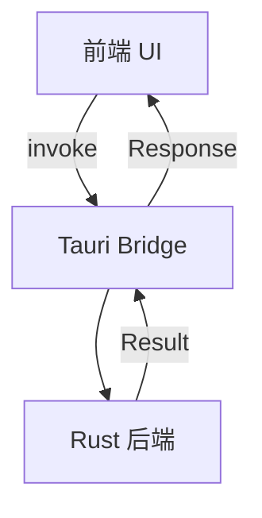
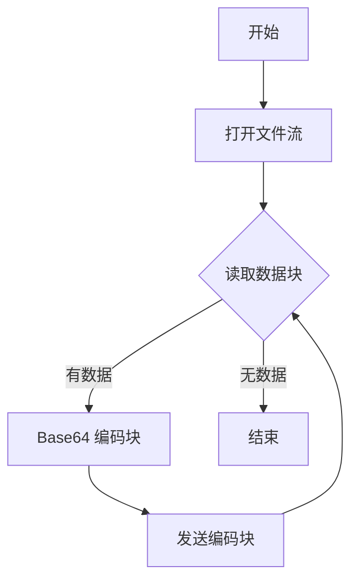
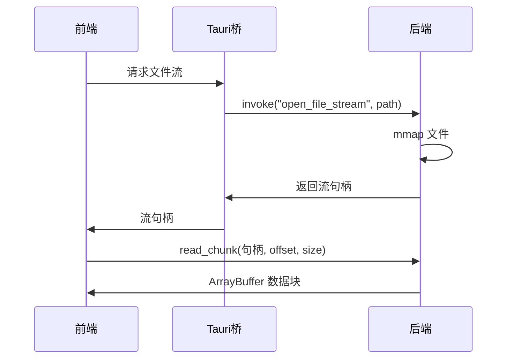

# 性能优化

<cite>
**本文档引用的文件**  
- [Cargo.toml](file://src-tauri/Cargo.toml)
- [package.json](file://package.json)
- [lib.rs](file://src-tauri/src/lib.rs)
- [base64_image.rs](file://src-tauri/src/command/codec/base64_image.rs)
- [base64_helper.rs](file://src-tauri/src/command/codec/base64_helper.rs)
- [hash.rs](file://src-tauri/src/command/generator/hash.rs)
- [rsa.rs](file://src-tauri/src/command/crypto/rsa.rs)
- [fs.rs](file://src-tauri/src/command/fs.rs)
- [base64_image.ts](file://src/command/codec/base64_image.ts)
- [base64_image.tsx](file://src/view/codec/base64_image.tsx)
</cite>

## 目录
1. [引言](#引言)
2. [项目结构与通信架构](#项目结构与通信架构)
3. [前后端通信性能瓶颈分析](#前后端通信性能瓶颈分析)
4. [大文件处理场景下的内存与传输优化](#大文件处理场景下的内存与传输优化)
5. [Rust后端计算密集型任务优化策略](#rust后端计算密集型任务优化策略)
6. [二进制数据传输优化方案](#二进制数据传输优化方案)
7. [Tauri命令调用开销与优化建议](#tauri命令调用开销与优化建议)
8. [依赖与编译配置优化](#依赖与编译配置优化)
9. [性能测试与监控方法](#性能测试与监控方法)
10. [结论](#结论)

## 引言
devkimi 是一个基于 Tauri 框架构建的桌面应用程序，旨在提供多种开发工具功能，包括 Base64 编解码、图像处理、加密算法等。随着功能的扩展，特别是在处理大文件（如高分辨率图片）时，前后端通信的性能问题逐渐显现。本文档旨在深入分析 devkimi 项目中的通信性能瓶颈，重点探讨大文件处理场景下的内存使用和传输效率，并提出一系列优化策略。通过合理利用 Rust 的高性能优势、优化二进制数据传输、减少 Tauri 命令调用开销以及调整编译配置，全面提升应用的整体性能。

## 项目结构与通信架构
devkimi 项目采用典型的 Tauri 架构，前端使用 SolidJS 框架构建用户界面，后端使用 Rust 编写核心逻辑。前后端通过 Tauri 提供的 `invoke` 和 `@tauri-apps/api/core` 进行通信。前端通过 `invoke` 调用后端定义的命令，后端在 `src-tauri/src/lib.rs` 中通过 `tauri::generate_handler!` 宏注册这些命令。

**通信流程**：
1. 前端组件（如 `base64_image.tsx`）调用命令函数（如 `encodeImageBase64`）。
2. 命令函数使用 `invoke` 发送请求到后端。
3. 后端 Rust 代码（如 `base64_image.rs`）处理请求并返回结果。
4. 前端接收结果并更新 UI。

这种架构分离了 UI 和业务逻辑，但频繁的跨语言调用可能成为性能瓶颈，尤其是在处理大量数据时。

**图示来源**  
- [base64_image.ts](file://src/command/codec/base64_image.ts)
- [lib.rs](file://src-tauri/src/lib.rs)
- [base64_image.rs](file://src-tauri/src/command/codec/base64_image.rs)

**本节来源**  
- [project_structure](file://project_structure)

## 前后端通信性能瓶颈分析
在 devkimi 项目中，前后端通信的主要瓶颈体现在以下几个方面：

1. **序列化与反序列化开销**：Tauri 命令调用需要将参数和返回值在 JavaScript 和 Rust 之间进行序列化和反序列化。对于大文件（如 Base64 字符串），这一过程会消耗大量 CPU 和内存资源。
2. **主线程阻塞**：前端的 `invoke` 调用是异步的，但如果后端 Rust 函数执行时间过长，可能会阻塞 Tauri 的事件循环，导致 UI 卡顿。
3. **内存复制**：在处理大文件时，数据需要在堆上分配，频繁的内存分配和复制会增加内存使用量和 GC 压力。

例如，在 `base64_image.rs` 中，`encode_image_base64` 函数首先读取整个文件到内存中，然后进行 Base64 编码。对于大文件，这会导致内存使用量急剧增加。

**本节来源**  
- [base64_image.rs](file://src-tauri/src/command/codec/base64_image.rs)
- [base64_image.ts](file://src/command/codec/base64_image.ts)

## 大文件处理场景下的内存与传输优化
在大文件处理场景下，如 Base64 图片编解码，内存使用和传输效率是关键问题。当前实现中，文件被一次性读取到内存中，然后进行编码或解码，这对于大文件来说是不可接受的。

### 优化策略
1. **流式处理**：避免一次性加载整个文件，而是使用流式 API 逐块处理数据。Rust 的 `std::io::BufReader` 和 `std::io::BufWriter` 可以用于实现高效的流式读写。
2. **分块传输**：将大文件分割成小块，通过多次 `invoke` 调用传输，避免单次传输过大数据。
3. **使用 ArrayBuffer**：在前端，使用 `ArrayBuffer` 而不是字符串来处理二进制数据，减少编码转换的开销。

例如，可以修改 `encode_image_base64` 函数，接受一个文件路径，并返回一个流式处理器，前端可以分块读取编码结果。

**图示来源**  
- [base64_image.rs](file://src-tauri/src/command/codec/base64_image.rs)

**本节来源**  
- [base64_image.rs](file://src-tauri/src/command/codec/base64_image.rs)
- [base64_image.tsx](file://src/view/codec/base64_image.tsx)

## Rust后端计算密集型任务优化策略
Rust 的高性能使其非常适合处理计算密集型任务。在 devkimi 中，如 Base64 编解码、哈希计算、RSA 加密等都是典型的计算密集型任务。

### 任务拆分与异步处理
1. **避免阻塞主线程**：使用 `#[tauri::command(async)]` 属性标记耗时的命令，使其在异步运行时中执行，避免阻塞 Tauri 的主事件循环。
2. **并行处理**：对于可以并行的任务，使用 `rayon` 等库进行并行计算。例如，计算多个文件的哈希值时，可以并行处理每个文件。

在 `rsa.rs` 中，`generate_rsa_key_pair` 已经使用了 `async` 属性，这是一个良好的实践。

### 内存管理优化
1. **预分配缓冲区**：在处理大文件时，预分配足够大的缓冲区，避免频繁的内存分配。
2. **使用零拷贝技术**：尽可能使用 `&[u8]` 引用而不是 `Vec<u8>`，减少数据复制。

**本节来源**  
- [rsa.rs](file://src-tauri/src/command/crypto/rsa.rs)
- [hash.rs](file://src-tauri/src/command/generator/hash.rs)

## 二进制数据传输优化方案
二进制数据的高效传输对于性能至关重要。当前实现中，二进制数据被转换为 Base64 字符串进行传输，这增加了约 33% 的数据量。

### ArrayBuffer 与二进制传输
1. **直接传输 ArrayBuffer**：Tauri 支持直接传输 `ArrayBuffer`，避免 Base64 编码的开销。前端可以使用 `fetch` 或 `WebSocket` 与后端进行二进制数据交换。
2. **零拷贝技术**：在 Rust 中，使用 `mmap` 将文件直接映射到内存，避免数据复制。虽然 Tauri 的 `invoke` 机制可能不支持直接传递内存映射区域，但可以通过共享内存或文件映射的方式实现。

### 优化示例
可以创建一个专门的二进制数据传输通道，使用 `tauri-plugin-ipc` 或自定义协议进行高效的数据交换。

**图示来源**  
- [fs.rs](file://src-tauri/src/command/fs.rs)

**本节来源**  
- [fs.rs](file://src-tauri/src/command/fs.rs)
- [base64_image.rs](file://src-tauri/src/command/codec/base64_image.rs)

## Tauri命令调用开销与优化建议
Tauri 的 `invoke` 机制虽然方便，但每次调用都有一定的开销，包括序列化、跨语言调用和事件循环调度。

### 批量操作
1. **合并请求**：将多个小的 `invoke` 调用合并为一个批量请求。例如，同时编码多个图片时，可以传递一个图片路径数组，后端一次性处理并返回结果数组。
2. **连接复用**：避免频繁创建和销毁连接。对于长时间运行的任务，可以使用 WebSocket 或自定义协议保持长连接。

### 减少调用频率
1. **前端缓存**：对于重复的操作，前端可以缓存结果，避免重复调用后端。
2. **防抖与节流**：对于用户频繁触发的操作（如实时预览），使用防抖（debounce）或节流（throttle）技术减少调用频率。

**本节来源**  
- [lib.rs](file://src-tauri/src/lib.rs)
- [base64_image.ts](file://src/command/codec/base64_image.ts)

## 依赖与编译配置优化
项目的性能不仅取决于代码实现，还与依赖选择和编译配置密切相关。

### Cargo.toml 依赖优化
1. **选择轻量级 crate**：在 `Cargo.toml` 中，检查并替换重量级依赖。例如，`image` crate 支持多种格式，如果只处理常见格式，可以考虑更轻量的替代品。
2. **启用必要功能**：许多 crate 提供可选功能，只启用项目需要的功能，减少二进制大小和依赖树。

当前 `Cargo.toml` 中的依赖如 `base64`、`flate2`、`image` 等都是必要的，但应确保使用最新稳定版本。

### 编译配置优化
`Cargo.toml` 中的 `[profile.release]` 配置已经启用了多项优化：
- `lto = true`：启用链接时优化，提升性能。
- `opt-level = "s"`：优化二进制大小，如果更注重速度，可以改为 `"3"`。
- `panic = "abort"`：禁用 panic 处理，提高性能。
- `strip = true`：移除调试符号，减小二进制大小。

建议在发布版本中使用这些配置，并考虑启用 PGO（Profile-Guided Optimization）以进一步优化性能。

**本节来源**  
- [Cargo.toml](file://src-tauri/Cargo.toml)

## 性能测试与监控方法
为了验证优化效果，需要建立系统的性能测试和监控机制。

### 性能测试
1. **基准测试**：使用 `cargo bench` 对关键函数（如 Base64 编码）进行基准测试，量化性能提升。
2. **端到端测试**：模拟真实用户场景，测量大文件处理的响应时间和内存使用。

### 监控方法
1. **内存监控**：在开发模式下，使用 `tauri-plugin-log` 记录内存使用情况。
2. **性能分析**：使用 `perf`（Linux）、`Instruments`（macOS）或 `VTune`（Windows）对应用进行性能分析，找出热点函数。

**本节来源**  
- [Cargo.toml](file://src-tauri/Cargo.toml)
- [lib.rs](file://src-tauri/src/lib.rs)

## 结论
通过对 devkimi 项目的深入分析，我们识别了前后端通信中的主要性能瓶颈，并提出了针对性的优化策略。关键优化点包括：采用流式处理和分块传输来优化大文件处理；利用 Rust 的异步和并行能力避免阻塞主线程；通过直接传输 ArrayBuffer 和零拷贝技术提升二进制数据传输效率；减少 Tauri 命令调用开销；以及通过依赖管理和编译配置优化整体性能。实施这些优化将显著提升应用的响应速度和资源利用率，为用户提供更流畅的体验。