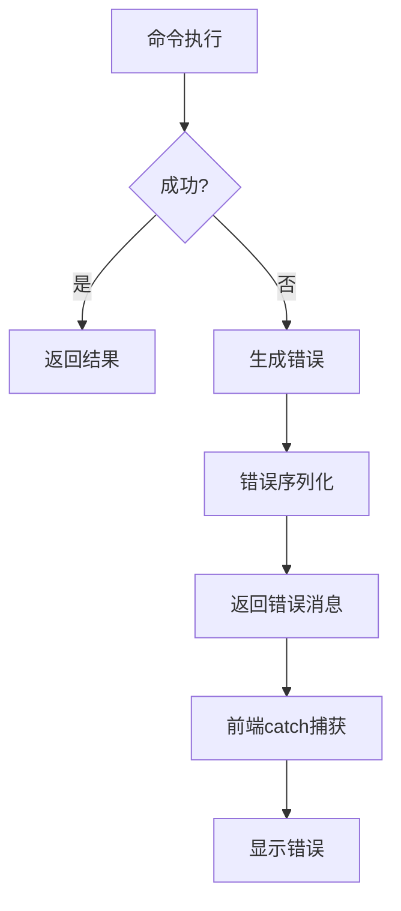
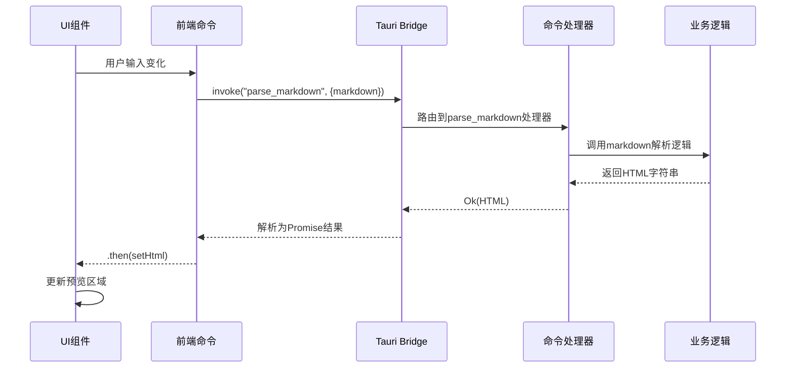

# 通信协议

<cite>
**本文档引用的文件**
- [lib.rs](file://src-tauri/src/lib.rs#L1-L57)
- [main.rs](file://src-tauri/src/main.rs#L1-L7)
- [tauri.conf.json](file://src-tauri/tauri.conf.json#L1-L46)
- [package.json](file://package.json#L1-L43)
- [error.rs](file://src-tauri/src/error.rs#L1-L31)
- [fs.rs](file://src-tauri/src/command/fs.rs#L1-L34)
- [font.rs](file://src-tauri/src/command/font.rs#L1-L29)
- [json.rs](file://src-tauri/src/command/formatter/json.rs#L1-L39)
- [base64_text.ts](file://src/command/codec/base64_text.ts#L1-L17)
- [markdown.ts](file://src/command/text/markdown.ts#L1-L7)
- [base64_text.tsx](file://src/view/codec/base64_text.tsx#L1-L111)
- [markdown.tsx](file://src/view/text/markdown.tsx#L1-L60)
- [url.ts](file://src/command/codec/url.ts#L1-L11)
- [json_yaml.ts](file://src/command/converter/json_yaml.ts#L1-L11)
- [qrcode.ts](file://src/command/codec/qrcode.ts#L1-L11)
- [xml.ts](file://src/command/formatter/xml.ts#L1-L7)
- [jsonpath.ts](file://src/command/text/jsonpath.ts#L1-L7)
</cite>

## 目录
1. [引言](#引言)
2. [通信协议设计概述](#通信协议设计概述)
3. [命令调用机制](#命令调用机制)
4. [参数序列化与响应结构](#参数序列化与响应结构)
5. [错误码定义与处理](#错误码定义与处理)
6. [前端调用机制](#前端调用机制)
7. [后端命令暴露机制](#后端命令暴露机制)
8. [协议消息格式的JSON Schema](#协议消息格式的json-schema)
9. [典型请求-响应流程时序图](#典型请求-响应流程时序图)
10. [异步特性与Promise处理](#异步特性与promise处理)
11. [类型安全与数据完整性](#类型安全与数据完整性)

## 引言
devkimi项目是一个基于Tauri框架的桌面应用程序，采用Rust作为后端语言，SolidJS作为前端框架。本通信协议文档详细描述了基于Tauri Bridge的前后端通信机制，涵盖命令调用格式、参数序列化方式、响应结构、错误码定义以及完整的请求-响应生命周期。文档旨在为开发者提供清晰的通信协议规范，确保前后端交互的可靠性与可维护性。

## 通信协议设计概述
devkimi项目的通信协议基于Tauri框架提供的Bridge机制实现，采用异步消息传递模式进行前后端通信。前端通过`@tauri-apps/api`模块的`invoke`方法发起命令调用，后端使用`#[tauri::command]`宏将Rust函数暴露为可调用接口。通信数据采用JSON格式进行序列化，确保跨语言兼容性和可读性。

该协议设计遵循以下核心原则：
- **异步通信**：所有命令调用均为异步操作，避免阻塞UI线程
- **类型安全**：通过TypeScript接口定义和Rust类型系统保证数据完整性
- **模块化设计**：命令按功能分类组织，便于维护和扩展
- **错误统一处理**：标准化错误响应格式，便于前端统一处理异常情况

**本节来源**
- [lib.rs](file://src-tauri/src/lib.rs#L1-L57)
- [tauri.conf.json](file://src-tauri/tauri.conf.json#L1-L46)

## 命令调用机制
devkimi项目的命令调用机制基于Tauri的Command系统实现。前端通过`invoke`函数调用后端注册的命令，命令名称在前后端之间保持一致。每个命令调用包含命令标识符和参数对象，后端根据命令名称路由到相应的处理函数。

命令调用具有以下特征：
- **单向消息传递**：前端向后端发送调用请求，后端返回响应结果
- **命名空间扁平化**：命令名称采用小写字母和下划线命名法，如`parse_markdown`、`encode_text_base64`
- **参数对象化**：所有参数封装在JSON对象中传递，便于扩展和维护
- **结果回调**：调用结果通过Promise返回，支持then/catch链式处理

**本节来源**
- [lib.rs](file://src-tauri/src/lib.rs#L11-L43)
- [base64_text.ts](file://src/command/codec/base64_text.ts#L3-L7)

## 参数序列化与响应结构
### 参数序列化方式
devkimi项目采用JSON作为前后端通信的序列化格式。前端调用`invoke`方法时，参数对象自动序列化为JSON字符串，通过Tauri Bridge传递给Rust后端。后端使用`serde`库将JSON反序列化为Rust结构体或基本类型。

参数序列化特点：
- **自动类型转换**：支持字符串、数字、布尔值、数组和对象等JSON原生类型
- **嵌套对象支持**：复杂参数结构可通过嵌套JSON对象传递
- **UTF-8编码**：文本数据使用UTF-8编码确保国际化支持
- **大小限制**：受Tauri框架默认消息大小限制（通常为10MB）

### 响应结构
响应数据同样采用JSON格式返回，包含成功结果或错误信息。成功响应直接返回计算结果，错误响应包含错误消息和可选的错误详情。

响应结构示例：
- 成功响应：`"result string"` 或 `{ "data": [...] }`
- 错误响应：`"error message"` 字符串形式

**本节来源**
- [base64_text.ts](file://src/command/codec/base64_text.ts#L3-L7)
- [json.rs](file://src-tauri/src/command/formatter/json.rs#L14-L24)

## 错误码定义与处理
### 错误码定义
devkimi项目通过自定义错误类型实现错误码管理。在Rust端，使用`command_error!`宏定义枚举错误类型，每个错误变体对应特定的错误场景。错误信息通过`thiserror`库自动生成，并使用`serialize_error!`宏实现JSON序列化。

主要错误类型包括：
- `Io`：文件I/O操作错误
- `InvalidFileName`：无效文件名错误
- `Font`：字体处理错误
- `Json`：JSON解析错误
- `Utf8`：UTF-8编码错误

### 错误处理机制
错误处理流程如下：
1. 后端命令执行过程中发生错误时，返回`Result<T, Error>`类型的错误值
2. Tauri框架自动将错误转换为字符串消息
3. 前端Promise的catch分支接收错误消息字符串
4. UI层显示错误消息给用户

错误处理特点：
- **统一错误格式**：所有错误最终转换为字符串消息
- **上下文信息保留**：错误消息包含具体错误原因和相关参数
- **用户友好显示**：前端直接显示错误消息，无需额外解析



**本节来源**
- [error.rs](file://src-tauri/src/error.rs#L1-L31)
- [fs.rs](file://src-tauri/src/command/fs.rs#L30-L33)

## 前端调用机制
### invoke方法使用
前端通过`@tauri-apps/api/core`模块的`invoke`函数与后端通信。`invoke`函数返回Promise，支持async/await语法或then/catch链式调用。

基本调用模式：
```typescript
import { invoke } from "@tauri-apps/api/core";

const result = await invoke<string>("command_name", { param1: value1 });
```

### 前端命令封装
项目在`src/command`目录下对底层`invoke`调用进行封装，提供类型安全的函数接口。每个功能模块都有对应的命令文件，如`base64_text.ts`、`markdown.ts`等。

封装特点：
- **类型注解**：使用TypeScript定义参数和返回值类型
- **函数抽象**：将`invoke`调用封装为普通函数，隐藏通信细节
- **参数验证**：在调用前进行基本参数验证
- **错误传播**：直接传递Promise错误，由调用者处理

### 视图层集成
在UI组件中，封装后的命令函数被直接调用，通常在响应式计算或事件处理函数中使用。例如，在Markdown预览组件中，输入变化时自动调用`parseMarkdown`命令。

**本节来源**
- [base64_text.ts](file://src/command/codec/base64_text.ts#L1-L17)
- [markdown.ts](file://src/command/text/markdown.ts#L1-L7)
- [base64_text.tsx](file://src/view/codec/base64_text.tsx#L30-L48)

## 后端命令暴露机制
### #[tauri::command]宏使用
Rust后端使用`#[tauri::command]`属性宏将函数标记为可从前端调用的命令。被标记的函数必须满足以下条件：
- 函数为`pub`公开函数
- 参数为可序列化的类型（支持`serde::Deserialize`）
- 返回值为`Result<T, Error>`或直接可序列化类型（支持`serde::Serialize`）

命令函数示例：
```rust
#[tauri::command]
pub fn get_system_fonts() -> Result<Vec<String>, Error> {
    // 实现逻辑
}
```

### 命令注册
所有暴露的命令需要在`tauri::Builder`的`invoke_handler`中注册。通过`tauri::generate_handler!`宏批量注册命令函数，Tauri框架在运行时建立命令名称到函数指针的映射。

注册机制特点：
- **编译时检查**：确保注册的函数存在且签名正确
- **名称自动推导**：函数名称转换为蛇形命名法作为命令名称
- **模块路径无关**：命令名称不包含Rust模块路径信息

### 错误类型集成
命令函数返回的错误类型必须实现`serde::Serialize`，以便通过Bridge传递。项目通过`serialize_error!`宏为自定义错误类型自动实现序列化。

**本节来源**
- [lib.rs](file://src-tauri/src/lib.rs#L11-L43)
- [font.rs](file://src-tauri/src/command/font.rs#L7-L13)
- [error.rs](file://src-tauri/src/error.rs#L4-L12)

## 协议消息格式的JSON Schema
### 请求消息格式
```json
{
  "command": "string",
  "parameters": "object"
}
```

### 响应消息格式
成功响应：
```json
{
  "result": "any"
}
```

错误响应：
```json
{
  "error": "string"
}
```

### 具体命令Schema示例
#### Base64编码命令
```json
{
  "$schema": "http://json-schema.org/draft-07/schema#",
  "title": "EncodeTextBase64",
  "type": "object",
  "properties": {
    "command": {
      "type": "string",
      "const": "encode_text_base64"
    },
    "parameters": {
      "type": "object",
      "properties": {
        "text": {
          "type": "string"
        },
        "mode": {
          "type": "string",
          "enum": ["Standard", "StandardNoPad", "UrlSafe", "UrlSafeNoPad"]
        }
      },
      "required": ["text", "mode"]
    }
  },
  "required": ["command", "parameters"]
}
```

#### Markdown解析命令
```json
{
  "$schema": "http://json-schema.org/draft-07/schema#",
  "title": "ParseMarkdown",
  "type": "object",
  "properties": {
    "command": {
      "type": "string",
      "const": "parse_markdown"
    },
    "parameters": {
      "type": "object",
      "properties": {
        "markdown": {
          "type": "string"
        }
      },
      "required": ["markdown"]
    }
  },
  "required": ["command", "parameters"]
}
```

**本节来源**
- [base64_text.ts](file://src/command/codec/base64_text.ts#L3-L7)
- [markdown.ts](file://src/command/text/markdown.ts#L3-L5)
- [json.rs](file://src-tauri/src/command/formatter/json.rs#L14-L24)

## 典型请求-响应流程时序图


该时序图展示了从用户在Markdown编辑器中输入文本到预览区域更新的完整生命周期：
1. UI组件检测到输入变化，触发响应式计算
2. 调用封装的`parseMarkdown`命令函数
3. `invoke`方法通过Tauri Bridge发送消息到Rust后端
4. 后端命令处理器接收请求并调用业务逻辑
5. 业务逻辑处理完成后返回结果
6. 结果通过Bridge传回前端，解析为Promise结果
7. UI组件更新状态，重新渲染预览区域

**本节来源**
- [markdown.tsx](file://src/view/text/markdown.tsx#L14-L22)
- [markdown.ts](file://src/command/text/markdown.ts#L3-L5)

## 异步特性与Promise处理
### 异步通信模型
devkimi项目采用完全异步的通信模型，所有Tauri命令调用都返回Promise对象。这种设计确保UI线程不会被长时间运行的后端操作阻塞，保持应用的响应性。

异步特性优势：
- **非阻塞UI**：长时间操作不会冻结界面
- **并发执行**：多个命令可以并行发起
- **资源高效**：避免创建额外线程的开销
- **错误隔离**：单个命令失败不影响其他操作

### Promise处理模式
项目采用两种主要的Promise处理模式：

#### async/await语法
```typescript
const handleProcess = async () => {
  try {
    const result = await invoke("long_running_task");
    // 处理成功结果
  } catch (error) {
    // 处理错误
  }
};
```

#### then/catch链式调用
```typescript
invoke("parse_markdown", { markdown })
  .then(setHtml)
  .catch((e) => setHtml(e.toString()));
```

### 响应式集成
在SolidJS框架中，Promise结果与响应式系统无缝集成。通过`createEffect`等响应式原语，可以自动处理异步结果并更新UI状态。

**本节来源**
- [markdown.tsx](file://src/view/text/markdown.tsx#L14-L22)
- [base64_text.tsx](file://src/view/codec/base64_text.tsx#L36-L45)

## 类型安全与数据完整性
### 前端类型系统
项目使用TypeScript提供完整的类型安全保证：
- **参数类型**：命令函数参数有明确的类型注解
- **返回值类型**：`invoke`调用指定返回值泛型类型
- **接口定义**：复杂数据结构通过接口定义
- **编译时检查**：类型错误在编译阶段被捕获

### 后端类型系统
Rust语言提供更强的类型安全保证：
- **静态类型**：所有变量和函数参数有确定类型
- **内存安全**：所有权系统防止内存泄漏和数据竞争
- **模式匹配**：`Result`类型强制处理成功和失败情况
- **零成本抽象**：类型检查在编译期完成，运行时无开销

### 数据完整性保障
通过以下机制确保数据完整性：
- **双向类型验证**：前后端各自验证数据类型
- **序列化一致性**：`serde`库确保JSON序列化/反序列化一致性
- **错误边界**：异常情况被捕获并转换为用户可理解的消息
- **输入验证**：关键操作前进行参数验证

**本节来源**
- [base64_text.ts](file://src/command/codec/base64_text.ts#L3-L7)
- [json.rs](file://src-tauri/src/command/formatter/json.rs#L5-L11)
- [error.rs](file://src-tauri/src/error.rs#L4-L12)