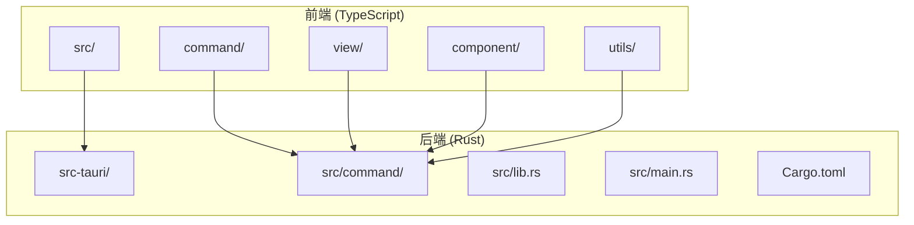
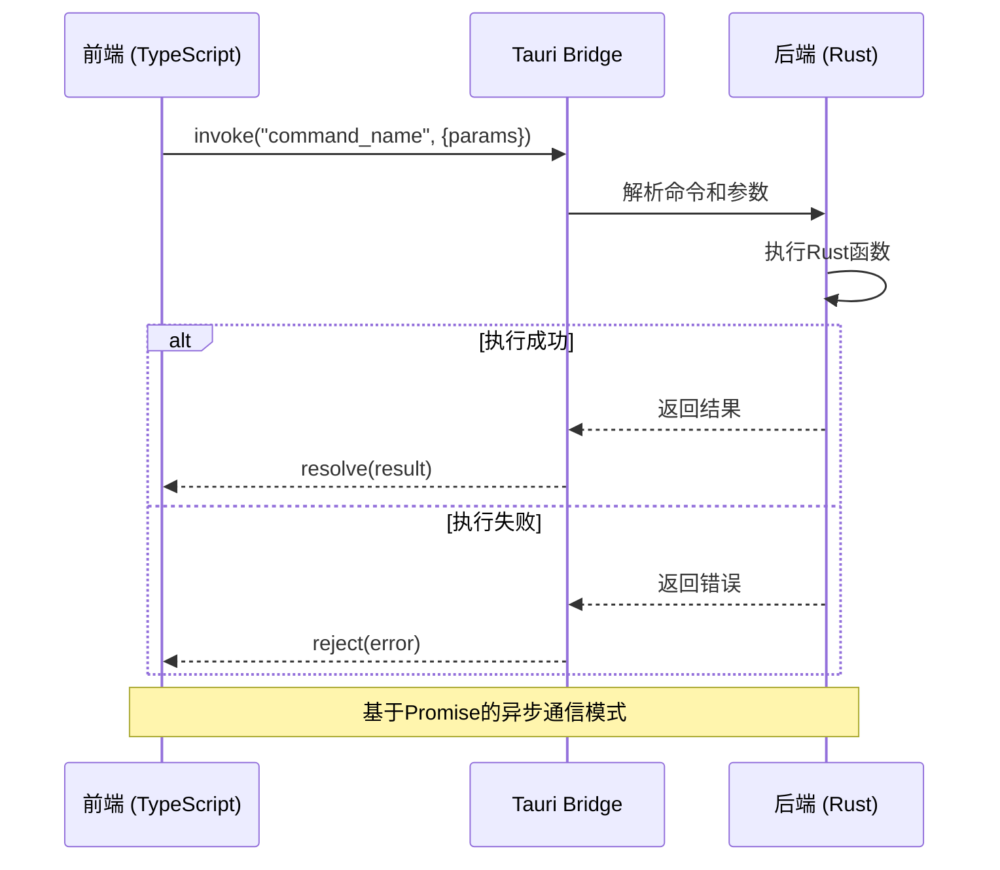
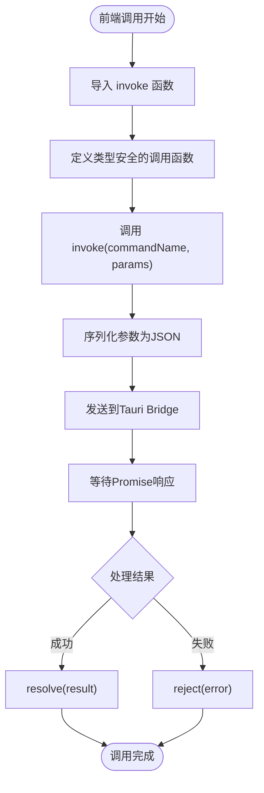
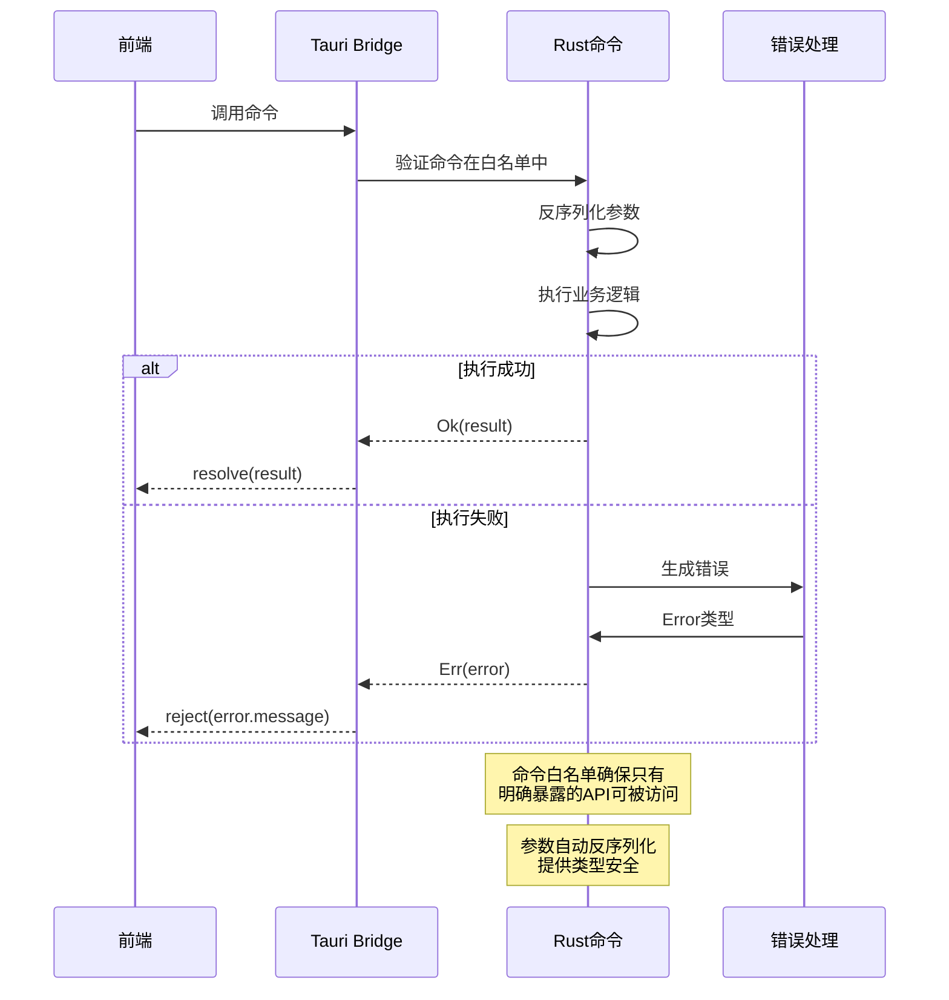
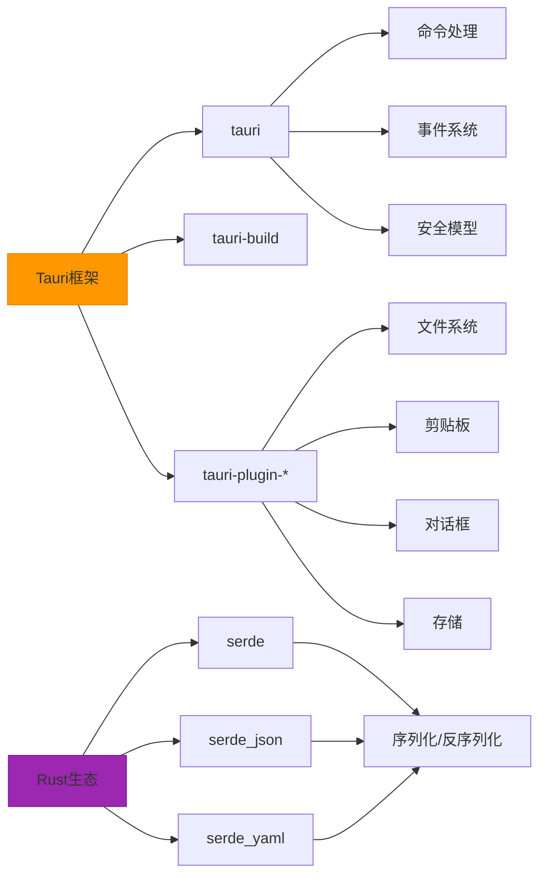

# 通信机制

<cite>
**本文档引用的文件**
- [main.rs](file://src-tauri/src/main.rs)
- [lib.rs](file://src-tauri/src/lib.rs)
- [Cargo.toml](file://src-tauri/Cargo.toml)
- [tauri.conf.json](file://src-tauri/tauri.conf.json)
- [markdown.ts](file://src/command/text/markdown.ts)
- [json_yaml.ts](file://src/command/converter/json_yaml.ts)
- [fs.rs](file://src-tauri/src/command/fs.rs)
- [password.rs](file://src-tauri/src/command/generator/password.rs)
- [json_yaml.rs](file://src-tauri/src/command/converter/json_yaml.rs)
- [markdown.rs](file://src-tauri/src/command/text/markdown.rs)
- [base64_text.rs](file://src-tauri/src/command/codec/base64_text.rs)
- [error.rs](file://src-tauri/src/error.rs)
- [mod.rs](file://src-tauri/src/command/mod.rs)
</cite>

## 目录
1. [引言](#引言)
2. [项目结构](#项目结构)
3. [核心通信组件](#核心通信组件)
4. [架构概览](#架构概览)
5. [详细组件分析](#详细组件分析)
6. [依赖分析](#依赖分析)
7. [性能考虑](#性能考虑)
8. [故障排除指南](#故障排除指南)
9. [结论](#结论)

## 引言
本文档详细描述了devkimi项目中基于Tauri Bridge实现的前后端通信机制。文档解释了从前端TypeScript调用到后端Rust函数执行的完整流程，阐述了main.rs中setup函数如何注册事件监听器，command模块如何暴露安全的API接口。同时说明了通信的安全模型，包括命令白名单、参数验证和错误处理机制，并提供了通信协议时序图展示请求-响应模式和可能的错误场景。

## 项目结构
devkimi项目采用典型的Tauri应用结构，分为前端和后端两个主要部分。前端代码位于`src/`目录下，使用SolidJS框架构建用户界面；后端代码位于`src-tauri/`目录下，使用Rust语言实现核心功能和系统交互。



**Diagram sources**
- [src-tauri/src/main.rs](file://src-tauri/src/main.rs)
- [src-tauri/src/lib.rs](file://src-tauri/src/lib.rs)

**Section sources**
- [src-tauri/src/main.rs](file://src-tauri/src/main.rs)
- [src-tauri/src/lib.rs](file://src-tauri/src/lib.rs)

## 核心通信组件
devkimi项目的通信机制基于Tauri框架提供的安全桥接系统，实现了前后端之间的高效、类型安全的通信。前端通过`@tauri-apps/api/core`的`invoke`函数调用后端命令，后端通过`#[tauri::command]`宏暴露安全的API接口。

**Section sources**
- [src/command/text/markdown.ts](file://src/command/text/markdown.ts)
- [src-tauri/src/lib.rs](file://src-tauri/src/lib.rs)

## 架构概览
devkimi的通信架构采用典型的客户端-服务器模式，其中前端作为客户端，后端Rust应用作为服务器。Tauri Bridge作为中间层，负责序列化、反序列化和安全验证。



**Diagram sources**
- [src/command/text/markdown.ts](file://src/command/text/markdown.ts)
- [src-tauri/src/lib.rs](file://src-tauri/src/lib.rs)
- [src-tauri/src/command/text/markdown.rs](file://src-tauri/src/command/text/markdown.rs)

## 详细组件分析

### 前端调用机制分析
前端通过导入`@tauri-apps/api/core`的`invoke`函数来调用后端Rust命令。每个命令都被封装为TypeScript函数，提供类型安全的接口。



**Diagram sources**
- [src/command/text/markdown.ts](file://src/command/text/markdown.ts)
- [src/command/converter/json_yaml.ts](file://src/command/converter/json_yaml.ts)

**Section sources**
- [src/command/text/markdown.ts](file://src/command/text/markdown.ts)
- [src/command/converter/json_yaml.ts](file://src/command/converter/json_yaml.ts)

### 后端命令注册机制分析
后端通过`tauri::Builder::default()`配置应用，并使用`generate_handler!`宏注册所有可被前端调用的命令。这些命令构成了通信的白名单，确保只有明确暴露的API才能被访问。

```mermaid
classDiagram
class TauriBuilder {
+default() Builder
+plugin(Plugin) Builder
+invoke_handler(Handler) Builder
+setup(SetupFn) Builder
+run(Context) Result
}
class CommandHandler {
+generate_handler!([...commands]) Handler
}
class SetupFunction {
+setup(app) Result
}
TauriBuilder --> CommandHandler : "使用"
TauriBuilder --> SetupFunction : "配置"
note right of TauriBuilder
Tauri应用构建器，负责
配置插件、命令处理器和
设置函数
end
note right of CommandHandler
生成命令处理函数，包含
所有通过#[tauri : : command]
宏暴露的Rust函数
end
```

**Diagram sources**
- [src-tauri/src/lib.rs](file://src-tauri/src/lib.rs)
- [src-tauri/src/main.rs](file://src-tauri/src/main.rs)

**Section sources**
- [src-tauri/src/lib.rs](file://src-tauri/src/lib.rs)
- [src-tauri/src/main.rs](file://src-tauri/src/main.rs)

### 命令实现与安全模型分析
每个后端命令使用`#[tauri::command]`宏标记，这使得函数能够被Tauri Bridge调用。命令函数通常返回`Result<T, Error>`类型，实现了完善的错误处理机制。



**Diagram sources**
- [src-tauri/src/command/fs.rs](file://src-tauri/src/command/fs.rs)
- [src-tauri/src/command/generator/password.rs](file://src-tauri/src/command/generator/password.rs)
- [src-tauri/src/error.rs](file://src-tauri/src/error.rs)

**Section sources**
- [src-tauri/src/command/fs.rs](file://src-tauri/src/command/fs.rs)
- [src-tauri/src/command/generator/password.rs](file://src-tauri/src/command/generator/password.rs)
- [src-tauri/src/error.rs](file://src-tauri/src/error.rs)

### 类型安全与异步处理最佳实践
devkimi项目展示了Tauri通信中类型安全和异步处理的最佳实践。前端调用使用泛型指定返回类型，后端命令使用Result类型处理成功和错误情况。

```mermaid
flowchart LR
A[前端TypeScript] --> B[类型声明]
B --> C[async函数]
C --> D[invoke<T>("command")]
D --> E[Promise<T>]
F[后端Rust] --> G[#[tauri::command]]
G --> H[Result<T, Error>]
H --> I[serde序列化]
I --> J[JSON传输]
E < --> J
style A fill:#4CAF50,stroke:#388E3C
style F fill:#2196F3,stroke:#1976D2
```

**Diagram sources**
- [src/command/text/markdown.ts](file://src/command/text/markdown.ts)
- [src-tauri/src/command/text/markdown.rs](file://src-tauri/src/command/text/markdown.rs)
- [src-tauri/src/command/converter/json_yaml.rs](file://src-tauri/src/command/converter/json_yaml.rs)

**Section sources**
- [src/command/text/markdown.ts](file://src/command/text/markdown.ts)
- [src-tauri/src/command/text/markdown.rs](file://src-tauri/src/command/text/markdown.rs)
- [src-tauri/src/command/converter/json_yaml.rs](file://src-tauri/src/command/converter/json_yaml.rs)

## 依赖分析
devkimi项目的通信机制依赖于多个Tauri核心组件和Rust crate，这些依赖共同构建了安全、高效的前后端通信基础。



**Diagram sources**
- [src-tauri/Cargo.toml](file://src-tauri/Cargo.toml)
- [src-tauri/tauri.conf.json](file://src-tauri/tauri.conf.json)

**Section sources**
- [src-tauri/Cargo.toml](file://src-tauri/Cargo.toml)
- [src-tauri/tauri.conf.json](file://src-tauri/tauri.conf.json)

## 性能考虑
Tauri Bridge的通信机制经过优化，提供了高性能的前后端交互。序列化使用高效的serde库，通信开销极小，适合频繁调用的场景。

- **序列化性能**：使用serde进行零成本抽象的序列化/反序列化
- **内存效率**：直接在栈上处理数据，减少堆分配
- **异步处理**：非阻塞I/O操作，避免UI冻结
- **类型安全**：编译时类型检查，减少运行时错误

## 故障排除指南
当通信出现问题时，可以按照以下步骤进行排查：

1. **检查命令名称**：确保前端调用的命令名称与后端注册的完全一致
2. **验证参数类型**：确保传递的参数类型与Rust函数签名匹配
3. **查看错误信息**：检查控制台输出的详细错误信息
4. **确认命令注册**：确保命令已通过`generate_handler!`宏注册
5. **检查依赖版本**：确认Tauri及相关插件版本兼容

**Section sources**
- [src-tauri/src/error.rs](file://src-tauri/src/error.rs)
- [src-tauri/src/lib.rs](file://src-tauri/src/lib.rs)

## 结论
devkimi项目通过Tauri Bridge实现了安全、高效、类型安全的前后端通信。前端使用TypeScript的`invoke`函数调用后端Rust命令，后端通过`#[tauri::command]`宏暴露API接口。整个通信机制基于命令白名单、自动参数验证和完善的错误处理，确保了应用的安全性和可靠性。通过serde库的高效序列化和Promise的异步模式，实现了高性能的跨语言通信，为开发者提供了优秀的开发体验。