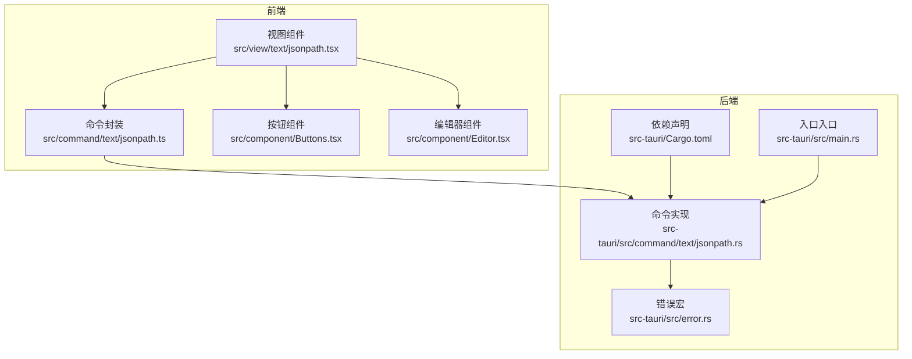
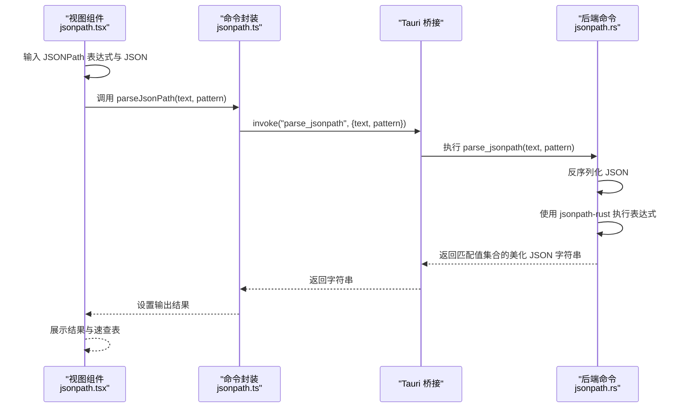
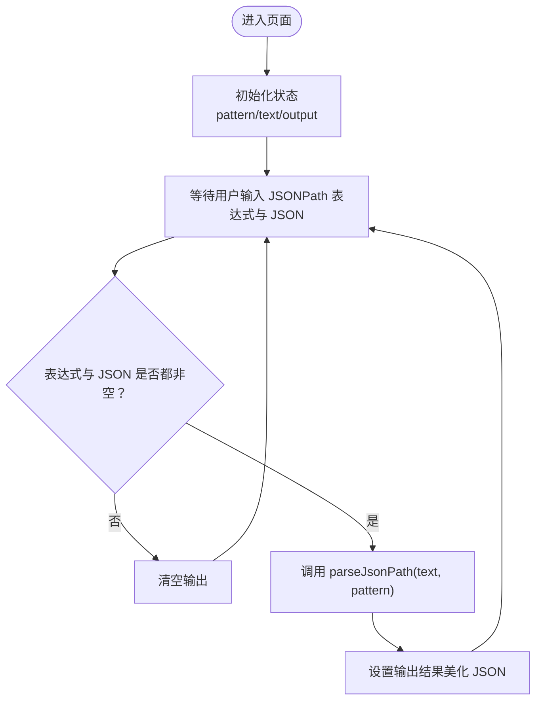
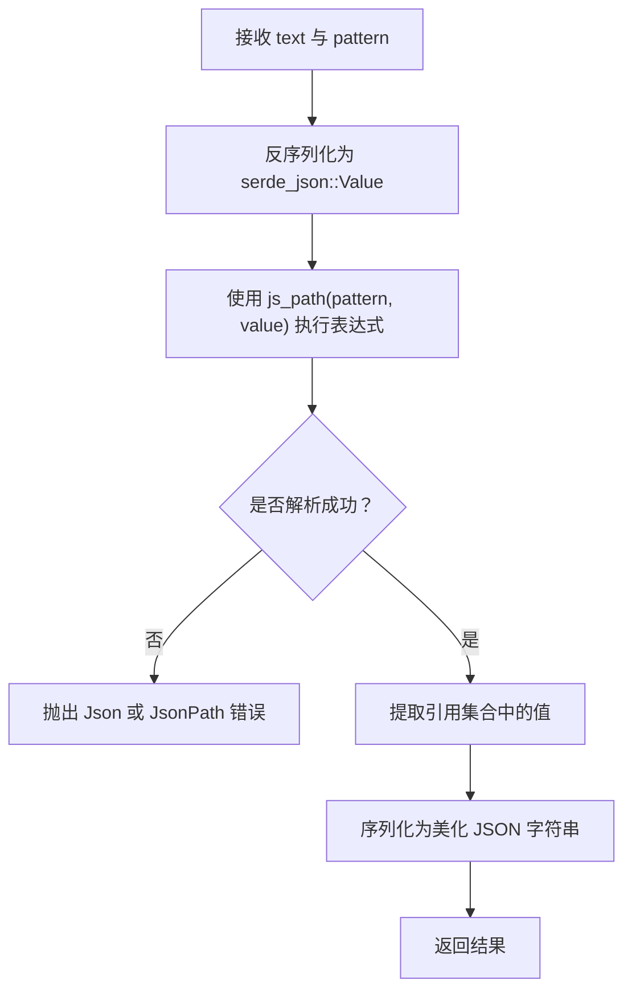

# JSONPath查询

<cite>
**本文引用的文件**
- [src/view/text/jsonpath.tsx](file://src/view/text/jsonpath.tsx)
- [src/command/text/jsonpath.ts](file://src/command/text/jsonpath.ts)
- [src-tauri/src/command/text/jsonpath.rs](file://src-tauri/src/command/text/jsonpath.rs)
- [src-tauri/Cargo.toml](file://src-tauri/Cargo.toml)
- [src-tauri/src/error.rs](file://src-tauri/src/error.rs)
- [src/routes.tsx](file://src/routes.tsx)
- [src/component/Buttons.tsx](file://src/component/Buttons.tsx)
- [src/component/Editor.tsx](file://src/component/Editor.tsx)
- [src-tauri/src/main.rs](file://src-tauri/src/main.rs)
</cite>

## 目录
1. [简介](#简介)
2. [项目结构](#项目结构)
3. [核心组件](#核心组件)
4. [架构总览](#架构总览)
5. [详细组件分析](#详细组件分析)
6. [依赖关系分析](#依赖关系分析)
7. [性能考量](#性能考量)
8. [故障排查指南](#故障排查指南)
9. [结论](#结论)
10. [附录：使用示例与最佳实践](#附录使用示例与最佳实践)

## 简介
本文件系统性阐述 devkimi 中“JSONPath 查询”功能的前端界面设计、命令调用链路与 Rust 后端实现。该功能基于 jsonpath-rust 库解析与执行 JSONPath 表达式，支持通配符、数组切片、过滤器、递归下降等常见语法，并通过 Tauri 将前端与后端安全地连接起来。文档覆盖：
- 前端界面布局与交互逻辑
- 命令调用与错误处理机制
- Rust 后端解析与输出格式
- 性能优化与边界情况处理
- 实际使用示例与最佳实践

## 项目结构
JSONPath 功能位于以下模块中：
- 前端视图层：src/view/text/jsonpath.tsx
- 前端命令封装：src/command/text/jsonpath.ts
- 后端命令实现：src-tauri/src/command/text/jsonpath.rs
- 路由注册：src/routes.tsx
- 组件依赖：src/component/Buttons.tsx、src/component/Editor.tsx
- 错误宏与类型：src-tauri/src/error.rs
- 依赖声明：src-tauri/Cargo.toml
- 入口入口：src-tauri/src/main.rs



图表来源
- [src/view/text/jsonpath.tsx](file://src/view/text/jsonpath.tsx#L1-L203)
- [src/command/text/jsonpath.ts](file://src/command/text/jsonpath.ts#L1-L8)
- [src-tauri/src/command/text/jsonpath.rs](file://src-tauri/src/command/text/jsonpath.rs#L1-L19)
- [src-tauri/src/error.rs](file://src-tauri/src/error.rs#L1-L31)
- [src-tauri/Cargo.toml](file://src-tauri/Cargo.toml#L1-L69)
- [src-tauri/src/main.rs](file://src-tauri/src/main.rs#L1-L7)

章节来源
- [src/view/text/jsonpath.tsx](file://src/view/text/jsonpath.tsx#L1-L203)
- [src/command/text/jsonpath.ts](file://src/command/text/jsonpath.ts#L1-L8)
- [src-tauri/src/command/text/jsonpath.rs](file://src-tauri/src/command/text/jsonpath.rs#L1-L19)
- [src-tauri/src/error.rs](file://src-tauri/src/error.rs#L1-L31)
- [src-tauri/Cargo.toml](file://src-tauri/Cargo.toml#L1-L69)
- [src-tauri/src/main.rs](file://src-tauri/src/main.rs#L1-L7)

## 核心组件
- 视图组件负责渲染输入区域（JSONPath 表达式、原始 JSON）、结果展示与速查表；当表达式与 JSON 同时存在时触发查询。
- 命令封装通过 Tauri 的 invoke 调用后端命令，返回字符串结果。
- 后端命令解析 JSON 字符串为结构体，使用 jsonpath-rust 执行表达式，收集匹配值并以美化 JSON 输出。
- 错误宏统一序列化错误，便于前端捕获与展示。

章节来源
- [src/view/text/jsonpath.tsx](file://src/view/text/jsonpath.tsx#L1-L203)
- [src/command/text/jsonpath.ts](file://src/command/text/jsonpath.ts#L1-L8)
- [src-tauri/src/command/text/jsonpath.rs](file://src-tauri/src/command/text/jsonpath.rs#L1-L19)
- [src-tauri/src/error.rs](file://src-tauri/src/error.rs#L1-L31)

## 架构总览
从前端到后端的调用链如下：



图表来源
- [src/view/text/jsonpath.tsx](file://src/view/text/jsonpath.tsx#L118-L173)
- [src/command/text/jsonpath.ts](file://src/command/text/jsonpath.ts#L1-L8)
- [src-tauri/src/command/text/jsonpath.rs](file://src-tauri/src/command/text/jsonpath.rs#L6-L13)

## 详细组件分析

### 前端视图组件（JSONPath）
- 状态管理：使用信号管理表达式、原始 JSON 与输出结果。
- 依赖注入：依赖命令封装 parseJsonPath，依赖按钮组件与编辑器组件。
- 交互逻辑：当表达式与 JSON 同时不为空时，触发查询；否则清空输出。
- 结果展示：只读编辑器展示美化后的 JSON 结果。
- 速查表：内置常见语法条目，覆盖根节点、属性访问、通配符、数组切片、递归下降、过滤器等。



图表来源
- [src/view/text/jsonpath.tsx](file://src/view/text/jsonpath.tsx#L118-L173)

章节来源
- [src/view/text/jsonpath.tsx](file://src/view/text/jsonpath.tsx#L1-L203)
- [src/component/Buttons.tsx](file://src/component/Buttons.tsx#L44-L59)
- [src/component/Editor.tsx](file://src/component/Editor.tsx#L61-L136)

### 前端命令封装（parseJsonPath）
- 通过 Tauri 的 invoke 调用名为 “parse_jsonpath” 的后端命令，传入 text 与 pattern。
- 返回值为字符串，前端直接设置到输出区域。

章节来源
- [src/command/text/jsonpath.ts](file://src/command/text/jsonpath.ts#L1-L8)

### 后端命令实现（parse_jsonpath）
- 输入：text（原始 JSON 字符串）、pattern（JSONPath 表达式）。
- 处理流程：
  - 反序列化 JSON 字符串为 serde_json::Value。
  - 使用 jsonpath_rust 的 js_path 执行表达式，得到引用集合。
  - 提取每个引用对应的值，收集为 Vec<Value>。
  - 将结果序列化为美化 JSON 字符串返回。
- 错误处理：统一通过 command_error 宏定义的 Error 枚举返回，包含 JSON 解析错误与 JSONPath 解析错误两类。



图表来源
- [src-tauri/src/command/text/jsonpath.rs](file://src-tauri/src/command/text/jsonpath.rs#L6-L13)
- [src-tauri/src/error.rs](file://src-tauri/src/error.rs#L16-L31)

章节来源
- [src-tauri/src/command/text/jsonpath.rs](file://src-tauri/src/command/text/jsonpath.rs#L1-L19)
- [src-tauri/src/error.rs](file://src-tauri/src/error.rs#L1-L31)

### 路由与导航
- 在路由元数据中注册了 “JSONPath” 子路由，路径为 “/jsonpath”，组件懒加载自视图模块。
- 该路由位于 “文本工具” 分类下，图标为文件括号样式。

章节来源
- [src/routes.tsx](file://src/routes.tsx#L110-L137)

## 依赖关系分析
- 前端依赖：
  - SolidJS 用于响应式状态与副作用。
  - Tauri API 用于跨语言调用。
  - Monaco Editor 用于 JSON 编辑与高亮。
  - 自定义按钮组件提供粘贴、清空等操作。
- 后端依赖：
  - jsonpath-rust：解析与执行 JSONPath 表达式。
  - serde_json：JSON 解析与序列化。
  - tauri：命令导出与桥接。
  - thiserror 与自定义错误宏：统一错误类型与序列化。

```mermaid
graph LR
FE["前端<br/>Solid + Tauri + Monaco"] --> CMD["invoke(\"parse_jsonpath\")"]
CMD --> BE["后端<br/>jsonpath-rust + serde_json"]
BE --> DEP["依赖<br/>Cargo.toml"]
MAIN["入口<br/>main.rs"] --> LIB["app_lib::run()"]
LIB --> BE
```

图表来源
- [src-tauri/Cargo.toml](file://src-tauri/Cargo.toml#L20-L69)
- [src-tauri/src/main.rs](file://src-tauri/src/main.rs#L1-L7)

章节来源
- [src-tauri/Cargo.toml](file://src-tauri/Cargo.toml#L1-L69)
- [src-tauri/src/main.rs](file://src-tauri/src/main.rs#L1-L7)

## 性能考量
- 解析与执行：
  - 前端仅在表达式与 JSON 同时存在时触发查询，避免无效计算。
  - 后端一次性反序列化 JSON，执行表达式后批量提取值再序列化，减少多次序列化开销。
- I/O 与内存：
  - 对于大型 JSON，建议分段输入或使用文件导入，避免一次性渲染导致卡顿。
  - Monaco 编辑器按需更新，避免不必要的重绘。
- 并发与线程：
  - Tauri 命令默认在后台线程执行，避免阻塞 UI。
- 过滤器与递归：
  - 复杂过滤器与深层递归可能带来性能压力，建议先简化表达式验证结果，再逐步优化。

[本节为通用性能建议，无需特定文件引用]

## 故障排查指南
- 前端错误显示：
  - 当命令调用失败时，前端会将错误转换为字符串并显示在结果区域，便于快速定位问题。
- 后端错误分类：
  - JSON 解析错误：当 text 非合法 JSON 时触发。
  - JSONPath 解析错误：当 pattern 语法不正确或无法匹配时触发。
- 常见问题与处理：
  - 表达式为空：前端不会发起请求，输出为空。
  - JSON 为空：同上。
  - 表达式语法错误：后端返回 JsonPath 错误，前端展示为字符串。
  - JSON 不合法：后端返回 Json 错误，前端展示为字符串。
- 排查步骤：
  - 检查 JSON 是否为合法结构。
  - 检查 JSONPath 表达式是否符合速查表中的语法。
  - 使用粘贴按钮从剪贴板导入测试数据，确认环境可用。

章节来源
- [src/view/text/jsonpath.tsx](file://src/view/text/jsonpath.tsx#L122-L129)
- [src-tauri/src/command/text/jsonpath.rs](file://src-tauri/src/command/text/jsonpath.rs#L15-L19)
- [src-tauri/src/error.rs](file://src-tauri/src/error.rs#L16-L31)

## 结论
devkimi 的 JSONPath 查询功能通过清晰的前后端分层与 Tauri 桥接，实现了简洁高效的查询体验。前端提供直观的输入与展示，后端基于 jsonpath-rust 保证了表达式解析与执行的稳定性，并通过统一错误机制提升可观测性。结合本文的性能建议与最佳实践，可在复杂数据场景中获得良好的查询体验。

[本节为总结性内容，无需特定文件引用]

## 附录：使用示例与最佳实践

### 使用示例（从输入到高亮）
- 步骤一：在“JSONPath”输入框中编写表达式，例如根节点、属性访问、通配符、数组切片、递归下降、过滤器等。
- 步骤二：在“JSON”编辑器中粘贴或输入待查询的 JSON 数据。
- 步骤三：前端自动触发查询，后端解析 JSON 并执行表达式，返回匹配值集合的美化 JSON。
- 步骤四：结果在右侧只读编辑器中展示，支持复制与保存。

章节来源
- [src/view/text/jsonpath.tsx](file://src/view/text/jsonpath.tsx#L118-L173)
- [src/component/Buttons.tsx](file://src/component/Buttons.tsx#L44-L59)
- [src/component/Editor.tsx](file://src/component/Editor.tsx#L61-L136)

### 支持的语法特性（来自速查表）
- 根节点与属性访问：根对象或数组、点号表示法、括号表示法。
- 通配符与多属性：通配符、逗号分隔的多个属性、括号与函数式表示法。
- 数组切片与索引：数组切片、索引访问、范围访问、通配符索引、数组长度。
- 递归下降：递归搜索指定键名的对象。
- 过滤器：比较运算符（等于、大于、小于、大于等于、小于等于、不等于）、正则匹配、包含/不包含、SQL 风格正则、前缀匹配等。

章节来源
- [src/view/text/jsonpath.tsx](file://src/view/text/jsonpath.tsx#L11-L116)

### 最佳实践
- 表达式优化：
  - 优先使用精确路径，避免过深的递归与宽泛的通配符。
  - 复杂过滤器尽量前置条件，缩小候选集后再进行二次筛选。
- 数据规模控制：
  - 对超大 JSON，建议拆分或分页查询，避免一次性渲染。
  - 使用文件导入而非长文本粘贴，减少 UI 卡顿。
- 错误与回退：
  - 当表达式报错时，先简化为最小可行表达式，逐步增加复杂度。
  - 若 JSON 不合法，先修复 JSON 再尝试表达式。
- 结果处理：
  - 结果为美化 JSON，适合人类阅读；如需进一步处理，可复制到其他工具中继续分析。

[本节为通用指导，无需特定文件引用]