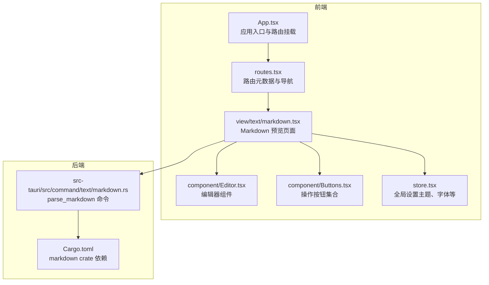
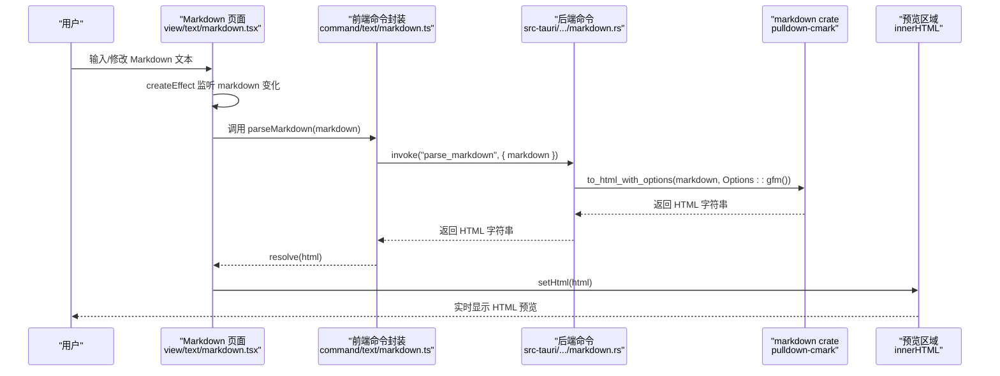
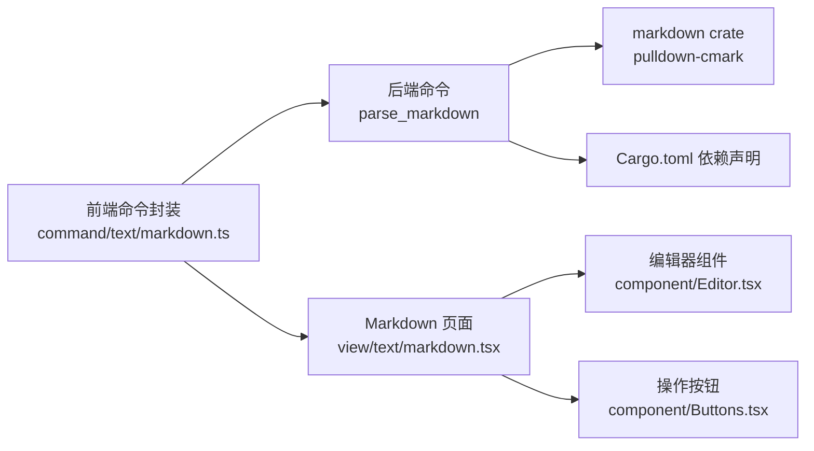

# Markdown预览

<cite>
**本文引用的文件**
- [src/view/text/markdown.tsx](file://src/view/text/markdown.tsx)
- [src/command/text/markdown.ts](file://src/command/text/markdown.ts)
- [src-tauri/src/command/text/markdown.rs](file://src-tauri/src/command/text/markdown.rs)
- [src-tauri/Cargo.toml](file://src-tauri/Cargo.toml)
- [src/routes.tsx](file://src/routes.tsx)
- [src/App.tsx](file://src/App.tsx)
- [src/component/Editor.tsx](file://src/component/Editor.tsx)
- [src/component/Buttons.tsx](file://src/component/Buttons.tsx)
- [src/store.tsx](file://src/store.tsx)
- [README.md](file://README.md)
</cite>

## 目录
1. [简介](#简介)
2. [项目结构](#项目结构)
3. [核心组件](#核心组件)
4. [架构总览](#架构总览)
5. [详细组件分析](#详细组件分析)
6. [依赖关系分析](#依赖关系分析)
7. [性能考量](#性能考量)
8. [故障排查指南](#故障排查指南)
9. [结论](#结论)
10. [附录](#附录)

## 简介
本文件系统性阐述 devkimi 中“Markdown 预览”功能的实现机制，覆盖从前端编辑器到 Rust 后端解析再到 HTML 实时预览的完整链路。重点包括：
- 前端编辑器与预览区域的同步机制
- 语法高亮与编辑体验
- Rust 后端使用 pulldown-cmark（markdown crate）进行高效解析
- HTML 渲染安全过滤与危险 HTML 的处理策略
- 支持的 Markdown 扩展语法（如表格、任务列表等）
- 性能优化策略与错误恢复机制
- 使用示例与最佳实践（技术文档、博客创作）

## 项目结构
Markdown 预览功能位于“文本工具”模块下，通过路由注册并由前端页面承载。整体结构如下：

图表来源
- [src/App.tsx](file://src/App.tsx#L1-L43)
- [src/routes.tsx](file://src/routes.tsx#L110-L121)
- [src/view/text/markdown.tsx](file://src/view/text/markdown.tsx#L1-L60)
- [src/component/Editor.tsx](file://src/component/Editor.tsx#L1-L139)
- [src/component/Buttons.tsx](file://src/component/Buttons.tsx#L1-L191)
- [src/store.tsx](file://src/store.tsx#L1-L88)
- [src-tauri/src/command/text/markdown.rs](file://src-tauri/src/command/text/markdown.rs#L1-L15)
- [src-tauri/Cargo.toml](file://src-tauri/Cargo.toml#L20-L69)

章节来源
- [src/routes.tsx](file://src/routes.tsx#L110-L121)
- [src/App.tsx](file://src/App.tsx#L1-L43)
- [README.md](file://README.md#L33-L42)

## 核心组件
- 前端页面：Markdown 预览页面负责接收用户输入、触发解析、展示 HTML 预览。
- 前端命令封装：通过 Tauri invoke 调用后端命令。
- 后端命令：使用 markdown crate（pulldown-cmark）解析 Markdown 并返回 HTML。
- 编辑器组件：基于 Monaco 提供 Markdown 输入与编辑体验。
- 操作按钮：复制、保存、清空、从文件导入等常用操作。
- 全局设置：主题、字体、自动换行等影响编辑体验的配置。

章节来源
- [src/view/text/markdown.tsx](file://src/view/text/markdown.tsx#L1-L60)
- [src/command/text/markdown.ts](file://src/command/text/markdown.ts#L1-L8)
- [src-tauri/src/command/text/markdown.rs](file://src-tauri/src/command/text/markdown.rs#L1-L15)
- [src/component/Editor.tsx](file://src/component/Editor.tsx#L1-L139)
- [src/component/Buttons.tsx](file://src/component/Buttons.tsx#L1-L191)
- [src/store.tsx](file://src/store.tsx#L1-L88)

## 架构总览
Markdown 预览的端到端流程如下：

图表来源
- [src/view/text/markdown.tsx](file://src/view/text/markdown.tsx#L1-L60)
- [src/command/text/markdown.ts](file://src/command/text/markdown.ts#L1-L8)
- [src-tauri/src/command/text/markdown.rs](file://src-tauri/src/command/text/markdown.rs#L1-L15)

## 详细组件分析

### 前端页面：Markdown 预览
- 状态管理：使用信号存储 markdown 文本与解析后的 HTML。
- 同步机制：通过 effect 监听 markdown 变化，异步调用 parseMarkdown 并更新 HTML。
- UI 结构：左侧编辑区（包含复制、保存、清空、导入等按钮），右侧预览区（使用 innerHTML 展示 HTML）。
- 交互细节：当输入为空时，预览区也清空；解析异常时，将错误字符串显示在预览区，便于定位问题。

章节来源
- [src/view/text/markdown.tsx](file://src/view/text/markdown.tsx#L1-L60)
- [src/component/Buttons.tsx](file://src/component/Buttons.tsx#L1-L191)

### 前端命令封装：parseMarkdown
- 作用：通过 Tauri invoke 调用后端命令，传入 markdown 文本并接收 HTML 字符串。
- 类型：返回 Promise<string>，用于与前端状态绑定。

章节来源
- [src/command/text/markdown.ts](file://src/command/text/markdown.ts#L1-L8)

### 后端命令：parse_markdown
- 选项配置：使用 Options::gfm() 启用 GitHub Flavored Markdown 扩展；同时允许危险 HTML（allow_dangerous_html = true）。
- 解析流程：调用 to_html_with_options 将 Markdown 文本解析为 HTML。
- 错误处理：捕获解析错误并转换为字符串返回，前端统一处理。

章节来源
- [src-tauri/src/command/text/markdown.rs](file://src-tauri/src/command/text/markdown.rs#L1-L15)
- [src-tauri/Cargo.toml](file://src-tauri/Cargo.toml#L20-L69)

### 编辑器组件：Monaco Editor
- 主题与字体：从全局设置读取主题、字体家族与字号，动态应用。
- 自动换行：根据设置切换换行策略。
- 事件监听：监听内容变化并回调上层，保持与 markdown 信号同步。
- 语言模式：当前以纯文本模式运行，但可通过 props 扩展语言支持（例如 markdown 语言高亮）。

章节来源
- [src/component/Editor.tsx](file://src/component/Editor.tsx#L1-L139)
- [src/store.tsx](file://src/store.tsx#L1-L88)

### 操作按钮：复制/保存/清空/导入
- 复制：写入剪贴板，反馈成功/失败状态。
- 保存：弹出保存对话框，将文本写入文件。
- 清空：将输入文本置空。
- 导入：打开文件对话框，读取文本文件内容填充输入。

章节来源
- [src/component/Buttons.tsx](file://src/component/Buttons.tsx#L1-L191)

### 路由与导航
- 路由注册：在“文本工具”下注册“Markdown 预览”子路由，路径为 /text/markdown。
- 导航：通过菜单与面包屑进入该页面。

章节来源
- [src/routes.tsx](file://src/routes.tsx#L110-L121)
- [src/App.tsx](file://src/App.tsx#L1-L43)

## 依赖关系分析
- 前端依赖：@tauri-apps/api/core 提供 invoke；Monaco Editor 提供编辑体验；SolidJS 提供响应式状态与 effect。
- 后端依赖：markdown crate（pulldown-cmark）提供 Markdown 解析能力；tauri::command 注册命令。
- 选项依赖：Options::gfm() 启用扩展语法；allow_dangerous_html=true 允许渲染危险 HTML。

图表来源
- [src/command/text/markdown.ts](file://src/command/text/markdown.ts#L1-L8)
- [src-tauri/src/command/text/markdown.rs](file://src-tauri/src/command/text/markdown.rs#L1-L15)
- [src-tauri/Cargo.toml](file://src-tauri/Cargo.toml#L20-L69)
- [src/view/text/markdown.tsx](file://src/view/text/markdown.tsx#L1-L60)
- [src/component/Editor.tsx](file://src/component/Editor.tsx#L1-L139)
- [src/component/Buttons.tsx](file://src/component/Buttons.tsx#L1-L191)

## 性能考量
- 前端解析触发频率控制：通过 createEffect 在 markdown 变化时触发解析，避免频繁重渲染；可结合节流/防抖进一步降低解析压力（建议在高频输入场景引入）。
- 后端解析开销：pulldown-cmark 为高性能解析器，适合大多数文档规模；大文档建议分段或延迟解析。
- DOM 更新策略：使用 innerHTML 直接注入 HTML，简单高效；对于超长文档，可考虑虚拟滚动或分页预览。
- 编辑器性能：Monaco 默认 worker 已按语言拆分，减少不必要的线程负担；可根据需要关闭迷你地图等特性。

章节来源
- [src/view/text/markdown.tsx](file://src/view/text/markdown.tsx#L1-L60)
- [src-tauri/src/command/text/markdown.rs](file://src-tauri/src/command/text/markdown.rs#L1-L15)
- [src-tauri/Cargo.toml](file://src-tauri/Cargo.toml#L20-L69)

## 故障排查指南
- 解析异常显示：前端在 catch 分支将错误字符串显示在预览区，便于快速定位问题。
- 危险 HTML 渲染：后端允许危险 HTML，若出现不期望的脚本执行风险，需在前端对输出进行二次过滤或限制渲染范围。
- XSS 防护：当前实现未内置 XSS 过滤，建议在前端对 innerHTML 输出进行白名单过滤或改用受控组件渲染（如 React 组件树）。
- 路由访问：确认已在“文本工具”菜单中点击“Markdown 预览”，确保路由已注册。

章节来源
- [src/view/text/markdown.tsx](file://src/view/text/markdown.tsx#L1-L60)
- [src-tauri/src/command/text/markdown.rs](file://src-tauri/src/command/text/markdown.rs#L1-L15)
- [src/routes.tsx](file://src/routes.tsx#L110-L121)

## 结论
devkimi 的 Markdown 预览采用“前端编辑 + 后端解析 + 前端渲染”的清晰分层架构。前端负责输入与 UI，后端使用 pulldown-cmark 高效解析 Markdown 并返回 HTML，最终由前端实时展示。当前实现具备良好的扩展性与易用性，但在安全与性能方面仍有优化空间（如 XSS 过滤、大文档优化、输入节流等）。建议在生产环境中结合业务场景补充安全与性能策略。

## 附录

### 支持的 Markdown 扩展语法
- GitHub Flavored Markdown（GFM）：启用表格、任务列表、删除线、代码围栏等扩展。
- 危险 HTML：允许渲染潜在危险标签（如 script），需谨慎处理 XSS 风险。

章节来源
- [src-tauri/src/command/text/markdown.rs](file://src-tauri/src/command/text/markdown.rs#L1-L15)
- [src-tauri/Cargo.toml](file://src-tauri/Cargo.toml#L20-L69)

### 使用示例（从输入到预览）
- 打开应用，进入“文本工具/Markdown 预览”。
- 在左侧编辑区输入 Markdown 文本。
- 右侧预览区即时显示 HTML 渲染结果。
- 可使用复制、保存、清空、导入等按钮辅助工作。

章节来源
- [src/routes.tsx](file://src/routes.tsx#L110-L121)
- [src/view/text/markdown.tsx](file://src/view/text/markdown.tsx#L1-L60)
- [src/component/Buttons.tsx](file://src/component/Buttons.tsx#L1-L191)

### 安全与最佳实践
- XSS 防护：建议在前端对 innerHTML 输出进行白名单过滤，仅允许安全标签与属性。
- 危险 HTML 控制：若不需要危险 HTML，可在后端选项中关闭 allow_dangerous_html。
- 语法高亮：可在编辑器组件中启用 markdown 语言高亮，提升写作体验。
- 大文档优化：对超长文档采用分段解析、延迟渲染或虚拟滚动。
- 技术文档 vs 博客创作：技术文档偏向结构化与可读性，博客创作更注重排版与美观，可结合主题与样式定制。

章节来源
- [src-tauri/src/command/text/markdown.rs](file://src-tauri/src/command/text/markdown.rs#L1-L15)
- [src/component/Editor.tsx](file://src/component/Editor.tsx#L1-L139)
- [src/store.tsx](file://src/store.tsx#L1-L88)