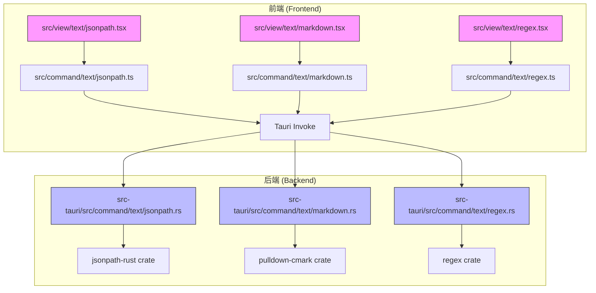
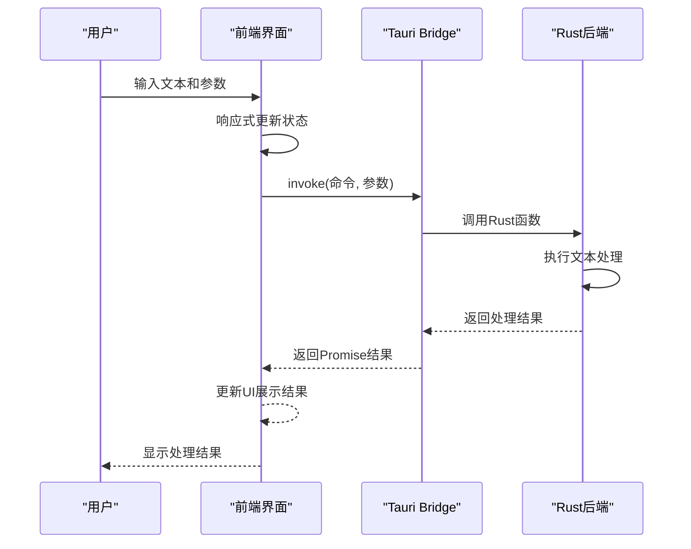
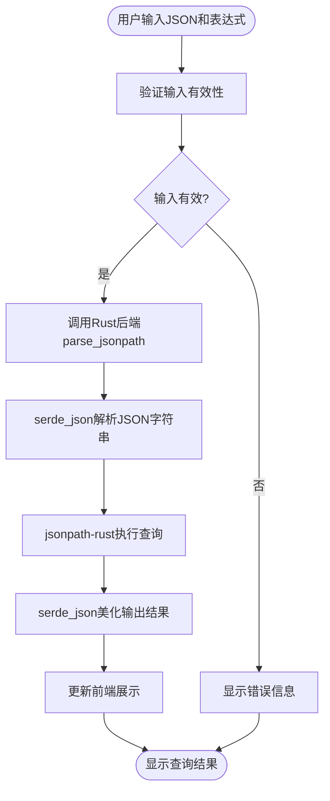
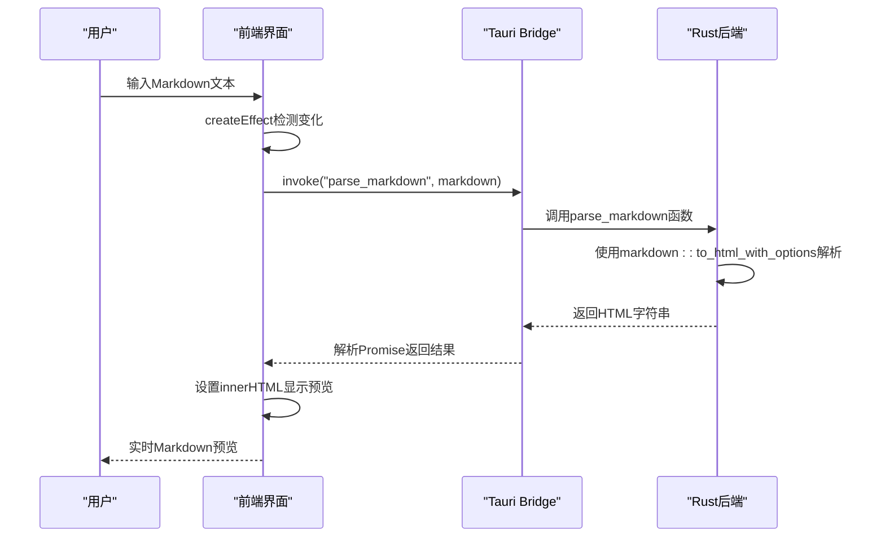
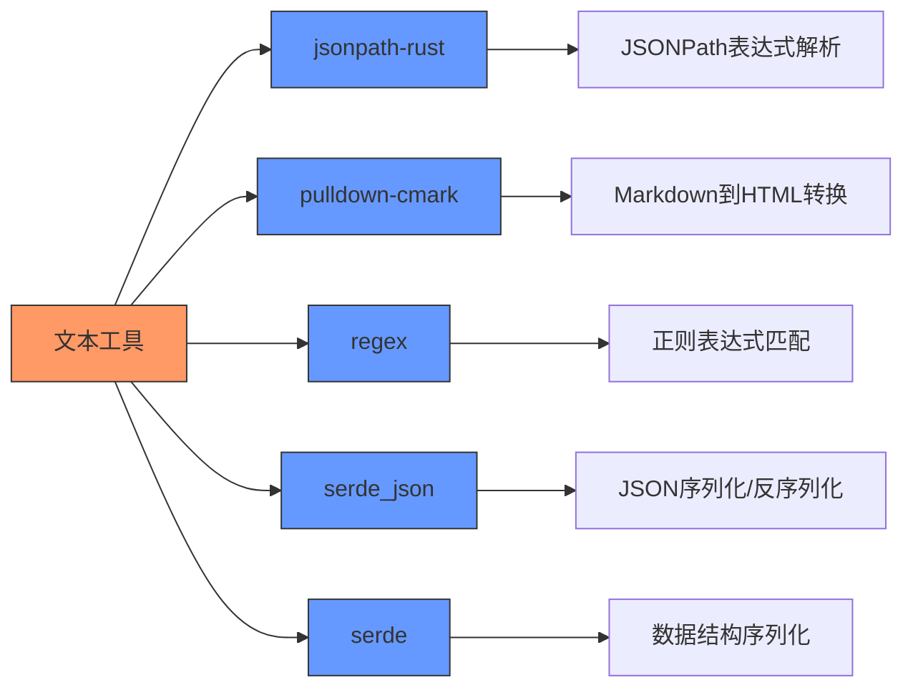

# 文本工具

<cite>
**本文档中引用的文件**  
- [jsonpath.ts](file://src/command/text/jsonpath.ts)
- [markdown.ts](file://src/command/text/markdown.ts)
- [regex.ts](file://src/command/text/regex.ts)
- [jsonpath.tsx](file://src/view/text/jsonpath.tsx)
- [markdown.tsx](file://src/view/text/markdown.tsx)
- [regex.tsx](file://src/view/text/regex.tsx)
- [jsonpath.rs](file://src-tauri/src/command/text/jsonpath.rs)
- [markdown.rs](file://src-tauri/src/command/text/markdown.rs)
- [regex.rs](file://src-tauri/src/command/text/regex.rs)
- [lib.rs](file://src-tauri/src/lib.rs)
- [Cargo.toml](file://src-tauri/Cargo.toml)
- [Buttons.tsx](file://src/component/Buttons.tsx)
- [Config/index.tsx](file://src/component/Config/index.tsx)
- [Editor.tsx](file://src/component/Editor.tsx)
</cite>

## 目录
1. [简介](#简介)
2. [项目结构](#项目结构)
3. [核心组件](#核心组件)
4. [架构概览](#架构概览)
5. [详细组件分析](#详细组件分析)
6. [依赖分析](#依赖分析)
7. [性能考虑](#性能考虑)
8. [故障排除指南](#故障排除指南)
9. [结论](#结论)

## 简介
devkimi是一款基于Tauri框架的桌面文本处理工具，提供JSONPath查询、Markdown预览和正则表达式测试三大核心功能。本系统采用前后端分离架构，前端使用SolidJS构建用户界面，后端使用Rust实现高性能文本处理逻辑。通过Tauri的invoke机制，前端能够安全高效地调用Rust后端函数，实现跨语言通信。系统设计注重用户体验，提供实时响应、语法速查表和丰富的配置选项。

## 项目结构
devkimi项目采用模块化设计，主要分为前端和后端两大部分。前端代码位于src目录，后端Rust代码位于src-tauri目录。文本处理功能集中在src/view/text和src/command/text目录下，分别负责用户界面展示和业务逻辑处理。



**图示来源**  
- [jsonpath.tsx](file://src/view/text/jsonpath.tsx)
- [markdown.tsx](file://src/view/text/markdown.tsx)
- [regex.tsx](file://src/view/text/regex.tsx)
- [jsonpath.rs](file://src-tauri/src/command/text/jsonpath.rs)
- [markdown.rs](file://src-tauri/src/command/text/markdown.rs)
- [regex.rs](file://src-tauri/src/command/text/regex.rs)

**本节来源**  
- [src/view/text/](file://src/view/text/)
- [src/command/text/](file://src/command/text/)
- [src-tauri/src/command/text/](file://src-tauri/src/command/text/)

## 核心组件
文本工具的核心功能由三个子系统组成：JSONPath查询、Markdown预览和正则表达式测试。每个子系统都包含前端界面组件和后端处理逻辑，通过Tauri的invoke机制进行通信。前端使用SolidJS的响应式编程模型，当用户输入发生变化时自动触发后端处理并更新结果展示。后端使用Rust语言和专门的crates实现高效准确的文本处理，确保复杂操作的性能和可靠性。

**本节来源**  
- [jsonpath.tsx](file://src/view/text/jsonpath.tsx#L1-L203)
- [markdown.tsx](file://src/view/text/markdown.tsx#L1-L60)
- [regex.tsx](file://src/view/text/regex.tsx#L1-L203)
- [jsonpath.rs](file://src-tauri/src/command/text/jsonpath.rs#L1-L19)
- [markdown.rs](file://src-tauri/src/command/text/markdown.rs#L1-L15)
- [regex.rs](file://src-tauri/src/command/text/regex.rs#L1-L59)

## 架构概览
devkimi采用典型的前后端分离架构，前端负责用户交互和界面展示，后端负责核心业务逻辑和数据处理。这种架构设计实现了关注点分离，提高了代码的可维护性和可扩展性。



**图示来源**  
- [lib.rs](file://src-tauri/src/lib.rs#L11-L43)
- [jsonpath.ts](file://src/command/text/jsonpath.ts#L3-L5)
- [jsonpath.rs](file://src-tauri/src/command/text/jsonpath.rs#L6-L13)

## 详细组件分析

### JSONPath查询分析
JSONPath查询功能允许用户通过JSONPath表达式从JSON数据中提取特定信息。前端提供语法速查表和实时预览功能，后端使用jsonpath-rust crate解析和执行查询表达式。



**图示来源**  
- [jsonpath.tsx](file://src/view/text/jsonpath.tsx#L118-L203)
- [jsonpath.rs](file://src-tauri/src/command/text/jsonpath.rs#L6-L13)

**本节来源**  
- [jsonpath.tsx](file://src/view/text/jsonpath.tsx#L1-L203)
- [jsonpath.ts](file://src/command/text/jsonpath.ts#L1-L8)
- [jsonpath.rs](file://src-tauri/src/command/text/jsonpath.rs#L1-L19)

### Markdown预览分析
Markdown预览功能将Markdown文本实时转换为HTML格式进行预览。系统使用pulldown-cmark库进行解析，支持GFM（GitHub Flavored Markdown）扩展语法。



**图示来源**  
- [markdown.tsx](file://src/view/text/markdown.tsx#L11-L60)
- [markdown.rs](file://src-tauri/src/command/text/markdown.rs#L9-L14)

**本节来源**  
- [markdown.tsx](file://src/view/text/markdown.tsx#L1-L60)
- [markdown.ts](file://src/command/text/markdown.ts#L1-L8)
- [markdown.rs](file://src-tauri/src/command/text/markdown.rs#L1-L15)

### 正则表达式测试分析
正则表达式测试功能提供完整的正则表达式匹配分析，支持全局匹配、忽略大小写和多行模式等配置选项。

```mermaid
classDiagram
class RegexTest {
+global : boolean
+caseInsensitive : boolean
+multiLine : boolean
+pattern : string
+text : string
+captures : Capture[]
+parseRegex() : Promise~Capture[]~
}
class Capture {
+start : number
+end : number
+value : string
}
class RegexOptions {
+global : boolean
+caseInsensitive : boolean
+multiLine : boolean
}
class RegexGrammars {
+grammar : string
+description : string
}
RegexTest --> Capture : "包含多个"
RegexTest --> RegexOptions : "使用配置"
RegexTest --> RegexGrammars : "参考语法"
RegexTest --> "parse_regex" : "调用"
```

**图示来源**  
- [regex.tsx](file://src/view/text/regex.tsx#L54-L203)
- [regex.rs](file://src-tauri/src/command/text/regex.rs#L33-L59)
- [regex.ts](file://src/command/text/regex.ts#L1-L28)

**本节来源**  
- [regex.tsx](file://src/view/text/regex.tsx#L1-L203)
- [regex.ts](file://src/command/text/regex.ts#L1-L28)
- [regex.rs](file://src-tauri/src/command/text/regex.rs#L1-L59)

## 依赖分析
文本工具的实现依赖于多个关键的Rust crates，这些依赖项在Cargo.toml文件中明确定义，确保了功能的完整性和性能的优化。



**图示来源**  
- [Cargo.toml](file://src-tauri/Cargo.toml#L27-L39)
- [lib.rs](file://src-tauri/src/lib.rs#L11-L43)

**本节来源**  
- [Cargo.toml](file://src-tauri/Cargo.toml#L1-L69)
- [lib.rs](file://src-tauri/src/lib.rs#L1-L57)

## 性能考虑
文本工具在设计时充分考虑了性能因素，通过多种机制确保用户体验的流畅性。Rust后端的高性能处理能力使得复杂文本操作能够快速完成，而前端的响应式编程模型则避免了不必要的重复计算。对于大型文本处理，系统采用流式处理和增量更新策略，减少内存占用和响应延迟。此外，通过Tauri的原生调用机制，避免了WebAssembly的启动开销，进一步提升了执行效率。

## 故障排除指南
当文本工具出现异常时，可参考以下常见问题及解决方案：

1. **JSONPath查询失败**：检查JSON格式是否正确，确保表达式语法无误
2. **Markdown预览不显示**：验证输入是否为有效的Markdown语法
3. **正则表达式匹配异常**：检查正则表达式是否包含语法错误
4. **性能问题**：对于超大文本，建议分批处理或优化表达式

**本节来源**  
- [jsonpath.rs](file://src-tauri/src/command/text/jsonpath.rs#L15-L18)
- [regex.rs](file://src-tauri/src/command/text/regex.rs#L5-L9)
- [markdown.rs](file://src-tauri/src/command/text/markdown.rs#L13-L14)

## 结论
devkimi文本工具通过前后端协同工作，提供了高效、可靠的文本处理功能。前端界面友好，支持实时预览和语法参考；后端基于Rust语言，利用专业的crates实现高性能文本处理。系统架构清晰，模块化程度高，易于维护和扩展。通过Tauri框架，实现了桌面应用的安全性和性能优势，为用户提供了优质的文本处理体验。