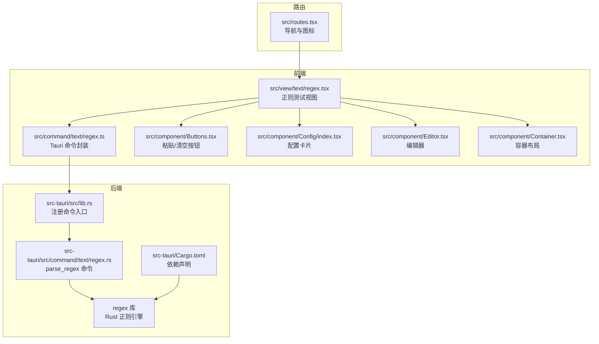
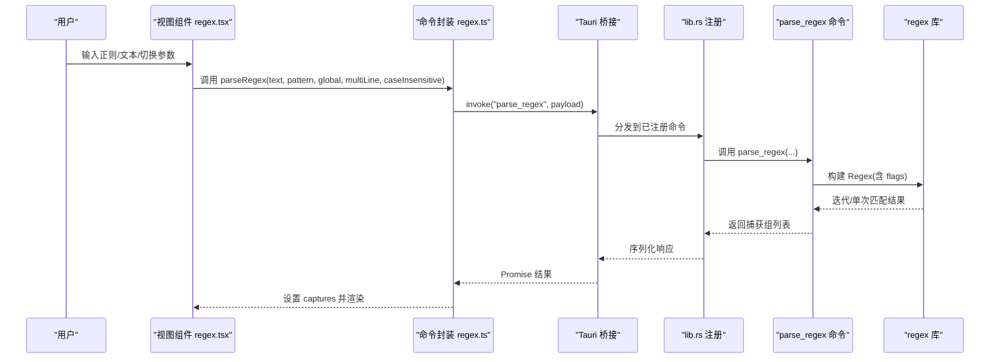
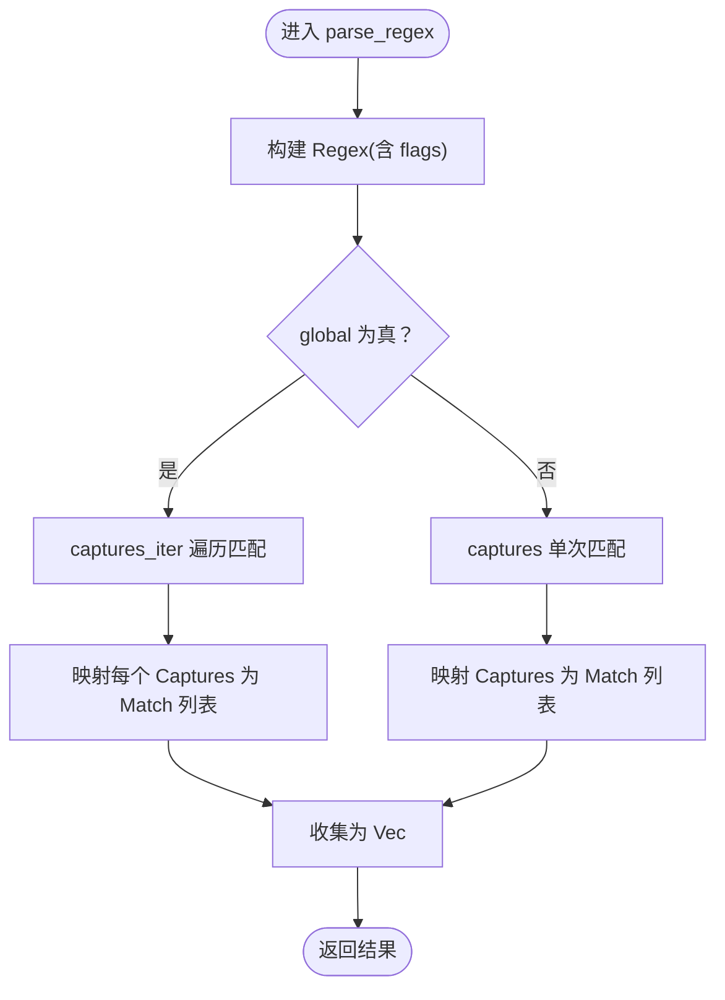
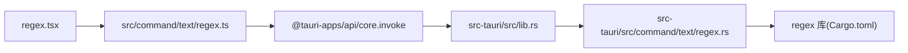

# 正则表达式测试

<cite>
**本文引用的文件**
- [src/view/text/regex.tsx](file://src/view/text/regex.tsx)
- [src/command/text/regex.ts](file://src/command/text/regex.ts)
- [src-tauri/src/command/text/regex.rs](file://src-tauri/src/command/text/regex.rs)
- [src-tauri/src/lib.rs](file://src-tauri/src/lib.rs)
- [src-tauri/Cargo.toml](file://src-tauri/Cargo.toml)
- [src/routes.tsx](file://src/routes.tsx)
- [src/component/Buttons.tsx](file://src/component/Buttons.tsx)
- [src/component/Config/index.tsx](file://src/component/Config/index.tsx)
- [src/component/Container.tsx](file://src/component/Container.tsx)
- [src/component/Editor.tsx](file://src/component/Editor.tsx)
</cite>

## 目录
1. [简介](#简介)
2. [项目结构](#项目结构)
3. [核心组件](#核心组件)
4. [架构总览](#架构总览)
5. [详细组件分析](#详细组件分析)
6. [依赖关系分析](#依赖关系分析)
7. [性能考量](#性能考量)
8. [故障排查指南](#故障排查指南)
9. [结论](#结论)
10. [附录](#附录)

## 简介
本文件系统性梳理 devkimi 中“正则表达式测试”功能的实现，覆盖前端交互界面、实时匹配结果展示以及 Rust 后端对正则引擎的调用与封装。重点说明：
- 前端 Solid 组件如何组织正则参数（全局、多行、忽略大小写）与输入数据，并将请求转发至后端命令；
- 后端 Rust 使用 regex 库构建正则对象并执行匹配，返回捕获组信息；
- 匹配结果的可视化呈现与速查表辅助；
- 性能优化、回溯风险规避与错误诊断建议；
- 实际使用示例与最佳实践，适用于数据验证、文本提取等常见场景。

## 项目结构
该功能位于“文本工具”模块下，前端页面负责输入与展示，命令层负责跨前端与后端的桥接，后端命令负责正则匹配逻辑。

图表来源
- [src/view/text/regex.tsx](file://src/view/text/regex.tsx#L1-L203)
- [src/command/text/regex.ts](file://src/command/text/regex.ts#L1-L28)
- [src-tauri/src/lib.rs](file://src-tauri/src/lib.rs#L1-L57)
- [src-tauri/src/command/text/regex.rs](file://src-tauri/src/command/text/regex.rs#L1-L59)
- [src-tauri/Cargo.toml](file://src-tauri/Cargo.toml#L1-L69)
- [src/routes.tsx](file://src/routes.tsx#L1-L242)

章节来源
- [src/view/text/regex.tsx](file://src/view/text/regex.tsx#L1-L203)
- [src/command/text/regex.ts](file://src/command/text/regex.ts#L1-L28)
- [src-tauri/src/lib.rs](file://src-tauri/src/lib.rs#L1-L57)
- [src-tauri/src/command/text/regex.rs](file://src-tauri/src/command/text/regex.rs#L1-L59)
- [src-tauri/Cargo.toml](file://src-tauri/Cargo.toml#L1-L69)
- [src/routes.tsx](file://src/routes.tsx#L1-L242)

## 核心组件
- 视图组件：负责正则参数开关、正则表达式输入、测试文本输入、匹配结果表格与速查表。
- 命令封装：通过 Tauri invoke 将参数传递给后端命令。
- 后端命令：使用 regex 库构建正则对象，按全局/单次模式收集捕获组，序列化返回。
- 路由与导航：在“文本工具”下暴露“正则表达式”入口。

章节来源
- [src/view/text/regex.tsx](file://src/view/text/regex.tsx#L54-L203)
- [src/command/text/regex.ts](file://src/command/text/regex.ts#L1-L28)
- [src-tauri/src/command/text/regex.rs](file://src-tauri/src/command/text/regex.rs#L1-L59)
- [src-tauri/src/lib.rs](file://src-tauri/src/lib.rs#L1-L57)
- [src/routes.tsx](file://src/routes.tsx#L110-L137)

## 架构总览
从前端到后端的调用链路如下：

图表来源
- [src/view/text/regex.tsx](file://src/view/text/regex.tsx#L62-L70)
- [src/command/text/regex.ts](file://src/command/text/regex.ts#L10-L24)
- [src-tauri/src/lib.rs](file://src-tauri/src/lib.rs#L11-L43)
- [src-tauri/src/command/text/regex.rs](file://src-tauri/src/command/text/regex.rs#L32-L59)

## 详细组件分析

### 前端视图组件 regex.tsx
- 参数控制
  - 全局匹配：开启后遍历所有匹配；关闭后仅返回首个匹配。
  - 忽略大小写：传入 case_insensitive 标志。
  - 多行模式：传入 multi_line 标志。
- 输入区域
  - 正则表达式输入框，支持粘贴与清空。
  - 测试文本使用 Monaco 编辑器，支持大文本与主题切换。
- 结果展示
  - 表格列出每个匹配及其捕获组，包含起止位置与值。
- 速查表
  - 展示常用语法（字符类、锚点、量词、分组、断言、字符集）与说明，便于快速查阅。

章节来源
- [src/view/text/regex.tsx](file://src/view/text/regex.tsx#L54-L203)
- [src/component/Buttons.tsx](file://src/component/Buttons.tsx#L44-L59)
- [src/component/Buttons.tsx](file://src/component/Buttons.tsx#L169-L177)
- [src/component/Editor.tsx](file://src/component/Editor.tsx#L61-L139)
- [src/component/Config/index.tsx](file://src/component/Config/index.tsx#L10-L37)
- [src/component/Container.tsx](file://src/component/Container.tsx#L5-L23)

### 前端命令封装 regex.ts
- 定义 Match/Capture 类型，用于描述单个匹配与一组捕获。
- 通过 invoke 调用后端 parse_regex 命令，传入 text、pattern、global、multiLine、caseInsensitive。
- 返回 Promise<Capture[]>，供视图组件消费。

章节来源
- [src/command/text/regex.ts](file://src/command/text/regex.ts#L1-L28)

### 后端命令 regex.rs
- 错误类型
  - 使用 regex::Error 包装，统一序列化为前端可识别的错误。
- 数据模型
  - Match：包含 start、end、value。
  - Captures：Match 数组，表示一次匹配的所有捕获。
- 命令逻辑
  - 使用 RegexBuilder 构建正则，启用 case_insensitive 与 multi_line。
  - 若 global 为真，使用 captures_iter 遍历所有匹配；否则仅返回第一个匹配。
  - 将 regex::Captures 转换为内部 Match 结构，收集为 Vec<Captures> 返回。

图表来源
- [src-tauri/src/command/text/regex.rs](file://src-tauri/src/command/text/regex.rs#L32-L59)

章节来源
- [src-tauri/src/command/text/regex.rs](file://src-tauri/src/command/text/regex.rs#L1-L59)

### 命令注册与依赖
- 命令注册
  - 在 lib.rs 中通过 generate_handler! 注册 parse_regex，使前端可通过 invoke 调用。
- 依赖声明
  - Cargo.toml 引入 regex、serde、thiserror 等依赖，确保正则引擎与序列化能力。

章节来源
- [src-tauri/src/lib.rs](file://src-tauri/src/lib.rs#L11-L43)
- [src-tauri/Cargo.toml](file://src-tauri/Cargo.toml#L1-L69)

### 路由与导航
- “文本工具”下新增“正则表达式”子路由，图标为 Regex，组件懒加载到 regex.tsx。
- 导航菜单与面包屑均支持该入口。

章节来源
- [src/routes.tsx](file://src/routes.tsx#L110-L137)

## 依赖关系分析
- 前端到后端
  - 视图组件通过命令封装调用后端命令，命令封装依赖 @tauri-apps/api/core 的 invoke。
- 后端到正则引擎
  - parse_regex 命令依赖 regex 库，RegexBuilder 提供 flags 控制。
- 命令注册
  - lib.rs 通过 generate_handler! 将 parse_regex 暴露为可调用命令。

图表来源
- [src/view/text/regex.tsx](file://src/view/text/regex.tsx#L62-L70)
- [src/command/text/regex.ts](file://src/command/text/regex.ts#L10-L24)
- [src-tauri/src/lib.rs](file://src-tauri/src/lib.rs#L11-L43)
- [src-tauri/src/command/text/regex.rs](file://src-tauri/src/command/text/regex.rs#L32-L59)
- [src-tauri/Cargo.toml](file://src-tauri/Cargo.toml#L1-L69)

章节来源
- [src/view/text/regex.tsx](file://src/view/text/regex.tsx#L62-L70)
- [src/command/text/regex.ts](file://src/command/text/regex.ts#L10-L24)
- [src-tauri/src/lib.rs](file://src-tauri/src/lib.rs#L11-L43)
- [src-tauri/src/command/text/regex.rs](file://src-tauri/src/command/text/regex.rs#L32-L59)
- [src-tauri/Cargo.toml](file://src-tauri/Cargo.toml#L1-L69)

## 性能考量
- 正则构建与标志
  - 使用 RegexBuilder 在构建阶段一次性设置 flags（忽略大小写、多行），避免运行时切换开销。
- 全局匹配策略
  - global 为真时使用迭代器遍历所有匹配，适合批量提取；若仅需首个匹配，关闭 global 可减少计算。
- 捕获组映射
  - 将 regex::Captures 映射为 Match 列表，避免额外拷贝；注意捕获组数量较多时的内存占用。
- 大文本处理
  - 使用 Monaco 编辑器支持大文本输入；建议在长文本场景下谨慎使用全局匹配，必要时限制匹配范围或采用分段处理。
- 回溯风险与优化建议
  - 避免使用易产生灾难性回溯的构造（如嵌套量词、无界贪婪量词）。优先使用非贪婪量词、字符类替代、锚点限定范围。
  - 对复杂模式，先在小样本上验证性能，再扩展到全量数据。
  - 使用零宽断言（先行/后行）替代昂贵的回溯组合。
- 错误诊断
  - 后端将 regex::Error 透明包装并序列化，前端可在 effect 中捕获异常并记录日志，便于定位无效模式。

章节来源
- [src-tauri/src/command/text/regex.rs](file://src-tauri/src/command/text/regex.rs#L32-L59)
- [src/view/text/regex.tsx](file://src/view/text/regex.tsx#L62-L70)

## 故障排查指南
- 常见问题
  - 正则语法错误：后端抛出 regex::Error，前端 effect 捕获并打印日志。
  - 空输入：当 pattern 或 text 为空时，清空结果，避免无意义计算。
  - 大文本卡顿：关闭 global 或减少匹配范围，或拆分输入文本。
- 排查步骤
  - 在“速查表”核对语法是否正确；
  - 逐步简化正则，定位导致回溯的片段；
  - 使用“忽略大小写”“多行模式”开关对比行为差异；
  - 检查捕获组顺序与命名（若使用命名捕获），确认输出表格中各列含义。
- 建议
  - 对关键业务正则建立回归用例，定期验证；
  - 在生产环境前进行压力测试，评估匹配耗时与内存峰值。

章节来源
- [src/view/text/regex.tsx](file://src/view/text/regex.tsx#L62-L70)
- [src-tauri/src/command/text/regex.rs](file://src-tauri/src/command/text/regex.rs#L1-L21)

## 结论
该正则表达式测试功能以清晰的前后端分层实现：前端负责参数与输入管理、结果可视化与速查表辅助；后端通过 regex 库高效执行匹配并返回结构化结果。整体具备良好的扩展性与可维护性，适合在数据验证、文本提取等场景中使用。建议在复杂正则场景下遵循回溯优化原则，并结合性能测试持续改进。

## 附录

### 使用示例（从编写到分析）
- 编写正则
  - 在“正则表达式”输入框中输入模式，参考“速查表”快速查阅语法。
- 准备测试数据
  - 在“文本”编辑器中粘贴或导入待匹配文本；可使用“粘贴/清空/选择文件”按钮辅助。
- 调整参数
  - 根据需求切换“全部匹配”“忽略大小写”“多行模式”，观察结果差异。
- 查看结果
  - 表格显示每个匹配及捕获组，包含起止位置与值；定位到具体匹配后，可进一步分析捕获组用途。
- 优化与验证
  - 若匹配耗时较长，尝试简化模式、使用非贪婪量词或添加锚点；对关键规则建立回归用例。

章节来源
- [src/view/text/regex.tsx](file://src/view/text/regex.tsx#L54-L203)
- [src/component/Buttons.tsx](file://src/component/Buttons.tsx#L44-L59)
- [src/component/Buttons.tsx](file://src/component/Buttons.tsx#L169-L177)
- [src/component/Editor.tsx](file://src/component/Editor.tsx#L61-L139)

### 语法支持与特性
- 支持的语法要点（来自速查表）
  - 基础字符匹配：任意字符、单词字符、数字字符、空白字符等。
  - 锚点与边界：字符串开始/结束、单词边界。
  - 量词：*、+、?、{n}、{n,}、{n,m}。
  - 分组与捕获：捕获分组与非捕获分组，以及各种断言（先行/后行）。
  - 字符集合：字符集与取反字符集，支持范围与大小写混合。
- 匹配模式
  - 全局：返回所有匹配及其捕获组。
  - 单次：仅返回首个匹配及其捕获组。
  - 多行：^/$ 在每行生效。
  - 忽略大小写：不区分大小写的匹配。

章节来源
- [src/view/text/regex.tsx](file://src/view/text/regex.tsx#L13-L52)
- [src-tauri/src/command/text/regex.rs](file://src-tauri/src/command/text/regex.rs#L32-L59)