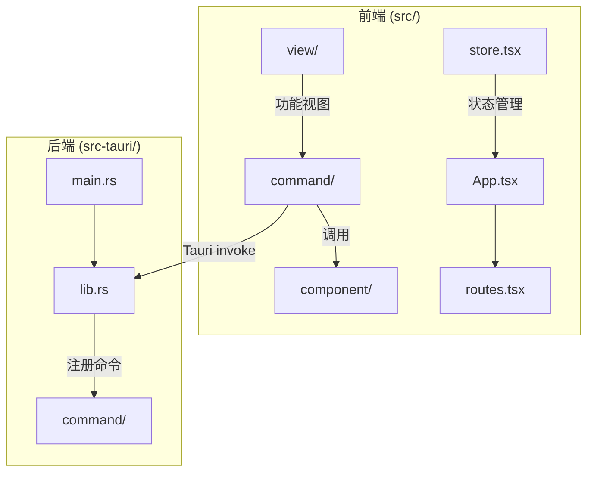
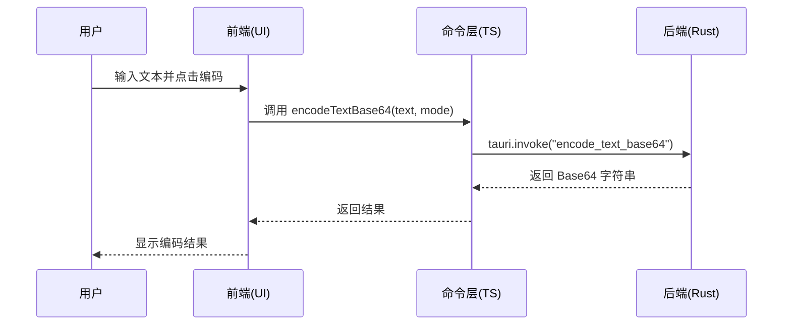
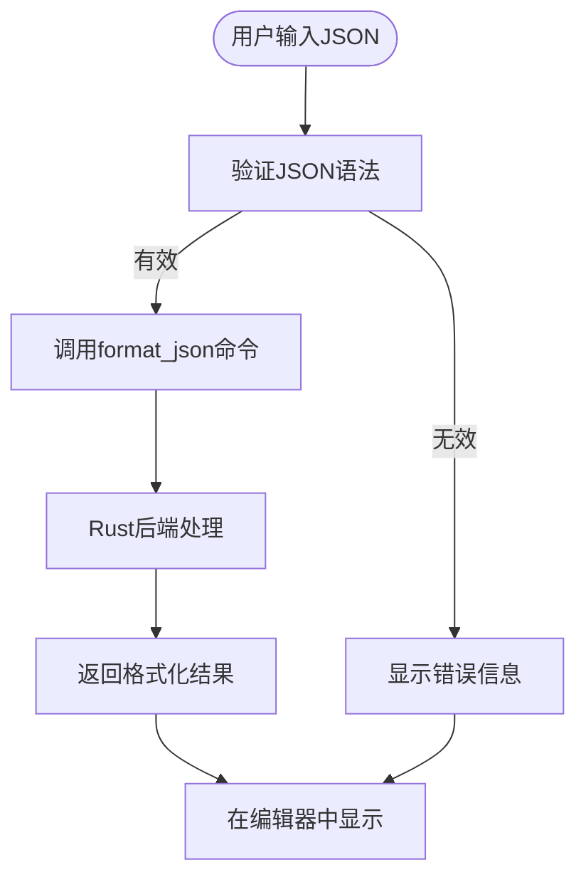
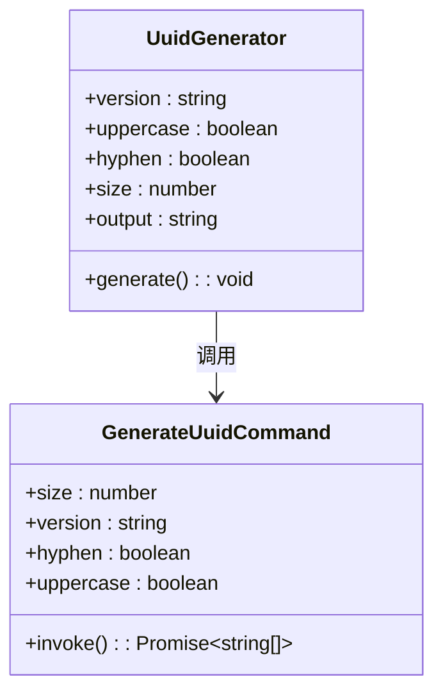
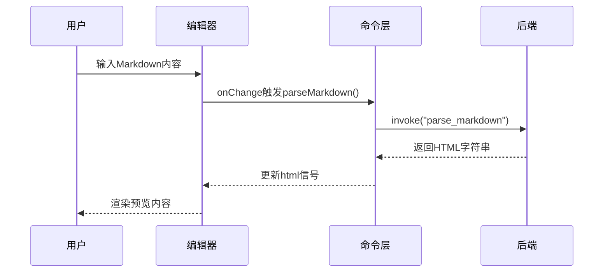
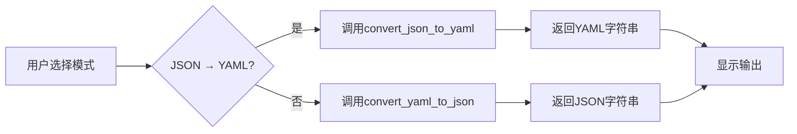
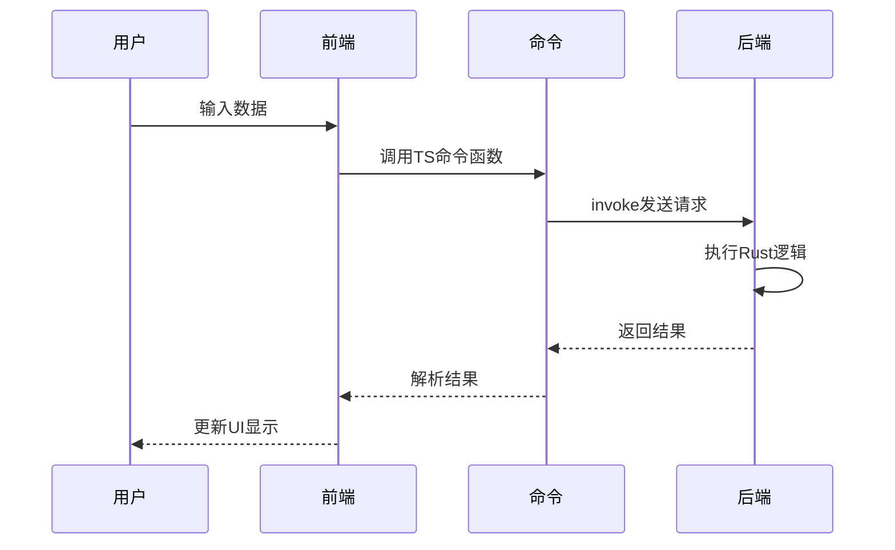

# 核心功能

<cite>
**本文档中引用的文件**  
- [App.tsx](file://src/App.tsx)
- [routes.tsx](file://src/routes.tsx)
- [store.tsx](file://src/store.tsx)
- [json.tsx](file://src/view/formatter/json.tsx)
- [base64_text.tsx](file://src/view/codec/base64_text.tsx)
- [uuid.tsx](file://src/view/generator/uuid.tsx)
- [markdown.tsx](file://src/view/text/markdown.tsx)
- [json_yaml.tsx](file://src/view/converter/json_yaml.tsx)
- [json.ts](file://src/command/formatter/json.ts)
- [base64_text.ts](file://src/command/codec/base64_text.ts)
- [uuid.ts](file://src/command/generate/uuid.ts)
- [markdown.ts](file://src/command/text/markdown.ts)
- [json_yaml.ts](file://src/command/converter/json_yaml.ts)
- [lib.rs](file://src-tauri/src/lib.rs)
- [main.rs](file://src-tauri/src/main.rs)
</cite>

## 目录
1. [简介](#简介)
2. [项目结构](#项目结构)
3. [核心功能模块概述](#核心功能模块概述)
4. [编解码工具](#编解码工具)
5. [格式化工具](#格式化工具)
6. [生成器](#生成器)
7. [文本工具](#文本工具)
8. [转换器](#转换器)
9. [前后端协作机制](#前后端协作机制)
10. [数据流分析](#数据流分析)
11. [结论](#结论)

## 简介
devkimi 是一个基于 Tauri 框架构建的桌面开发工具集，旨在为开发者提供一系列高效、便捷的实用功能。本项目采用 Rust 作为后端语言，结合 SolidJS 前端框架，实现了高性能与响应式 UI 的统一。系统通过五大核心功能模块——编解码工具、格式化工具、生成器、文本工具和转换器——覆盖了日常开发中的常见需求。

**Section sources**
- [App.tsx](file://src/App.tsx#L1-L47)
- [routes.tsx](file://src/routes.tsx#L1-L223)

## 项目结构
devkimi 的项目结构清晰地划分为前端（`src/`）与后端（`src-tauri/`）两大模块。前端部分采用 SolidJS 实现组件化 UI，后端使用 Rust 提供高性能计算能力，并通过 Tauri Bridge 实现安全的跨语言调用。



**Diagram sources**
- [App.tsx](file://src/App.tsx#L1-L47)
- [routes.tsx](file://src/routes.tsx#L1-L223)
- [lib.rs](file://src-tauri/src/lib.rs#L1-L57)
- [main.rs](file://src-tauri/src/main.rs#L1-L7)

**Section sources**
- [App.tsx](file://src/App.tsx#L1-L47)
- [routes.tsx](file://src/routes.tsx#L1-L223)
- [lib.rs](file://src-tauri/src/lib.rs#L1-L57)

## 核心功能模块概述
devkimi 围绕开发者日常需求设计了五个核心功能类别，每个类别下包含多个具体工具。这些功能通过统一的 UI 架构呈现，用户可在侧边栏导航中快速切换。

| 功能类别 | 主要用途 | 示例工具 |
|--------|--------|--------|
| 编解码工具 | 数据编码与解码 | Base64 文本/图片、URL 编解码、二维码生成 |
| 格式化工具 | 数据格式美化 | JSON、SQL、XML 格式化 |
| 生成器 | 随机内容生成 | UUID、密码、哈希值生成 |
| 文本工具 | 文本解析与处理 | Markdown 预览、正则表达式测试、JSONPath 查询 |
| 转换器 | 数据格式互转 | JSON ↔ YAML、YAML ↔ Properties、Cron 表达式解析 |

所有功能均遵循一致的交互模式：用户在左侧输入区域输入内容或配置参数，系统实时处理并在右侧输出结果，支持复制与保存操作。

**Section sources**
- [routes.tsx](file://src/routes.tsx#L39-L218)

## 编解码工具
编解码工具模块提供多种数据编码与解码功能，支持文本、图片、URL 和二维码等常见场景。用户可通过切换“编码/解码”模式实现双向转换。

以 Base64 文本编解码为例，用户可选择 Standard、UrlSafe 等不同编码模式。前端通过 `base64_text.tsx` 组件渲染配置项与编辑器界面，用户输入触发 `encodeTextBase64` 或 `decodeTextBase64` 命令。



**Diagram sources**
- [base64_text.tsx](file://src/view/codec/base64_text.tsx#L1-L111)
- [base64_text.ts](file://src/command/codec/base64_text.ts#L1-L18)

**Section sources**
- [base64_text.tsx](file://src/view/codec/base64_text.tsx#L1-L111)
- [base64_text.ts](file://src/command/codec/base64_text.ts#L1-L18)

## 格式化工具
格式化工具模块专注于提升数据可读性，支持 JSON、SQL 和 XML 三种主流格式的美化与排序。以 JSON 格式化为例，用户可配置缩进方式（2空格、4空格、Tab）及是否按属性排序。

该功能由 `json.tsx` 视图组件驱动，通过 `formatJson` 命令调用后端服务。输入内容变化时，`createEffect` 自动触发格式化请求，确保实时预览效果。



**Diagram sources**
- [json.tsx](file://src/view/formatter/json.tsx#L1-L91)
- [json.ts](file://src/command/formatter/json.ts#L1-L8)

**Section sources**
- [json.tsx](file://src/view/formatter/json.tsx#L1-L91)
- [json.ts](file://src/command/formatter/json.ts#L1-L8)

## 生成器
生成器模块用于快速生成随机数据，包括 UUID、密码和哈希值。以 UUID 生成为例，用户可选择 v1、v4 或 v7 版本，配置是否包含连字符、是否大写以及生成数量。

每次点击“重新生成”按钮时，通过 `setN(n() + 1)` 触发信号更新，进而调用 `generateUuid` 命令获取新值。生成结果以换行分隔的形式展示，便于批量使用。



**Diagram sources**
- [uuid.tsx](file://src/view/generator/uuid.tsx#L1-L87)
- [uuid.ts](file://src/command/generate/uuid.ts#L1-L18)

**Section sources**
- [uuid.tsx](file://src/view/generator/uuid.tsx#L1-L87)
- [uuid.ts](file://src/command/generate/uuid.ts#L1-L18)

## 文本工具
文本工具模块提供高级文本处理能力，包括 Markdown 实时预览、正则表达式测试和 JSONPath 查询。以 Markdown 预览为例，左侧为编辑区，右侧为 HTML 渲染结果。

系统通过 `parseMarkdown` 命令将 Markdown 转换为 HTML，并使用 `innerHTML` 注入预览容器。由于不依赖客户端 JavaScript 渲染，保证了安全性与性能。



**Diagram sources**
- [markdown.tsx](file://src/view/text/markdown.tsx#L1-L60)
- [markdown.ts](file://src/command/text/markdown.ts#L1-L8)

**Section sources**
- [markdown.tsx](file://src/view/text/markdown.tsx#L1-L60)
- [markdown.ts](file://src/command/text/markdown.ts#L1-L8)

## 转换器
转换器模块实现不同数据格式之间的相互转换，如 JSON 与 YAML、YAML 与 Properties 文件的互转。用户通过开关选择转换方向，输入区语言提示随之动态变化。

以 JSON/YAML 转换为例，`Show` 组件根据 `mode()` 值切换编辑器语言（JSON 或 YAML），确保语法高亮正确。转换过程由 `convertJsonToYaml` 和 `convertYamlToJson` 两个独立命令支持。



**Diagram sources**
- [json_yaml.tsx](file://src/view/converter/json_yaml.tsx#L1-L107)
- [json_yaml.ts](file://src/command/converter/json_yaml.ts#L1-L12)

**Section sources**
- [json_yaml.tsx](file://src/view/converter/json_yaml.tsx#L1-L107)
- [json_yaml.ts](file://src/command/converter/json_yaml.ts#L1-L12)

## 前后端协作机制
devkimi 采用 Tauri 架构实现前后端分离与安全通信。前端使用 TypeScript 编写命令调用接口，通过 `@tauri-apps/api/core` 的 `invoke` 方法发起异步请求，后端 Rust 层注册对应处理函数。

所有命令在 `src-tauri/src/lib.rs` 中通过 `tauri::generate_handler!` 宏集中注册，确保类型安全与调用效率。这种设计既隔离了 UI 逻辑与业务逻辑，又充分发挥了 Rust 在计算密集型任务上的性能优势。

```mermaid
graph LR
A[前端 SolidJS] --> |invoke("command_name")| B[Tauri Bridge]
B --> C[Rust 后端]
C --> |处理并返回| B
B --> A
```

**Diagram sources**
- [lib.rs](file://src-tauri/src/lib.rs#L1-L57)
- [json.ts](file://src/command/formatter/json.ts#L1-L8)

**Section sources**
- [lib.rs](file://src-tauri/src/lib.rs#L1-L57)
- [json.ts](file://src/command/formatter/json.ts#L1-L8)

## 数据流分析
从用户操作到最终输出，devkimi 的完整数据流如下：

1. **用户交互**：在 UI 中输入数据或更改配置
2. **状态更新**：SolidJS 信号（Signal）捕获变更
3. **副作用触发**：`createEffect` 监听到信号变化，调用命令
4. **桥接调用**：`invoke` 发送命令名与参数至 Tauri Bridge
5. **Rust 处理**：后端执行具体算法并返回结果
6. **结果更新**：前端信号更新，驱动视图重渲染

此流程确保了数据单向流动与响应式更新，同时利用 Rust 后端保障了计算性能与内存安全。



**Diagram sources**
- [lib.rs](file://src-tauri/src/lib.rs#L1-L57)
- [main.rs](file://src-tauri/src/main.rs#L1-L7)

**Section sources**
- [lib.rs](file://src-tauri/src/lib.rs#L1-L57)
- [main.rs](file://src-tauri/src/main.rs#L1-L7)

## 结论
devkimi 通过模块化设计与前后端协同架构，构建了一个功能丰富且性能优越的开发者工具集。五大核心功能模块覆盖了编码、格式化、生成、文本处理与格式转换等典型场景，统一的交互模式降低了用户学习成本。

系统充分利用 Tauri 框架的优势，将计算密集型任务交由 Rust 后端处理，前端专注于用户体验，实现了安全性、性能与可维护性的平衡。未来可扩展更多工具模块，并支持插件化机制以增强可扩展性。