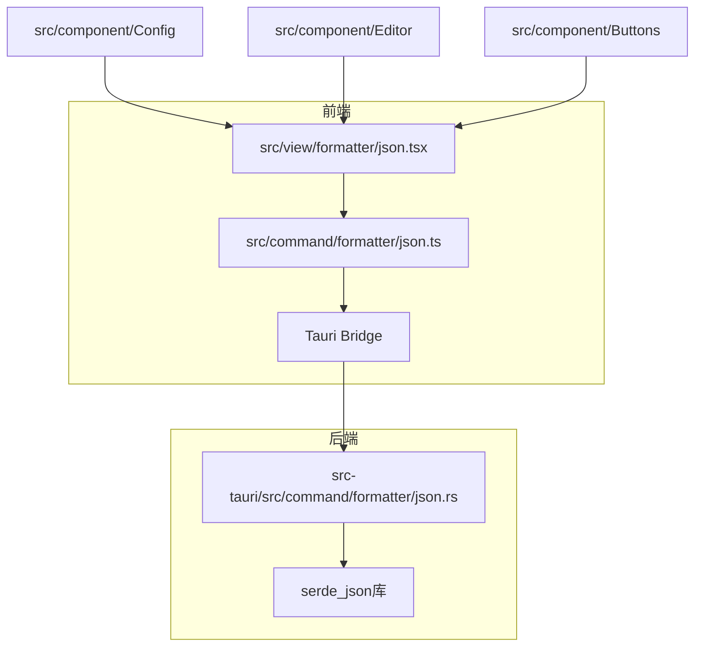
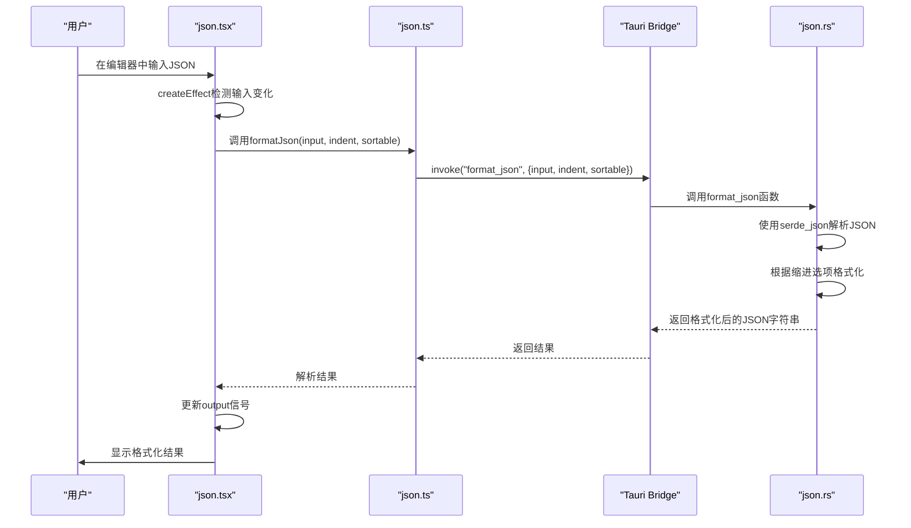
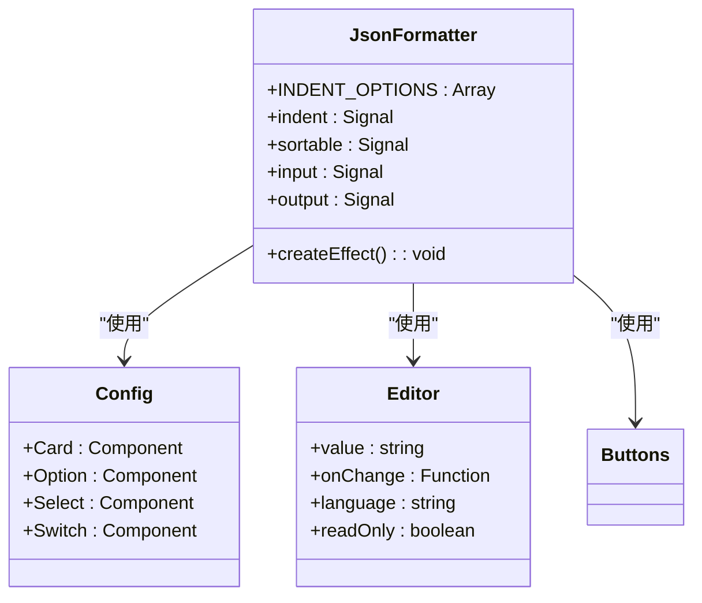
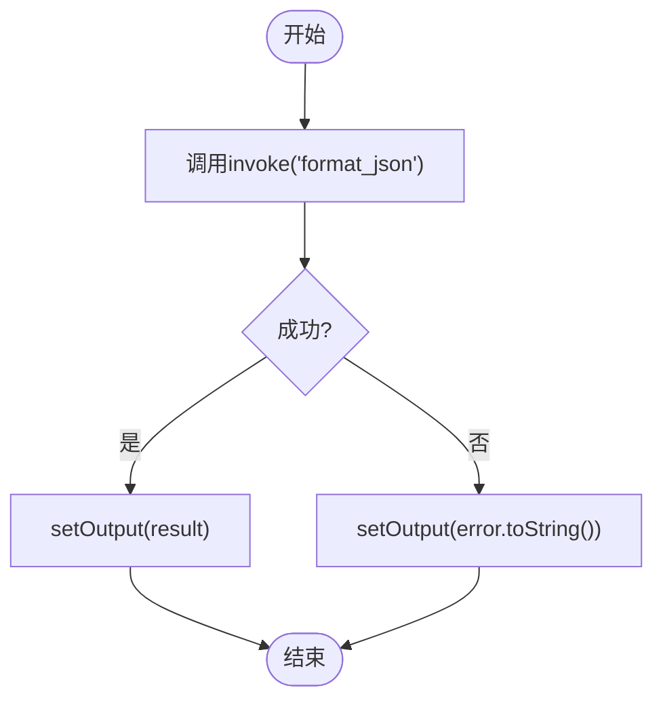
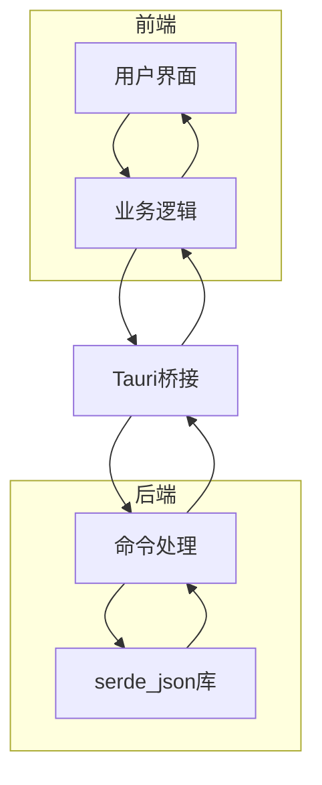
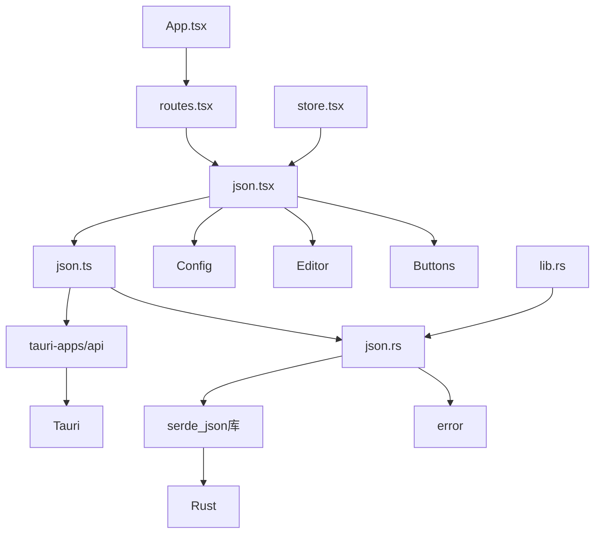

# JSON格式化

<cite>
**本文档引用的文件**
- [json.tsx](file://src/view/formatter/json.tsx)
- [json.ts](file://src/command/formatter/json.ts)
- [json.rs](file://src-tauri/src/command/formatter/json.rs)
- [Cargo.toml](file://src-tauri/Cargo.toml)
- [App.tsx](file://src/App.tsx)
- [routes.tsx](file://src/routes.tsx)
- [store.tsx](file://src/store.tsx)
- [Buttons.tsx](file://src/component/Buttons.tsx)
- [Editor.tsx](file://src/component/Editor.tsx)
- [Config/index.tsx](file://src/component/Config/index.tsx)
- [lib.rs](file://src-tauri/src/lib.rs)
- [error.rs](file://src-tauri/src/error.rs)
</cite>

## 目录
1. [简介](#简介)
2. [项目结构](#项目结构)
3. [核心组件](#核心组件)
4. [架构概述](#架构概述)
5. [详细组件分析](#详细组件分析)
6. [依赖分析](#依赖分析)
7. [性能考虑](#性能考虑)
8. [故障排除指南](#故障排除指南)
9. [结论](#结论)

## 简介
devkimi是一款基于Tauri框架的桌面应用程序，提供多种开发工具。其中JSON格式化功能是其核心特性之一，允许用户将原始JSON数据格式化为可读性更强的结构。该功能通过前端界面与后端Rust实现的高性能JSON解析器无缝集成，为用户提供实时预览、多种格式化选项和错误处理能力。本文档深入分析JSON格式化功能的实现原理，从用户界面到后端处理的完整流程。

## 项目结构
devkimi项目采用分层架构，前端使用SolidJS框架，后端使用Rust语言通过Tauri框架与前端通信。JSON格式化功能分布在多个目录中，体现了清晰的关注点分离。



**图表来源**
- [json.tsx](file://src/view/formatter/json.tsx#L1-L91)
- [json.ts](file://src/command/formatter/json.ts#L1-L8)
- [json.rs](file://src-tauri/src/command/formatter/json.rs#L1-L39)

**本节来源**
- [json.tsx](file://src/view/formatter/json.tsx#L1-L91)
- [json.ts](file://src/command/formatter/json.ts#L1-L8)
- [json.rs](file://src-tauri/src/command/formatter/json.rs#L1-L39)

## 核心组件
JSON格式化功能由三个主要组件构成：前端用户界面组件、前端业务逻辑层和后端Rust实现。前端界面`json.tsx`负责渲染用户界面和处理用户交互，业务逻辑层`json.ts`作为桥梁调用Tauri命令，后端`json.rs`利用Rust的`serde_json`库执行实际的JSON解析和格式化操作。这种分层架构确保了高性能的同时保持了代码的可维护性。

**本节来源**
- [json.tsx](file://src/view/formatter/json.tsx#L1-L91)
- [json.ts](file://src/command/formatter/json.ts#L1-L8)
- [json.rs](file://src-tauri/src/command/formatter/json.rs#L1-L39)

## 架构概述
JSON格式化功能采用典型的前后端分离架构，通过Tauri框架提供的安全桥接机制进行通信。前端使用SolidJS的响应式编程模型，当用户输入发生变化时自动触发格式化操作。后端利用Rust语言的高性能特性，通过`serde_json`库实现快速、准确的JSON解析和格式化。



**图表来源**
- [json.tsx](file://src/view/formatter/json.tsx#L25-L33)
- [json.ts](file://src/command/formatter/json.ts#L3-L5)
- [json.rs](file://src-tauri/src/command/formatter/json.rs#L14-L25)

## 详细组件分析

### JSON格式化器分析
JSON格式化器组件实现了完整的JSON处理流程，从用户界面到后端处理，提供了丰富的功能选项。

#### 前端用户界面
前端界面使用SolidJS框架构建，包含配置面板、输入编辑器和输出编辑器三个主要部分。配置面板允许用户选择缩进样式和是否对JSON属性进行排序。



**图表来源**
- [json.tsx](file://src/view/formatter/json.tsx#L13-L91)
- [Config/index.tsx](file://src/component/Config/index.tsx#L1-L37)
- [Editor.tsx](file://src/component/Editor.tsx#L1-L139)

#### 业务逻辑层
业务逻辑层作为前端和后端之间的桥梁，负责调用Tauri命令并处理结果。它使用`invoke`函数与后端通信，实现了异步操作的Promise处理。



**图表来源**
- [json.ts](file://src/command/formatter/json.ts#L3-L5)

#### 后端实现
后端实现利用Rust的`serde_json`库提供高性能的JSON解析和格式化能力。`format_json`函数接受输入字符串、缩进类型和排序标志作为参数，返回格式化后的JSON字符串。

```mermaid
flowchart TD
Start([开始]) --> 解析JSON["serde_json::from_str::<Value>(input)"]
解析JSON --> 排序检查{"sortable为true?"}
排序检查 --> |是| 排序JSON["value.sort_all_objects()"]
排序检查 --> |否| 缩进检查
排序JSON --> 缩进检查
缩进检查 --> 缩进类型{"缩进类型"}
缩进类型 --> |None| 精简格式["serde_json::to_string(&value)"]
缩进类型 --> |TwoSpace| 两空格["to_string_pretty(&value, b\" \")"]
缩进类型 --> |FourSpace| 四空格["to_string_pretty(&value, b\" \")"]
缩进类型 --> |Tab| 制表符["to_string_pretty(&value, b\"\\t\")"]
精简格式 --> 返回结果
两空格 --> 返回结果
四空格 --> 返回结果
制表符 --> 返回结果
返回结果 --> End([返回格式化字符串])
```

**图表来源**
- [json.rs](file://src-tauri/src/command/formatter/json.rs#L14-L25)
- [json.rs](file://src-tauri/src/command/formatter/json.rs#L27-L33)

**本节来源**
- [json.tsx](file://src/view/formatter/json.tsx#L1-L91)
- [json.ts](file://src/command/formatter/json.ts#L1-L8)
- [json.rs](file://src-tauri/src/command/formatter/json.rs#L1-L39)

### 概念概述
JSON格式化功能的设计体现了现代桌面应用开发的最佳实践。通过将计算密集型任务（JSON解析和格式化）放在性能优越的Rust后端执行，而将用户界面和交互逻辑放在灵活的前端框架中实现，实现了性能和开发效率的平衡。Tauri框架作为桥梁，确保了前后端通信的安全性和效率。



## 依赖分析
JSON格式化功能依赖于多个内部和外部组件，形成了一个完整的功能生态系统。



**图表来源**
- [Cargo.toml](file://src-tauri/Cargo.toml#L42)
- [lib.rs](file://src-tauri/src/lib.rs#L15)
- [routes.tsx](file://src/routes.tsx#L50)
- [json.tsx](file://src/view/formatter/json.tsx#L3)
- [json.ts](file://src/command/formatter/json.ts#L1)
- [json.rs](file://src-tauri/src/command/formatter/json.rs#L3)

**本节来源**
- [Cargo.toml](file://src-tauri/Cargo.toml#L1-L69)
- [lib.rs](file://src-tauri/src/lib.rs#L1-L57)
- [routes.tsx](file://src/routes.tsx#L1-L242)
- [store.tsx](file://src/store.tsx#L1-L88)

## 性能考虑
JSON格式化功能在性能方面进行了精心设计，确保即使处理大型JSON文件也能保持流畅的用户体验。后端使用Rust语言实现，利用其内存安全和高性能特性，通过`serde_json`库提供快速的JSON解析能力。前端采用SolidJS的响应式系统，仅在输入发生变化时才触发格式化操作，避免了不必要的计算。对于大文件处理，系统通过异步操作避免阻塞UI线程，确保界面的响应性。

## 故障排除指南
当JSON格式化功能出现问题时，可以从以下几个方面进行排查：

**本节来源**
- [json.tsx](file://src/view/formatter/json.tsx#L29)
- [json.rs](file://src-tauri/src/command/formatter/json.rs#L35-L38)
- [error.rs](file://src-tauri/src/error.rs#L1-L31)

## 结论
devkimi的JSON格式化功能通过巧妙的架构设计，将前端的灵活性与后端的高性能相结合，为用户提供了一个强大而易用的工具。通过Tauri框架的桥接，前端可以安全地调用Rust后端的高性能JSON处理能力，同时保持了良好的用户体验。该功能不仅支持基本的格式化需求，还提供了排序、多种缩进选项等高级特性，满足了不同用户的需求。未来可以考虑增加更多格式化选项，如控制小数精度、日期格式化等，进一步提升功能的实用性。