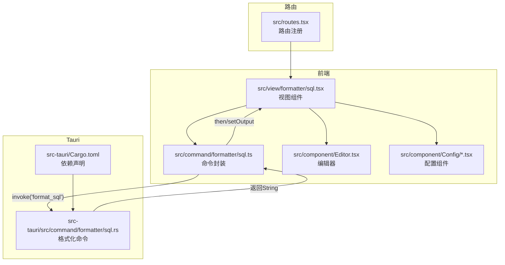
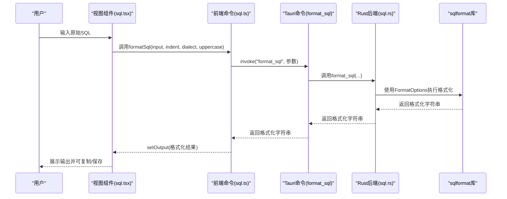
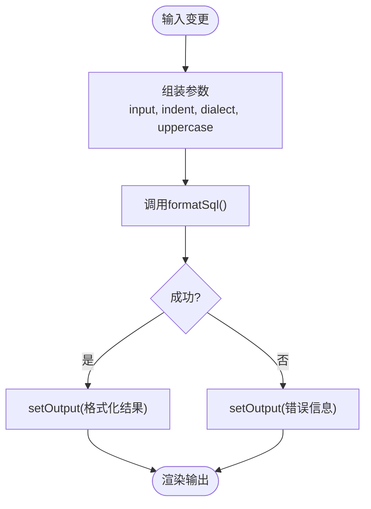
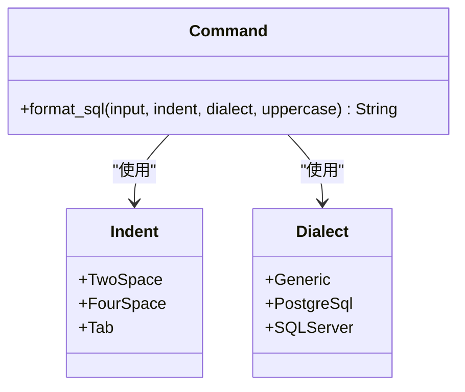

# SQL格式化

<cite>
**本文引用的文件**
- [src/view/formatter/sql.tsx](file://src/view/formatter/sql.tsx)
- [src/command/formatter/sql.ts](file://src/command/formatter/sql.ts)
- [src-tauri/src/command/formatter/sql.rs](file://src-tauri/src/command/formatter/sql.rs)
- [src-tauri/Cargo.toml](file://src-tauri/Cargo.toml)
- [src/component/Editor.tsx](file://src/component/Editor.tsx)
- [src/component/Config/index.tsx](file://src/component/Config/index.tsx)
- [src/component/Config/Select.tsx](file://src/component/Config/Select.tsx)
- [src/component/Config/Switch.tsx](file://src/component/Config/Switch.tsx)
- [src/routes.tsx](file://src/routes.tsx)
- [src/store.tsx](file://src/store.tsx)
- [README.md](file://README.md)
</cite>

## 目录
1. [简介](#简介)
2. [项目结构](#项目结构)
3. [核心组件](#核心组件)
4. [架构总览](#架构总览)
5. [详细组件分析](#详细组件分析)
6. [依赖关系分析](#依赖关系分析)
7. [性能考量](#性能考量)
8. [故障排查指南](#故障排查指南)
9. [结论](#结论)
10. [附录](#附录)

## 简介
本文件系统性阐述 devkimi 中 SQL 格式化功能的实现架构与使用方法。该功能由前端 SolidJS 组件负责交互与配置，通过 Tauri 的命令通道调用 Rust 后端，后端使用 sqlformat 库完成多数据库方言的语法解析与格式化，最终返回给前端进行展示与复制保存。本文覆盖：
- 后端如何利用 Rust 的 sqlformat 库支持多种数据库方言（标准 SQL、PostgreSQL、SQL Server）的语法解析与格式化规则
- 前端编辑器组件如何提供语法高亮、自动补全与格式化选项配置界面
- 不同 SQL 语句类型（SELECT、INSERT、UPDATE 等）的格式化效果与复杂查询（嵌套子查询、JOIN 操作）的处理能力
- 实际使用示例，从原始 SQL 到格式化输出的转换流程
- 配置选项（关键字大写、缩进风格）的实现机制、错误处理与性能特征
- 面向数据库开发者的最佳实践建议

## 项目结构
SQL 格式化功能分布在前端视图层、命令层与后端命令层三部分，并通过路由组织在“格式化工具/SQL”页面中：
- 前端视图层：负责用户交互、配置项与输入输出编辑器
- 前端命令层：封装 Tauri invoke 调用，传递格式化参数
- 后端命令层：使用 sqlformat 库执行格式化，返回字符串结果
- 依赖声明：Rust 侧通过 Cargo.toml 引入 sqlformat

图表来源
- [src/view/formatter/sql.tsx](file://src/view/formatter/sql.tsx#L1-L100)
- [src/command/formatter/sql.ts](file://src/command/formatter/sql.ts#L1-L13)
- [src-tauri/src/command/formatter/sql.rs](file://src-tauri/src/command/formatter/sql.rs#L1-L36)
- [src-tauri/Cargo.toml](file://src-tauri/Cargo.toml#L1-L69)
- [src/routes.tsx](file://src/routes.tsx#L1-L62)

章节来源
- [src/view/formatter/sql.tsx](file://src/view/formatter/sql.tsx#L1-L100)
- [src/command/formatter/sql.ts](file://src/command/formatter/sql.ts#L1-L13)
- [src-tauri/src/command/formatter/sql.rs](file://src-tauri/src/command/formatter/sql.rs#L1-L36)
- [src-tauri/Cargo.toml](file://src-tauri/Cargo.toml#L1-L69)
- [src/routes.tsx](file://src/routes.tsx#L1-L62)

## 核心组件
- 视图组件（SQL 格式化页面）
  - 提供缩进风格、数据库方言、关键字大写三项配置
  - 输入与输出两个编辑器，支持复制与保存
  - 通过 effect 监听输入变化，触发格式化命令
- 前端命令封装
  - 通过 Tauri invoke 调用后端命令 format_sql，传入 input、indent、dialect、uppercase
- 后端命令实现
  - 将前端枚举映射为 sqlformat 的 Indent/Dialect
  - 使用 FormatOptions 控制缩进、方言与关键字大写
  - 返回格式化后的字符串
- 依赖声明
  - Rust 侧 Cargo.toml 显式引入 sqlformat

章节来源
- [src/view/formatter/sql.tsx](file://src/view/formatter/sql.tsx#L1-L100)
- [src/command/formatter/sql.ts](file://src/command/formatter/sql.ts#L1-L13)
- [src-tauri/src/command/formatter/sql.rs](file://src-tauri/src/command/formatter/sql.rs#L1-L36)
- [src-tauri/Cargo.toml](file://src-tauri/Cargo.toml#L1-L69)

## 架构总览
下图展示了从前端到后端的完整调用链路与数据流。

图表来源
- [src/view/formatter/sql.tsx](file://src/view/formatter/sql.tsx#L1-L100)
- [src/command/formatter/sql.ts](file://src/command/formatter/sql.ts#L1-L13)
- [src-tauri/src/command/formatter/sql.rs](file://src-tauri/src/command/formatter/sql.rs#L1-L36)

## 详细组件分析

### 前端视图组件（SQL 格式化页面）
- 配置项
  - 缩进风格：TwoSpace、FourSpace、Tab
  - 数据库方言：Generic、PostgreSql、SQLServer
  - 关键字大写：布尔开关
- 输入输出编辑器
  - 输入编辑器：language="sql"，支持语法高亮与自动补全
  - 输出编辑器：只读，支持复制与保存
- 效果监听
  - 当输入发生变化时，异步调用 formatSql 并更新输出
  - 发生异常时，将错误信息显示在输出区域

图表来源
- [src/view/formatter/sql.tsx](file://src/view/formatter/sql.tsx#L1-L100)

章节来源
- [src/view/formatter/sql.tsx](file://src/view/formatter/sql.tsx#L1-L100)

### 前端命令封装（invoke 封装）
- 作用：统一调用后端命令 format_sql，隐藏 Tauri 调用细节
- 参数：input、indent、dialect、uppercase
- 返回：Promise<string>，用于后续 setOutput

章节来源
- [src/command/formatter/sql.ts](file://src/command/formatter/sql.ts#L1-L13)

### 后端命令实现（Rust）
- 枚举映射
  - Indent -> Spaces(2/4)/Tabs
  - Dialect -> Generic/PostgreSql/SQLServer
- 格式化选项
  - indent：根据 Indent 决定空格数或制表符
  - dialect：选择方言以适配特定语法
  - uppercase：控制关键字是否转为大写
- 返回值
  - 返回格式化后的字符串

图表来源
- [src-tauri/src/command/formatter/sql.rs](file://src-tauri/src/command/formatter/sql.rs#L1-L36)

章节来源
- [src-tauri/src/command/formatter/sql.rs](file://src-tauri/src/command/formatter/sql.rs#L1-L36)

### 前端编辑器与配置组件
- 编辑器
  - 通过 Monaco Editor 提供语法高亮与自动补全
  - 支持主题、字体、自动换行等设置
- 配置卡片与控件
  - Config.Card：折叠式配置容器
  - Config.Select：下拉选择缩进与方言
  - Config.Switch：关键字大写开关

章节来源
- [src/component/Editor.tsx](file://src/component/Editor.tsx#L1-L139)
- [src/component/Config/index.tsx](file://src/component/Config/index.tsx#L1-L37)
- [src/component/Config/Select.tsx](file://src/component/Config/Select.tsx#L1-L30)
- [src/component/Config/Switch.tsx](file://src/component/Config/Switch.tsx#L1-L24)
- [src/store.tsx](file://src/store.tsx#L1-L88)

### 路由与导航
- “格式化工具/SQL”路由已注册，页面按需懒加载
- 便于用户在应用内快速定位到 SQL 格式化功能

章节来源
- [src/routes.tsx](file://src/routes.tsx#L1-L62)

## 依赖关系分析
- 前端到后端
  - 前端命令封装通过 Tauri invoke 调用后端命令
  - 后端命令实现使用 sqlformat 库进行格式化
- 依赖声明
  - Rust 侧 Cargo.toml 显式声明 sqlformat 依赖
- 耦合与内聚
  - 前端仅关心参数与返回值，耦合度低
  - 后端集中处理格式化逻辑，内聚性高

图表来源
- [src/command/formatter/sql.ts](file://src/command/formatter/sql.ts#L1-L13)
- [src-tauri/src/command/formatter/sql.rs](file://src-tauri/src/command/formatter/sql.rs#L1-L36)
- [src-tauri/Cargo.toml](file://src-tauri/Cargo.toml#L1-L69)

章节来源
- [src/command/formatter/sql.ts](file://src/command/formatter/sql.ts#L1-L13)
- [src-tauri/src/command/formatter/sql.rs](file://src-tauri/src/command/formatter/sql.rs#L1-L36)
- [src-tauri/Cargo.toml](file://src-tauri/Cargo.toml#L1-L69)

## 性能考量
- 前端
  - 使用 SolidJS 的响应式信号与 effect，仅在输入变化时触发格式化，避免不必要的计算
  - 编辑器采用 Monaco，具备高效的语法高亮与自动补全
- 后端
  - 使用 sqlformat 库进行格式化，其内部实现针对 SQL 解析与格式化进行了优化
  - 通过枚举映射与默认选项合并，减少分支判断开销
- 运行时
  - Tauri invoke 为本地命令调用，延迟较低
  - 对于超长 SQL，建议分段处理或提示用户优化输入

[本节为一般性指导，不直接分析具体文件]

## 故障排查指南
- 输入为空
  - 现象：输出清空
  - 原因：effect 中对空输入的分支处理
- 格式化失败
  - 现象：输出显示错误信息
  - 原因：前端调用 catch 分支将异常字符串写入输出
  - 建议：检查 SQL 语法、方言选择与关键字大写设置
- 编辑器无语法高亮
  - 现象：输入/输出编辑器未显示语法高亮
  - 原因：编辑器 language 需要正确设置；Monaco 默认语言为 plaintext
  - 建议：确认编辑器初始化与 language 配置
- 配置不生效
  - 现象：缩进、方言、关键字大写未按预期变化
  - 原因：前端信号未更新或后端枚举映射不匹配
  - 建议：检查配置控件的 onChange 与后端枚举值

章节来源
- [src/view/formatter/sql.tsx](file://src/view/formatter/sql.tsx#L1-L100)
- [src/component/Editor.tsx](file://src/component/Editor.tsx#L1-L139)

## 结论
devkimi 的 SQL 格式化功能以清晰的三层架构实现：前端负责交互与配置，Tauri 作为桥接层，Rust 后端使用 sqlformat 库完成格式化。该设计具备良好的扩展性与可维护性，能够满足多数据库方言与多样化格式化需求。通过合理的配置与最佳实践，开发者可以显著提升 SQL 代码的可读性与一致性。

[本节为总结性内容，不直接分析具体文件]

## 附录

### 使用示例（从原始 SQL 到格式化输出）
- 步骤
  1) 在输入编辑器中粘贴原始 SQL
  2) 在配置面板中选择合适的缩进风格、数据库方言与关键字大写开关
  3) 查看输出编辑器中的格式化结果
  4) 如需复制或保存，使用复制/保存按钮
- 适用场景
  - SELECT/INSERT/UPDATE/DELETE 等常见语句
  - 嵌套子查询与 JOIN 操作
  - 多数据库方言（标准 SQL、PostgreSQL、SQL Server）

章节来源
- [src/view/formatter/sql.tsx](file://src/view/formatter/sql.tsx#L1-L100)

### 配置选项说明
- 缩进风格
  - TwoSpace：两空格缩进
  - FourSpace：四空格缩进
  - Tab：制表符缩进
- 数据库方言
  - Generic：标准 SQL
  - PostgreSql：PostgreSQL 方言
  - SQLServer：SQL Server 方言
- 关键字大写
  - 开启：将关键字转为大写
  - 关闭：保留原大小写

章节来源
- [src/view/formatter/sql.tsx](file://src/view/formatter/sql.tsx#L1-L100)
- [src-tauri/src/command/formatter/sql.rs](file://src-tauri/src/command/formatter/sql.rs#L1-L36)

### 最佳实践
- 选择合适的方言以匹配目标数据库，确保格式化结果符合目标环境的语法习惯
- 在团队协作中统一缩进风格与关键字大小写策略，提升一致性
- 对复杂查询（嵌套子查询、JOIN）建议先拆分再格式化，便于阅读与审查
- 使用复制/保存功能留存格式化结果，便于版本管理与审计

[本节为一般性指导，不直接分析具体文件]