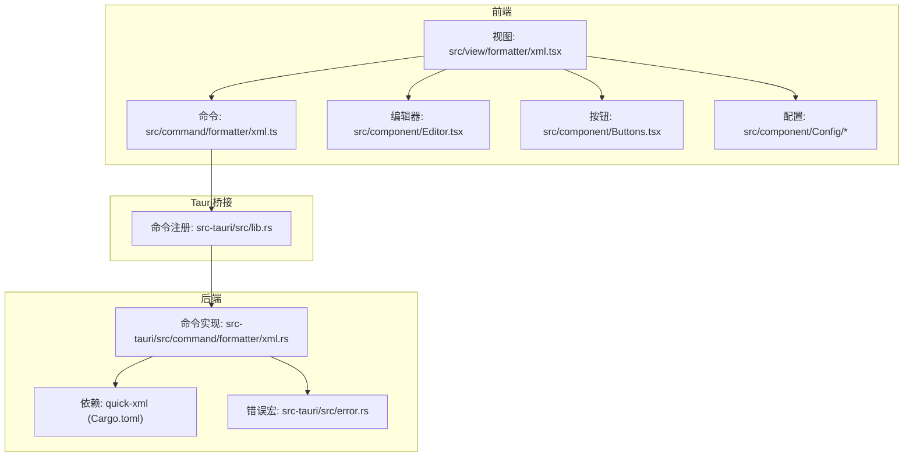
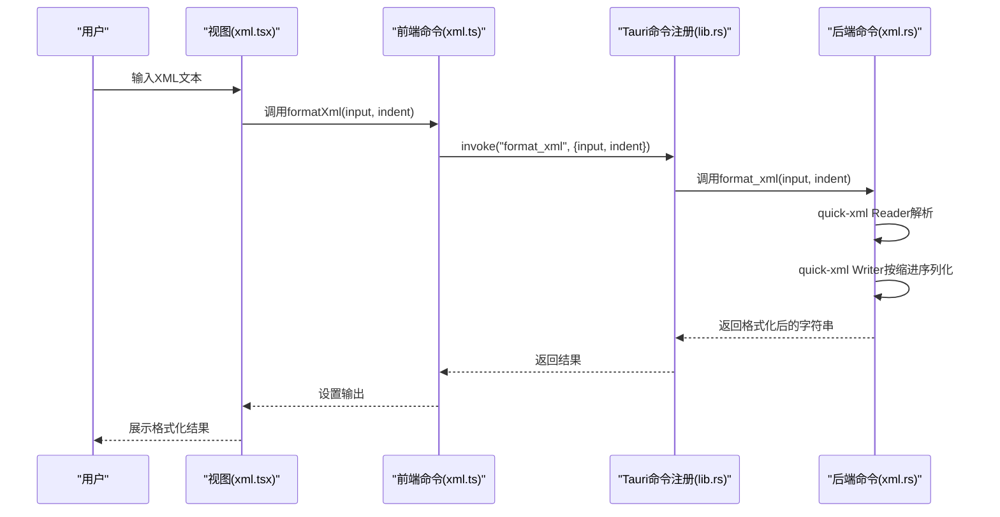
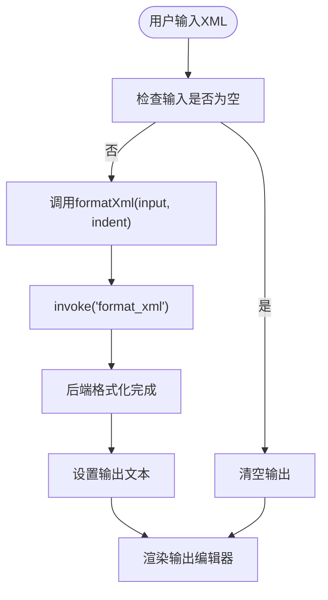
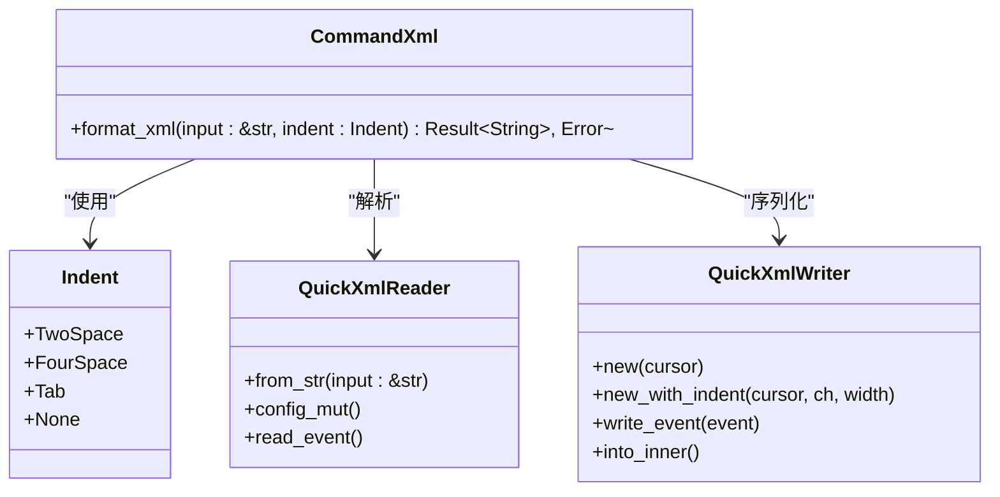
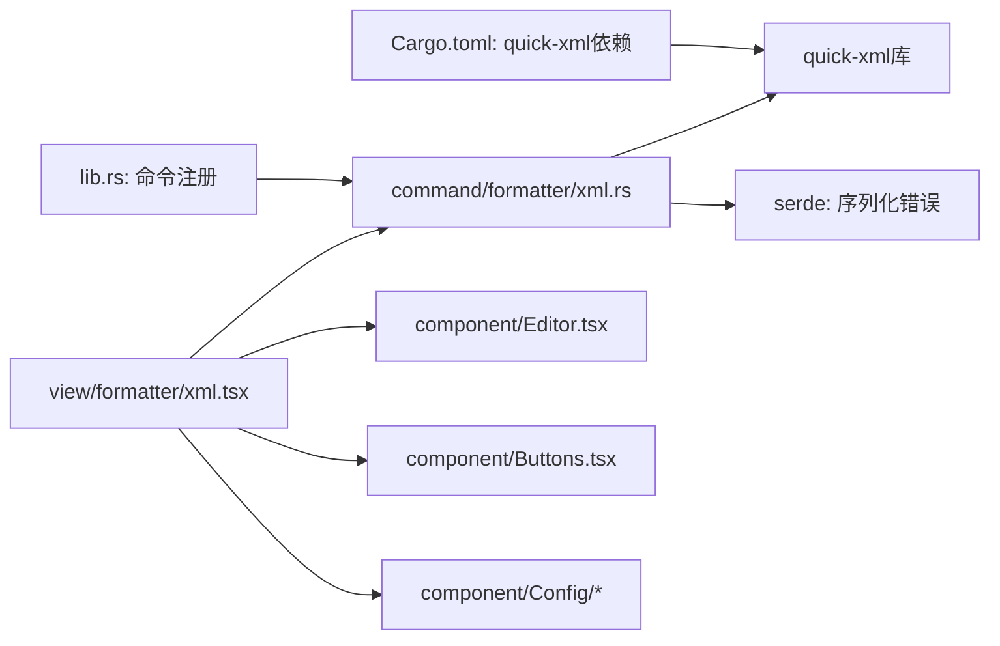

# XML格式化

<cite>
**本文引用的文件**
- [src/view/formatter/xml.tsx](file://src/view/formatter/xml.tsx)
- [src/command/formatter/xml.ts](file://src/command/formatter/xml.ts)
- [src-tauri/src/command/formatter/xml.rs](file://src-tauri/src/command/formatter/xml.rs)
- [src-tauri/src/lib.rs](file://src-tauri/src/lib.rs)
- [src-tauri/Cargo.toml](file://src-tauri/Cargo.toml)
- [src-tauri/src/error.rs](file://src-tauri/src/error.rs)
- [src/routes.tsx](file://src/routes.tsx)
- [src/App.tsx](file://src/App.tsx)
- [src/component/Config/index.tsx](file://src/component/Config/index.tsx)
- [src/component/Config/Select.tsx](file://src/component/Config/Select.tsx)
- [src/component/Buttons.tsx](file://src/component/Buttons.tsx)
- [src/component/Editor.tsx](file://src/component/Editor.tsx)
</cite>

## 目录
1. [简介](#简介)
2. [项目结构](#项目结构)
3. [核心组件](#核心组件)
4. [架构总览](#架构总览)
5. [详细组件分析](#详细组件分析)
6. [依赖关系分析](#依赖关系分析)
7. [性能考量](#性能考量)
8. [故障排查指南](#故障排查指南)
9. [结论](#结论)
10. [附录](#附录)

## 简介
本文件系统性地阐述 devkimi 中 XML 格式化功能的实现与使用，覆盖前端界面、跨语言命令桥接与 Rust 后端解析三部分的协作机制。重点说明：
- 如何正确处理 XML 命名空间、属性、CDATA 块与特殊字符转义
- DOM 解析与事件序列化技术，确保结构完整性与有效性
- 支持的格式化选项（缩进、属性排序、空元素表示方式）及其配置
- 从原始 XML 到格式化输出的完整流程与错误处理
- 基于 quick-xml 的高效解析与大文件处理优化策略
- 面向 XML 开发者的使用指南与最佳实践

## 项目结构
XML 格式化功能位于“格式化工具”子菜单下，采用三层架构：
- 前端视图层：负责用户交互与实时格式化
- 前端命令层：通过 Tauri 桥接调用后端命令
- 后端命令层：基于 quick-xml 实现流式解析与序列化

图表来源
- [src/view/formatter/xml.tsx](file://src/view/formatter/xml.tsx#L1-L78)
- [src/command/formatter/xml.ts](file://src/command/formatter/xml.ts#L1-L8)
- [src-tauri/src/lib.rs](file://src-tauri/src/lib.rs#L11-L21)
- [src-tauri/src/command/formatter/xml.rs](file://src-tauri/src/command/formatter/xml.rs#L1-L43)
- [src-tauri/Cargo.toml](file://src-tauri/Cargo.toml#L36-L36)
- [src-tauri/src/error.rs](file://src-tauri/src/error.rs#L16-L31)

章节来源
- [src/routes.tsx](file://src/routes.tsx#L39-L67)
- [src/App.tsx](file://src/App.tsx#L8-L44)

## 核心组件
- 视图组件：提供缩进配置、输入/输出编辑器、复制与保存按钮，监听输入变化并触发格式化
- 前端命令：封装 invoke 调用，传递输入文本与缩进策略
- 后端命令：基于 quick-xml Reader/Writer 流式解析与序列化，按缩进策略输出
- 错误处理：统一通过自定义错误宏序列化，便于前端展示

章节来源
- [src/view/formatter/xml.tsx](file://src/view/formatter/xml.tsx#L13-L77)
- [src/command/formatter/xml.ts](file://src/command/formatter/xml.ts#L1-L8)
- [src-tauri/src/command/formatter/xml.rs](file://src-tauri/src/command/formatter/xml.rs#L6-L12)
- [src-tauri/src/error.rs](file://src-tauri/src/error.rs#L16-L31)

## 架构总览
XML 格式化在运行时的调用链如下：

图表来源
- [src/view/formatter/xml.tsx](file://src/view/formatter/xml.tsx#L20-L32)
- [src/command/formatter/xml.ts](file://src/command/formatter/xml.ts#L1-L8)
- [src-tauri/src/lib.rs](file://src-tauri/src/lib.rs#L11-L17)
- [src-tauri/src/command/formatter/xml.rs](file://src-tauri/src/command/formatter/xml.rs#L14-L36)

## 详细组件分析

### 前端视图组件（XML格式化页面）
- 缩进选项：支持两空格、四空格、制表符、精简四种模式
- 实时格式化：监听输入变化，调用前端命令进行格式化
- 用户操作：提供粘贴、清空、复制、保存等常用操作
- 编辑器：内置 XML 语法高亮与主题适配

图表来源
- [src/view/formatter/xml.tsx](file://src/view/formatter/xml.tsx#L20-L32)
- [src/command/formatter/xml.ts](file://src/command/formatter/xml.ts#L1-L8)
- [src/component/Buttons.tsx](file://src/component/Buttons.tsx#L150-L167)
- [src/component/Editor.tsx](file://src/component/Editor.tsx#L61-L136)

章节来源
- [src/view/formatter/xml.tsx](file://src/view/formatter/xml.tsx#L13-L77)
- [src/component/Config/Select.tsx](file://src/component/Config/Select.tsx#L1-L30)
- [src/component/Buttons.tsx](file://src/component/Buttons.tsx#L150-L167)
- [src/component/Editor.tsx](file://src/component/Editor.tsx#L61-L136)

### 前端命令（跨语言桥接）
- 通过 invoke 调用后端命令“format_xml”
- 将输入文本与缩进策略作为参数传入
- 异步返回格式化结果或错误信息

章节来源
- [src/command/formatter/xml.ts](file://src/command/formatter/xml.ts#L1-L8)

### 后端命令（Rust实现）
- 缩进枚举：TwoSpace、FourSpace、Tab、None
- Reader/Writer：使用 quick-xml 的 Reader 从字符串读取事件，Writer 写回事件
- trim_text：启用文本去空白，提升可读性
- 错误类型：统一通过 command_error 宏生成，包含 Io、Xml、Utf8 三类

图表来源
- [src-tauri/src/command/formatter/xml.rs](file://src-tauri/src/command/formatter/xml.rs#L6-L12)
- [src-tauri/src/command/formatter/xml.rs](file://src-tauri/src/command/formatter/xml.rs#L14-L36)
- [src-tauri/src/error.rs](file://src-tauri/src/error.rs#L16-L31)

章节来源
- [src-tauri/src/command/formatter/xml.rs](file://src-tauri/src/command/formatter/xml.rs#L6-L12)
- [src-tauri/src/command/formatter/xml.rs](file://src-tauri/src/command/formatter/xml.rs#L14-L36)
- [src-tauri/src/error.rs](file://src-tauri/src/error.rs#L16-L31)

### 命令注册与路由集成
- 命令注册：在 lib.rs 中通过 generate_handler 注册 format_xml
- 路由集成：在 routes.tsx 中将“XML格式化”挂载到“格式化工具”菜单下

章节来源
- [src-tauri/src/lib.rs](file://src-tauri/src/lib.rs#L11-L17)
- [src/routes.tsx](file://src/routes.tsx#L39-L67)
- [src/App.tsx](file://src/App.tsx#L8-L44)

## 依赖关系分析
- quick-xml：用于事件驱动的 XML 解析与序列化
- serde：用于错误类型的序列化
- tauri：提供 invoke 桥接与命令注册
- 前端组件：Editor 提供语法高亮与主题；Buttons 提供复制/保存；Config 提供缩进选项

图表来源
- [src-tauri/Cargo.toml](file://src-tauri/Cargo.toml#L36-L36)
- [src-tauri/src/lib.rs](file://src-tauri/src/lib.rs#L11-L17)
- [src-tauri/src/command/formatter/xml.rs](file://src-tauri/src/command/formatter/xml.rs#L1-L43)
- [src/view/formatter/xml.tsx](file://src/view/formatter/xml.tsx#L1-L78)

章节来源
- [src-tauri/Cargo.toml](file://src-tauri/Cargo.toml#L36-L36)
- [src-tauri/src/lib.rs](file://src-tauri/src/lib.rs#L11-L17)

## 性能考量
- 流式解析与序列化：Reader/Writer 基于事件模型，避免一次性加载整文档，降低内存占用
- 缓冲区容量：Writer 使用带容量的缓冲，减少分配次数
- trim_text：自动去除文本两端空白，减少冗余字符
- 大文件优化建议：
  - 限制单次输入长度或分块处理
  - 在 UI 层限制编辑器内容大小，防止内存溢出
  - 对超大文件建议外部工具预处理或分段提交

章节来源
- [src-tauri/src/command/formatter/xml.rs](file://src-tauri/src/command/formatter/xml.rs#L14-L36)
- [src-tauri/Cargo.toml](file://src-tauri/Cargo.toml#L36-L36)

## 故障排查指南
- 常见错误类型
  - Io：I/O 错误（如编码问题）
  - Xml：XML 解析错误（如未闭合标签、非法字符）
  - Utf8：UTF-8 转换错误
- 前端表现：当后端抛出错误时，前端会将错误信息字符串显示在输出区域
- 排查步骤
  - 检查输入是否包含未闭合标签、非法字符或不合法命名空间
  - 确认缩进选项与编辑器语言模式一致
  - 若出现乱码，确认输入编码为 UTF-8

章节来源
- [src-tauri/src/command/formatter/xml.rs](file://src-tauri/src/command/formatter/xml.rs#L38-L43)
- [src-tauri/src/error.rs](file://src-tauri/src/error.rs#L16-L31)
- [src/view/formatter/xml.tsx](file://src/view/formatter/xml.tsx#L24-L32)

## 结论
devkimi 的 XML 格式化功能以简洁高效的架构实现了从输入到输出的全链路处理。前端提供直观的交互与实时反馈，后端基于 quick-xml 实现流式解析与序列化，兼顾性能与准确性。通过统一的错误处理机制，用户能够快速定位并修复格式化失败的原因。

## 附录

### 支持的格式化选项与配置
- 缩进策略
  - 两空格
  - 四空格
  - 制表符
  - 精简（无额外缩进）
- 配置入口：视图组件中的缩进选择器
- 选项映射：前端字符串值与后端 Indent 枚举一一对应

章节来源
- [src/view/formatter/xml.tsx](file://src/view/formatter/xml.tsx#L13-L18)
- [src/view/formatter/xml.tsx](file://src/view/formatter/xml.tsx#L38-L45)
- [src-tauri/src/command/formatter/xml.rs](file://src-tauri/src/command/formatter/xml.rs#L6-L12)

### XML特性处理说明
- 命名空间与属性：Reader/Writer 逐事件处理，保留命名空间声明与属性顺序
- CDATA 块：事件模型原样写回，保持 CDATA 不被破坏
- 特殊字符转义：Writer 自动处理实体转义，确保输出符合 XML 语义
- 结构完整性：Reader 严格校验，遇到非法结构会抛出错误

章节来源
- [src-tauri/src/command/formatter/xml.rs](file://src-tauri/src/command/formatter/xml.rs#L22-L33)
- [src-tauri/src/command/formatter/xml.rs](file://src-tauri/src/command/formatter/xml.rs#L38-L43)

### 使用指南（面向XML开发者）
- 快速开始
  - 在“格式化工具/XML”页面粘贴或打开 XML 文件
  - 选择合适的缩进策略
  - 复制或保存格式化后的结果
- 最佳实践
  - 优先使用两空格缩进，提升团队一致性
  - 对包含大量 CDATA 的文档，注意保持其完整性
  - 遇到错误时，先检查标签闭合与命名空间声明
- 大文件建议
  - 分段提交或外部预处理
  - 避免一次性加载超大文档至编辑器

章节来源
- [src/view/formatter/xml.tsx](file://src/view/formatter/xml.tsx#L48-L77)
- [src/component/Buttons.tsx](file://src/component/Buttons.tsx#L150-L167)