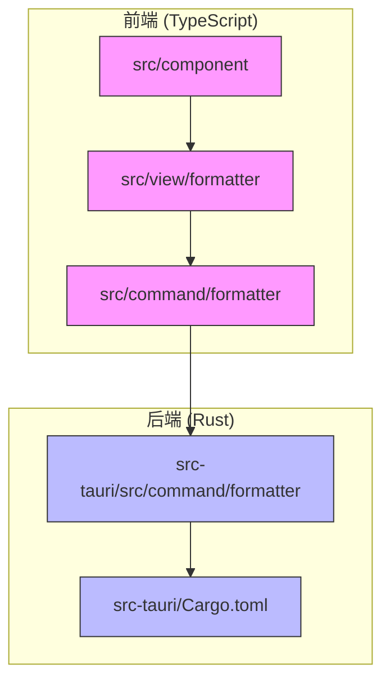
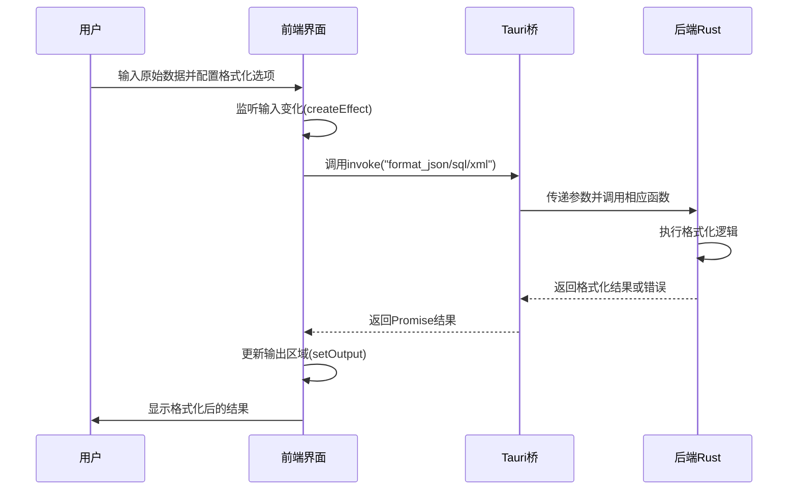
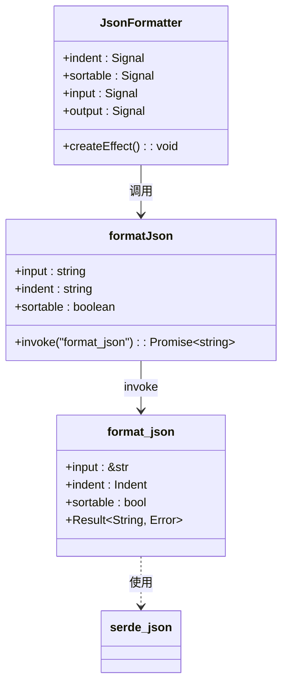
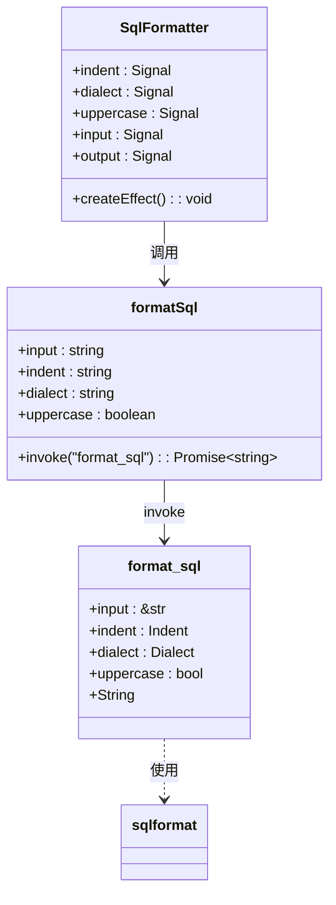
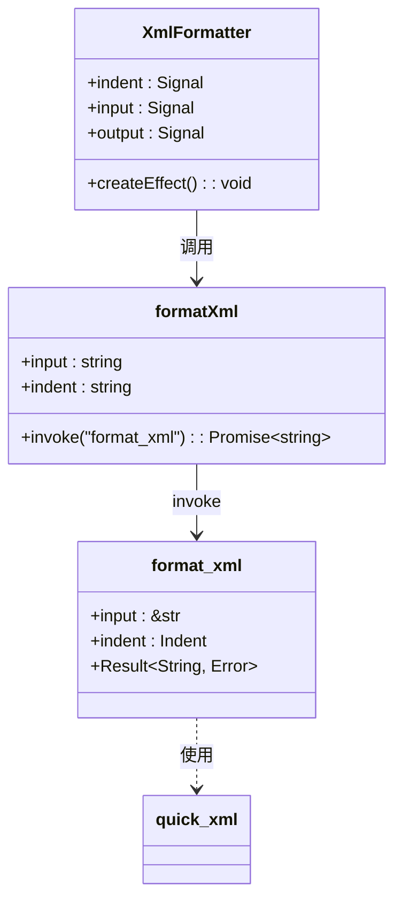
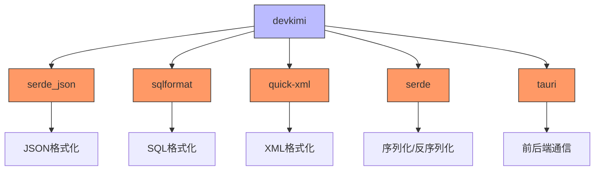

# 格式化工具

<cite>
**本文档引用的文件**
- [json.ts](file://src/command/formatter/json.ts)
- [sql.ts](file://src/command/formatter/sql.ts)
- [xml.ts](file://src/command/formatter/xml.ts)
- [json.tsx](file://src/view/formatter/json.tsx)
- [sql.tsx](file://src/view/formatter/sql.tsx)
- [xml.tsx](file://src/view/formatter/xml.tsx)
- [json.rs](file://src-tauri/src/command/formatter/json.rs)
- [sql.rs](file://src-tauri/src/command/formatter/sql.rs)
- [xml.rs](file://src-tauri/src/command/formatter/xml.rs)
- [mod.rs](file://src-tauri/src/command/formatter/mod.rs)
- [Cargo.toml](file://src-tauri/Cargo.toml)
- [Editor.tsx](file://src/component/Editor.tsx)
- [Config/index.tsx](file://src/component/Config/index.tsx)
- [routes.tsx](file://src/routes.tsx)
</cite>

## 目录
1. [简介](#简介)
2. [项目结构](#项目结构)
3. [核心组件](#核心组件)
4. [架构概览](#架构概览)
5. [详细组件分析](#详细组件分析)
6. [依赖分析](#依赖分析)
7. [性能考量](#性能考量)
8. [故障排除指南](#故障排除指南)
9. [结论](#结论)

## 简介
devkimi格式化工具是一个基于Tauri框架构建的桌面应用程序，提供JSON、SQL和XML三种数据格式的格式化功能。该工具采用前后端分离架构，前端使用SolidJS框架构建用户界面，后端使用Rust语言实现高性能的格式化逻辑。系统通过Tauri的invoke机制实现前后端通信，确保了格式化操作的安全性和高效性。本工具支持多种配置选项，包括缩进样式、SQL方言选择和JSON属性排序等，满足不同用户的个性化需求。

## 项目结构
devkimi格式化工具的项目结构清晰地分为前端和后端两个主要部分。前端代码位于`src`目录下，后端Rust代码位于`src-tauri`目录下。格式化功能的相关文件分布在`src/view/formatter`（前端视图）和`src-tauri/src/command/formatter`（后端命令）目录中。

**Diagram sources**
- [json.tsx](file://src/view/formatter/json.tsx)
- [json.ts](file://src/command/formatter/json.ts)
- [json.rs](file://src-tauri/src/command/formatter/json.rs)
- [Cargo.toml](file://src-tauri/Cargo.toml)

**Section sources**
- [json.tsx](file://src/view/formatter/json.tsx)
- [json.ts](file://src/command/formatter/json.ts)
- [json.rs](file://src-tauri/src/command/formatter/json.rs)
- [Cargo.toml](file://src-tauri/Cargo.toml)

## 核心组件
格式化工具的核心组件包括前端视图组件、前端命令接口和后端格式化实现。前端视图组件负责用户界面的渲染和用户交互，前端命令接口通过Tauri的invoke函数与后端通信，后端格式化实现则利用Rust生态系统中的高效crate进行实际的格式化操作。这种分层架构确保了代码的可维护性和扩展性，同时充分发挥了Rust在性能和安全性方面的优势。

**Section sources**
- [json.tsx](file://src/view/formatter/json.tsx)
- [json.ts](file://src/command/formatter/json.ts)
- [json.rs](file://src-tauri/src/command/formatter/json.rs)

## 架构概览
devkimi格式化工具采用典型的前后端分离架构，前端负责用户界面展示和用户交互，后端负责核心业务逻辑处理。前后端通过Tauri框架提供的安全API进行通信，实现了Web技术与原生系统能力的完美结合。

**Diagram sources**
- [json.tsx](file://src/view/formatter/json.tsx#L20-L33)
- [json.ts](file://src/command/formatter/json.ts#L3-L5)
- [json.rs](file://src-tauri/src/command/formatter/json.rs#L14-L24)

## 详细组件分析

### JSON格式化分析
JSON格式化功能允许用户将紧凑或格式混乱的JSON数据转换为具有良好可读性的格式。用户可以通过界面选择缩进样式（2个空格、4个空格、制表符或精简）以及是否对JSON属性进行排序。

**Diagram sources**
- [json.tsx](file://src/view/formatter/json.tsx#L20-L90)
- [json.ts](file://src/command/formatter/json.ts#L3-L5)
- [json.rs](file://src-tauri/src/command/formatter/json.rs#L14-L38)

**Section sources**
- [json.tsx](file://src/view/formatter/json.tsx#L1-L91)
- [json.ts](file://src/command/formatter/json.ts#L1-L8)
- [json.rs](file://src-tauri/src/command/formatter/json.rs#L1-L39)

### SQL格式化分析
SQL格式化功能支持多种数据库方言（标准SQL、SQLServer、PostgreSql），并允许用户选择是否将SQL关键字转换为大写。该功能利用Rust的sqlformat crate实现，确保了格式化的准确性和性能。

**Diagram sources**
- [sql.tsx](file://src/view/formatter/sql.tsx#L25-L99)
- [sql.ts](file://src/command/formatter/sql.ts#L3-L10)
- [sql.rs](file://src-tauri/src/command/formatter/sql.rs#L19-L35)

**Section sources**
- [sql.tsx](file://src/view/formatter/sql.tsx#L1-L100)
- [sql.ts](file://src/command/formatter/sql.ts#L1-L13)
- [sql.rs](file://src-tauri/src/command/formatter/sql.rs#L1-L36)

### XML格式化分析
XML格式化功能能够处理包含命名空间和属性的复杂XML文档，保持文档结构的完整性。用户可以选择不同的缩进样式来美化XML输出。

**Diagram sources**
- [xml.tsx](file://src/view/formatter/xml.tsx#L20-L77)
- [xml.ts](file://src/command/formatter/xml.ts#L3-L5)
- [xml.rs](file://src-tauri/src/command/formatter/xml.rs#L15-L36)

**Section sources**
- [xml.tsx](file://src/view/formatter/xml.tsx#L1-L78)
- [xml.ts](file://src/command/formatter/xml.ts#L1-L8)
- [xml.rs](file://src-tauri/src/command/formatter/xml.rs#L1-L43)

## 依赖分析
格式化工具的后端实现依赖于多个高质量的Rust crate，这些依赖在Cargo.toml文件中明确定义，确保了版本的可重现性和安全性。

**Diagram sources**
- [Cargo.toml](file://src-tauri/Cargo.toml#L42-L47)
- [json.rs](file://src-tauri/src/command/formatter/json.rs#L3)
- [sql.rs](file://src-tauri/src/command/formatter/sql.rs#L2)
- [xml.rs](file://src-tauri/src/command/formatter/xml.rs#L2)

**Section sources**
- [Cargo.toml](file://src-tauri/Cargo.toml#L1-L69)
- [json.rs](file://src-tauri/src/command/formatter/json.rs#L1-L39)
- [sql.rs](file://src-tauri/src/command/formatter/sql.rs#L1-L36)
- [xml.rs](file://src-tauri/src/command/formatter/xml.rs#L1-L43)

## 性能考量
devkimi格式化工具在性能方面表现出色，这主要得益于Rust语言的高效性和所选crate的优化实现。JSON格式化使用serde_json，这是一个广泛使用且高度优化的JSON处理库，能够快速解析和序列化大型JSON文档。SQL格式化依赖于sqlformat crate，该库专为SQL语句的格式化而设计，具有良好的性能特征。XML格式化使用quick-xml，这是一个快速的XML解析器和写入器，基于xml-rs但具有更好的性能。前后端通过Tauri的轻量级通信机制进行交互，减少了不必要的开销。整体架构确保了即使处理大型数据文件，用户界面也能保持响应性。

## 故障排除指南
当格式化工具出现问题时，可以按照以下步骤进行排查：

1. **输入数据验证**：确保输入的数据是有效的JSON、SQL或XML格式。无效的输入会导致格式化失败。
2. **检查错误信息**：当格式化失败时，输出区域会显示具体的错误信息，如"json error: ..."或"xml error: ..."，这些信息有助于定位问题。
3. **查看控制台日志**：在开发模式下，浏览器控制台会输出详细的调试信息，可以帮助诊断问题。
4. **确认Rust后端正常运行**：确保Tauri后端服务正常启动，没有编译错误或运行时异常。
5. **检查依赖版本**：确认Cargo.toml中列出的crate版本与代码兼容，必要时更新依赖。

**Section sources**
- [json.rs](file://src-tauri/src/command/formatter/json.rs#L35-L38)
- [xml.rs](file://src-tauri/src/command/formatter/xml.rs#L38-L42)
- [Editor.tsx](file://src/component/Editor.tsx#L104-L106)

## 结论
devkimi格式化工具通过结合SolidJS的响应式前端框架和Rust的高性能后端实现，提供了一个高效、可靠且用户友好的数据格式化解决方案。系统架构清晰，前后端职责分明，利用Tauri框架实现了Web技术与原生系统能力的无缝集成。通过使用serde_json、sqlformat和quick-xml等成熟的Rust crate，工具在处理各种数据格式时表现出卓越的性能和准确性。未来可以考虑增加更多格式化选项和预设配置，进一步提升用户体验。