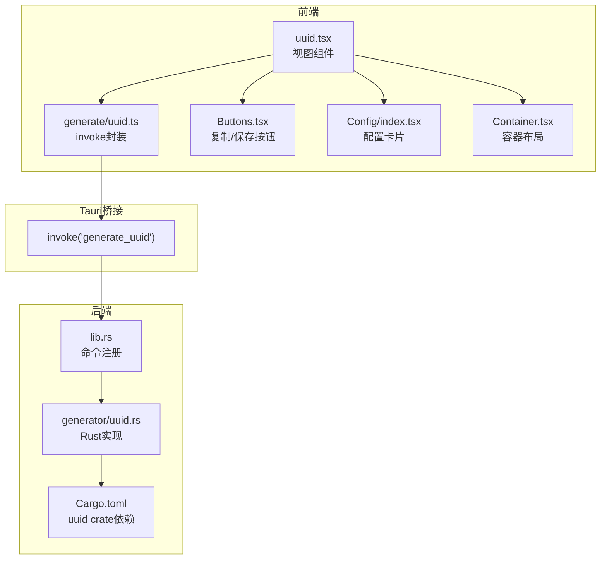
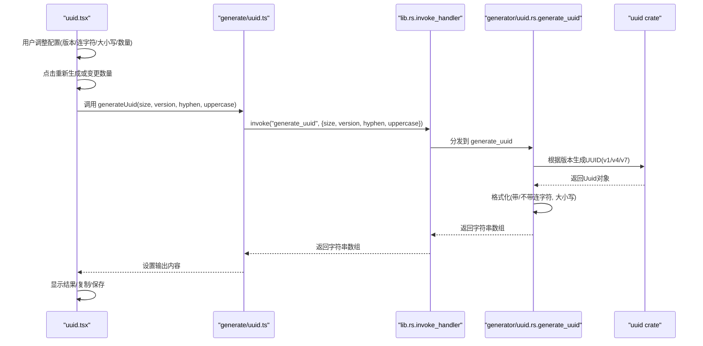
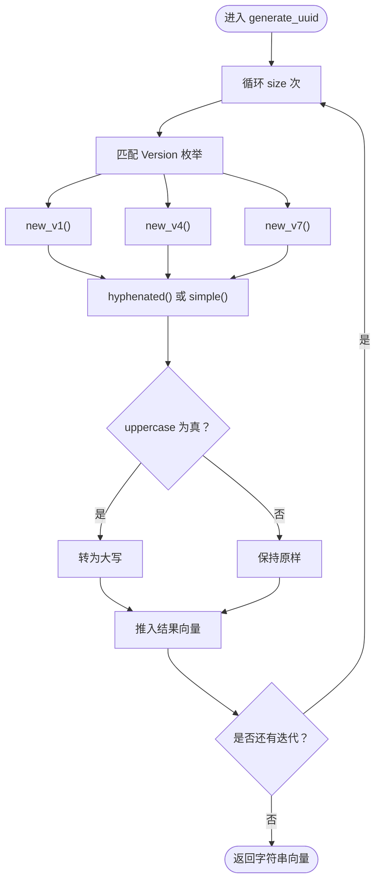
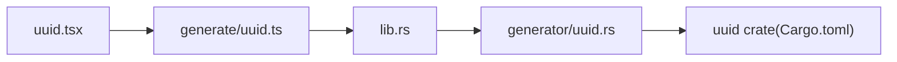

# UUID生成

<cite>
**本文引用的文件**
- [src/view/generator/uuid.tsx](file://src/view/generator/uuid.tsx)
- [src/command/generate/uuid.ts](file://src/command/generate/uuid.ts)
- [src-tauri/src/command/generator/uuid.rs](file://src-tauri/src/command/generator/uuid.rs)
- [src-tauri/src/lib.rs](file://src-tauri/src/lib.rs)
- [src-tauri/Cargo.toml](file://src-tauri/Cargo.toml)
- [src/routes.tsx](file://src/routes.tsx)
- [src/component/Buttons.tsx](file://src/component/Buttons.tsx)
- [src/component/Config/index.tsx](file://src/component/Config/index.tsx)
- [src/component/Container.tsx](file://src/component/Container.tsx)
</cite>

## 目录
1. [简介](#简介)
2. [项目结构](#项目结构)
3. [核心组件](#核心组件)
4. [架构总览](#架构总览)
5. [详细组件分析](#详细组件分析)
6. [依赖关系分析](#依赖关系分析)
7. [性能与唯一性特性](#性能与唯一性特性)
8. [故障排查指南](#故障排查指南)
9. [结论](#结论)
10. [附录：API使用指南与最佳实践](#附录api使用指南与最佳实践)

## 简介
本文件系统性地阐述 devkimi 中“UUID生成”功能的实现与使用方法，覆盖从前端 SolidJS 组件通过 Tauri Bridge 调用后端 Rust 实现的 UUID 生成逻辑，到最终在前端进行格式化、复制与保存的完整流程。文档重点说明：
- 前端 uuid.tsx 如何通过 invoke 调用后端命令 generate_uuid
- 后端 Rust 使用 uuid crate 生成符合 RFC 标准的 UUID（支持 v1/v4/v7）
- UUID 版本选择、唯一性保证、性能特征与适用场景
- 前端对不同格式（带连字符/不带连字符、大小写）的处理与复制/保存能力
- 最佳实践与常见问题排查

## 项目结构
与 UUID 生成相关的关键文件分布如下：
- 前端视图层：src/view/generator/uuid.tsx
- 前端命令封装：src/command/generate/uuid.ts
- 后端命令实现：src-tauri/src/command/generator/uuid.rs
- 后端命令注册：src-tauri/src/lib.rs
- 依赖声明：src-tauri/Cargo.toml
- 路由挂载：src/routes.tsx
- 前端通用组件：src/component/Buttons.tsx、src/component/Config/index.tsx、src/component/Container.tsx

图表来源
- [src/view/generator/uuid.tsx](file://src/view/generator/uuid.tsx#L1-L87)
- [src/command/generate/uuid.ts](file://src/command/generate/uuid.ts#L1-L18)
- [src-tauri/src/lib.rs](file://src-tauri/src/lib.rs#L1-L57)
- [src-tauri/src/command/generator/uuid.rs](file://src-tauri/src/command/generator/uuid.rs#L1-L48)
- [src-tauri/Cargo.toml](file://src-tauri/Cargo.toml#L1-L69)

章节来源
- [src/view/generator/uuid.tsx](file://src/view/generator/uuid.tsx#L1-L87)
- [src/command/generate/uuid.ts](file://src/command/generate/uuid.ts#L1-L18)
- [src-tauri/src/lib.rs](file://src-tauri/src/lib.rs#L1-L57)
- [src-tauri/src/command/generator/uuid.rs](file://src-tauri/src/command/generator/uuid.rs#L1-L48)
- [src-tauri/Cargo.toml](file://src-tauri/Cargo.toml#L1-L69)
- [src/routes.tsx](file://src/routes.tsx#L1-L242)

## 核心组件
- 前端视图组件 uuid.tsx：负责用户交互（版本选择、连字符开关、大小写开关、数量输入），触发生成并展示结果；提供重新生成、复制与保存操作。
- 前端 invoke 封装 generate/uuid.ts：统一调用后端 generate_uuid 命令，传入 size、version、hyphen、uppercase 参数。
- 后端命令实现 generator/uuid.rs：定义 Version 枚举与 generate_uuid 命令，内部根据版本调用 uuid crate 的 v1/v4/v7 生成函数，并按 hyphen/uppercase 规则格式化输出。
- 后端命令注册 lib.rs：将 generate_uuid 暴露为可被前端调用的命令。
- 依赖声明 Cargo.toml：引入 uuid crate 并启用 v1/v4/v7 特性。

章节来源
- [src/view/generator/uuid.tsx](file://src/view/generator/uuid.tsx#L1-L87)
- [src/command/generate/uuid.ts](file://src/command/generate/uuid.ts#L1-L18)
- [src-tauri/src/command/generator/uuid.rs](file://src-tauri/src/command/generator/uuid.rs#L1-L48)
- [src-tauri/src/lib.rs](file://src-tauri/src/lib.rs#L1-L57)
- [src-tauri/Cargo.toml](file://src-tauri/Cargo.toml#L1-L69)

## 架构总览
从前端到后端的调用链路如下：

图表来源
- [src/view/generator/uuid.tsx](file://src/view/generator/uuid.tsx#L1-L87)
- [src/command/generate/uuid.ts](file://src/command/generate/uuid.ts#L1-L18)
- [src-tauri/src/lib.rs](file://src-tauri/src/lib.rs#L1-L57)
- [src-tauri/src/command/generator/uuid.rs](file://src-tauri/src/command/generator/uuid.rs#L1-L48)

## 详细组件分析

### 前端视图组件：uuid.tsx
- 功能要点
  - 提供版本选项（V1/V4/V7）、连字符开关、大写开关、数量输入
  - 通过 createEffect 监听数量变化，触发 generateUuid 调用
  - 输出区域使用只读编辑器展示多行 UUID
  - 提供重新生成、复制到剪贴板、保存到文件的操作按钮
- 关键交互
  - 重新生成：通过自增 n 触发 createEffect 重新计算
  - 复制：调用剪贴板插件写入文本
  - 保存：弹出对话框选择文件路径并写入文本

章节来源
- [src/view/generator/uuid.tsx](file://src/view/generator/uuid.tsx#L1-L87)
- [src/component/Buttons.tsx](file://src/component/Buttons.tsx#L1-L191)

### 前端 invoke 封装：generate/uuid.ts
- 功能要点
  - 通过 @tauri-apps/api/core 的 invoke 方法调用后端命令 generate_uuid
  - 参数映射：size、version（字符串）、hyphen、uppercase
  - 返回类型：Promise<string[]>，即一组格式化后的 UUID 字符串

章节来源
- [src/command/generate/uuid.ts](file://src/command/generate/uuid.ts#L1-L18)

### 后端命令实现：generator/uuid.rs
- 功能要点
  - 定义 Version 枚举：V1/V4/V7
  - generate_uuid 命令：循环生成指定数量的 UUID，按 hyphen/uppercase 规则格式化
  - 版本生成函数：
    - V1：使用 Context::new_random() 获取上下文，Timestamp::now(context) 获取时间戳，构造 v1 UUID
    - V4：直接调用 new_v4()
    - V7：使用 Context::new_random() 获取上下文，Timestamp::now(context) 获取时间戳，构造 v7 UUID
- 性能与内存
  - 预分配容量：Vec::with_capacity(size)，避免多次扩容
  - 字符串格式化：hyphenated()/simple() 后再转为 String，最后可选转为大写

图表来源
- [src-tauri/src/command/generator/uuid.rs](file://src-tauri/src/command/generator/uuid.rs#L1-L48)

章节来源
- [src-tauri/src/command/generator/uuid.rs](file://src-tauri/src/command/generator/uuid.rs#L1-L48)

### 后端命令注册：lib.rs
- 功能要点
  - 在 invoke_handler 中注册 generate_uuid 命令，使其可被前端调用
  - 其他 generator 子模块命令也在此处统一注册

章节来源
- [src-tauri/src/lib.rs](file://src-tauri/src/lib.rs#L1-L57)

### 依赖声明：Cargo.toml
- 功能要点
  - 引入 uuid crate，并启用 v1/v4/v7 特性，满足版本生成需求
  - 其他 Tauri 插件与依赖（如 clipboard、dialog、fs 等）用于前端复制/保存能力

章节来源
- [src-tauri/Cargo.toml](file://src-tauri/Cargo.toml#L1-L69)

### 路由挂载：routes.tsx
- 功能要点
  - 在路由表中挂载 UUID 生成器视图组件，用户可通过导航访问该功能

章节来源
- [src/routes.tsx](file://src/routes.tsx#L1-L242)

## 依赖关系分析
- 前端到后端
  - uuid.tsx 依赖 generate/uuid.ts 进行 invoke 调用
  - generate/uuid.ts 依赖 @tauri-apps/api/core 的 invoke
  - lib.rs 注册 generate_uuid 命令，供前端调用
- 后端到库
  - generator/uuid.rs 依赖 uuid crate 的 v1/v4/v7 生成能力
  - uuid crate 依赖 rand 与 chrono 等底层库（由 uuid crate 内部管理）

图表来源
- [src/view/generator/uuid.tsx](file://src/view/generator/uuid.tsx#L1-L87)
- [src/command/generate/uuid.ts](file://src/command/generate/uuid.ts#L1-L18)
- [src-tauri/src/lib.rs](file://src-tauri/src/lib.rs#L1-L57)
- [src-tauri/src/command/generator/uuid.rs](file://src-tauri/src/command/generator/uuid.rs#L1-L48)
- [src-tauri/Cargo.toml](file://src-tauri/Cargo.toml#L1-L69)

## 性能与唯一性特性
- 性能特征
  - 预分配容量：后端在生成前预估容量，减少动态扩容开销
  - 字符串格式化：先生成 UUID 对象，再进行 hyphenated/simple 与大小写转换，避免重复构建
  - 批量生成：前端一次请求生成多个 UUID，降低往返次数
- 唯一性保证
  - V4：基于高质量随机数生成，满足全局唯一性要求，适合大多数业务场景
  - V1：包含时间戳与节点标识，具备时间有序性，但唯一性依赖时间源与节点标识的随机性
  - V7：基于时间戳的新型版本，具备时间有序性与唯一性，适合需要时间序的场景
- 适用场景
  - V4：通用、高性能、无需时间序，推荐默认选择
  - V1：需要时间序与审计追踪，但需确保节点标识唯一
  - V7：需要时间序且追求更优的排序与唯一性，适用于日志、事件流等

章节来源
- [src-tauri/src/command/generator/uuid.rs](file://src-tauri/src/command/generator/uuid.rs#L1-L48)
- [src-tauri/Cargo.toml](file://src-tauri/Cargo.toml#L1-L69)

## 故障排查指南
- 前端复制/保存异常
  - 复制：检查剪贴板插件权限与平台支持；前端复制按钮会尝试写入剪贴板并打印日志
  - 保存：检查文件对话框权限与目标路径写入权限
- UUID 生成异常
  - 检查后端命令是否已注册（lib.rs 中 generate_uuid 是否在 invoke_handler 列表）
  - 检查 uuid crate 特性是否启用（v1/v4/v7）
- 前端参数传递
  - 确认前端 generate/uuid.ts 传参顺序与类型一致（size、version、hyphen、uppercase）
- 版本选择
  - 若仅生成 V4，确认前端版本选项默认值与后端 Version 枚举匹配

章节来源
- [src/component/Buttons.tsx](file://src/component/Buttons.tsx#L1-L191)
- [src-tauri/src/lib.rs](file://src-tauri/src/lib.rs#L1-L57)
- [src-tauri/Cargo.toml](file://src-tauri/Cargo.toml#L1-L69)
- [src/command/generate/uuid.ts](file://src/command/generate/uuid.ts#L1-L18)

## 结论
devkimi 的 UUID 生成功能通过清晰的前后端分层实现：前端负责用户交互与结果展示，后端使用 uuid crate 提供 v1/v4/v7 生成能力，并在格式化阶段完成连字符与大小写的控制。整体设计简洁、性能良好，满足通用与特定场景下的 UUID 生成需求。

## 附录：API使用指南与最佳实践
- API 使用指南
  - 前端调用
    - 调用 generateUuid(size, version, hyphen, uppercase)
    - 参数说明
      - size：生成数量（建议不超过 10000）
      - version：版本字符串（"V1"/"V4"/"V7"）
      - hyphen：是否包含连字符
      - uppercase：是否转为大写
    - 返回值：Promise<string[]>，包含格式化后的 UUID 字符串数组
  - 后端命令
    - 命令名："generate_uuid"
    - 参数：size(u16)、version(Version枚举)、uppercase(bool)、hyphen(bool)
    - 返回：Vec<String>
- 最佳实践
  - 默认选择 V4：在大多数场景下提供最佳平衡
  - 控制批量规模：避免一次性生成过多 UUID 导致 UI 卡顿
  - 格式一致性：在团队内约定 UUID 格式（连字符/大小写），避免混用
  - 错误处理：前端捕获 Promise 拒绝并提示用户
  - 权限与安全：确保剪贴板与文件写入权限可用，避免敏感数据泄露

章节来源
- [src/command/generate/uuid.ts](file://src/command/generate/uuid.ts#L1-L18)
- [src-tauri/src/command/generator/uuid.rs](file://src-tauri/src/command/generator/uuid.rs#L1-L48)
- [src-tauri/src/lib.rs](file://src-tauri/src/lib.rs#L1-L57)