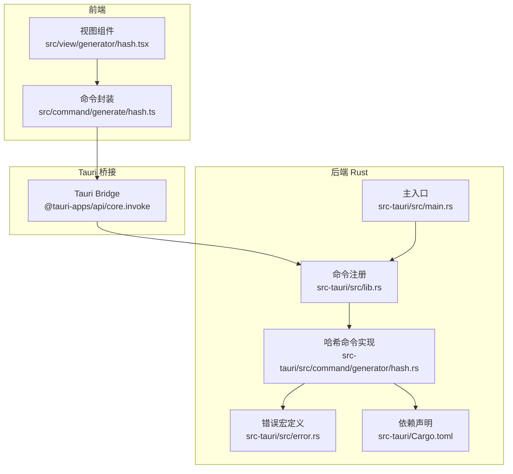
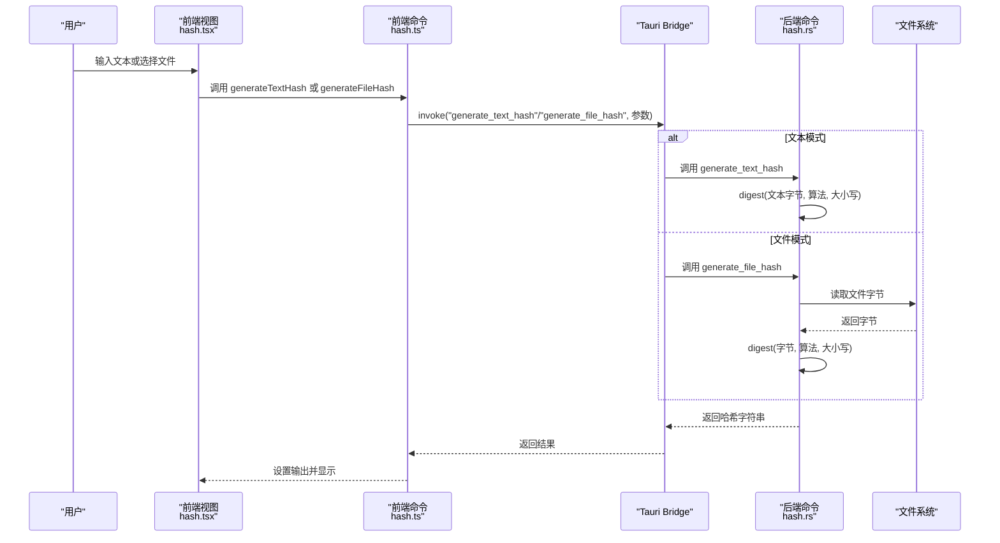
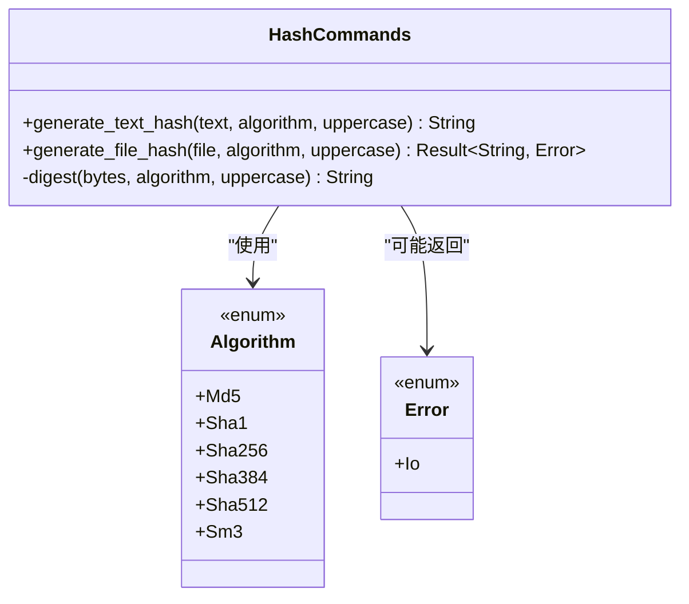
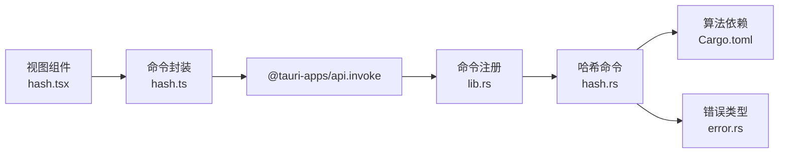
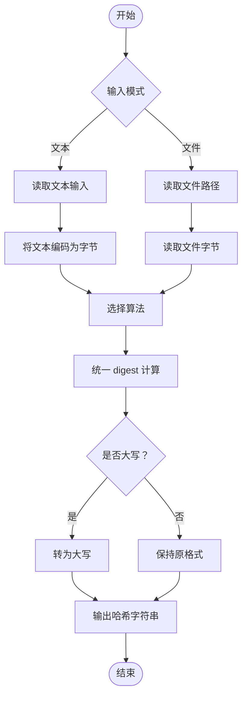

# 哈希生成

<cite>
**本文引用的文件**
- [src/view/generator/hash.tsx](file://src/view/generator/hash.tsx)
- [src/command/generate/hash.ts](file://src/command/generate/hash.ts)
- [src-tauri/src/command/generator/hash.rs](file://src-tauri/src/command/generator/hash.rs)
- [src-tauri/src/lib.rs](file://src-tauri/src/lib.rs)
- [src-tauri/src/main.rs](file://src-tauri/src/main.rs)
- [src-tauri/src/error.rs](file://src-tauri/src/error.rs)
- [src-tauri/Cargo.toml](file://src-tauri/Cargo.toml)
</cite>

## 目录
1. [简介](#简介)
2. [项目结构](#项目结构)
3. [核心组件](#核心组件)
4. [架构总览](#架构总览)
5. [详细组件分析](#详细组件分析)
6. [依赖关系分析](#依赖关系分析)
7. [性能考量](#性能考量)
8. [故障排查指南](#故障排查指南)
9. [结论](#结论)
10. [附录](#附录)

## 简介
本文件面向开发者，系统性说明 devkimi 中“哈希生成”功能的端到端实现：从前端 UI 组件到 Tauri Bridge 的桥接，再到后端 Rust 使用 digest crate 支持多种哈希算法（MD5、SHA1、SHA256、SHA384、SHA512、SM3）的完整数据流。文档重点覆盖：
- 算法选择机制与输入处理流程
- 性能特征与内存管理策略（尤其是大文本输入）
- 安全性考虑与最佳实践
- 前后端交互序列图与数据流图
- API 使用指南与集成建议

## 项目结构
该功能由三层组成：
- 前端 SolidJS 视图层：负责用户输入、算法选择、结果显示与校验
- 前端命令层：通过 @tauri-apps/api 调用后端命令
- 后端 Rust 层：定义命令、枚举算法、执行哈希计算并返回字符串结果

图表来源
- [src/view/generator/hash.tsx](file://src/view/generator/hash.tsx#L1-L184)
- [src/command/generate/hash.ts](file://src/command/generate/hash.ts#L1-L20)
- [src-tauri/src/lib.rs](file://src-tauri/src/lib.rs#L1-L57)
- [src-tauri/src/main.rs](file://src-tauri/src/main.rs#L1-L7)
- [src-tauri/src/command/generator/hash.rs](file://src-tauri/src/command/generator/hash.rs#L1-L52)
- [src-tauri/src/error.rs](file://src-tauri/src/error.rs#L1-L31)
- [src-tauri/Cargo.toml](file://src-tauri/Cargo.toml#L1-L69)

章节来源
- [src/view/generator/hash.tsx](file://src/view/generator/hash.tsx#L1-L184)
- [src/command/generate/hash.ts](file://src/command/generate/hash.ts#L1-L20)
- [src-tauri/src/lib.rs](file://src-tauri/src/lib.rs#L1-L57)
- [src-tauri/src/main.rs](file://src-tauri/src/main.rs#L1-L7)
- [src-tauri/src/command/generator/hash.rs](file://src-tauri/src/command/generator/hash.rs#L1-L52)
- [src-tauri/src/error.rs](file://src-tauri/src/error.rs#L1-L31)
- [src-tauri/Cargo.toml](file://src-tauri/Cargo.toml#L1-L69)

## 核心组件
- 前端视图组件：提供算法选择、大小写开关、文本/文件两种输入模式、哈希值显示与校验对比。
- 前端命令封装：统一暴露 generateTextHash 与 generateFileHash 两个异步函数，通过 invoke 调用后端命令。
- 后端命令实现：定义 Algorithm 枚举与 generate_text_hash/generate_file_hash 两个命令；内部统一 digest 函数完成哈希计算与大小写转换。
- 错误处理：通过自定义 command_error! 宏生成可序列化的 Error 类型，用于文件读取失败等场景。
- 依赖声明：Cargo.toml 引入 md-5、sha1、sha2、sm3 等算法 crate。

章节来源
- [src/view/generator/hash.tsx](file://src/view/generator/hash.tsx#L1-L184)
- [src/command/generate/hash.ts](file://src/command/generate/hash.ts#L1-L20)
- [src-tauri/src/command/generator/hash.rs](file://src-tauri/src/command/generator/hash.rs#L1-L52)
- [src-tauri/src/error.rs](file://src-tauri/src/error.rs#L1-L31)
- [src-tauri/Cargo.toml](file://src-tauri/Cargo.toml#L1-L69)

## 架构总览
下图展示了从用户输入到哈希值输出的完整调用链路与数据流向。

图表来源
- [src/view/generator/hash.tsx](file://src/view/generator/hash.tsx#L1-L184)
- [src/command/generate/hash.ts](file://src/command/generate/hash.ts#L1-L20)
- [src-tauri/src/command/generator/hash.rs](file://src-tauri/src/command/generator/hash.rs#L1-L52)
- [src-tauri/src/lib.rs](file://src-tauri/src/lib.rs#L1-L57)

## 详细组件分析

### 前端视图组件（hash.tsx）
- 功能要点
  - 算法选项：MD5、SM3、SHA-1、SHA-256、SHA-384、SHA-512
  - 大小写切换：统一转为大写或保持原格式
  - 输入模式：文本输入与文件选择双模式，自动切换模式并触发计算
  - 输出与校验：显示哈希值，支持复制、保存；提供目标哈希值输入进行匹配提示
- 数据流
  - 文本模式：监听 text 变化，调用 generateTextHash
  - 文件模式：监听 file 变化，调用 generateFileHash
  - 错误处理：捕获异常并回显错误信息
- 交互细节
  - 通过 createEffect 在输入变化时自动触发计算
  - 通过按钮集合提供粘贴、清空、选择文件、复制、保存等常用操作

章节来源
- [src/view/generator/hash.tsx](file://src/view/generator/hash.tsx#L1-L184)

### 前端命令封装（hash.ts）
- 功能要点
  - 封装 generateTextHash 与 generateFileHash 两个异步函数
  - 通过 invoke 调用后端命名命令，参数包含算法名称字符串与大小写标志
- 设计意义
  - 将 Tauri 调用抽象为简单易用的函数接口，便于在视图组件中直接使用

章节来源
- [src/command/generate/hash.ts](file://src/command/generate/hash.ts#L1-L20)

### 后端命令实现（hash.rs）
- 算法枚举与命令导出
  - Algorithm 枚举：Md5、Sha1、Sha256、Sha384、Sha512、Sm3
  - generate_text_hash：接收字符串与算法，内部转为字节后统一计算
  - generate_file_hash：读取文件字节后统一计算，返回 Result<String, Error>
- 统一计算逻辑
  - digest 函数根据算法分支调用对应 crate 的 Digest::digest，再格式化为十六进制字符串
  - 根据 uppercase 标志决定是否转为大写
- 错误处理
  - 通过 command_error! 宏定义 Error，包含 Io 分支，用于文件读取失败等场景
  - Error 实现 serde::Serialize，便于跨语言传递

章节来源
- [src-tauri/src/command/generator/hash.rs](file://src-tauri/src/command/generator/hash.rs#L1-L52)
- [src-tauri/src/error.rs](file://src-tauri/src/error.rs#L1-L31)

### Tauri 命令注册与主入口
- 命令注册
  - 在 lib.rs 中通过 generate_handler! 注册 generate_text_hash 与 generate_file_hash
- 主入口
  - main.rs 调用 app_lib::run 启动应用

章节来源
- [src-tauri/src/lib.rs](file://src-tauri/src/lib.rs#L1-L57)
- [src-tauri/src/main.rs](file://src-tauri/src/main.rs#L1-L7)

### 依赖与算法支持（Cargo.toml）
- 引入的算法 crate
  - md-5、sha1、sha2、sm3
- 版本与特性
  - 采用 serde 的 derive 特性，便于序列化枚举与错误类型

章节来源
- [src-tauri/Cargo.toml](file://src-tauri/Cargo.toml#L1-L69)

### 类图（代码级）

图表来源
- [src-tauri/src/command/generator/hash.rs](file://src-tauri/src/command/generator/hash.rs#L1-L52)
- [src-tauri/src/error.rs](file://src-tauri/src/error.rs#L1-L31)

## 依赖关系分析
- 前端到后端
  - 视图组件依赖命令封装；命令封装依赖 @tauri-apps/api 的 invoke
  - 命令封装与后端命令通过命令名字符串绑定（generate_text_hash/generate_file_hash）
- 后端到算法库
  - hash.rs 直接使用 md-5、sha1、sha2、sm3 提供的 Digest trait
- 错误传播
  - generate_file_hash 返回 Result<String, Error>，Error 通过 command_error! 宏生成并序列化

图表来源
- [src/view/generator/hash.tsx](file://src/view/generator/hash.tsx#L1-L184)
- [src/command/generate/hash.ts](file://src/command/generate/hash.ts#L1-L20)
- [src-tauri/src/lib.rs](file://src-tauri/src/lib.rs#L1-L57)
- [src-tauri/src/command/generator/hash.rs](file://src-tauri/src/command/generator/hash.rs#L1-L52)
- [src-tauri/Cargo.toml](file://src-tauri/Cargo.toml#L1-L69)
- [src-tauri/src/error.rs](file://src-tauri/src/error.rs#L1-L31)

章节来源
- [src-tauri/src/lib.rs](file://src-tauri/src/lib.rs#L1-L57)
- [src-tauri/src/command/generator/hash.rs](file://src-tauri/src/command/generator/hash.rs#L1-L52)
- [src-tauri/Cargo.toml](file://src-tauri/Cargo.toml#L1-L69)
- [src-tauri/src/error.rs](file://src-tauri/src/error.rs#L1-L31)

## 性能考量
- 算法复杂度
  - 各种哈希算法的时间复杂度近似线性于输入长度 O(n)，空间复杂度通常为常量级（不考虑中间缓冲）
- 大文本输入优化与内存管理
  - 文件模式：后端直接读取文件字节，未见分块读取或流式处理逻辑。对于超大文件，建议在后端引入分块读取与增量更新，避免一次性加载至内存导致内存峰值过高
  - 文本模式：前端 SolidJS 信号驱动，输入变更即触发计算。建议在前端增加防抖或节流策略，减少频繁调用
- 字符串处理
  - 大小写转换发生在计算完成后，成本极低
- 并发与线程
  - Tauri 命令默认在后台线程执行，避免阻塞 UI
- 编译优化
  - Cargo.toml 开启了 LTO 与 strip 等优化，有利于发布包体积与运行效率

章节来源
- [src-tauri/Cargo.toml](file://src-tauri/Cargo.toml#L1-L69)
- [src-tauri/src/command/generator/hash.rs](file://src-tauri/src/command/generator/hash.rs#L1-L52)
- [src/view/generator/hash.tsx](file://src/view/generator/hash.tsx#L1-L184)

## 故障排查指南
- 常见问题
  - 文件读取失败：generate_file_hash 返回 Io 错误，需检查文件路径是否存在、权限是否足够
  - 算法名称不匹配：前端传入的算法字符串需与后端枚举一致，否则反序列化可能失败
  - UI 无响应：确认命令已正确注册到 generate_handler!
- 排查步骤
  - 检查命令注册：确保 lib.rs 中包含 generate_text_hash 与 generate_file_hash
  - 检查 invoke 参数：确认算法字符串与大小写布尔值正确传递
  - 查看日志：在 debug 模式下启用日志插件，定位错误来源
- 建议
  - 对大文件输入增加分块读取与进度反馈
  - 对网络或外部存储场景，增加重试与超时控制

章节来源
- [src-tauri/src/lib.rs](file://src-tauri/src/lib.rs#L1-L57)
- [src-tauri/src/command/generator/hash.rs](file://src-tauri/src/command/generator/hash.rs#L1-L52)
- [src-tauri/src/error.rs](file://src-tauri/src/error.rs#L1-L31)

## 结论
devkimi 的哈希生成功能通过清晰的三层架构实现了从 UI 到后端算法的完整链路。前端提供直观的交互与校验能力，后端以统一的 digest 流程支持多算法，并通过 Tauri Bridge 与前端解耦。当前实现简洁可靠，建议在大文件场景下进一步优化内存占用与性能，以提升用户体验与稳定性。

## 附录

### API 使用指南
- 前端调用
  - generateTextHash(text, algorithm, uppercase)：计算文本哈希
  - generateFileHash(file, algorithm, uppercase)：计算文件哈希
- 参数说明
  - text：待计算的文本字符串
  - file：文件绝对路径
  - algorithm：算法名称字符串（与后端枚举值一致）
  - uppercase：是否转为大写
- 返回值
  - 成功：哈希字符串
  - 失败：错误对象（包含 Io 等错误类型）

章节来源
- [src/command/generate/hash.ts](file://src/command/generate/hash.ts#L1-L20)
- [src-tauri/src/command/generator/hash.rs](file://src-tauri/src/command/generator/hash.rs#L1-L52)

### 算法选择与安全性建议
- 算法选择
  - MD5、SHA1：不推荐用于安全敏感场景
  - SHA-256/384/512：通用安全场景首选
  - SM3：国产密码算法，适用于特定合规要求
- 安全性建议
  - 避免在 UI 显示明文敏感内容
  - 对输入进行长度限制与白名单校验
  - 对外暴露的命令需谨慎设计参数与返回值

章节来源
- [src-tauri/src/command/generator/hash.rs](file://src-tauri/src/command/generator/hash.rs#L1-L52)
- [src-tauri/Cargo.toml](file://src-tauri/Cargo.toml#L1-L69)

### 数据流流程图（算法选择与处理）

图表来源
- [src/view/generator/hash.tsx](file://src/view/generator/hash.tsx#L1-L184)
- [src-tauri/src/command/generator/hash.rs](file://src-tauri/src/command/generator/hash.rs#L1-L52)