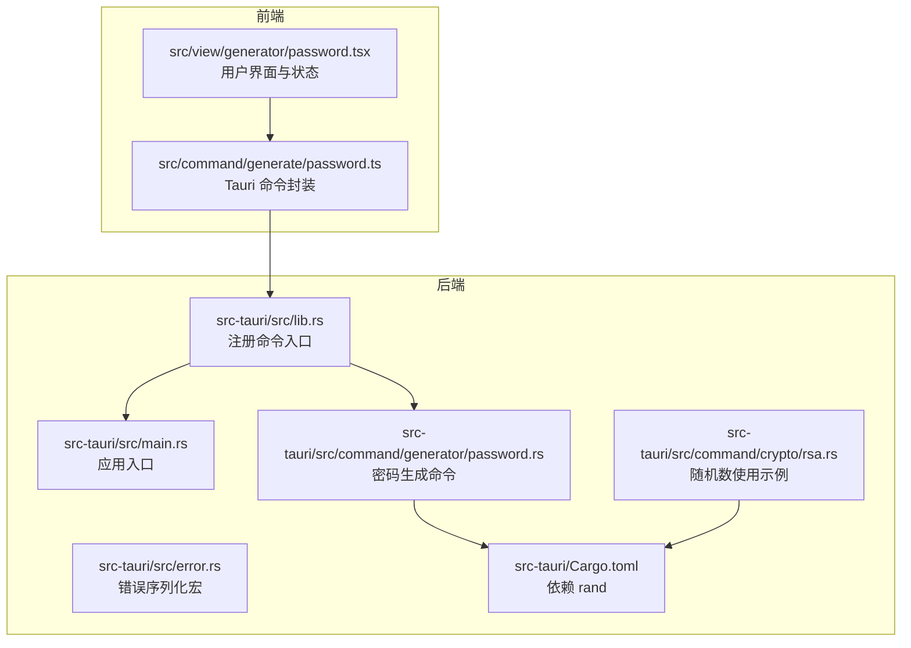
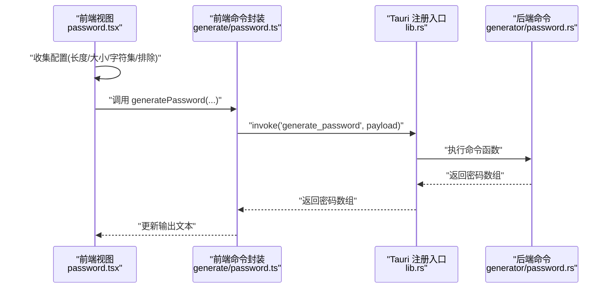
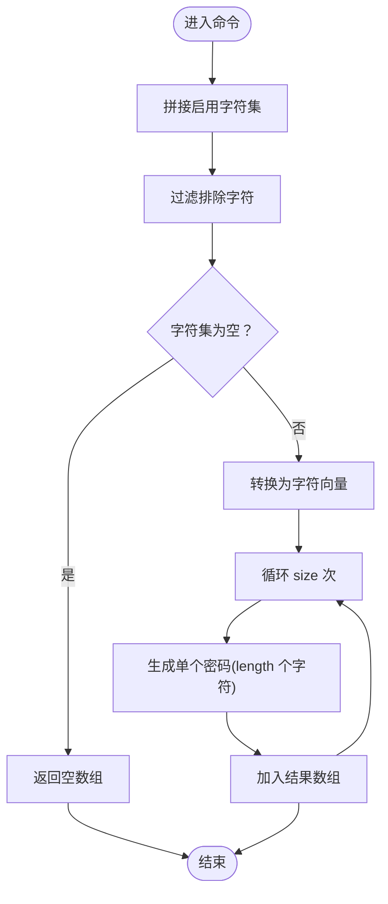
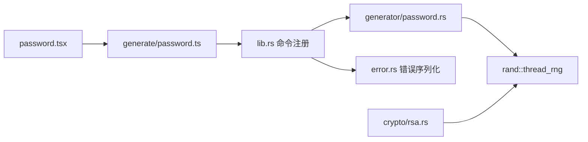

# 密码生成

<cite>
**本文引用的文件**
- [src/view/generator/password.tsx](file://src/view/generator/password.tsx)
- [src/command/generate/password.ts](file://src/command/generate/password.ts)
- [src-tauri/src/command/generator/password.rs](file://src-tauri/src/command/generator/password.rs)
- [src-tauri/src/lib.rs](file://src-tauri/src/lib.rs)
- [src-tauri/src/main.rs](file://src-tauri/src/main.rs)
- [src-tauri/Cargo.toml](file://src-tauri/Cargo.toml)
- [src-tauri/src/error.rs](file://src-tauri/src/error.rs)
- [src-tauri/src/command/crypto/rsa.rs](file://src-tauri/src/command/crypto/rsa.rs)
</cite>

## 目录
1. [简介](#简介)
2. [项目结构](#项目结构)
3. [核心组件](#核心组件)
4. [架构总览](#架构总览)
5. [详细组件分析](#详细组件分析)
6. [依赖关系分析](#依赖关系分析)
7. [性能与安全特性](#性能与安全特性)
8. [故障排查指南](#故障排查指南)
9. [结论](#结论)
10. [附录：集成与使用指南](#附录集成与使用指南)

## 简介
本文件系统化梳理 devkimi 中“密码生成”功能的前后端协作机制，围绕前端 Solid 组件与 Rust 后端命令实现展开，重点说明：
- 前端如何收集用户配置并通过 Tauri 调用后端命令生成密码
- 后端 Rust 使用 rand crate 实现安全随机数生成的策略与细节
- 密码强度配置（长度、字符集、特殊字符、排除字符）的实现原理
- 熵源管理、随机性保证、性能特征与安全考量
- 从用户配置到安全密码生成的完整流程与最佳实践

## 项目结构
密码生成功能由三层组成：
- 前端视图层：负责用户输入与结果展示
- 前端命令封装层：负责调用 Tauri 命令
- 后端命令层：负责密码生成逻辑与随机数生成

图表来源
- [src/view/generator/password.tsx](file://src/view/generator/password.tsx#L1-L133)
- [src/command/generate/password.ts](file://src/command/generate/password.ts#L1-L24)
- [src-tauri/src/lib.rs](file://src-tauri/src/lib.rs#L1-L57)
- [src-tauri/src/main.rs](file://src-tauri/src/main.rs#L1-L7)
- [src-tauri/src/command/generator/password.rs](file://src-tauri/src/command/generator/password.rs#L1-L59)
- [src-tauri/src/error.rs](file://src-tauri/src/error.rs#L1-L31)
- [src-tauri/src/command/crypto/rsa.rs](file://src-tauri/src/command/crypto/rsa.rs#L1-L78)
- [src-tauri/Cargo.toml](file://src-tauri/Cargo.toml#L1-L69)

章节来源
- [src/view/generator/password.tsx](file://src/view/generator/password.tsx#L1-L133)
- [src/command/generate/password.ts](file://src/command/generate/password.ts#L1-L24)
- [src-tauri/src/lib.rs](file://src-tauri/src/lib.rs#L1-L57)
- [src-tauri/src/main.rs](file://src-tauri/src/main.rs#L1-L7)
- [src-tauri/src/command/generator/password.rs](file://src-tauri/src/command/generator/password.rs#L1-L59)
- [src-tauri/Cargo.toml](file://src-tauri/Cargo.toml#L1-L69)

## 核心组件
- 前端视图组件：收集长度、大小、字符集开关、排除字符等配置，触发生成并展示结果
- 前端命令封装：通过 Tauri invoke 调用后端命令
- 后端命令：根据配置构建字符集，过滤排除字符，使用线程本地随机源生成密码列表

章节来源
- [src/view/generator/password.tsx](file://src/view/generator/password.tsx#L1-L133)
- [src/command/generate/password.ts](file://src/command/generate/password.ts#L1-L24)
- [src-tauri/src/command/generator/password.rs](file://src-tauri/src/command/generator/password.rs#L1-L59)

## 架构总览
从前端到后端的调用链路如下：

图表来源
- [src/view/generator/password.tsx](file://src/view/generator/password.tsx#L1-L133)
- [src/command/generate/password.ts](file://src/command/generate/password.ts#L1-L24)
- [src-tauri/src/lib.rs](file://src-tauri/src/lib.rs#L1-L57)
- [src-tauri/src/command/generator/password.rs](file://src-tauri/src/command/generator/password.rs#L1-L59)

## 详细组件分析

### 前端组件：password.tsx
- 状态管理：长度、大小、是否包含大写/小写/数字/特殊字符、排除字符、输出文本、刷新计数
- 触发条件：当大小与长度大于零且至少开启一种字符集时，自动发起生成请求
- 交互：支持重新生成、复制与保存

章节来源
- [src/view/generator/password.tsx](file://src/view/generator/password.tsx#L1-L133)

### 前端命令封装：generate/password.ts
- 将前端配置打包为参数对象
- 通过 Tauri invoke 调用名为 generate_password 的后端命令
- 返回类型为字符串数组（每行一个密码）

章节来源
- [src/command/generate/password.ts](file://src/command/generate/password.ts#L1-L24)

### 后端命令：generator/password.rs
- 常量字符集：数字、小写、大写、特殊字符
- 参数：size（生成数量）、length（密码长度）、uppercase/lowercase/numberic/special（字符集开关）、excludes（排除字符）
- 逻辑要点：
  - 动态拼接启用的字符集
  - 过滤排除字符
  - 若最终字符集为空，返回空数组
  - 将字符集转为向量，逐个生成指定长度的密码
  - 每次生成使用线程本地随机源选择字符

图表来源
- [src-tauri/src/command/generator/password.rs](file://src-tauri/src/command/generator/password.rs#L1-L59)

章节来源
- [src-tauri/src/command/generator/password.rs](file://src-tauri/src/command/generator/password.rs#L1-L59)

### Tauri 命令注册与应用入口
- 应用入口 main.rs 调用 lib.rs 的 run 函数启动
- lib.rs 中通过 generate_handler! 注册了 generate_password 命令
- 该注册确保前端 invoke 可以正确路由到后端实现

章节来源
- [src-tauri/src/main.rs](file://src-tauri/src/main.rs#L1-L7)
- [src-tauri/src/lib.rs](file://src-tauri/src/lib.rs#L1-L57)

### 依赖与随机数源
- 依赖声明中包含 rand crate，版本为 0.8
- 后端使用 rand::thread_rng 作为线程本地随机源
- 其他加密命令（如 RSA）也使用相同的线程本地随机源，体现一致的随机数策略

章节来源
- [src-tauri/Cargo.toml](file://src-tauri/Cargo.toml#L1-L69)
- [src-tauri/src/command/generator/password.rs](file://src-tauri/src/command/generator/password.rs#L1-L59)
- [src-tauri/src/command/crypto/rsa.rs](file://src-tauri/src/command/crypto/rsa.rs#L1-L78)

## 依赖关系分析
- 前端依赖：Solid 状态与 Tauri invoke
- 前端到后端：通过 Tauri 命令通道传递参数
- 后端依赖：rand 提供随机数生成；Tauri 提供命令框架与插件生态
- 错误处理：通过统一的错误序列化宏与 thiserror 错误类型进行序列化与传播

图表来源
- [src/view/generator/password.tsx](file://src/view/generator/password.tsx#L1-L133)
- [src/command/generate/password.ts](file://src/command/generate/password.ts#L1-L24)
- [src-tauri/src/lib.rs](file://src-tauri/src/lib.rs#L1-L57)
- [src-tauri/src/command/generator/password.rs](file://src-tauri/src/command/generator/password.rs#L1-L59)
- [src-tauri/src/error.rs](file://src-tauri/src/error.rs#L1-L31)
- [src-tauri/src/command/crypto/rsa.rs](file://src-tauri/src/command/crypto/rsa.rs#L1-L78)

章节来源
- [src-tauri/src/lib.rs](file://src-tauri/src/lib.rs#L1-L57)
- [src-tauri/src/command/generator/password.rs](file://src-tauri/src/command/generator/password.rs#L1-L59)
- [src-tauri/src/error.rs](file://src-tauri/src/error.rs#L1-L31)
- [src-tauri/src/command/crypto/rsa.rs](file://src-tauri/src/command/crypto/rsa.rs#L1-L78)

## 性能与安全特性

### 随机性与熵源
- 线程本地随机源：后端使用 rand::thread_rng，属于线程本地的伪随机数生成器，适合桌面应用场景
- 字符集构建：按需拼接启用字符集，避免不必要的内存分配
- 生成策略：逐字符随机选择，时间复杂度 O(size × length)，空间复杂度 O(size × length)

章节来源
- [src-tauri/src/command/generator/password.rs](file://src-tauri/src/command/generator/password.rs#L1-L59)

### 安全性设计
- 预防预测攻击：使用线程本地随机源，避免全局共享状态；字符集在每次生成前动态构建，减少可预测性
- 排除字符：允许用户排除易混淆字符，降低误读风险
- 输入校验：若最终字符集为空，直接返回空数组，避免异常或空结果导致的不一致行为
- 一致性：与其他加密命令（如 RSA）共享同一随机源，保持一致的随机性策略

章节来源
- [src-tauri/src/command/generator/password.rs](file://src-tauri/src/command/generator/password.rs#L1-L59)
- [src-tauri/src/command/crypto/rsa.rs](file://src-tauri/src/command/crypto/rsa.rs#L1-L78)

### 性能特征
- 时间复杂度：O(size × length)，受生成数量与长度影响
- 内存占用：预先分配容量，减少扩容开销
- 并发友好：线程本地随机源天然避免锁竞争

章节来源
- [src-tauri/src/command/generator/password.rs](file://src-tauri/src/command/generator/password.rs#L1-L59)

## 故障排查指南
- 前端无输出
  - 检查是否满足触发条件（大小与长度大于零且至少启用一种字符集）
  - 检查排除字符是否导致最终字符集为空
- 后端返回空数组
  - 当字符集被排除后变为空，命令会返回空数组；请调整排除字符或启用更多字符集
- 错误序列化
  - 后端错误通过统一的错误序列化宏进行序列化，前端收到字符串形式的错误信息；可在日志中查看详细信息

章节来源
- [src-tauri/src/command/generator/password.rs](file://src-tauri/src/command/generator/password.rs#L1-L59)
- [src-tauri/src/error.rs](file://src-tauri/src/error.rs#L1-L31)

## 结论
devkimi 的密码生成功能以简洁清晰的方式实现了从前端配置到后端安全随机生成的完整闭环。后端采用线程本地随机源与明确的字符集构建策略，在保证性能的同时兼顾安全性与可维护性。通过排除字符与多字符集组合，能够灵活适配不同场景下的密码强度需求。

## 附录：集成与使用指南

### 前端集成步骤
- 在视图中引入 generatePassword 并绑定到 UI 控件
- 监听配置变化，满足触发条件时调用生成函数
- 将返回的字符串数组按行展示，并提供复制与保存能力

章节来源
- [src/view/generator/password.tsx](file://src/view/generator/password.tsx#L1-L133)
- [src/command/generate/password.ts](file://src/command/generate/password.ts#L1-L24)

### 后端命令扩展建议
- 若需更高安全等级，可评估引入 OS 级别的熵源（例如 getrandom），并与现有线程本地随机源结合
- 对于超长密码或大批量生成，可考虑分批生成或异步流式输出，避免 UI 卡顿

章节来源
- [src-tauri/src/command/generator/password.rs](file://src-tauri/src/command/generator/password.rs#L1-L59)
- [src-tauri/Cargo.toml](file://src-tauri/Cargo.toml#L1-L69)