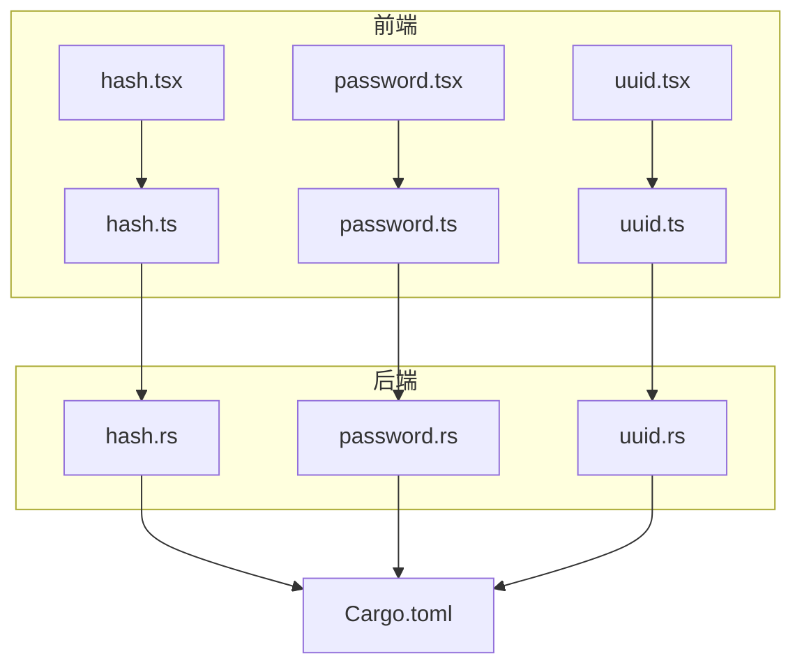
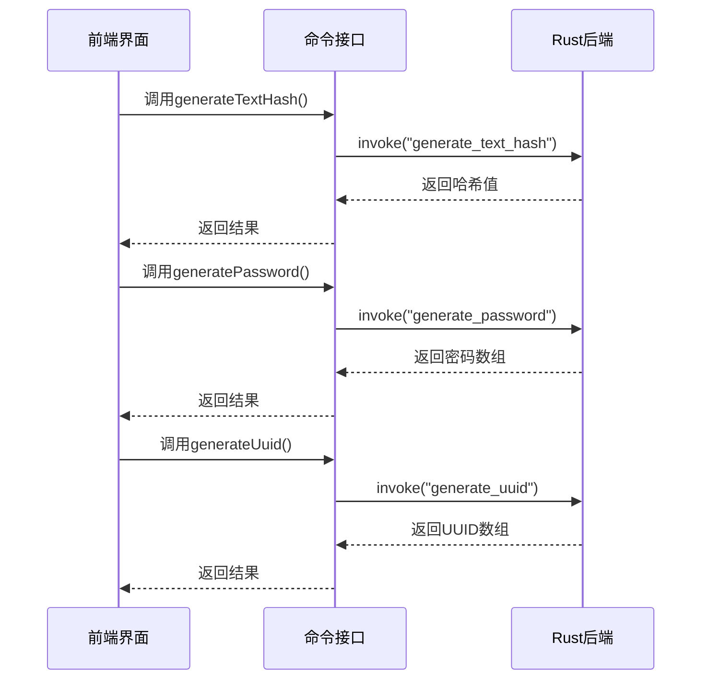
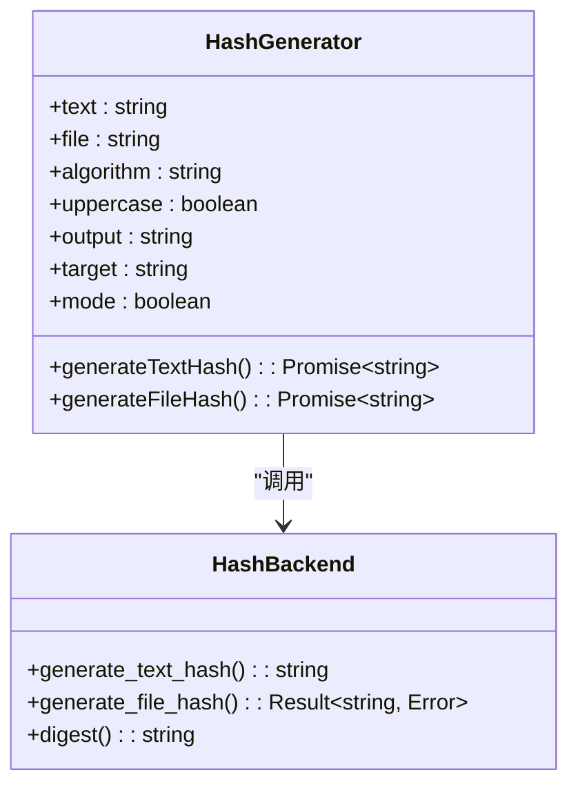
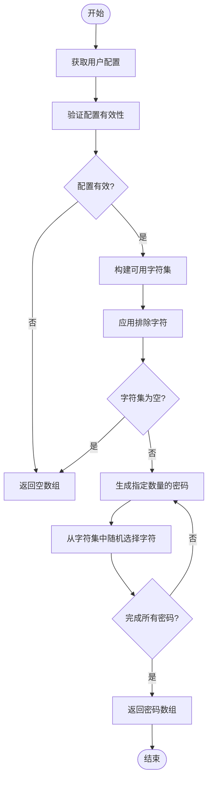
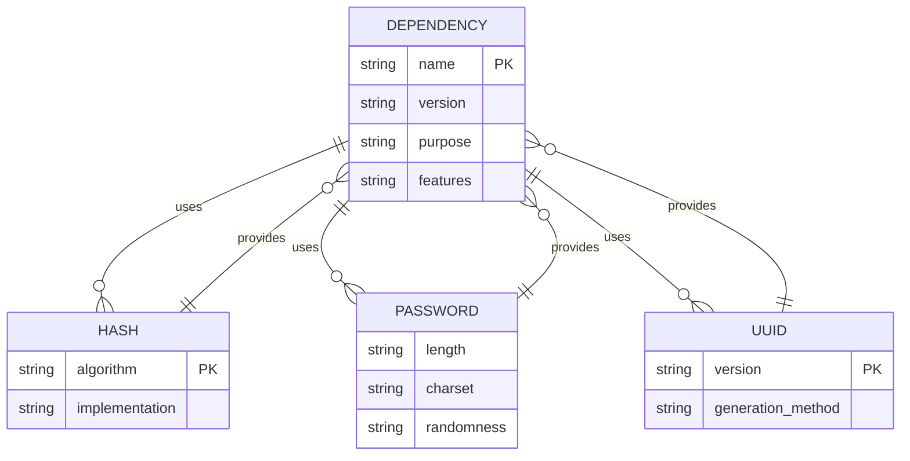

# 生成器

<cite>
**本文档引用的文件**  
- [hash.tsx](file://src/view/generator/hash.tsx)
- [password.tsx](file://src/view/generator/password.tsx)
- [uuid.tsx](file://src/view/generator/uuid.tsx)
- [hash.ts](file://src/command/generate/hash.ts)
- [password.ts](file://src/command/generate/password.ts)
- [uuid.ts](file://src/command/generate/uuid.ts)
- [hash.rs](file://src-tauri/src/command/generator/hash.rs)
- [password.rs](file://src-tauri/src/command/generator/password.rs)
- [uuid.rs](file://src-tauri/src/command/generator/uuid.rs)
- [mod.rs](file://src-tauri/src/command/generator/mod.rs)
- [Cargo.toml](file://src-tauri/Cargo.toml)
- [lib.rs](file://src-tauri/src/lib.rs)
</cite>

## 目录
1. [简介](#简介)
2. [项目结构](#项目结构)
3. [核心组件](#核心组件)
4. [架构概述](#架构概述)
5. [详细组件分析](#详细组件分析)
6. [依赖分析](#依赖分析)
7. [性能考虑](#性能考虑)
8. [故障排除指南](#故障排除指南)
9. [结论](#结论)

## 简介
devkimi生成器功能提供了一套完整的数据生成工具，包括哈希值生成、密码生成和UUID生成三大核心子功能。该系统采用Tauri框架构建，前端使用SolidJS实现响应式用户界面，后端使用Rust语言确保生成过程的安全性和可靠性。本文档详细介绍了这三个生成器的实现原理、技术细节和交互机制，为开发者提供全面的集成指南和最佳实践。

## 项目结构
devkimi生成器功能的代码结构清晰地分为前端视图层、命令接口层和Rust后端实现层。前端视图位于`src/view/generator/`目录下，包含三个主要的生成器组件：哈希生成器、密码生成器和UUID生成器。命令接口层位于`src/command/generate/`目录下，负责连接前端与后端。Rust后端实现位于`src-tauri/src/command/generator/`目录下，提供了安全可靠的生成逻辑。



**图示来源**  
- [hash.tsx](file://src/view/generator/hash.tsx)
- [password.tsx](file://src/view/generator/password.tsx)
- [uuid.tsx](file://src/view/generator/uuid.tsx)
- [hash.ts](file://src/command/generate/hash.ts)
- [password.ts](file://src/command/generate/password.ts)
- [uuid.ts](file://src/command/generate/uuid.ts)
- [hash.rs](file://src-tauri/src/command/generator/hash.rs)
- [password.rs](file://src-tauri/src/command/generator/password.rs)
- [uuid.rs](file://src-tauri/src/command/generator/uuid.rs)

**节来源**  
- [src/view/generator/](file://src/view/generator/)
- [src/command/generate/](file://src/command/generate/)
- [src-tauri/src/command/generator/](file://src-tauri/src/command/generator/)

## 核心组件
devkimi生成器功能的核心组件包括哈希生成器、密码生成器和UUID生成器。每个生成器都遵循相同的架构模式：前端用户界面通过命令接口调用Rust后端的原生函数。哈希生成器支持多种算法，包括MD5、SHA-1、SHA-256、SHA-384、SHA-512和SM3。密码生成器提供了灵活的配置选项，允许用户自定义密码长度、字符集和排除字符。UUID生成器支持v1、v4和v7版本，满足不同场景下的唯一性需求。

**节来源**  
- [hash.tsx](file://src/view/generator/hash.tsx#L25-L184)
- [password.tsx](file://src/view/generator/password.tsx#L18-L133)
- [uuid.tsx](file://src/view/generator/uuid.tsx#L16-L87)

## 架构概述
devkimi生成器功能采用前后端分离的架构设计。前端使用SolidJS框架构建响应式用户界面，通过Tauri的`invoke` API与Rust后端进行通信。Rust后端使用`tauri::command`宏暴露安全的原生函数接口，确保跨语言调用的安全性。整个系统通过`src-tauri/src/lib.rs`中的`invoke_handler`注册所有可用的命令，形成一个统一的API入口。



**图示来源**  
- [lib.rs](file://src-tauri/src/lib.rs#L11-L43)
- [hash.ts](file://src/command/generate/hash.ts)
- [password.ts](file://src/command/generate/password.ts)
- [uuid.ts](file://src/command/generate/uuid.ts)

## 详细组件分析

### 哈希生成器分析
哈希生成器提供了文本哈希和文件哈希两种计算模式。用户可以通过界面选择不同的哈希算法（MD5、SHA-1、SHA-256、SHA-384、SHA-512、SM3）和输出格式（大写或小写）。系统通过Rust的`digest`系列crate实现各种哈希算法，确保计算结果的准确性和安全性。



**图示来源**  
- [hash.tsx](file://src/view/generator/hash.tsx#L34-L184)
- [hash.rs](file://src-tauri/src/command/generator/hash.rs#L20-L47)

**节来源**  
- [hash.tsx](file://src/view/generator/hash.tsx#L1-L184)
- [hash.ts](file://src/command/generate/hash.ts)
- [hash.rs](file://src-tauri/src/command/generator/hash.rs)

### 密码生成器分析
密码生成器注重安全性和灵活性。系统使用Rust的`rand` crate作为随机数生成器，确保密码的随机性和不可预测性。用户可以配置密码长度、包含的字符类型（大写字母、小写字母、数字、特殊字符）以及需要排除的字符。生成器会根据用户的配置动态构建字符集，并从中随机选择字符生成密码。



**图示来源**  
- [password.rs](file://src-tauri/src/command/generator/password.rs#L9-L58)

**节来源**  
- [password.tsx](file://src/view/generator/password.tsx#L18-L133)
- [password.ts](file://src/command/generate/password.ts)
- [password.rs](file://src-tauri/src/command/generator/password.rs)

### UUID生成器分析
UUID生成器支持v1、v4和v7三个版本，满足不同场景下的唯一性需求。v1基于时间戳和节点标识，v4基于随机数，v7是新的时间有序UUID格式。用户可以配置生成数量、版本、是否包含连字符以及输出大小写格式。

```mermaid
stateDiagram-v2
[*] --> 初始化
初始化 --> 选择版本["根据版本选择生成函数"]
选择版本 --> v1["v1 : new_v1()"]
选择版本 --> v4["v4 : new_v4()"]
选择版本 --> v7["v7 : new_v7()"]
v1 --> 格式化
v4 --> 格式化
v7 --> 格式化
格式化 --> 连字符["应用连字符格式"]
连字符 --> 大小写["应用大小写格式"]
大小写 --> 完成{"完成所有UUID?"}
完成 --> |否| 选择版本
完成 --> |是| 返回结果["返回UUID数组"]
返回结果 --> [*]
```

**图示来源**  
- [uuid.rs](file://src-tauri/src/command/generator/uuid.rs#L12-L30)

**节来源**  
- [uuid.tsx](file://src/view/generator/uuid.tsx#L16-L87)
- [uuid.ts](file://src/command/generate/uuid.ts)
- [uuid.rs](file://src-tauri/src/command/generator/uuid.rs)

## 依赖分析
devkimi生成器功能依赖多个高质量的Rust crate来实现其核心功能。哈希生成器依赖`md-5`、`sha1`、`sha2`和`sm3`等crate提供各种哈希算法实现。密码生成器依赖`rand` crate作为加密安全的随机数生成器。UUID生成器依赖`uuid` crate提供标准的UUID生成算法。这些依赖在`Cargo.toml`文件中明确定义，并通过语义化版本控制确保兼容性和安全性。



**图示来源**  
- [Cargo.toml](file://src-tauri/Cargo.toml#L30-L58)
- [hash.rs](file://src-tauri/src/command/generator/hash.rs#L1-L5)
- [password.rs](file://src-tauri/src/command/generator/password.rs#L1)
- [uuid.rs](file://src-tauri/src/command/generator/uuid.rs#L2)

**节来源**  
- [Cargo.toml](file://src-tauri/Cargo.toml)
- [lib.rs](file://src-tauri/src/lib.rs)

## 性能考虑
devkimi生成器功能在设计时充分考虑了性能因素。哈希生成器对大文件采用一次性读取的方式，避免了内存的多次分配。密码生成器预先构建字符集并重复使用，减少了运行时的字符串操作开销。UUID生成器批量生成多个UUID，提高了时间戳获取等系统调用的效率。Rust的零成本抽象和内存安全特性确保了高性能的同时不会牺牲安全性。

## 故障排除指南
当遇到生成器功能异常时，可以按照以下步骤进行排查：首先检查前端界面的用户输入是否符合要求；其次确认Tauri运行时是否正常启动；然后查看Rust后端是否有错误日志输出；最后检查相关依赖是否正确安装。对于文件哈希计算失败的情况，需要特别注意文件路径的正确性和文件读取权限。

**节来源**  
- [error.rs](file://src-tauri/src/error.rs)
- [hash.rs](file://src-tauri/src/command/generator/hash.rs#L49-L51)

## 结论
devkimi生成器功能通过前后端协同工作，提供了一套安全、可靠、易用的数据生成工具。前端使用现代JavaScript框架构建直观的用户界面，后端利用Rust语言的优势确保生成过程的安全性和性能。三个生成器模块（哈希、密码、UUID）各自独立又统一管理，形成了一个完整的工具集。开发者可以参考本文档中的实现模式，扩展更多类型的生成器功能。