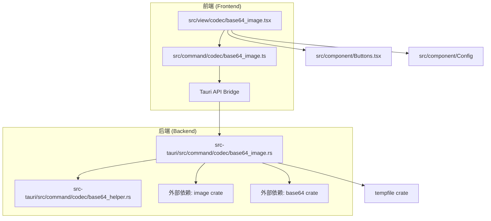
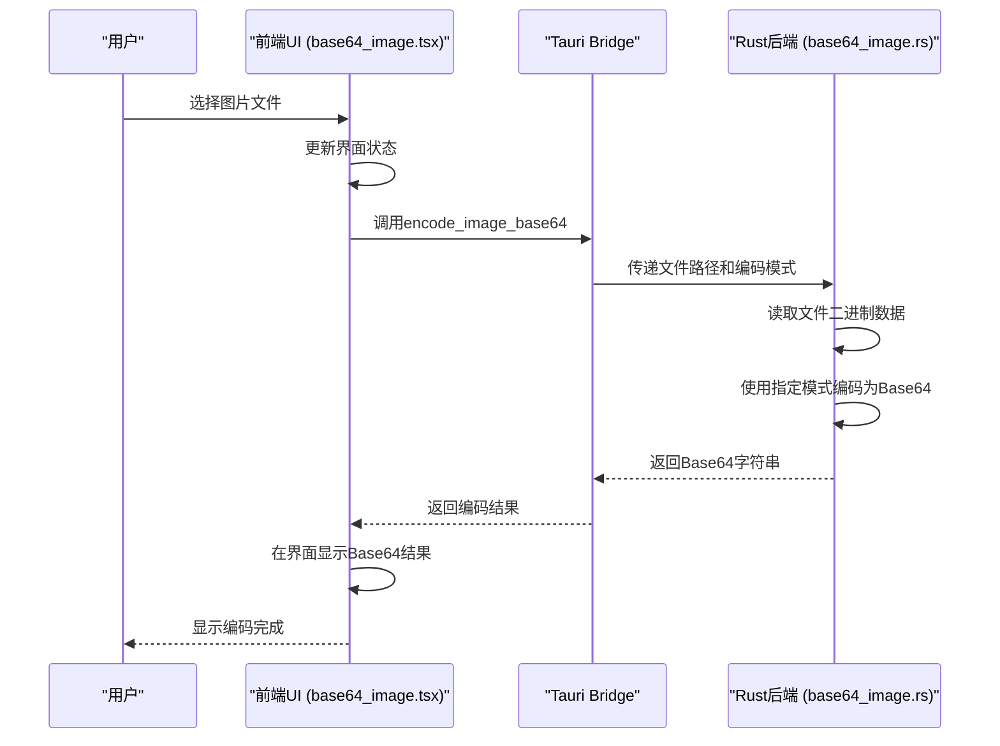
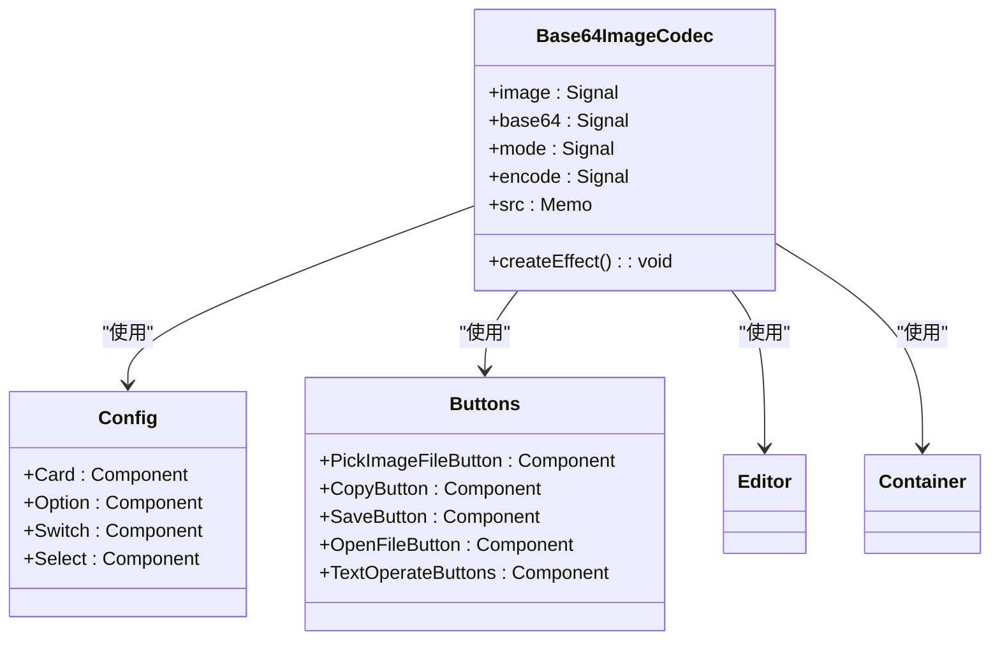
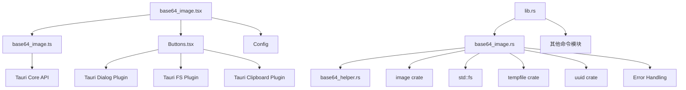

# Base64图片编解码

<cite>
**本文档中引用的文件**  
- [base64_image.tsx](file://src/view/codec/base64_image.tsx)
- [base64_image.ts](file://src/command/codec/base64_image.ts)
- [base64_image.rs](file://src-tauri/src/command/codec/base64_image.rs)
- [base64_helper.rs](file://src-tauri/src/command/codec/base64_helper.rs)
- [Buttons.tsx](file://src/component/Buttons.tsx)
- [fs.ts](file://src/command/fs.ts)
- [lib.rs](file://src-tauri/src/lib.rs)
</cite>

## 目录
1. [简介](#简介)
2. [项目结构](#项目结构)
3. [核心组件](#核心组件)
4. [架构概览](#架构概览)
5. [详细组件分析](#详细组件分析)
6. [依赖分析](#依赖分析)
7. [性能考虑](#性能考虑)
8. [故障排除指南](#故障排除指南)
9. [结论](#结论)

## 简介
本项目实现了一个完整的Base64图片编解码功能，允许用户在桌面应用中将图片文件编码为Base64字符串或将Base64字符串解码为图片。该功能基于Tauri框架构建，前端使用SolidJS，后端使用Rust，实现了高性能的二进制数据处理。系统支持多种Base64编码模式，包括标准模式、无填充模式、URL安全模式等，满足不同场景下的使用需求。

## 项目结构
Base64图片编解码功能的实现分布在前端和后端两个主要部分。前端负责用户界面展示、文件选择和结果预览，后端负责实际的编解码逻辑处理。通过Tauri Bridge实现前后端的安全通信。



**Diagram sources**  
- [base64_image.tsx](file://src/view/codec/base64_image.tsx)
- [base64_image.ts](file://src/command/codec/base64_image.ts)
- [base64_image.rs](file://src-tauri/src/command/codec/base64_image.rs)
- [base64_helper.rs](file://src-tauri/src/command/codec/base64_helper.rs)

**Section sources**  
- [base64_image.tsx](file://src/view/codec/base64_image.tsx)
- [base64_image.rs](file://src-tauri/src/command/codec/base64_image.rs)

## 核心组件
Base64图片编解码功能的核心组件包括前端UI组件、Tauri命令接口和Rust后端实现。前端组件处理用户交互和界面展示，通过Tauri Bridge调用后端Rust函数进行实际的编解码操作。系统支持编码（图片到Base64）和解码（Base64到图片）两种模式，用户可以通过界面切换。

**Section sources**  
- [base64_image.tsx](file://src/view/codec/base64_image.tsx)
- [base64_image.rs](file://src-tauri/src/command/codec/base64_image.rs)

## 架构概览
Base64图片编解码功能采用前后端分离的架构设计。前端负责用户界面和交互逻辑，后端负责高性能的二进制数据处理。通过Tauri框架提供的安全API桥接，前端可以调用后端的Rust函数，实现高效的数据编解码。



**Diagram sources**  
- [base64_image.tsx](file://src/view/codec/base64_image.tsx)
- [base64_image.ts](file://src/command/codec/base64_image.ts)
- [base64_image.rs](file://src-tauri/src/command/codec/base64_image.rs)

## 详细组件分析

### 前端UI组件分析
前端UI组件实现了完整的用户交互流程，包括模式选择、文件上传、结果展示和操作按钮。组件使用SolidJS的响应式系统，当用户更改设置或选择文件时，自动触发相应的编解码操作。



**Diagram sources**  
- [base64_image.tsx](file://src/view/codec/base64_image.tsx)
- [Buttons.tsx](file://src/component/Buttons.tsx)
- [Config/index.tsx](file://src/component/Config/index.tsx)

**Section sources**  
- [base64_image.tsx](file://src/view/codec/base64_image.tsx)
- [Buttons.tsx](file://src/component/Buttons.tsx)

### Tauri命令接口分析
Tauri命令接口作为前后端通信的桥梁，定义了前端可以调用的后端函数。接口使用`invoke`方法进行异步调用，传递参数并接收返回结果。这种设计模式确保了前后端的解耦，同时提供了类型安全的API调用。

```mermaid
flowchart TD
A[前端调用] --> B[invoke("encode_image_base64")]
B --> C{参数验证}
C --> D[传递image路径]
D --> E[传递mode模式]
E --> F[Tauri Bridge]
F --> G[Rust后端处理]
G --> H[返回Promise]
H --> I[成功: Base64字符串]
H --> J[失败: 错误信息]
I --> K[前端处理结果]
J --> L[前端显示错误]
```

**Diagram sources**  
- [base64_image.ts](file://src/command/codec/base64_image.ts)
- [base64_image.rs](file://src-tauri/src/command/codec/base64_image.rs)

**Section sources**  
- [base64_image.ts](file://src/command/codec/base64_image.ts)

### Rust后端实现分析
Rust后端实现了高性能的Base64编解码逻辑。编码函数读取图片文件的二进制数据，使用指定的Base64模式进行编码；解码函数将Base64字符串解码为二进制数据，自动识别图片格式并保存到临时文件。后端利用Rust的内存安全特性和高效的外部crates，确保了处理大文件时的性能和稳定性。

```mermaid
classDiagram
class Base64Mode {
+Standard
+StandardNoPad
+UrlSafe
+UrlSafeNoPad
+encode(bytes) : String
+decode(base64) : Result<Vec<u8>>
}
class ImageProcessor {
+encode_image_base64(image : &str, mode : Base64Mode) : Result<String>
+decode_image_base64(base64 : &str, mode : Base64Mode) : Result<PathBuf>
}
ImageProcessor --> Base64Mode : "使用"
ImageProcessor --> image : : ImageReader : "依赖"
ImageProcessor --> std : : fs : "依赖"
ImageProcessor --> tempfile : "依赖"
ImageProcessor --> uuid : "依赖"
```

**Diagram sources**  
- [base64_image.rs](file://src-tauri/src/command/codec/base64_image.rs)
- [base64_helper.rs](file://src-tauri/src/command/codec/base64_helper.rs)

**Section sources**  
- [base64_image.rs](file://src-tauri/src/command/codec/base64_image.rs)
- [base64_helper.rs](file://src-tauri/src/command/codec/base64_helper.rs)

## 依赖分析
Base64图片编解码功能依赖多个外部库和内部模块，形成了清晰的依赖关系网络。后端依赖Rust生态系统中的成熟crates处理Base64编码、图片格式识别和文件操作，前端依赖Tauri提供的API进行文件选择、剪贴板操作和跨平台文件打开。



**Diagram sources**  
- [base64_image.rs](file://src-tauri/src/command/codec/base64_image.rs)
- [base64_helper.rs](file://src-tauri/src/command/codec/base64_helper.rs)
- [lib.rs](file://src-tauri/src/lib.rs)
- [fs.ts](file://src/command/fs.ts)

**Section sources**  
- [base64_image.rs](file://src-tauri/src/command/codec/base64_image.rs)
- [lib.rs](file://src-tauri/src/lib.rs)

## 性能考虑
Base64编码会增加原始数据约33%的大小，因此在处理大图片文件时需要考虑性能影响。系统通过在Rust后端进行编解码操作，充分利用了Rust的高性能特性，避免了JavaScript处理二进制数据的性能瓶颈。对于超大文件，建议先进行图片压缩再进行Base64编码，以减少数据传输量和内存占用。

## 故障排除指南
当Base64图片编解码功能出现问题时，可以按照以下步骤进行排查：检查文件路径是否正确、确认图片格式是否支持、验证Base64字符串格式是否正确、检查临时目录是否有写入权限。系统提供了详细的错误处理机制，包括IO错误、Base64解码错误、图片格式错误等，帮助用户快速定位问题。

**Section sources**  
- [base64_image.rs](file://src-tauri/src/command/codec/base64_image.rs)
- [base64_image.tsx](file://src/view/codec/base64_image.tsx)

## 结论
Base64图片编解码功能通过前后端协同工作，提供了一个高效、易用的工具。前端友好的用户界面与后端高性能的Rust实现相结合，确保了良好的用户体验和系统性能。该功能适用于网页内嵌图片、API数据传输等多种场景，支持多种编码模式以适应不同的使用需求。