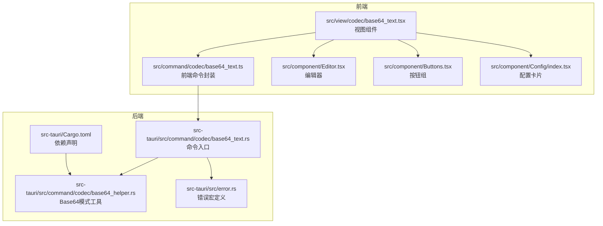
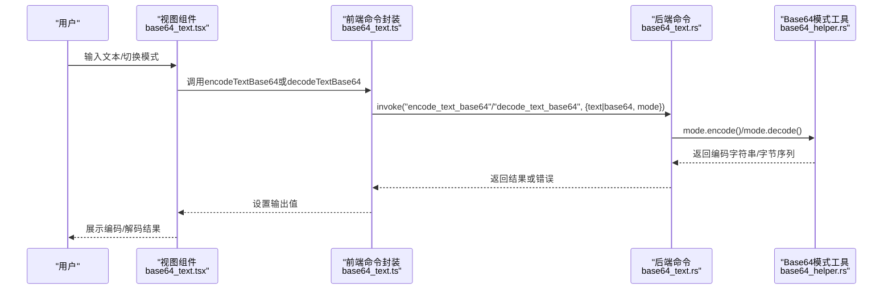
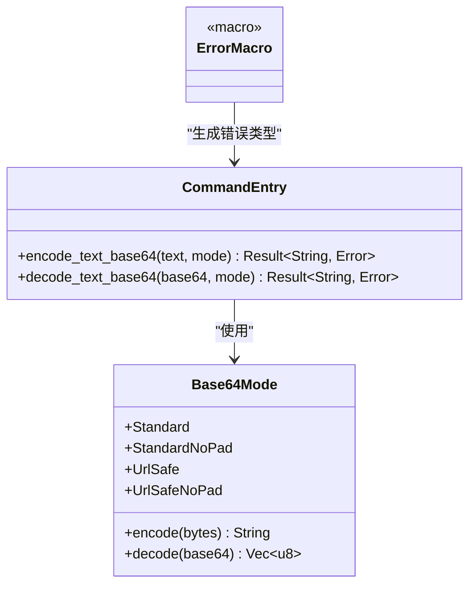
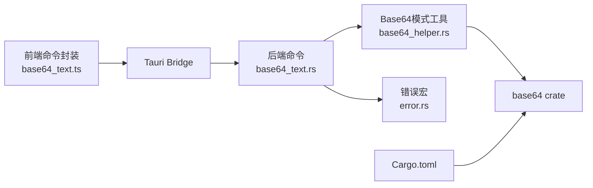
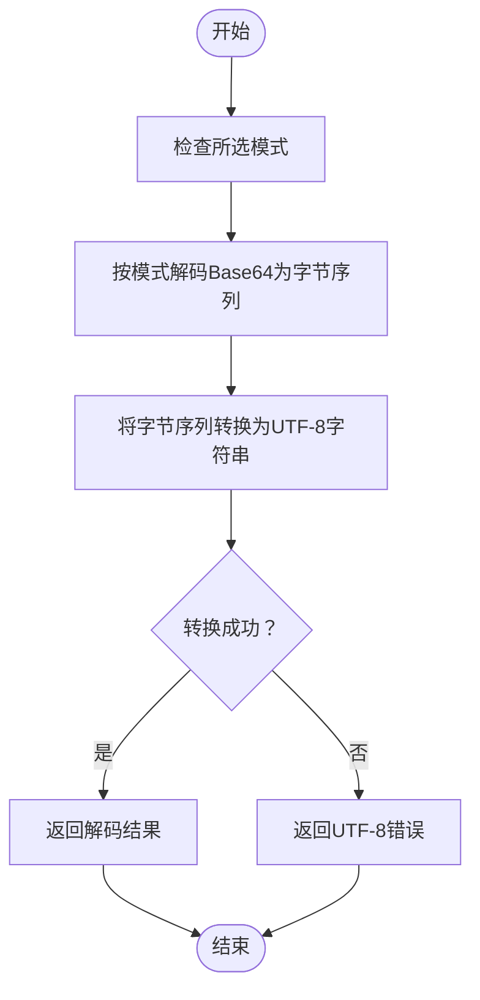

# Base64文本编解码

<cite>
**本文引用的文件**
- [src/view/codec/base64_text.tsx](file://src/view/codec/base64_text.tsx)
- [src/command/codec/base64_text.ts](file://src/command/codec/base64_text.ts)
- [src-tauri/src/command/codec/base64_text.rs](file://src-tauri/src/command/codec/base64_text.rs)
- [src-tauri/src/command/codec/base64_helper.rs](file://src-tauri/src/command/codec/base64_helper.rs)
- [src-tauri/src/error.rs](file://src-tauri/src/error.rs)
- [src-tauri/Cargo.toml](file://src-tauri/Cargo.toml)
- [src/component/Config/index.tsx](file://src/component/Config/index.tsx)
- [src/component/Buttons.tsx](file://src/component/Buttons.tsx)
- [src/component/Editor.tsx](file://src/component/Editor.tsx)
</cite>

## 目录
1. [简介](#简介)
2. [项目结构](#项目结构)
3. [核心组件](#核心组件)
4. [架构总览](#架构总览)
5. [详细组件分析](#详细组件分析)
6. [依赖关系分析](#依赖关系分析)
7. [性能考量](#性能考量)
8. [故障排查指南](#故障排查指南)
9. [结论](#结论)
10. [附录](#附录)

## 简介
本文件系统性阐述“Base64文本编解码”功能的实现原理与使用方法，覆盖从前端UI到后端Rust命令的完整链路。文档重点包括：
- 前端Solid组件如何通过Tauri Bridge调用后端命令
- Rust后端如何基于base64 crate实现标准/URL安全等不同模式的编码与解码
- 字符集与填充机制的规范说明
- 使用场景、API接口说明、错误处理与性能优化策略
- 初学者操作指南与高级用户的配置建议

## 项目结构
该功能由三层组成：前端视图层、前端命令层、后端命令层。前端通过Tauri的invoke桥接调用后端命令，后端命令再委托给通用的Base64模式工具进行具体编码/解码。

图表来源
- [src/view/codec/base64_text.tsx](file://src/view/codec/base64_text.tsx#L1-L111)
- [src/command/codec/base64_text.ts](file://src/command/codec/base64_text.ts#L1-L18)
- [src-tauri/src/command/codec/base64_text.rs](file://src-tauri/src/command/codec/base64_text.rs#L1-L22)
- [src-tauri/src/command/codec/base64_helper.rs](file://src-tauri/src/command/codec/base64_helper.rs#L1-L36)
- [src-tauri/src/error.rs](file://src-tauri/src/error.rs#L1-L31)
- [src-tauri/Cargo.toml](file://src-tauri/Cargo.toml#L1-L69)

章节来源
- [src/view/codec/base64_text.tsx](file://src/view/codec/base64_text.tsx#L1-L111)
- [src/command/codec/base64_text.ts](file://src/command/codec/base64_text.ts#L1-L18)
- [src-tauri/src/command/codec/base64_text.rs](file://src-tauri/src/command/codec/base64_text.rs#L1-L22)
- [src-tauri/src/command/codec/base64_helper.rs](file://src-tauri/src/command/codec/base64_helper.rs#L1-L36)
- [src-tauri/src/error.rs](file://src-tauri/src/error.rs#L1-L31)
- [src-tauri/Cargo.toml](file://src-tauri/Cargo.toml#L1-L69)

## 核心组件
- 视图组件：负责用户交互、模式选择、输入输出展示与按钮操作。
- 前端命令封装：通过Tauri invoke桥接调用后端命令，传递参数与接收结果。
- 后端命令：定义可被前端调用的命令函数，执行编码或解码。
- 模式工具：抽象Base64模式枚举与具体编码/解码逻辑，统一调用base64 crate。
- 错误体系：通过自定义错误宏生成统一错误类型，便于跨语言传递。

章节来源
- [src/view/codec/base64_text.tsx](file://src/view/codec/base64_text.tsx#L1-L111)
- [src/command/codec/base64_text.ts](file://src/command/codec/base64_text.ts#L1-L18)
- [src-tauri/src/command/codec/base64_text.rs](file://src-tauri/src/command/codec/base64_text.rs#L1-L22)
- [src-tauri/src/command/codec/base64_helper.rs](file://src-tauri/src/command/codec/base64_helper.rs#L1-L36)
- [src-tauri/src/error.rs](file://src-tauri/src/error.rs#L1-L31)

## 架构总览
从前端到后端的调用序列如下：

图表来源
- [src/view/codec/base64_text.tsx](file://src/view/codec/base64_text.tsx#L1-L111)
- [src/command/codec/base64_text.ts](file://src/command/codec/base64_text.ts#L1-L18)
- [src-tauri/src/command/codec/base64_text.rs](file://src-tauri/src/command/codec/base64_text.rs#L1-L22)
- [src-tauri/src/command/codec/base64_helper.rs](file://src-tauri/src/command/codec/base64_helper.rs#L1-L36)

## 详细组件分析

### 前端视图组件（Base64文本编解码）
- 功能要点
  - 提供“编码/解码”开关与“模式”下拉选择（Standard、StandardNoPad、UrlSafe、UrlSafeNoPad）。
  - 输入区支持从文件读取、粘贴、清空等操作；输出区支持复制与保存。
  - 当输入变化时，根据当前模式与方向自动触发编码或解码。
- 关键行为
  - 输入变化触发异步调用，错误时将错误信息字符串回显到输出区。
  - 输出区以只读方式展示结果，便于复制与保存。

章节来源
- [src/view/codec/base64_text.tsx](file://src/view/codec/base64_text.tsx#L1-L111)
- [src/component/Config/index.tsx](file://src/component/Config/index.tsx#L1-L37)
- [src/component/Buttons.tsx](file://src/component/Buttons.tsx#L1-L191)
- [src/component/Editor.tsx](file://src/component/Editor.tsx#L1-L139)

### 前端命令封装（Tauri Bridge）
- 功能要点
  - 封装encodeTextBase64与decodeTextBase64两个异步函数，分别调用后端对应命令。
  - 参数包含待处理文本或Base64字符串以及Base64模式。
- 调用约定
  - 返回Promise，前端在视图中直接使用then/catch处理结果与错误。

章节来源
- [src/command/codec/base64_text.ts](file://src/command/codec/base64_text.ts#L1-L18)

### 后端命令（Rust）
- 功能要点
  - 定义两个命令：encode_text_base64与decode_text_base64。
  - 编码：将输入文本按指定模式编码为Base64字符串。
  - 解码：将Base64字符串按指定模式解码为字节序列，再转为UTF-8字符串。
- 错误处理
  - UTF-8解码错误与Base64解码错误均映射为统一错误类型，便于前端捕获与展示。

章节来源
- [src-tauri/src/command/codec/base64_text.rs](file://src-tauri/src/command/codec/base64_text.rs#L1-L22)
- [src-tauri/src/error.rs](file://src-tauri/src/error.rs#L1-L31)

### Base64模式工具（Rust）
- 功能要点
  - 定义Base64Mode枚举：Standard、StandardNoPad、UrlSafe、UrlSafeNoPad。
  - encode：根据模式调用对应的base64引擎进行编码。
  - decode：根据模式调用对应的base64引擎进行解码，返回字节序列。
- 依赖
  - 使用base64 crate的标准/URL安全编码器与解码器。

章节来源
- [src-tauri/src/command/codec/base64_helper.rs](file://src-tauri/src/command/codec/base64_helper.rs#L1-L36)
- [src-tauri/Cargo.toml](file://src-tauri/Cargo.toml#L1-L69)

### 错误体系（Rust）
- 功能要点
  - 通过自定义宏command_error!生成统一错误类型，包含UTF-8与Base64解码错误分支。
  - 通过serialize_error!宏使错误类型可序列化，便于跨语言传递。
- 影响
  - 前端收到的错误消息格式统一，便于用户理解与定位问题。

章节来源
- [src-tauri/src/error.rs](file://src-tauri/src/error.rs#L1-L31)
- [src-tauri/src/command/codec/base64_text.rs](file://src-tauri/src/command/codec/base64_text.rs#L1-L22)

### 类关系图（代码级）

图表来源
- [src-tauri/src/command/codec/base64_helper.rs](file://src-tauri/src/command/codec/base64_helper.rs#L1-L36)
- [src-tauri/src/command/codec/base64_text.rs](file://src-tauri/src/command/codec/base64_text.rs#L1-L22)
- [src-tauri/src/error.rs](file://src-tauri/src/error.rs#L1-L31)

## 依赖关系分析
- 前端依赖
  - @tauri-apps/api/core：用于invoke桥接调用后端命令。
  - lucide-solid：图标库。
  - monaco-editor：编辑器渲染与交互。
  - @tauri-apps插件：剪贴板、对话框、文件系统等能力。
- 后端依赖
  - base64 crate：提供标准与URL安全编码/解码。
  - tauri：命令注册与桥接。
  - thiserror与serde：错误与序列化。

图表来源
- [src/command/codec/base64_text.ts](file://src/command/codec/base64_text.ts#L1-L18)
- [src-tauri/src/command/codec/base64_text.rs](file://src-tauri/src/command/codec/base64_text.rs#L1-L22)
- [src-tauri/src/command/codec/base64_helper.rs](file://src-tauri/src/command/codec/base64_helper.rs#L1-L36)
- [src-tauri/src/error.rs](file://src-tauri/src/error.rs#L1-L31)
- [src-tauri/Cargo.toml](file://src-tauri/Cargo.toml#L1-L69)

章节来源
- [src/command/codec/base64_text.ts](file://src/command/codec/base64_text.ts#L1-L18)
- [src-tauri/src/command/codec/base64_text.rs](file://src-tauri/src/command/codec/base64_text.rs#L1-L22)
- [src-tauri/src/command/codec/base64_helper.rs](file://src-tauri/src/command/codec/base64_helper.rs#L1-L36)
- [src-tauri/src/error.rs](file://src-tauri/src/error.rs#L1-L31)
- [src-tauri/Cargo.toml](file://src-tauri/Cargo.toml#L1-L69)

## 性能考量
- 前端大文本处理
  - 使用Monaco编辑器进行增量渲染与布局更新，避免全量重绘。
  - 输入变化时仅触发一次异步调用，减少重复计算。
  - 对于超长文本，建议分段处理或限制一次性处理的数据量，避免阻塞UI线程。
- 后端处理
  - base64 crate为零拷贝与高效内存管理设计，适合大文本处理。
  - Rust侧解码后立即进行UTF-8校验，失败即刻返回错误，避免无效后续处理。
- I/O与桥接
  - invoke调用为异步，避免阻塞主线程。
  - 建议对频繁调用进行节流/防抖，降低命令调用频率。

章节来源
- [src/view/codec/base64_text.tsx](file://src/view/codec/base64_text.tsx#L1-L111)
- [src-tauri/src/command/codec/base64_helper.rs](file://src-tauri/src/command/codec/base64_helper.rs#L1-L36)
- [src-tauri/src/command/codec/base64_text.rs](file://src-tauri/src/command/codec/base64_text.rs#L1-L22)

## 故障排查指南
- 常见错误类型
  - UTF-8错误：解码得到的字节序列无法转换为UTF-8字符串。
  - Base64解码错误：输入的Base64字符串不符合所选模式的字符集或长度规则。
- 前端表现
  - 输出区显示错误字符串，提示具体错误原因。
- 排查步骤
  - 确认所选模式与输入是否匹配（例如URL安全模式不应包含标准字符集之外的字符）。
  - 检查输入是否包含非法字符或不完整的填充。
  - 对于超长文本，尝试分段处理或降低一次性处理量。
- 后端日志
  - 可通过Tauri日志插件查看命令执行过程中的错误堆栈与上下文。

章节来源
- [src-tauri/src/command/codec/base64_text.rs](file://src-tauri/src/command/codec/base64_text.rs#L1-L22)
- [src-tauri/src/error.rs](file://src-tauri/src/error.rs#L1-L31)
- [src-tauri/Cargo.toml](file://src-tauri/Cargo.toml#L1-L69)

## 结论
该功能通过清晰的前后端职责划分与统一的错误处理机制，实现了稳定高效的Base64文本编解码体验。前端提供直观的交互与丰富的操作按钮，后端依托base64 crate与统一错误类型保障可靠性。对于初学者，只需选择模式与输入文本即可完成编解码；对于高级用户，可通过模式配置与错误提示快速定位问题并优化性能。

## 附录

### 使用场景
- 数据传输：在网络协议或嵌入式场景中传输二进制数据。
- 配置文件处理：将二进制资源或密钥以文本形式嵌入配置。
- Web集成：在HTML或JavaScript环境中嵌入图片或资源。

### API接口说明
- 前端命令
  - encodeTextBase64(text: string, mode: string): Promise<string>
  - decodeTextBase64(base64: string, mode: string): Promise<string>
- 后端命令
  - encode_text_base64(text: &str, mode: Base64Mode) -> Result<String, Error>
  - decode_text_base64(base64: &str, mode: Base64Mode) -> Result<String, Error>

章节来源
- [src/command/codec/base64_text.ts](file://src/command/codec/base64_text.ts#L1-L18)
- [src-tauri/src/command/codec/base64_text.rs](file://src-tauri/src/command/codec/base64_text.rs#L1-L22)

### 模式与字符集规范
- Standard：标准字符集，包含字母、数字、加号与斜杠，使用等号作为填充。
- StandardNoPad：标准字符集，但不使用填充。
- UrlSafe：URL安全字符集，通常将加号替换为连字符，斜杠替换为下划线，不使用填充。
- UrlSafeNoPad：URL安全字符集且不使用填充。

章节来源
- [src-tauri/src/command/codec/base64_helper.rs](file://src-tauri/src/command/codec/base64_helper.rs#L1-L36)

### 算法流程图（解码）

图表来源
- [src-tauri/src/command/codec/base64_text.rs](file://src-tauri/src/command/codec/base64_text.rs#L1-L22)
- [src-tauri/src/command/codec/base64_helper.rs](file://src-tauri/src/command/codec/base64_helper.rs#L1-L36)

### 实际调用路径示例（从输入到输出）
- 用户在输入区输入文本或粘贴Base64字符串。
- 视图组件根据“编码/解码”开关与“模式”选择，调用前端命令封装。
- 前端命令封装通过invoke调用后端命令。
- 后端命令根据模式调用Base64模式工具进行编码/解码。
- 结果返回前端，设置输出区内容，支持复制与保存。

章节来源
- [src/view/codec/base64_text.tsx](file://src/view/codec/base64_text.tsx#L1-L111)
- [src/command/codec/base64_text.ts](file://src/command/codec/base64_text.ts#L1-L18)
- [src-tauri/src/command/codec/base64_text.rs](file://src-tauri/src/command/codec/base64_text.rs#L1-L22)
- [src-tauri/src/command/codec/base64_helper.rs](file://src-tauri/src/command/codec/base64_helper.rs#L1-L36)