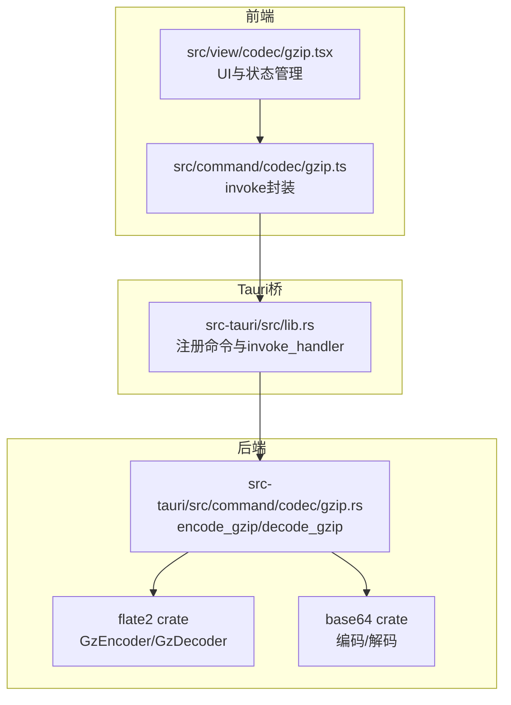
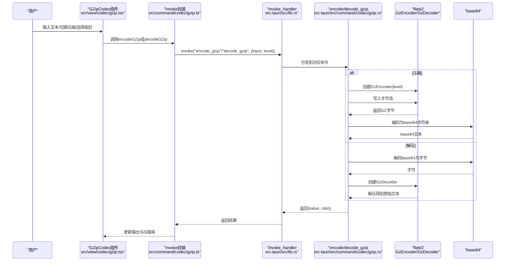
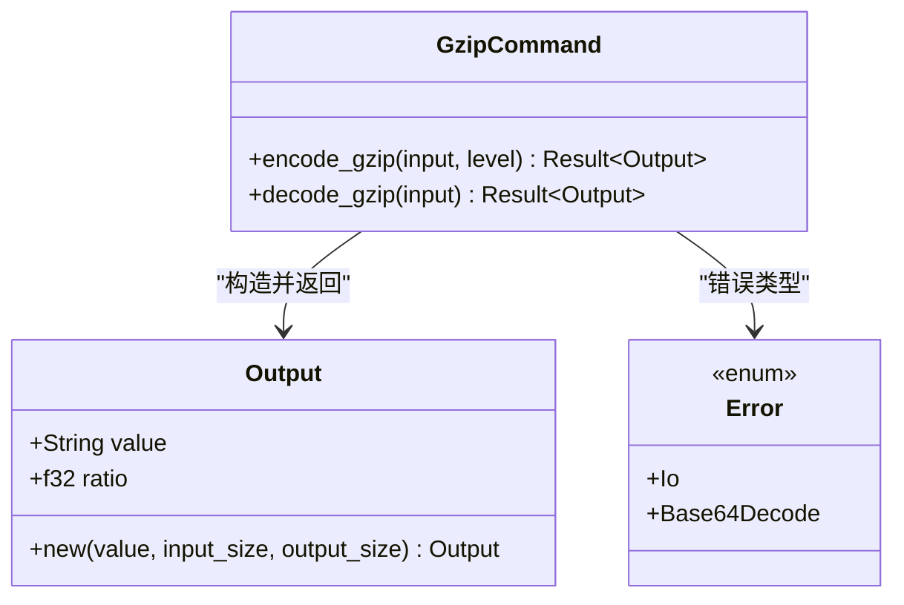
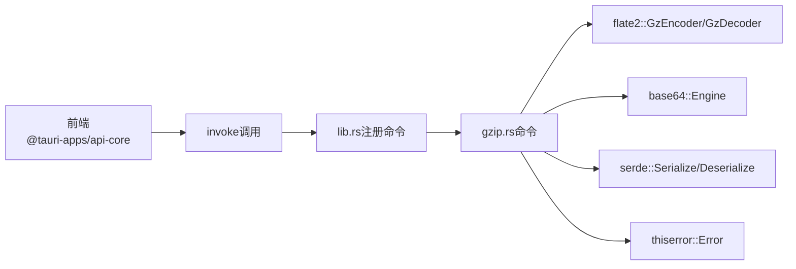

# GZip压缩解压

<cite>
**本文引用的文件**
- [src/view/codec/gzip.tsx](file://src/view/codec/gzip.tsx)
- [src/command/codec/gzip.ts](file://src/command/codec/gzip.ts)
- [src-tauri/src/command/codec/gzip.rs](file://src-tauri/src/command/codec/gzip.rs)
- [src-tauri/src/lib.rs](file://src-tauri/src/lib.rs)
- [src-tauri/src/error.rs](file://src-tauri/src/error.rs)
- [src-tauri/Cargo.toml](file://src-tauri/Cargo.toml)
</cite>

## 目录
1. [简介](#简介)
2. [项目结构](#项目结构)
3. [核心组件](#核心组件)
4. [架构总览](#架构总览)
5. [详细组件分析](#详细组件分析)
6. [依赖关系分析](#依赖关系分析)
7. [性能与压缩率](#性能与压缩率)
8. [故障排查指南](#故障排查指南)
9. [结论](#结论)
10. [附录](#附录)

## 简介
本文件系统性阐述 GZip 压缩解压功能在本项目中的实现与使用方法，覆盖从前端 UI 组件到 Tauri 桥接再到 Rust 后端的完整链路。文档重点包括：
- 前端 SolidJS 组件如何通过 Tauri Bridge 调用后端命令
- Rust 后端使用 flate2 crate 实现高效压缩与解压
- GZip/DEFLATE 算法基础与压缩级别配置
- 使用场景、API 接口说明、压缩率计算与性能考量
- 从文本输入到压缩输出或从压缩数据到解压文本的完整流程
- 不同压缩级别对性能与压缩率的影响
- 初学者操作指南与高级用户的大文件处理最佳实践

## 项目结构
该功能由三层组成：前端视图层、前端命令层、后端命令层。前端通过 Tauri 的 invoke 机制调用后端命令，后端使用 flate2 提供的 GZip 编码器/解码器完成压缩与解压，并通过 base64 对二进制结果进行文本化传输。

图表来源
- [src/view/codec/gzip.tsx](file://src/view/codec/gzip.tsx#L1-L129)
- [src/command/codec/gzip.ts](file://src/command/codec/gzip.ts#L1-L18)
- [src-tauri/src/lib.rs](file://src-tauri/src/lib.rs#L1-L57)
- [src-tauri/src/command/codec/gzip.rs](file://src-tauri/src/command/codec/gzip.rs#L1-L48)

章节来源
- [src/view/codec/gzip.tsx](file://src/view/codec/gzip.tsx#L1-L129)
- [src/command/codec/gzip.ts](file://src/command/codec/gzip.ts#L1-L18)
- [src-tauri/src/lib.rs](file://src-tauri/src/lib.rs#L1-L57)

## 核心组件
- 前端视图组件：负责用户交互、压缩级别选择、输入输出编辑器、复制与保存按钮、压缩率显示。
- 前端命令封装：通过 Tauri invoke 调用后端命令，返回包含压缩/解压结果与压缩率的对象。
- 后端命令：实现 encode_gzip/decode_gzip，内部使用 flate2 的 GZip 编码器/解码器与 base64 进行二进制到文本的转换。
- 错误处理宏：统一序列化错误消息，便于前端捕获与展示。

章节来源
- [src/view/codec/gzip.tsx](file://src/view/codec/gzip.tsx#L1-L129)
- [src/command/codec/gzip.ts](file://src/command/codec/gzip.ts#L1-L18)
- [src-tauri/src/command/codec/gzip.rs](file://src-tauri/src/command/codec/gzip.rs#L1-L48)
- [src-tauri/src/error.rs](file://src-tauri/src/error.rs#L1-L31)

## 架构总览
下图展示了从前端到后端的调用序列，以及关键数据流（字符串输入、二进制中间态、base64 文本）。

图表来源
- [src/view/codec/gzip.tsx](file://src/view/codec/gzip.tsx#L1-L129)
- [src/command/codec/gzip.ts](file://src/command/codec/gzip.ts#L1-L18)
- [src-tauri/src/lib.rs](file://src-tauri/src/lib.rs#L1-L57)
- [src-tauri/src/command/codec/gzip.rs](file://src-tauri/src/command/codec/gzip.rs#L1-L48)

## 详细组件分析

### 前端视图组件（GZipCodec）
- 状态管理：包含输入文本、输出文本、是否压缩模式、压缩级别、压缩率等信号。
- 交互逻辑：
  - 切换压缩/解压模式时重置输入输出。
  - 当输入非空时，根据当前模式调用 encodeGZip 或 decodeGZip，并更新输出与压缩率。
  - 压缩级别选项范围为 1..9，中文提示“最快/最好”。
- UI 组成：配置卡片（模式开关、压缩级别）、输入编辑器、输出编辑器、复制/保存按钮、压缩率展示。

章节来源
- [src/view/codec/gzip.tsx](file://src/view/codec/gzip.tsx#L1-L129)

### 前端命令封装（invoke 封装）
- 提供 encodeGZip(input, level) 与 decodeGZip(input, level) 两个函数，分别映射到后端命令。
- 返回 Promise，包含 value（结果文本）与 ratio（压缩率）字段。

章节来源
- [src/command/codec/gzip.ts](file://src/command/codec/gzip.ts#L1-L18)

### 后端命令（encode_gzip/decode_gzip）
- 数据结构 Output：包含 value 与 ratio，ratio 由输入长度与输出长度计算。
- 压缩流程：
  - 使用 flate2::write::GzEncoder，按传入 level 初始化压缩等级。
  - 将输入字符串转为字节写入编码器，finish 后得到 GZip 字节。
  - 使用 base64::Engine 对字节进行标准编码，作为最终 value。
  - 计算 ratio 并返回。
- 解压流程：
  - 先对输入的 base64 文本进行解码，得到字节。
  - 使用 flate2::read::GzDecoder 读取字节流，解压为字符串。
  - 计算 ratio 并返回。
- 错误处理：
  - 定义 Error 枚举，包含 Io 与 Base64Decode 两种错误类型，统一序列化为字符串，便于前端捕获。

章节来源
- [src-tauri/src/command/codec/gzip.rs](file://src-tauri/src/command/codec/gzip.rs#L1-L48)
- [src-tauri/src/error.rs](file://src-tauri/src/error.rs#L1-L31)

### Tauri 命令注册
- 在 lib.rs 中通过 generate_handler! 注册了 encode_gzip 与 decode_gzip，使前端可通过 invoke 调用。

章节来源
- [src-tauri/src/lib.rs](file://src-tauri/src/lib.rs#L1-L57)

### 类关系图（代码级）

图表来源
- [src-tauri/src/command/codec/gzip.rs](file://src-tauri/src/command/codec/gzip.rs#L1-L48)
- [src-tauri/src/error.rs](file://src-tauri/src/error.rs#L1-L31)

## 依赖关系分析
- 前端依赖：
  - @tauri-apps/api/core：用于 invoke 调用后端命令。
- 后端依赖：
  - flate2：提供 GZip 编码器/解码器。
  - base64：提供标准 base64 编码/解码。
  - serde：用于结构体序列化。
  - thiserror：用于错误定义与派生。
- Cargo.toml 中声明了上述依赖及版本。

图表来源
- [src-tauri/src/lib.rs](file://src-tauri/src/lib.rs#L1-L57)
- [src-tauri/src/command/codec/gzip.rs](file://src-tauri/src/command/codec/gzip.rs#L1-L48)
- [src-tauri/Cargo.toml](file://src-tauri/Cargo.toml#L1-L69)

章节来源
- [src-tauri/Cargo.toml](file://src-tauri/Cargo.toml#L1-L69)
- [src-tauri/src/command/codec/gzip.rs](file://src-tauri/src/command/codec/gzip.rs#L1-L48)

## 性能与压缩率

### 算法与原理
- GZip 是基于 DEFLATE 算法的文件格式封装，广泛用于网络传输与存储压缩。
- DEFLATE 结合了 LZ77（滑动窗口匹配）与 Huffman 编码，先进行重复模式匹配，再对剩余符号进行熵编码。
- GZip 在 DEFLATE 基础上添加了头部、校验与多记录结构，便于跨平台兼容与完整性校验。

### 压缩级别与权衡
- 压缩级别 1..9：级别越高，压缩比通常越好，但 CPU 开销与时间成本越高；级别越低，速度越快，压缩比越差。
- 本实现中，前端提供 1..9 的级别选择，后端直接透传给 flate2 的 Compression::new(level)。

### 压缩率计算
- 后端在返回前计算 ratio = (input_len - output_len) / input_len。
- 前端展示百分比形式，便于直观比较。

### 性能考量
- 前端：避免在输入频繁变化时触发大量请求，当前实现已通过 effect 控制输入为空时不处理。
- 后端：对于超大文本，建议分块处理或采用流式 API（当前实现为一次性内存处理），以减少峰值内存占用。
- 序列化：base64 会增加约 33% 的体积，适合文本传输；若在本地高频处理，可考虑二进制通道或自定义协议以降低开销。

### 大文件处理最佳实践
- 分块压缩/解压：将长文本切分为固定大小的块，逐块压缩/解压，边处理边输出。
- 流式处理：使用 flate2 的流式接口，避免一次性加载全部数据到内存。
- 选择合适级别：默认 6 通常在压缩率与性能间取得平衡；对实时性敏感场景可降级至 1..3；对存储空间敏感场景可提升至 8..9。
- 错误恢复：对异常输入（如非法 base64 或损坏的 GZip 数据）进行捕获与提示，避免崩溃。

章节来源
- [src-tauri/src/command/codec/gzip.rs](file://src-tauri/src/command/codec/gzip.rs#L1-L48)
- [src/view/codec/gzip.tsx](file://src/view/codec/gzip.tsx#L1-L129)

## 故障排查指南
- 前端报错显示为字符串：后端通过 command_error 宏将错误统一序列化为字符串，前端在 then.catch 分支中将其设置为输出文本，便于用户查看。
- 常见错误类型：
  - IO 错误：底层读写失败，检查输入路径或权限（虽然本功能针对字符串输入，仍可能因外部资源引发）。
  - Base64 解码错误：输入不是合法的 base64 文本，检查是否被篡改或截断。
- 排查步骤：
  - 确认前端输入是否为空或格式正确。
  - 检查 invoke 是否成功返回，观察 ratio 是否为 0（表示未处理）。
  - 若出现错误，查看输出文本中的错误信息，定位是 IO 还是 Base64 解码问题。

章节来源
- [src-tauri/src/error.rs](file://src-tauri/src/error.rs#L1-L31)
- [src-tauri/src/command/codec/gzip.rs](file://src-tauri/src/command/codec/gzip.rs#L1-L48)
- [src/command/codec/gzip.ts](file://src/command/codec/gzip.ts#L1-L18)
- [src/view/codec/gzip.tsx](file://src/view/codec/gzip.tsx#L1-L129)

## 结论
本功能通过清晰的三层架构实现了 GZip 压缩与解压：前端负责交互与状态，Tauri 桥接负责命令分发，后端使用 flate2 与 base64 完成高效压缩与文本化传输。通过压缩级别调节可在压缩率与性能之间灵活权衡；结合分块与流式处理策略，可进一步优化大文件场景下的表现。错误处理机制保证了用户体验与稳定性。

## 附录

### API 接口说明
- 前端调用
  - encodeGZip(input: string, level: number): Promise<{ value: string; ratio: number }>
  - decodeGZip(input: string, level: number): Promise<{ value: string; ratio: number }>
- 后端命令
  - encode_gzip(input: &str, level: u32) -> Result<Output, Error>
  - decode_gzip(input: &str) -> Result<Output, Error>
- 返回结构
  - Output: { value: string, ratio: number }

章节来源
- [src/command/codec/gzip.ts](file://src/command/codec/gzip.ts#L1-L18)
- [src-tauri/src/command/codec/gzip.rs](file://src-tauri/src/command/codec/gzip.rs#L1-L48)

### 使用场景
- 数据传输优化：在网络带宽受限时压缩 JSON、日志、配置等文本数据。
- 存储节省：对日志文件、备份数据进行压缩归档。
- 跨平台兼容：GZip 格式通用性强，便于在不同系统间传输。

### 实操流程示例（无代码片段）
- 压缩流程
  1) 在前端输入框中粘贴待压缩文本。
  2) 选择压缩级别（1..9）。
  3) 点击“压缩”，等待完成后在输出框查看 base64 文本与压缩率。
- 解压流程
  1) 在前端输入框粘贴 GZip 的 base64 文本。
  2) 切换到“解压”模式。
  3) 点击“解压”，等待完成后在输出框查看原始文本与压缩率。

### 算法与参数调优建议
- 初学者建议：默认级别 6，兼顾速度与压缩率。
- 高级用户建议：根据业务特征调整级别；对重复度高的文本可尝试更高级别；对实时性要求高的场景优先选择较低级别。
- 大文件建议：采用分块与流式处理，避免一次性内存压力过大。