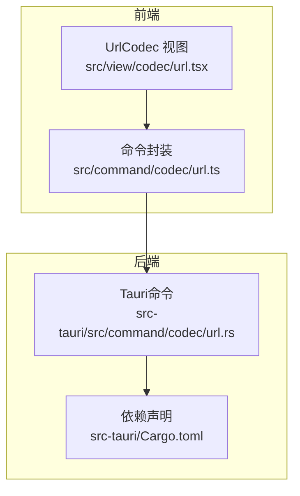
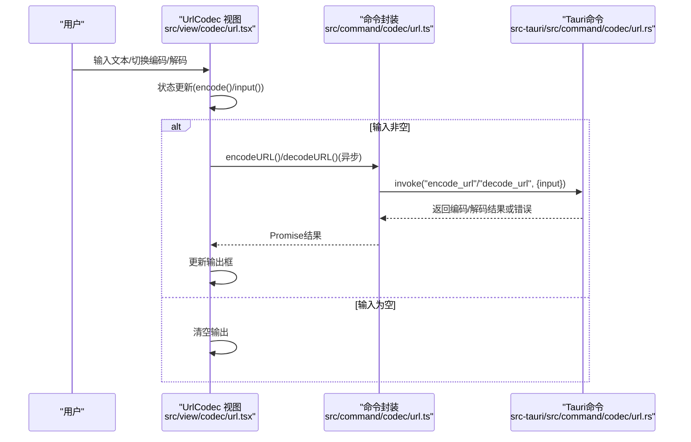
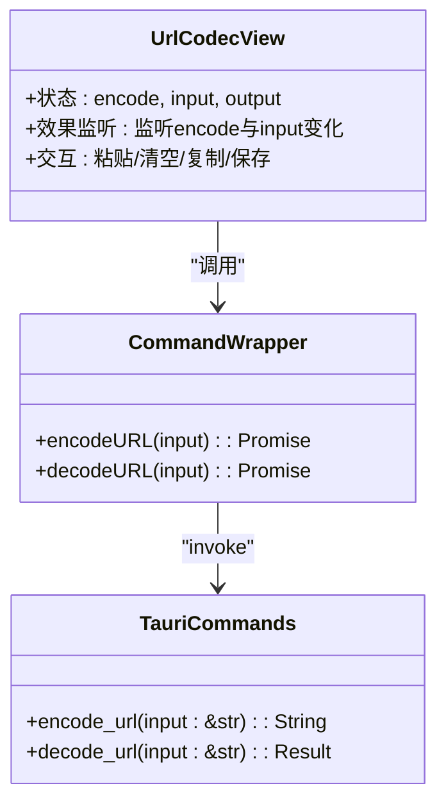
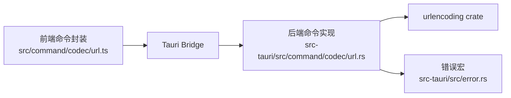
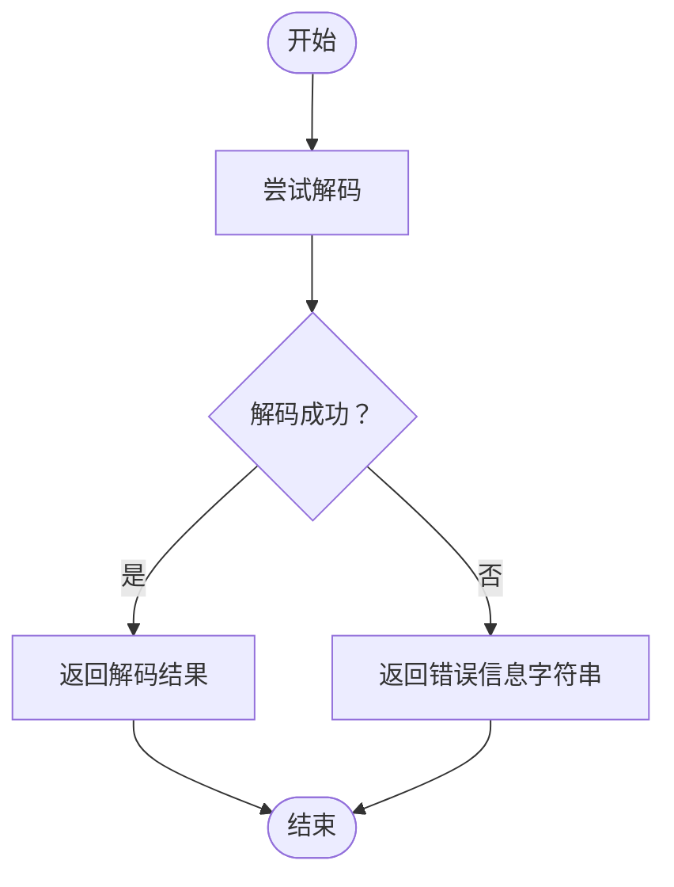

# URL编解码

<cite>
**本文引用的文件**
- [src/view/codec/url.tsx](file://src/view/codec/url.tsx)
- [src/command/codec/url.ts](file://src/command/codec/url.ts)
- [src-tauri/src/command/codec/url.rs](file://src-tauri/src/command/codec/url.rs)
- [src-tauri/Cargo.toml](file://src-tauri/Cargo.toml)
- [src-tauri/src/error.rs](file://src-tauri/src/error.rs)
- [README.md](file://README.md)
</cite>

## 目录
1. [简介](#简介)
2. [项目结构](#项目结构)
3. [核心组件](#核心组件)
4. [架构总览](#架构总览)
5. [详细组件分析](#详细组件分析)
6. [依赖关系分析](#依赖关系分析)
7. [性能考量](#性能考量)
8. [故障排查指南](#故障排查指南)
9. [结论](#结论)
10. [附录](#附录)

## 简介
本文件围绕“URL编解码”功能展开，系统性阐述从前端UI到后端Rust命令的完整实现路径，覆盖RFC 3986编码规范、特殊字符处理、百分号编码机制、国际化域名（IDN）支持、使用场景、API接口说明、安全考虑与常见陷阱，并给出从原始字符串到URL编码字符串、以及从编码字符串还原为原始文本的完整转换流程说明。同时，结合现有代码实现，解释前端通过Tauri Bridge调用后端命令的方式，以及后端如何利用urlencoding crate实现标准兼容的编解码。

## 项目结构
URL编解码功能位于“编解码工具”模块中，采用前后端分层设计：
- 前端视图层：负责用户交互、输入输出展示与按钮操作（复制、粘贴、清空、保存等）
- 前端命令层：封装Tauri invoke调用，暴露encodeURL/decodeURL方法
- 后端命令层：提供Tauri命令函数，委托urlencoding crate执行编码/解码
- 依赖声明：在Cargo.toml中引入urlencoding crate

图表来源
- [src/view/codec/url.tsx](file://src/view/codec/url.tsx#L1-L83)
- [src/command/codec/url.ts](file://src/command/codec/url.ts#L1-L12)
- [src-tauri/src/command/codec/url.rs](file://src-tauri/src/command/codec/url.rs#L1-L18)
- [src-tauri/Cargo.toml](file://src-tauri/Cargo.toml#L1-L69)

章节来源
- [README.md](file://README.md#L16-L22)
- [src/view/codec/url.tsx](file://src/view/codec/url.tsx#L1-L83)
- [src/command/codec/url.ts](file://src/command/codec/url.ts#L1-L12)
- [src-tauri/src/command/codec/url.rs](file://src-tauri/src/command/codec/url.rs#L1-L18)
- [src-tauri/Cargo.toml](file://src-tauri/Cargo.toml#L1-L69)

## 核心组件
- 前端视图组件：提供“编码/解码”切换、输入编辑器、输出只读编辑器、剪贴板与保存按钮等交互元素；当输入变化时，根据当前模式自动触发编码或解码逻辑，并将结果回显到输出框。
- 前端命令封装：通过invoke桥接调用后端Tauri命令，分别暴露encodeURL与decodeURL两个异步方法，返回字符串结果。
- 后端命令实现：定义两个Tauri命令函数，分别委托urlencoding crate完成编码与解码；解码失败时返回统一错误类型。
- 错误处理宏：提供command_error!宏，用于生成可序列化的错误枚举，便于跨语言传递。

章节来源
- [src/view/codec/url.tsx](file://src/view/codec/url.tsx#L1-L83)
- [src/command/codec/url.ts](file://src/command/codec/url.ts#L1-L12)
- [src-tauri/src/command/codec/url.rs](file://src-tauri/src/command/codec/url.rs#L1-L18)
- [src-tauri/src/error.rs](file://src-tauri/src/error.rs#L1-L31)

## 架构总览
下图展示了从用户输入到最终输出的端到端调用链路，包括前端状态变更、命令调用、后端处理与错误传播。

图表来源
- [src/view/codec/url.tsx](file://src/view/codec/url.tsx#L1-L83)
- [src/command/codec/url.ts](file://src/command/codec/url.ts#L1-L12)
- [src-tauri/src/command/codec/url.rs](file://src-tauri/src/command/codec/url.rs#L1-L18)

## 详细组件分析

### 前端视图组件（UrlCodec）
- 状态管理
  - encode：布尔信号，控制当前是“编码”还是“解码”
  - input/output：字符串信号，分别承载输入与输出
- 效果监听
  - 当encode切换时，重置输入与输出
  - 当input变化且非空时，根据encode状态调用对应命令，将结果写入output；若发生异常，将错误信息字符串写入output
- UI交互
  - 提供“粘贴”“清空”“复制”“保存”等常用按钮
  - 输入/输出区域使用编辑器组件，输入支持多行文本，输出为只读

章节来源
- [src/view/codec/url.tsx](file://src/view/codec/url.tsx#L1-L83)

### 前端命令封装（invoke桥接）
- encodeURL(input)：通过invoke调用后端命令“encode_url”，传入input对象，返回Promise<string>
- decodeURL(input)：通过invoke调用后端命令“decode_url”，传入input对象，返回Promise<string>
- 两者均以异步方式工作，便于与UI状态联动

章节来源
- [src/command/codec/url.ts](file://src/command/codec/url.ts#L1-L12)

### 后端命令实现（Tauri命令）
- encode_url(input: &str) -> String
  - 使用urlencoding::encode对输入字符串进行编码，返回Owned String
- decode_url(input: &str) -> Result<String, Error>
  - 使用urlencoding::decode对输入字符串进行解码，成功时返回Owned String，失败时返回Error
- 错误类型
  - 通过command_error!宏定义的Error枚举，包含Utf8等错误变体，支持序列化以便跨语言传递

章节来源
- [src-tauri/src/command/codec/url.rs](file://src-tauri/src/command/codec/url.rs#L1-L18)
- [src-tauri/src/error.rs](file://src-tauri/src/error.rs#L1-L31)

### 依赖与外部库
- urlencoding crate：提供标准的百分号编码/解码能力，遵循RFC 3986语义
- Cargo.toml中声明依赖版本，确保编解码行为一致

章节来源
- [src-tauri/Cargo.toml](file://src-tauri/Cargo.toml#L1-L69)
- [src-tauri/src/command/codec/url.rs](file://src-tauri/src/command/codec/url.rs#L1-L18)

### 类关系与命令签名

图表来源
- [src/view/codec/url.tsx](file://src/view/codec/url.tsx#L1-L83)
- [src/command/codec/url.ts](file://src/command/codec/url.ts#L1-L12)
- [src-tauri/src/command/codec/url.rs](file://src-tauri/src/command/codec/url.rs#L1-L18)

## 依赖关系分析
- 前端依赖
  - @tauri-apps/api/core：提供invoke桥接能力
  - SolidJS：响应式状态与组件渲染
- 后端依赖
  - tauri：提供命令注册与桥接
  - urlencoding：提供RFC 3986兼容的编码/解码
  - thiserror：错误类型派生与序列化
- 前后端耦合点
  - 命令名称固定（encode_url/decode_url），参数与返回值均为字符串
  - 错误通过Error枚举统一序列化，便于前端捕获与展示

图表来源
- [src/command/codec/url.ts](file://src/command/codec/url.ts#L1-L12)
- [src-tauri/src/command/codec/url.rs](file://src-tauri/src/command/codec/url.rs#L1-L18)
- [src-tauri/src/error.rs](file://src-tauri/src/error.rs#L1-L31)

章节来源
- [src/command/codec/url.ts](file://src/command/codec/url.ts#L1-L12)
- [src-tauri/src/command/codec/url.rs](file://src-tauri/src/command/codec/url.rs#L1-L18)
- [src-tauri/src/error.rs](file://src-tauri/src/error.rs#L1-L31)

## 性能考量
- 字符串处理复杂度
  - 编码/解码为线性时间复杂度O(n)，其中n为输入字符串长度
  - urlencoding crate内部按字节扫描与转义，避免不必要的内存分配
- 异步调用
  - 前端通过Promise异步调用，避免阻塞UI线程
- 内存与GC
  - 后端返回Owned String，前端接收后作为不可变状态使用，减少重复拷贝
- I/O与插件
  - 本功能不涉及文件系统或网络I/O，性能瓶颈主要集中在字符串处理

[本节为通用性能讨论，无需列出具体文件来源]

## 故障排查指南
- 解码失败
  - 现象：decodeURL返回错误字符串
  - 可能原因：输入不是合法的百分号编码字符串、包含非法百分号序列、编码格式不匹配
  - 排查建议：确认输入是否为encodeURL的输出；检查是否存在未闭合的%或无效十六进制字符
- 编码异常
  - 现象：前端未显示输出或显示错误信息
  - 可能原因：命令调用失败、网络/权限问题（极少见于本地命令）
  - 排查建议：查看前端日志；确认命令名称与参数一致；检查后端错误宏是否被触发
- 错误传播
  - 后端Error枚举支持序列化，前端可通过输出框看到错误字符串提示
  - 若需更详细的错误信息，可在前端增加错误边界组件或日志记录

章节来源
- [src-tauri/src/command/codec/url.rs](file://src-tauri/src/command/codec/url.rs#L1-L18)
- [src-tauri/src/error.rs](file://src-tauri/src/error.rs#L1-L31)
- [src/view/codec/url.tsx](file://src/view/codec/url.tsx#L1-L83)

## 结论
本功能以简洁清晰的三层架构实现：前端视图负责交互与状态，命令封装负责桥接调用，后端命令委托urlencoding crate完成标准兼容的RFC 3986编解码。整体流程直观、易于扩展，适合在表单数据提交、API参数处理等场景中使用。对于国际化域名（IDN）与复杂查询参数，当前实现依赖urlencoding crate的标准行为；若需要更细粒度的控制，可在命令层增加参数化选项并通过invoke传递给后端。

[本节为总结性内容，无需列出具体文件来源]

## 附录

### RFC 3986与百分号编码要点
- 字符集与保留字符
  - 仅字母数字与部分特殊字符在URL中无需编码；其他字符需进行百分号编码
  - 常见保留字符包括：: / ? # [ ] @ ! $ & ' ( ) * + , ; = 等
- 百分号编码规则
  - 将每个非允许字符转换为其UTF-8字节序列，然后对每个字节以%HH形式编码
  - H为十六进制字符，大写
- 片段标识符与查询参数
  - 片段标识符（#）通常不在传输中发送，但若需要包含，应进行编码
  - 查询参数键值对中的分隔符（&、=）与空格等也应编码
- 国际化域名（IDN）
  - IDN在传输前通常先进行Punycode编码（如xn--），再进行百分号编码
  - 本实现依赖urlencoding crate，其遵循RFC 3986语义，对UTF-8字节序列进行编码

[本节为概念性说明，无需列出具体文件来源]

### 使用场景与最佳实践
- 表单数据提交
  - 对查询字符串或表单字段值进行编码，避免特殊字符破坏URL结构
- API参数处理
  - 在构造请求URL时，对所有动态参数进行编码；避免手动拼接导致的错误
- 安全考虑
  - 不要对已编码的字符串再次编码，避免重复编码
  - 对来自不受信任来源的数据，先解码再进行二次处理，最后重新编码
  - 注意避免注入攻击（如将HTML/脚本字符编码后再嵌入URL）

[本节为通用指导，无需列出具体文件来源]

### API接口说明
- 前端命令
  - encodeURL(input: string): Promise<string>
  - decodeURL(input: string): Promise<string>
- 后端命令
  - encode_url(input: &str) -> String
  - decode_url(input: &str) -> Result<String, Error>
- 参数与返回
  - 输入：字符串
  - 输出：字符串；解码失败时返回错误枚举（可序列化）

章节来源
- [src/command/codec/url.ts](file://src/command/codec/url.ts#L1-L12)
- [src-tauri/src/command/codec/url.rs](file://src-tauri/src/command/codec/url.rs#L1-L18)
- [src-tauri/src/error.rs](file://src-tauri/src/error.rs#L1-L31)

### 完整转换流程（示例路径）
- 从原始字符串到URL编码字符串
  - 输入：原始字符串
  - 前端：调用encodeURL
  - 桥接：invoke("encode_url", { input })
  - 后端：urlencoding::encode
  - 输出：编码后的字符串
- 从URL编码字符串到原始文本
  - 输入：编码后的字符串
  - 前端：调用decodeURL
  - 桥接：invoke("decode_url", { input })
  - 后端：urlencoding::decode
  - 输出：原始字符串或错误信息

章节来源
- [src/view/codec/url.tsx](file://src/view/codec/url.tsx#L1-L83)
- [src/command/codec/url.ts](file://src/command/codec/url.ts#L1-L12)
- [src-tauri/src/command/codec/url.rs](file://src-tauri/src/command/codec/url.rs#L1-L18)

### 错误处理流程

图表来源
- [src-tauri/src/command/codec/url.rs](file://src-tauri/src/command/codec/url.rs#L1-L18)
- [src-tauri/src/error.rs](file://src-tauri/src/error.rs#L1-L31)