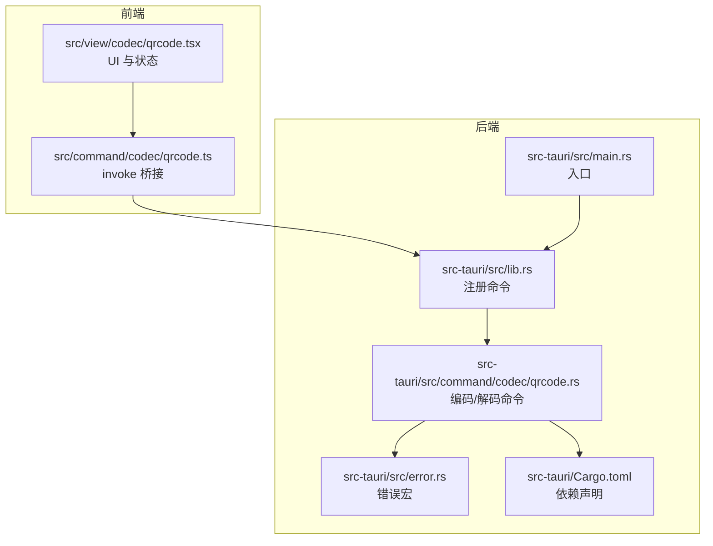
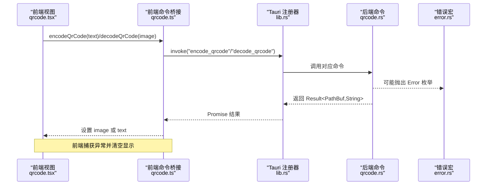
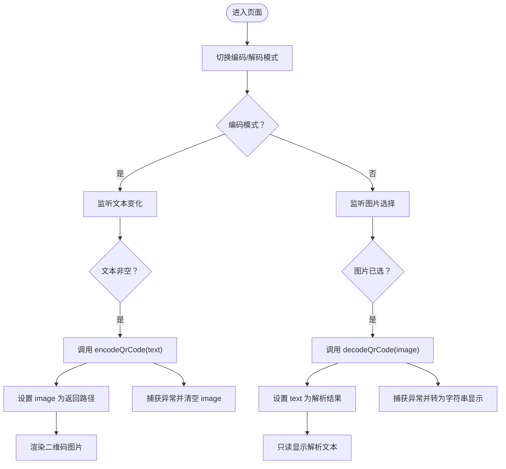
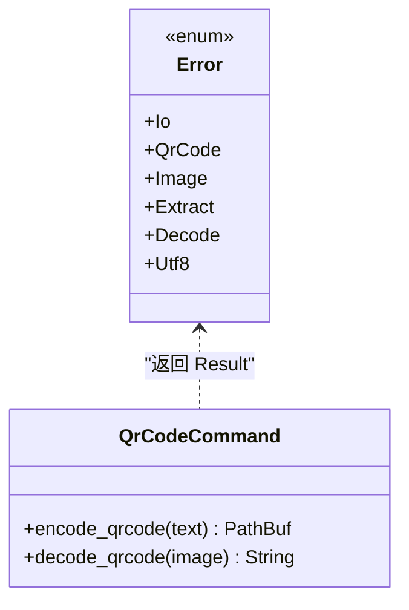
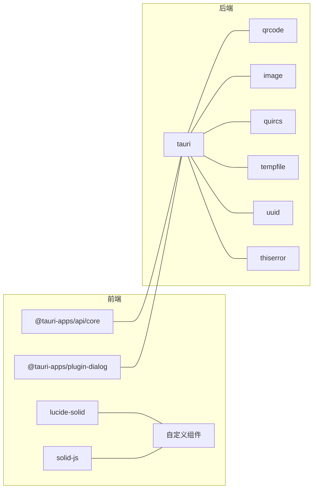

# 二维码生成解析

<cite>
**本文引用的文件**
- [src/view/codec/qrcode.tsx](file://src/view/codec/qrcode.tsx)
- [src/command/codec/qrcode.ts](file://src/command/codec/qrcode.ts)
- [src-tauri/src/command/codec/qrcode.rs](file://src-tauri/src/command/codec/qrcode.rs)
- [src-tauri/src/lib.rs](file://src-tauri/src/lib.rs)
- [src-tauri/src/main.rs](file://src-tauri/src/main.rs)
- [src-tauri/src/error.rs](file://src-tauri/src/error.rs)
- [src-tauri/Cargo.toml](file://src-tauri/Cargo.toml)
</cite>

## 目录
1. [简介](#简介)
2. [项目结构](#项目结构)
3. [核心组件](#核心组件)
4. [架构总览](#架构总览)
5. [详细组件分析](#详细组件分析)
6. [依赖关系分析](#依赖关系分析)
7. [性能考量](#性能考量)
8. [故障排查指南](#故障排查指南)
9. [结论](#结论)
10. [附录](#附录)

## 简介
本文件围绕“二维码生成解析”功能进行系统化技术文档梳理，覆盖从前端 UI 组件到后端 Rust 命令的完整链路。重点说明：
- 前端 SolidJS 组件如何通过 Tauri Bridge 调用后端命令；
- 后端 Rust 使用 qrcode 与 quircs 实现高效生成与解析；
- 错误处理机制与跨语言边界异常传播；
- 图像导出与解析流程、常见问题与优化建议；
- 初学者与高级用户的使用与定制指南。

## 项目结构
该功能位于“编解码”子模块下，采用“前端视图 + 前端命令桥接 + 后端命令”的分层设计：
- 前端视图：负责用户交互与状态管理；
- 前端命令桥接：封装 invoke 调用，暴露 encode_qrcode/decode_qrcode；
- 后端命令：实现二维码生成与解析逻辑，返回临时文件路径或字符串结果。

图表来源
- [src/view/codec/qrcode.tsx](file://src/view/codec/qrcode.tsx#L1-L145)
- [src/command/codec/qrcode.ts](file://src/command/codec/qrcode.ts#L1-L12)
- [src-tauri/src/lib.rs](file://src-tauri/src/lib.rs#L1-L57)
- [src-tauri/src/main.rs](file://src-tauri/src/main.rs#L1-L7)
- [src-tauri/src/error.rs](file://src-tauri/src/error.rs#L1-L31)
- [src-tauri/src/command/codec/qrcode.rs](file://src-tauri/src/command/codec/qrcode.rs#L1-L40)
- [src-tauri/Cargo.toml](file://src-tauri/Cargo.toml#L1-L69)

章节来源
- [src/view/codec/qrcode.tsx](file://src/view/codec/qrcode.tsx#L1-L145)
- [src/command/codec/qrcode.ts](file://src/command/codec/qrcode.ts#L1-L12)
- [src-tauri/src/lib.rs](file://src-tauri/src/lib.rs#L1-L57)
- [src-tauri/src/main.rs](file://src-tauri/src/main.rs#L1-L7)
- [src-tauri/src/error.rs](file://src-tauri/src/error.rs#L1-L31)
- [src-tauri/src/command/codec/qrcode.rs](file://src-tauri/src/command/codec/qrcode.rs#L1-L40)
- [src-tauri/Cargo.toml](file://src-tauri/Cargo.toml#L1-L69)

## 核心组件
- 前端视图组件：负责切换“编码/解码”模式、编辑文本、选择图片、显示二维码、保存与打开文件等交互。
- 前端命令桥接：封装 invoke 调用 encode_qrcode 与 decode_qrcode，返回临时文件路径或解析文本。
- 后端命令：编码命令生成 PNG 文件并返回临时路径；解码命令读取本地图片路径，调用 quircs 解析二维码内容。
- 错误处理：统一通过 command_error 宏定义错误类型，序列化为字符串传递给前端。

章节来源
- [src/view/codec/qrcode.tsx](file://src/view/codec/qrcode.tsx#L1-L145)
- [src/command/codec/qrcode.ts](file://src/command/codec/qrcode.ts#L1-L12)
- [src-tauri/src/command/codec/qrcode.rs](file://src-tauri/src/command/codec/qrcode.rs#L1-L40)
- [src-tauri/src/error.rs](file://src-tauri/src/error.rs#L1-L31)

## 架构总览
前端通过 Tauri Bridge 调用后端命令，后端命令使用 qrcode 生成 PNG，使用 quircs 解析二维码。错误在两端之间以字符串形式传播，便于前端统一提示。

图表来源
- [src/view/codec/qrcode.tsx](file://src/view/codec/qrcode.tsx#L1-L145)
- [src/command/codec/qrcode.ts](file://src/command/codec/qrcode.ts#L1-L12)
- [src-tauri/src/lib.rs](file://src-tauri/src/lib.rs#L1-L57)
- [src-tauri/src/command/codec/qrcode.rs](file://src-tauri/src/command/codec/qrcode.rs#L1-L40)
- [src-tauri/src/error.rs](file://src-tauri/src/error.rs#L1-L31)

## 详细组件分析

### 前端视图组件（二维码）
- 功能要点
  - 切换“编码/解码”模式；
  - 编码模式下编辑文本并触发生成二维码；
  - 解码模式下选择图片并触发解析；
  - 显示二维码图片、保存二维码、打开文件；
  - 异常时清空显示或回显错误字符串。
- 关键交互
  - encodeQrCode(text) 返回临时文件路径；
  - decodeQrCode(image) 返回解析文本；
  - 保存二维码通过对话框选择目录并复制临时文件。

图表来源
- [src/view/codec/qrcode.tsx](file://src/view/codec/qrcode.tsx#L1-L145)

章节来源
- [src/view/codec/qrcode.tsx](file://src/view/codec/qrcode.tsx#L1-L145)

### 前端命令桥接（invoke 封装）
- 提供 encodeQrCode(text) 与 decodeQrCode(image) 两个异步函数；
- 通过 invoke 调用后端命名命令；
- 返回值类型分别为字符串（文件路径）与字符串（解析文本）。

章节来源
- [src/command/codec/qrcode.ts](file://src/command/codec/qrcode.ts#L1-L12)

### 后端命令（二维码生成与解析）
- 生成命令
  - 使用 qrcode crate 创建二维码；
  - 渲染为灰度图像并保存为 PNG；
  - 返回临时文件路径。
- 解码命令
  - 读取本地图片并转为灰度；
  - 使用 quircs 识别并解码；
  - 拼接所有码字节为 UTF-8 字符串返回。
- 错误处理
  - 统一通过 command_error 宏定义错误枚举；
  - 包含 IO、qrcode、image、quircs 提取/解码、UTF8 等错误类型；
  - 序列化为字符串传递给前端。

图表来源
- [src-tauri/src/command/codec/qrcode.rs](file://src-tauri/src/command/codec/qrcode.rs#L1-L40)
- [src-tauri/src/error.rs](file://src-tauri/src/error.rs#L1-L31)

章节来源
- [src-tauri/src/command/codec/qrcode.rs](file://src-tauri/src/command/codec/qrcode.rs#L1-L40)
- [src-tauri/src/error.rs](file://src-tauri/src/error.rs#L1-L31)

### Tauri 注册与入口
- lib.rs 中注册了所有命令，包括二维码生成与解析；
- main.rs 作为应用入口，调用 lib.rs::run 启动应用。

章节来源
- [src-tauri/src/lib.rs](file://src-tauri/src/lib.rs#L1-L57)
- [src-tauri/src/main.rs](file://src-tauri/src/main.rs#L1-L7)

## 依赖关系分析
- 前端依赖
  - @tauri-apps/api/core：invoke、convertFileSrc；
  - @tauri-apps/plugin-dialog：文件对话框；
  - lucide-solid：图标；
  - solid-js：响应式状态与生命周期；
  - 自定义按钮与容器组件。
- 后端依赖
  - qrcode：生成二维码；
  - image：图像读写与格式；
  - quircs：二维码识别与解码；
  - tempfile：临时目录；
  - uuid：生成临时文件名；
  - tauri：命令注册与运行时；
  - thiserror：错误派生。

图表来源
- [src-tauri/Cargo.toml](file://src-tauri/Cargo.toml#L1-L69)

章节来源
- [src-tauri/Cargo.toml](file://src-tauri/Cargo.toml#L1-L69)

## 性能考量
- 生成性能
  - qrcode crate 默认生成 PNG，无需额外压缩，适合桌面应用快速预览；
  - 若需更高密度或更小体积，可考虑调整渲染参数（如像素尺寸），但当前实现未暴露配置项。
- 解码性能
  - quircs 为 C 实现的识别库，识别速度快；
  - 解码流程对灰度图处理，避免颜色通道开销；
  - 多码拼接会增加循环与字符串拼接成本，建议尽量单码输入。
- I/O 与内存
  - 生成与解码均使用临时文件，避免大对象在 IPC 间传递；
  - 前端通过 convertFileSrc 访问本地文件，减少数据拷贝。
- 建议
  - 对超长文本建议分段生成多个二维码；
  - 解码前确保图片清晰、无遮挡、对比度良好；
  - 在高并发场景下，限制同时生成/解析任务数量，避免磁盘与 CPU 抢占。

[本节为通用性能建议，不直接分析具体文件]

## 故障排查指南
- 常见错误类型（后端）
  - IO：文件读写失败、临时目录不可用；
  - QrCode：二维码构建失败（如输入为空或超出容量）；
  - Image：图像加载或格式转换失败；
  - Extract/Decode：识别或解码失败（图片模糊、角度过大、遮挡）；
  - Utf8：payload 非 UTF-8 字节序列。
- 前端表现
  - 生成失败：清空二维码显示；
  - 解码失败：将错误字符串显示在文本区域；
  - 保存失败：检查目录权限与路径有效性。
- 排查步骤
  - 确认输入文本长度与字符集是否合理；
  - 确认图片清晰度与尺寸；
  - 查看日志（开发模式下启用插件日志）；
  - 检查临时目录权限与磁盘空间。

章节来源
- [src-tauri/src/command/codec/qrcode.rs](file://src-tauri/src/command/codec/qrcode.rs#L1-L40)
- [src-tauri/src/error.rs](file://src-tauri/src/error.rs#L1-L31)
- [src/view/codec/qrcode.tsx](file://src/view/codec/qrcode.tsx#L1-L145)

## 结论
该二维码功能通过简洁的三层架构实现了“生成与解析”的闭环：前端负责交互与展示，中间层通过 Tauri Bridge 进行安全调用，后端使用成熟的 Rust 生态完成高质量的二维码生成与识别。当前实现未暴露纠错级别、版本号、数据模式等高级配置，但具备良好的扩展性与稳定性，适合信息分享与身份验证等常见场景。

[本节为总结性内容，不直接分析具体文件]

## 附录

### 使用场景与最佳实践
- 信息分享：将短文本或 URL 编码为二维码，便于扫码分享；
- 身份验证：生成一次性令牌二维码，结合本地存储与有效期控制；
- 数据导入导出：将 JSON/YAML 等结构化数据编码为二维码，便于离线传输。

### API 接口说明
- 前端命令
  - encodeQrCode(text: string): Promise<string> 返回临时文件路径
  - decodeQrCode(image: string): Promise<string> 返回解析文本
- 后端命令
  - encode_qrcode(text: &str) -> Result<PathBuf, Error>
  - decode_qrcode(image: &str) -> Result<String, Error>

章节来源
- [src/command/codec/qrcode.ts](file://src/command/codec/qrcode.ts#L1-L12)
- [src-tauri/src/command/codec/qrcode.rs](file://src-tauri/src/command/codec/qrcode.rs#L1-L40)

### 图像质量与解析准确性
- 图像质量
  - 生成默认为 PNG，清晰度适中；
  - 建议保持二维码尺寸足够大，避免过度缩放；
- 解析准确性
  - 确保光线充足、无反光；
  - 避免弯曲、遮挡与污渍；
  - 多码场景建议逐个识别，减少干扰。

[本节为通用指导，不直接分析具体文件]

### 二维码标准与参数说明
- 标准
  - 当前实现基于 QR Code 2005 标准，使用 qrcode crate 的默认行为；
  - 未显式配置纠错级别、版本号与数据模式，遵循库默认策略。
- 参数扩展建议
  - 如需自定义纠错级别、版本与数据模式，可在后端命令中引入相应 API 并通过前端配置传入；
  - 注意：扩展需要同步更新前端命令签名与调用侧。

[本节为概念性说明，不直接分析具体文件]

### 实际流程示例（路径指引）
- 文本到二维码图像生成
  - 步骤：编辑文本 → 触发 encodeQrCode → 后端生成 PNG → 返回临时路径 → 前端 convertFileSrc 渲染
  - 参考路径
    - [src/view/codec/qrcode.tsx](file://src/view/codec/qrcode.tsx#L31-L46)
    - [src/command/codec/qrcode.ts](file://src/command/codec/qrcode.ts#L1-L12)
    - [src-tauri/src/command/codec/qrcode.rs](file://src-tauri/src/command/codec/qrcode.rs#L7-L16)
- 二维码图像到文本解析
  - 步骤：选择图片 → 触发 decodeQrCode → 后端 quircs 识别与解码 → 返回文本
  - 参考路径
    - [src/view/codec/qrcode.tsx](file://src/view/codec/qrcode.tsx#L98-L101)
    - [src/command/codec/qrcode.ts](file://src/command/codec/qrcode.ts#L6-L9)
    - [src-tauri/src/command/codec/qrcode.rs](file://src-tauri/src/command/codec/qrcode.rs#L18-L30)

章节来源
- [src/view/codec/qrcode.tsx](file://src/view/codec/qrcode.tsx#L31-L46)
- [src/command/codec/qrcode.ts](file://src/command/codec/qrcode.ts#L1-L12)
- [src-tauri/src/command/codec/qrcode.rs](file://src-tauri/src/command/codec/qrcode.rs#L7-L30)