# 编解码工具

<cite>
**本文档中引用的文件**  
- [base64_text.tsx](file://src/view/codec/base64_text.tsx)
- [base64_text.ts](file://src/command/codec/base64_text.ts)
- [base64_image.tsx](file://src/view/codec/base64_image.tsx)
- [base64_image.ts](file://src/command/codec/base64_image.ts)
- [gzip.tsx](file://src/view/codec/gzip.tsx)
- [gzip.ts](file://src/command/codec/gzip.ts)
- [url.tsx](file://src/view/codec/url.tsx)
- [url.ts](file://src/command/codec/url.ts)
- [qrcode.tsx](file://src/view/codec/qrcode.tsx)
- [qrcode.ts](file://src/command/codec/qrcode.ts)
- [base64_text.rs](file://src-tauri/src/command/codec/base64_text.rs)
- [base64_image.rs](file://src-tauri/src/command/codec/base64_image.rs)
- [gzip.rs](file://src-tauri/src/command/codec/gzip.rs)
- [url.rs](file://src-tauri/src/command/codec/url.rs)
- [qrcode.rs](file://src-tauri/src/command/codec/qrcode.rs)
- [Cargo.toml](file://src-tauri/Cargo.toml)
- [lib.rs](file://src-tauri/src/lib.rs)
</cite>

## 目录
1. [简介](#简介)
2. [项目结构](#项目结构)
3. [核心组件](#核心组件)
4. [架构概述](#架构概述)
5. [详细组件分析](#详细组件分析)
6. [依赖分析](#依赖分析)
7. [性能考虑](#性能考虑)
8. [故障排除指南](#故障排除指南)
9. [结论](#结论)

## 简介
devkimi 是一个基于 Tauri 框架的桌面编解码工具，提供多种数据处理功能，包括 Base64 文本与图片编解码、GZip 压缩解压、URL 编解码和二维码生成与解析。该工具采用前后端分离架构，前端使用 SolidJS 构建用户界面，后端使用 Rust 实现高性能编解码逻辑。通过 Tauri Bridge，前端可以安全地调用本地 Rust 函数，实现跨平台的高效数据处理。

## 项目结构
devkimi 的项目结构清晰地划分为前端和后端两大部分。前端代码位于 `src/` 目录下，包含视图组件、命令接口和通用组件；后端 Rust 代码位于 `src-tauri/` 目录下，负责实际的编解码运算。

```mermaid
graph TB
subgraph "前端 (Frontend)"
direction TB
View["view/codec/"] --> Command["command/codec/"]
Command --> TauriBridge["Tauri Bridge"]
end
subgraph "后端 (Backend)"
direction TB
LibRs["lib.rs"] --> Codec["command/codec/"]
Codec --> Crates["Crates: base64, flate2, qrcode..."]
end
TauriBridge < --> LibRs
```

**Diagram sources**
- [base64_text.tsx](file://src/view/codec/base64_text.tsx)
- [base64_text.ts](file://src/command/codec/base64_text.ts)
- [lib.rs](file://src-tauri/src/lib.rs)

**Section sources**
- [base64_text.tsx](file://src/view/codec/base64_text.tsx)
- [base64_text.ts](file://src/command/codec/base64_text.ts)
- [lib.rs](file://src-tauri/src/lib.rs)

## 核心组件
本工具的核心功能由五个主要编解码模块构成：Base64 文本编解码、Base64 图片编解码、GZip 压缩解压、URL 编解码和二维码生成解析。每个模块都包含前端 UI 组件、前端命令接口、Tauri 调用桥接和后端 Rust 实现四个层次，形成完整的功能闭环。

**Section sources**
- [base64_text.tsx](file://src/view/codec/base64_text.tsx)
- [base64_image.tsx](file://src/view/codec/base64_image.tsx)
- [gzip.tsx](file://src/view/codec/gzip.tsx)
- [url.tsx](file://src/view/codec/url.tsx)
- [qrcode.tsx](file://src/view/codec/qrcode.tsx)

## 架构概述
devkimi 采用典型的 Tauri 应用架构，前端使用 SolidJS 框架构建响应式用户界面，后端使用 Rust 语言实现高性能计算逻辑。前后端通过 Tauri 提供的安全命令系统进行通信，确保了本地操作的安全性。

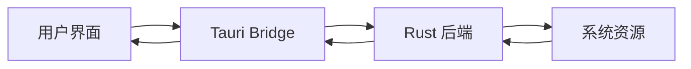

**Diagram sources**
- [lib.rs](file://src-tauri/src/lib.rs)
- [base64_text.rs](file://src-tauri/src/command/codec/base64_text.rs)

## 详细组件分析

### Base64 文本编解码分析
Base64 文本编解码功能允许用户在标准 Base64 编码格式之间进行转换，支持 Standard、StandardNoPad、UrlSafe 和 UrlSafeNoPad 四种模式。

#### 前端 UI 组件
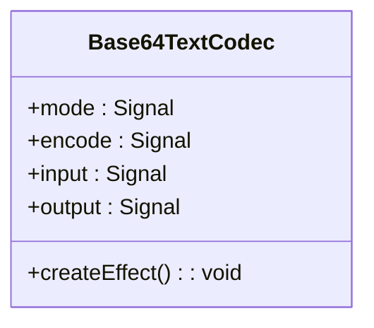

**Diagram sources**
- [base64_text.tsx](file://src/view/codec/base64_text.tsx)

#### 数据流序列图
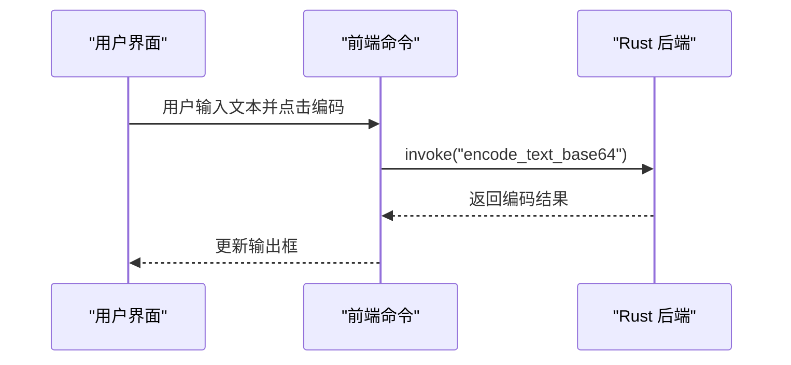

**Diagram sources**
- [base64_text.tsx](file://src/view/codec/base64_text.tsx)
- [base64_text.ts](file://src/command/codec/base64_text.ts)
- [base64_text.rs](file://src-tauri/src/command/codec/base64_text.rs)

**Section sources**
- [base64_text.tsx](file://src/view/codec/base64_text.tsx)
- [base64_text.ts](file://src/command/codec/base64_text.ts)
- [base64_text.rs](file://src-tauri/src/command/codec/base64_text.rs)

### Base64 图片编解码分析
Base64 图片编解码功能实现了图片文件与 Base64 字符串之间的相互转换，支持多种图片格式。

#### 前端 UI 组件
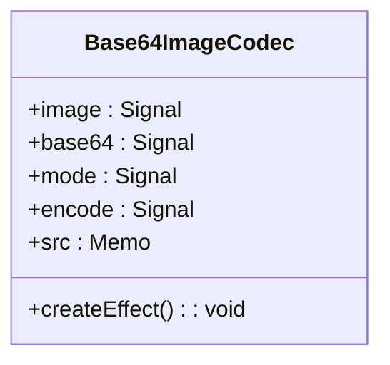

**Diagram sources**
- [base64_image.tsx](file://src/view/codec/base64_image.tsx)

#### 数据流序列图
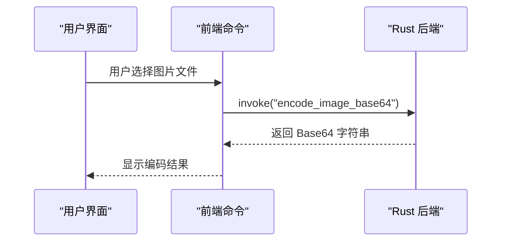

**Diagram sources**
- [base64_image.tsx](file://src/view/codec/base64_image.tsx)
- [base64_image.ts](file://src/command/codec/base64_image.ts)
- [base64_image.rs](file://src-tauri/src/command/codec/base64_image.rs)

**Section sources**
- [base64_image.tsx](file://src/view/codec/base64_image.tsx)
- [base64_image.ts](file://src/command/codec/base64_image.ts)
- [base64_image.rs](file://src-tauri/src/command/codec/base64_image.rs)

### GZip 压缩解压分析
GZip 功能提供文本数据的压缩与解压服务，支持 1-9 级压缩级别调节，并实时显示压缩率。

#### 前端 UI 组件
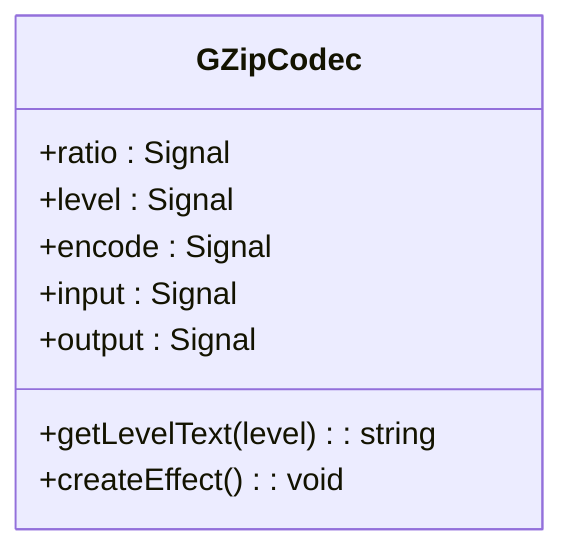

**Diagram sources**
- [gzip.tsx](file://src/view/codec/gzip.tsx)

#### 数据流序列图
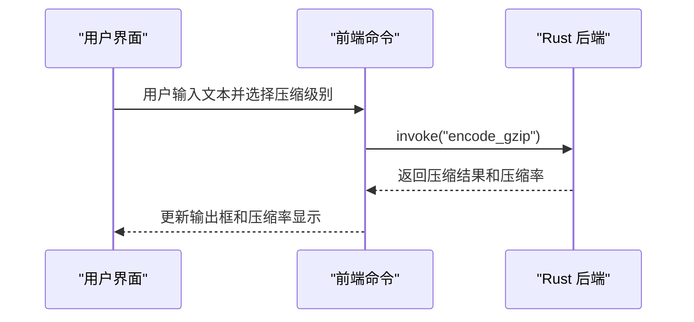

**Diagram sources**
- [gzip.tsx](file://src/view/codec/gzip.tsx)
- [gzip.ts](file://src/command/codec/gzip.ts)
- [gzip.rs](file://src-tauri/src/command/codec/gzip.rs)

**Section sources**
- [gzip.tsx](file://src/view/codec/gzip.tsx)
- [gzip.ts](file://src/command/codec/gzip.ts)
- [gzip.rs](file://src-tauri/src/command/codec/gzip.rs)

### URL 编解码分析
URL 编解码功能用于处理 URL 中特殊字符的编码与解码，确保数据在传输过程中的正确性。

#### 前端 UI 组件
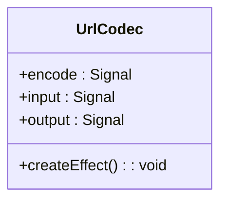

**Diagram sources**
- [url.tsx](file://src/view/codec/url.tsx)

#### 数据流序列图
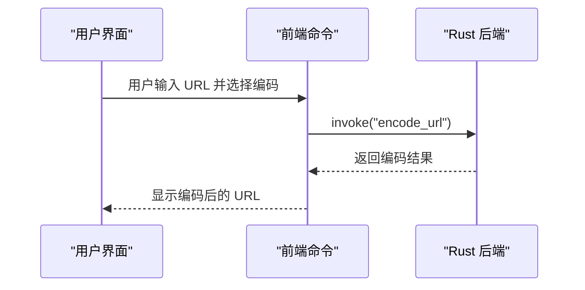

**Diagram sources**
- [url.tsx](file://src/view/codec/url.tsx)
- [url.ts](file://src/command/codec/url.ts)
- [url.rs](file://src-tauri/src/command/codec/url.rs)

**Section sources**
- [url.tsx](file://src/view/codec/url.tsx)
- [url.ts](file://src/command/codec/url.ts)
- [url.rs](file://src-tauri/src/command/codec/url.rs)

### 二维码生成解析分析
二维码功能支持将文本内容生成二维码图片，以及从二维码图片中解析出原始文本。

#### 前端 UI 组件
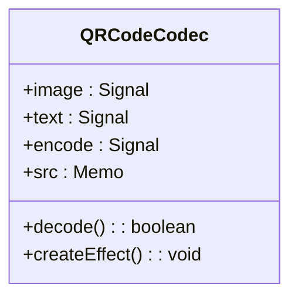

**Diagram sources**
- [qrcode.tsx](file://src/view/codec/qrcode.tsx)

#### 数据流序列图
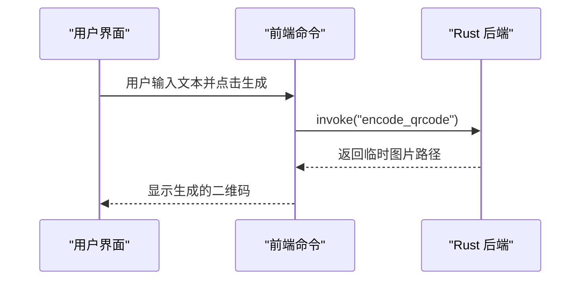

**Diagram sources**
- [qrcode.tsx](file://src/view/codec/qrcode.tsx)
- [qrcode.ts](file://src/command/codec/qrcode.ts)
- [qrcode.rs](file://src-tauri/src/command/codec/qrcode.rs)

**Section sources**
- [qrcode.tsx](file://src/view/codec/qrcode.tsx)
- [qrcode.ts](file://src/command/codec/qrcode.ts)
- [qrcode.rs](file://src-tauri/src/command/codec/qrcode.rs)

## 依赖分析
devkimi 的后端功能依赖于多个高质量的 Rust crate，这些库提供了稳定高效的编解码能力。

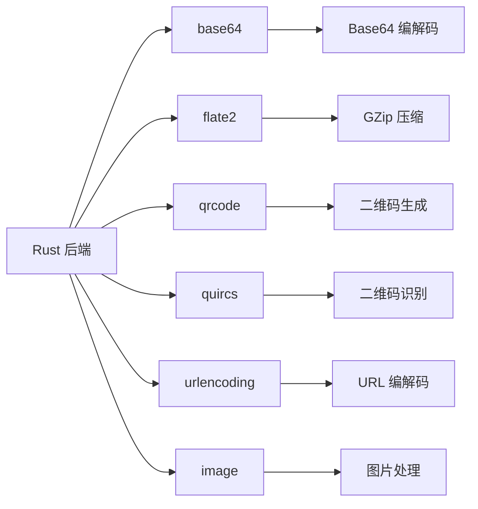

**Diagram sources**
- [Cargo.toml](file://src-tauri/Cargo.toml)
- [lib.rs](file://src-tauri/src/lib.rs)

**Section sources**
- [Cargo.toml](file://src-tauri/Cargo.toml)
- [lib.rs](file://src-tauri/src/lib.rs)

## 性能考虑
devkimi 在性能方面进行了精心设计，利用 Rust 语言的高性能特性确保编解码操作的快速响应。对于大文件处理，建议使用适当的压缩级别平衡速度与压缩率。Base64 编解码和 URL 编解码操作几乎即时完成，而 GZip 压缩的性能受压缩级别影响较大，级别越高处理时间越长但压缩率更好。

## 故障排除指南
当遇到编解码问题时，可参考以下常见问题解决方案：

**Section sources**
- [base64_text.rs](file://src-tauri/src/command/codec/base64_text.rs)
- [base64_image.rs](file://src-tauri/src/command/codec/base64_image.rs)
- [gzip.rs](file://src-tauri/src/command/codec/gzip.rs)
- [url.rs](file://src-tauri/src/command/codec/url.rs)
- [qrcode.rs](file://src-tauri/src/command/codec/qrcode.rs)

## 结论
devkimi 编解码工具通过结合 SolidJS 前端框架和 Rust 后端引擎，提供了一个高效、安全且用户友好的数据处理解决方案。其模块化的设计使得功能扩展变得简单，而 Tauri 架构确保了跨平台兼容性和本地系统访问的安全性。无论是开发者进行数据调试，还是普通用户处理日常编码任务，devkimi 都能提供可靠的服务。