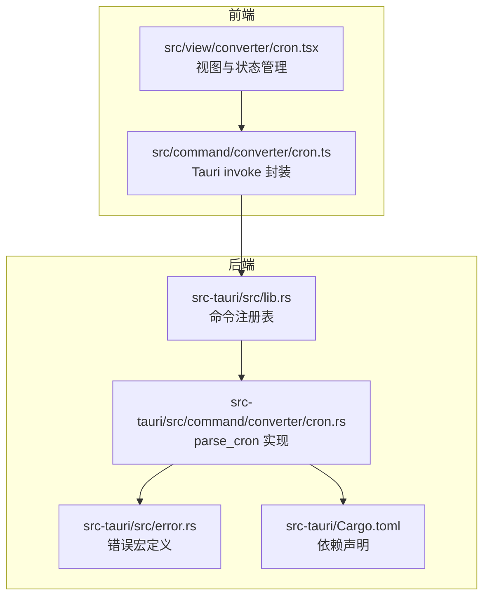
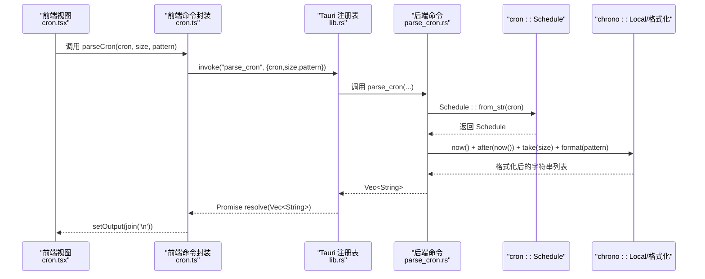
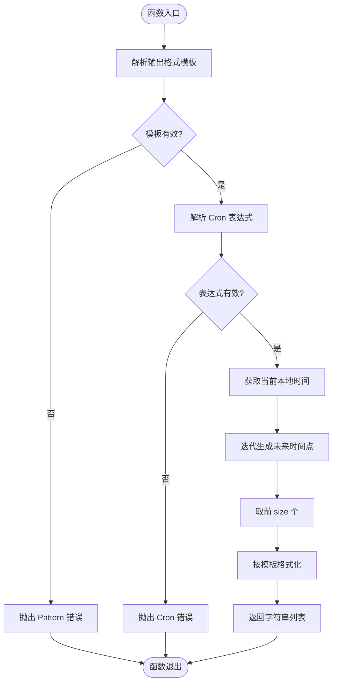
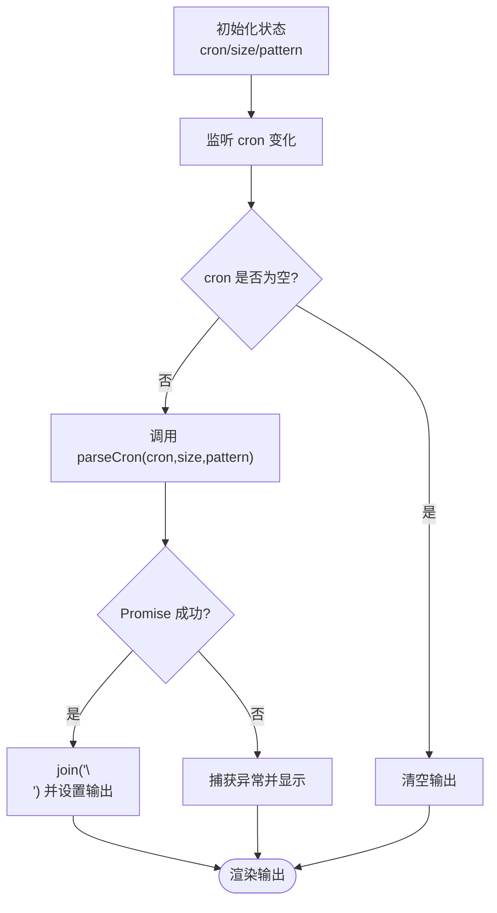
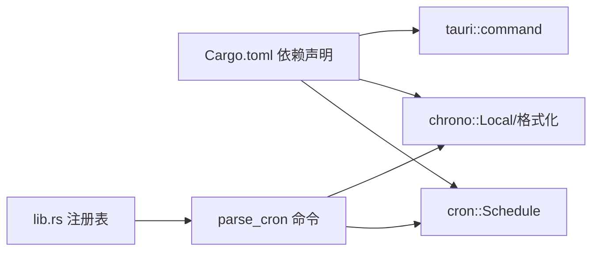

# Cron表达式解析

<cite>
**本文引用的文件**
- [src-tauri/src/command/converter/cron.rs](file://src-tauri/src/command/converter/cron.rs)
- [src-tauri/src/error.rs](file://src-tauri/src/error.rs)
- [src-tauri/src/lib.rs](file://src-tauri/src/lib.rs)
- [src-tauri/Cargo.toml](file://src-tauri/Cargo.toml)
- [src/view/converter/cron.tsx](file://src/view/converter/cron.tsx)
- [src/command/converter/cron.ts](file://src/command/converter/cron.ts)
- [README.md](file://README.md)
</cite>

## 目录
1. [简介](#简介)
2. [项目结构](#项目结构)
3. [核心组件](#核心组件)
4. [架构总览](#架构总览)
5. [详细组件分析](#详细组件分析)
6. [依赖关系分析](#依赖关系分析)
7. [性能考量](#性能考量)
8. [故障排查指南](#故障排查指南)
9. [结论](#结论)
10. [附录](#附录)

## 简介
本文件系统性阐述 devkimi 中 Cron 表达式解析功能的实现与使用方法。后端基于 Rust 的 cron crate 对表达式进行解析与校验；前端通过 Tauri 的命令通道调用后端能力，展示下一次执行时间列表及格式化输出。本文覆盖：
- Cron 表达式解析器的实现原理与边界处理
- 前后端交互流程与错误传播机制
- 支持的 Cron 语法与扩展格式
- 性能特征与使用限制
- 实际使用示例与最佳实践

## 项目结构
Cron 解析功能由“前端视图 + 前端命令封装 + 后端命令实现 + 错误宏定义”构成，同时在 Tauri 注册表中完成命令注册。

图表来源
- [src/view/converter/cron.tsx](file://src/view/converter/cron.tsx#L1-L93)
- [src/command/converter/cron.ts](file://src/command/converter/cron.ts#L1-L8)
- [src-tauri/src/lib.rs](file://src-tauri/src/lib.rs#L1-L57)
- [src-tauri/src/error.rs](file://src-tauri/src/error.rs#L1-L31)
- [src-tauri/src/command/converter/cron.rs](file://src-tauri/src/command/converter/cron.rs#L1-L22)
- [src-tauri/Cargo.toml](file://src-tauri/Cargo.toml#L1-L69)

章节来源
- [README.md](file://README.md#L38-L42)
- [src-tauri/src/lib.rs](file://src-tauri/src/lib.rs#L1-L57)
- [src-tauri/src/command/converter/cron.rs](file://src-tauri/src/command/converter/cron.rs#L1-L22)
- [src-tauri/Cargo.toml](file://src-tauri/Cargo.toml#L1-L69)

## 核心组件
- 后端命令：parse_cron
  - 输入：Cron 表达式字符串、输出格式模板、生成数量
  - 输出：按模板格式化的未来执行时间列表
  - 依赖：cron crate（解析）、chrono（时区与格式化）
- 前端视图：CronConverter
  - 提供 Cron 表达式输入、输出格式模板、生成数量等配置
  - 调用前端命令封装，展示解析结果或错误信息
- 前端命令封装：parseCron
  - 通过 Tauri invoke 调用后端 parse_cron 命令
- 错误宏：command_error
  - 统一包装 cron::error::Error 与 chrono::format::ParseError

章节来源
- [src-tauri/src/command/converter/cron.rs](file://src-tauri/src/command/converter/cron.rs#L1-L22)
- [src-tauri/src/error.rs](file://src-tauri/src/error.rs#L1-L31)
- [src-tauri/src/lib.rs](file://src-tauri/src/lib.rs#L1-L57)
- [src/view/converter/cron.tsx](file://src/view/converter/cron.tsx#L1-L93)
- [src/command/converter/cron.ts](file://src/command/converter/cron.ts#L1-L8)

## 架构总览
前后端交互采用 Tauri 的命令通道，前端发起请求，后端解析并返回格式化的时间列表。

图表来源
- [src/view/converter/cron.tsx](file://src/view/converter/cron.tsx#L1-L93)
- [src/command/converter/cron.ts](file://src/command/converter/cron.ts#L1-L8)
- [src-tauri/src/lib.rs](file://src-tauri/src/lib.rs#L1-L57)
- [src-tauri/src/command/converter/cron.rs](file://src-tauri/src/command/converter/cron.rs#L1-L22)

## 详细组件分析

### 后端命令：parse_cron
- 解析流程
  - 使用 cron::Schedule::from_str 将表达式解析为调度对象
  - 从当前本地时间起，迭代产生未来时间点，取前 size 个
  - 使用 chrono::format::StrftimeItems 按模板格式化输出
- 错误处理
  - cron::error::Error → 映射为 Cron 类型错误
  - chrono::format::ParseError → 映射为 Pattern 类型错误
  - 通过自定义错误宏统一序列化为字符串，便于前端捕获
- 时区与边界
  - 使用 Local 时区，受系统时区影响
  - 若表达式无法生成未来时间，将返回空列表

图表来源
- [src-tauri/src/command/converter/cron.rs](file://src-tauri/src/command/converter/cron.rs#L1-L22)
- [src-tauri/src/error.rs](file://src-tauri/src/error.rs#L1-L31)

章节来源
- [src-tauri/src/command/converter/cron.rs](file://src-tauri/src/command/converter/cron.rs#L1-L22)
- [src-tauri/src/error.rs](file://src-tauri/src/error.rs#L1-L31)

### 前端视图：CronConverter
- 状态与配置
  - cron：Cron 表达式输入，默认值为 "* * * * * *"（每分钟）
  - size：生成数量，默认 20，最大 10000
  - pattern：输出格式模板，默认 "%Y-%m-%d %H:%M:%S"
- 交互逻辑
  - 当 cron 非空时，调用 parseCron 并将结果按换行拼接显示
  - 错误时将异常字符串显示在输出区域
  - 提供重新生成按钮，通过增加信号触发重新计算

图表来源
- [src/view/converter/cron.tsx](file://src/view/converter/cron.tsx#L1-L93)

章节来源
- [src/view/converter/cron.tsx](file://src/view/converter/cron.tsx#L1-L93)

### 前端命令封装：parseCron
- 作用：通过 Tauri invoke 调用后端 parse_cron 命令
- 参数：cron、size、pattern
- 返回：Promise<string[]>，用于前端渲染

章节来源
- [src/command/converter/cron.ts](file://src/command/converter/cron.ts#L1-L8)

### 错误处理与序列化
- 自定义错误宏 command_error
  - 定义 Error 枚举，包含 Cron 与 Pattern 两类错误
  - 通过 serialize_error 宏将错误序列化为字符串，便于跨语言传递
- 前端捕获
  - 前端在 then 分支失败时，将异常转换为字符串显示

章节来源
- [src-tauri/src/error.rs](file://src-tauri/src/error.rs#L1-L31)
- [src-tauri/src/command/converter/cron.rs](file://src-tauri/src/command/converter/cron.rs#L1-L22)
- [src/view/converter/cron.tsx](file://src/view/converter/cron.tsx#L1-L93)

## 依赖关系分析
- 依赖声明
  - cron = "0.15"：表达式解析与调度
  - chrono = "0.4"：时区与格式化
  - tauri = "2.9.1"：命令通道与桌面应用框架
- 命令注册
  - 在 lib.rs 的 invoke_handler 中注册 parse_cron，使其可通过前端调用

图表来源
- [src-tauri/Cargo.toml](file://src-tauri/Cargo.toml#L1-L69)
- [src-tauri/src/lib.rs](file://src-tauri/src/lib.rs#L1-L57)
- [src-tauri/src/command/converter/cron.rs](file://src-tauri/src/command/converter/cron.rs#L1-L22)

章节来源
- [src-tauri/Cargo.toml](file://src-tauri/Cargo.toml#L1-L69)
- [src-tauri/src/lib.rs](file://src-tauri/src/lib.rs#L1-L57)

## 性能考量
- 时间复杂度
  - 生成 N 个未来时间点的复杂度近似 O(N)，受表达式复杂度与迭代器推进策略影响
- 内存占用
  - 输出列表长度为 size，每个元素为格式化后的字符串
- 时区与系统影响
  - 使用 Local 时区，受系统时区与夏令时切换影响
- 限制与建议
  - size 最大 10000，避免过大的批量生成导致 UI 卡顿
  - 复杂表达式可能增加解析与迭代成本，建议在合理范围内设计表达式

[本节为通用性能讨论，不直接分析具体代码文件]

## 故障排查指南
- 常见错误类型
  - Cron 错误：表达式格式不合法或超出支持范围
  - Pattern 错误：输出格式模板无效
- 前端表现
  - 输出区域显示错误字符串，提示用户修正表达式或模板
- 排查步骤
  - 检查 Cron 表达式是否符合支持语法
  - 检查输出格式模板是否为有效的 Strftime 模板
  - 减少 size 数量以确认是否为性能瓶颈
  - 切换到不同时间点复测，排除时区与夏令时影响

章节来源
- [src-tauri/src/command/converter/cron.rs](file://src-tauri/src/command/converter/cron.rs#L1-L22)
- [src-tauri/src/error.rs](file://src-tauri/src/error.rs#L1-L31)
- [src/view/converter/cron.tsx](file://src/view/converter/cron.tsx#L1-L93)

## 结论
devkimi 的 Cron 表达式解析功能以简洁清晰的方式实现了“表达式校验 + 未来时间生成 + 格式化输出”的完整链路。后端通过 cron 与 chrono 稳定可靠地完成解析与时区处理，前端通过 Tauri 命令通道无缝集成，错误通过统一宏进行序列化，便于前端展示与用户修复。建议在生产环境中合理控制 size，遵循表达式最佳实践，确保解析与渲染性能与稳定性。

[本节为总结性内容，不直接分析具体代码文件]

## 附录

### 支持的 Cron 语法与扩展
- 标准字段
  - 分钟、小时、日、月、星期（与 cron crate 默认支持一致）
- 扩展格式
  - 该实现默认使用 cron::Schedule::from_str 进行解析，具体支持范围取决于 cron crate 的版本与配置
  - 若需更严格的字段顺序或扩展语法，可在上游 crate 版本升级或自定义解析器时调整
- 输出格式
  - 使用 chrono::format::StrftimeItems 解析模板，支持常见的 strftime 占位符

章节来源
- [src-tauri/src/command/converter/cron.rs](file://src-tauri/src/command/converter/cron.rs#L1-L22)
- [src-tauri/Cargo.toml](file://src-tauri/Cargo.toml#L1-L69)

### 使用示例（从输入到结果）
- 输入
  - Cron 表达式：例如 "* * * * * *"（每分钟）
  - 输出格式：例如 "%Y-%m-%d %H:%M:%S"
  - 生成数量：例如 20
- 流程
  - 前端视图读取上述参数
  - 调用 parseCron，经 Tauri invoke 触发后端 parse_cron
  - 后端解析表达式、生成未来时间、按模板格式化
  - 前端接收字符串数组并以换行拼接展示
- 注意
  - 若表达式无效或模板无效，前端将显示对应错误信息

章节来源
- [src/view/converter/cron.tsx](file://src/view/converter/cron.tsx#L1-L93)
- [src/command/converter/cron.ts](file://src/command/converter/cron.ts#L1-L8)
- [src-tauri/src/command/converter/cron.rs](file://src-tauri/src/command/converter/cron.rs#L1-L22)

### 最佳实践与常见问题
- 表达式编写
  - 优先使用简单明确的组合，避免过于复杂的范围与步长叠加
  - 星号与问号的语义要清晰，避免无意的全量匹配
- 模板格式
  - 使用标准 strftime 占位符，避免未支持的占位符导致 Pattern 错误
- 性能与可用性
  - 控制 size，避免一次性生成过多时间点
  - 在需要精确时间的场景，注意 Local 时区与夏令时切换的影响
- 常见问题
  - 无效表达式：检查字段数量与取值范围
  - 无效模板：检查占位符是否正确
  - 无未来时间：确认表达式是否能推进到当前时间之后

[本节为通用指导，不直接分析具体代码文件]