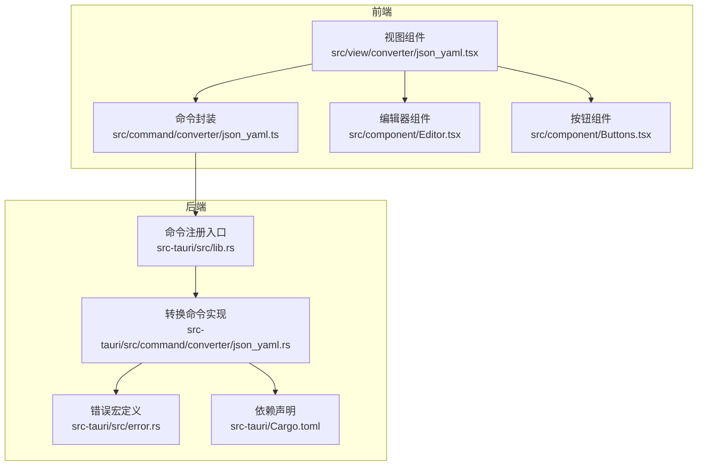
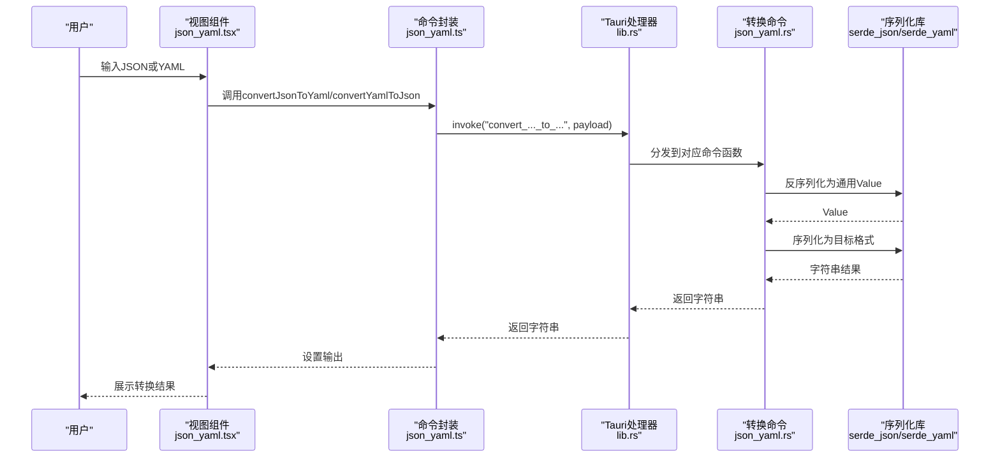
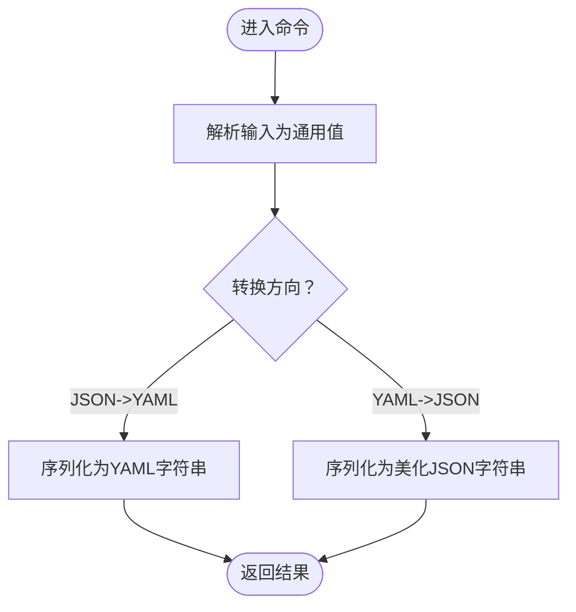
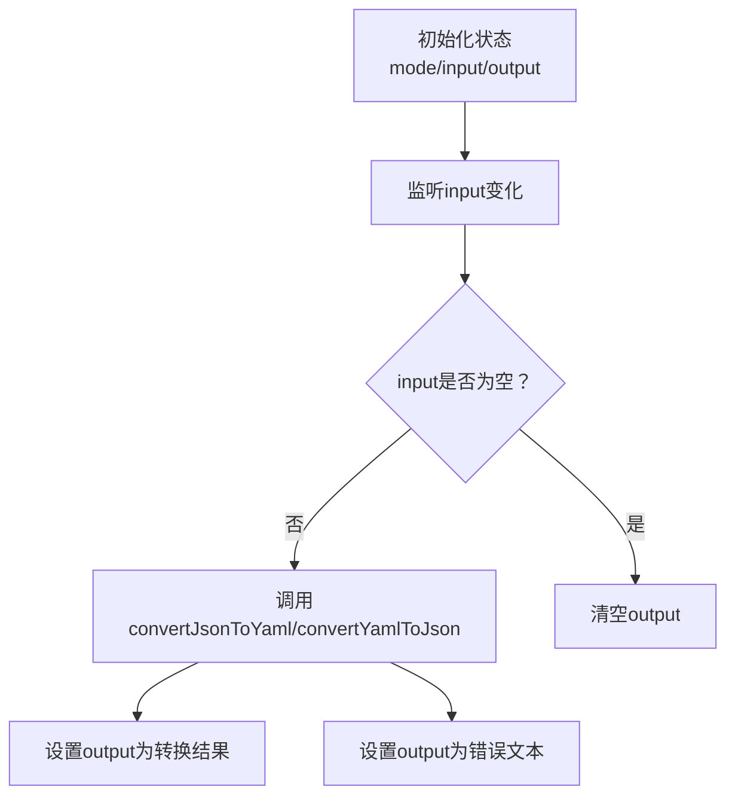
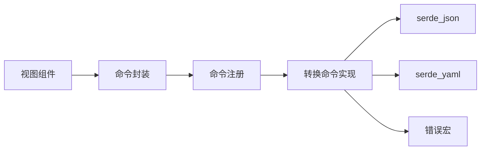
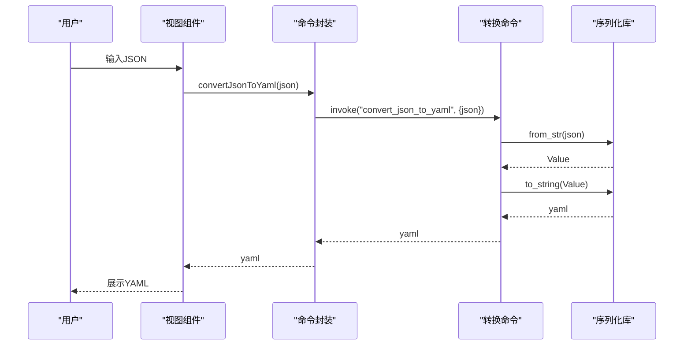

# JSON/YAML互转

<cite>
**本文引用的文件**
- [json_yaml.rs](file://src-tauri/src/command/converter/json_yaml.rs)
- [json_yaml.tsx](file://src/view/converter/json_yaml.tsx)
- [json_yaml.ts](file://src/command/converter/json_yaml.ts)
- [lib.rs](file://src-tauri/src/lib.rs)
- [Cargo.toml](file://src-tauri/Cargo.toml)
- [error.rs](file://src-tauri/src/error.rs)
- [Editor.tsx](file://src/component/Editor.tsx)
- [Buttons.tsx](file://src/component/Buttons.tsx)
</cite>

## 目录
1. [简介](#简介)
2. [项目结构](#项目结构)
3. [核心组件](#核心组件)
4. [架构总览](#架构总览)
5. [详细组件分析](#详细组件分析)
6. [依赖关系分析](#依赖关系分析)
7. [性能考量](#性能考量)
8. [故障排查指南](#故障排查指南)
9. [结论](#结论)
10. [附录](#附录)

## 简介
本文件面向开发者，系统性阐述 devkimi 中“JSON/YAML 互转”功能的实现机制与最佳实践。重点覆盖：
- Rust 后端如何使用 serde 与 serde_yaml 进行安全高效的序列化与反序列化；
- 前端如何接收用户输入、调用后端命令并展示转换结果；
- 支持的数据类型、特殊字符处理、错误恢复机制；
- 性能优化策略与大文件处理建议；
- 实际使用示例与一致性保障方法。

## 项目结构
该功能由三层组成：前端视图层、前端命令封装层、后端命令层。整体采用 Tauri 的 invoke 模式，从前端发起命令，后端完成 JSON/YAML 的双向转换。

图表来源
- [json_yaml.tsx](file://src/view/converter/json_yaml.tsx#L1-L107)
- [json_yaml.ts](file://src/command/converter/json_yaml.ts#L1-L12)
- [lib.rs](file://src-tauri/src/lib.rs#L1-L57)
- [json_yaml.rs](file://src-tauri/src/command/converter/json_yaml.rs#L1-L19)
- [error.rs](file://src-tauri/src/error.rs#L1-L31)
- [Cargo.toml](file://src-tauri/Cargo.toml#L1-L69)

章节来源
- [json_yaml.tsx](file://src/view/converter/json_yaml.tsx#L1-L107)
- [json_yaml.ts](file://src/command/converter/json_yaml.ts#L1-L12)
- [lib.rs](file://src-tauri/src/lib.rs#L1-L57)
- [json_yaml.rs](file://src-tauri/src/command/converter/json_yaml.rs#L1-L19)
- [error.rs](file://src-tauri/src/error.rs#L1-L31)
- [Cargo.toml](file://src-tauri/Cargo.toml#L1-L69)

## 核心组件
- 前端视图组件负责用户交互与结果展示，包含输入/输出编辑器、模式切换、复制与保存等操作。
- 前端命令封装通过 Tauri invoke 调用后端命令。
- 后端命令实现使用 serde_json 与 serde_yaml 完成双向转换，并通过统一错误类型向上抛出。

章节来源
- [json_yaml.tsx](file://src/view/converter/json_yaml.tsx#L1-L107)
- [json_yaml.ts](file://src/command/converter/json_yaml.ts#L1-L12)
- [json_yaml.rs](file://src-tauri/src/command/converter/json_yaml.rs#L1-L19)
- [lib.rs](file://src-tauri/src/lib.rs#L1-L57)

## 架构总览
下图展示了从用户输入到转换结果返回的关键流程。

图表来源
- [json_yaml.tsx](file://src/view/converter/json_yaml.tsx#L1-L107)
- [json_yaml.ts](file://src/command/converter/json_yaml.ts#L1-L12)
- [lib.rs](file://src-tauri/src/lib.rs#L1-L57)
- [json_yaml.rs](file://src-tauri/src/command/converter/json_yaml.rs#L1-L19)

## 详细组件分析

### 后端命令实现（Rust）
- JSON -> YAML：先将输入解析为通用 JSON 值，再序列化为 YAML 字符串。
- YAML -> JSON：先将输入解析为通用 YAML 值，再序列化为美化后的 JSON 字符串。
- 错误类型：通过统一的错误宏生成，包含 JSON 与 YAML 解析错误分支，便于前端捕获与展示。

图表来源
- [json_yaml.rs](file://src-tauri/src/command/converter/json_yaml.rs#L1-L19)
- [error.rs](file://src-tauri/src/error.rs#L1-L31)

章节来源
- [json_yaml.rs](file://src-tauri/src/command/converter/json_yaml.rs#L1-L19)
- [error.rs](file://src-tauri/src/error.rs#L1-L31)

### 前端视图与交互（SolidJS）
- 模式切换：通过信号控制转换方向（JSON->YAML 或 YAML->JSON），切换时清空输入输出。
- 输入输出编辑器：根据模式动态选择语言（json/yaml），并提供只读输出展示。
- 操作按钮：复制、保存、粘贴、清空、打开文件等，提升易用性。
- 异步转换：监听输入变化，调用前端命令封装，将结果设置到输出框；若发生错误则显示错误文本。

图表来源
- [json_yaml.tsx](file://src/view/converter/json_yaml.tsx#L1-L107)
- [Buttons.tsx](file://src/component/Buttons.tsx#L1-L191)
- [Editor.tsx](file://src/component/Editor.tsx#L1-L139)

章节来源
- [json_yaml.tsx](file://src/view/converter/json_yaml.tsx#L1-L107)
- [Buttons.tsx](file://src/component/Buttons.tsx#L1-L191)
- [Editor.tsx](file://src/component/Editor.tsx#L1-L139)

### 前端命令封装（Tauri invoke）
- 将后端命令暴露为前端可调用的函数，分别对应两种转换方向。
- 使用 Tauri 的 invoke 机制与后端通信，返回 Promise 形式的字符串结果。

章节来源
- [json_yaml.ts](file://src/command/converter/json_yaml.ts#L1-L12)

### 命令注册与生命周期（Tauri）
- 在应用启动时注册所有命令，包括 JSON/YAML 转换命令。
- 通过 generate_handler! 宏集中注册，保证命令可用性。

章节来源
- [lib.rs](file://src-tauri/src/lib.rs#L1-L57)

### 依赖与版本（Cargo）
- serde_json：启用 preserve_order 特性，有助于在某些场景下维持键顺序。
- serde_yaml：用于 YAML 的序列化与反序列化。
- thiserror：配合自定义错误宏，提供一致的错误序列化行为。

章节来源
- [Cargo.toml](file://src-tauri/Cargo.toml#L1-L69)

## 依赖关系分析
- 前端依赖后端命令：视图组件通过命令封装调用后端。
- 后端依赖 serde 生态：命令实现直接使用 serde_json 与 serde_yaml。
- 错误处理统一：通过错误宏生成统一错误类型，便于跨层传播。

图表来源
- [json_yaml.tsx](file://src/view/converter/json_yaml.tsx#L1-L107)
- [json_yaml.ts](file://src/command/converter/json_yaml.ts#L1-L12)
- [lib.rs](file://src-tauri/src/lib.rs#L1-L57)
- [json_yaml.rs](file://src-tauri/src/command/converter/json_yaml.rs#L1-L19)
- [error.rs](file://src-tauri/src/error.rs#L1-L31)
- [Cargo.toml](file://src-tauri/Cargo.toml#L1-L69)

章节来源
- [json_yaml.tsx](file://src/view/converter/json_yaml.tsx#L1-L107)
- [json_yaml.ts](file://src/command/converter/json_yaml.ts#L1-L12)
- [lib.rs](file://src-tauri/src/lib.rs#L1-L57)
- [json_yaml.rs](file://src-tauri/src/command/converter/json_yaml.rs#L1-L19)
- [error.rs](file://src-tauri/src/error.rs#L1-L31)
- [Cargo.toml](file://src-tauri/Cargo.toml#L1-L69)

## 性能考量
- 流式处理与大文件：当前实现对输入进行一次性解析与序列化，适合中小规模数据。对于超大文件，建议：
  - 分块读取与流式解析（需扩展后端以支持迭代解析）；
  - 前端分页展示与延迟渲染；
  - 限制并发转换任务数量，避免阻塞 UI。
- 内存占用：通用值在内存中驻留，复杂嵌套结构可能占用较多内存。建议：
  - 对超大输入进行拆分或提示用户；
  - 使用只读输出编辑器减少重复拷贝。
- 序列化开销：美化 JSON（pretty）会增加序列化时间与体积。在批量转换或网络传输场景，可考虑关闭美化以提升性能。
- 并发与缓存：前端可引入防抖与去重逻辑，避免频繁触发转换；后端可按需引入轻量缓存（需评估一致性与内存占用）。

## 故障排查指南
- 常见错误类型
  - JSON 解析错误：输入不符合 JSON 语法（例如非法转义、尾逗号、单引号等）。
  - YAML 解析错误：输入不符合 YAML 语法（例如缩进不正确、非法标签、未知锚点等）。
- 前端表现
  - 当命令调用失败时，输出框会显示错误文本，便于定位问题。
- 排查步骤
  - 检查输入格式是否符合目标格式要求；
  - 若为 YAML，确认缩进与冒号后的空格；
  - 若为 JSON，确认键名使用双引号、无尾逗号、数值与布尔值大小写正确；
  - 对于超大输入，尝试简化或拆分后再试。
- 错误传播链
  - 前端命令封装通过 Promise 捕获错误；
  - 后端命令通过统一错误类型向上抛出；
  - 错误最终被序列化为字符串返回给前端。

章节来源
- [json_yaml.tsx](file://src/view/converter/json_yaml.tsx#L1-L107)
- [json_yaml.rs](file://src-tauri/src/command/converter/json_yaml.rs#L1-L19)
- [error.rs](file://src-tauri/src/error.rs#L1-L31)

## 结论
devkimi 的 JSON/YAML 互转功能以简洁高效的实现满足日常开发与运维需求。后端通过 serde 生态完成安全可靠的序列化与反序列化，前端提供直观的交互体验与实用的操作按钮。遵循本文的最佳实践，可在保证数据一致性的同时获得良好的性能与稳定性。

## 附录

### 支持的数据类型与边界行为
- 基本类型：字符串、数字、布尔、null。
- 复合类型：对象（映射）、数组（序列）。
- 注意事项：
  - JSON 数字在 YAML 中可能表现为整数或浮点，但不会改变语义；
  - YAML 的多行字符串、时间、标签等特性在 JSON 中无法直接表达，转换时会以字符串形式呈现；
  - 注释在 YAML 中会被丢弃，因为 serde_yaml 默认不保留注释元信息。

章节来源
- [json_yaml.rs](file://src-tauri/src/command/converter/json_yaml.rs#L1-L19)

### 实际使用示例（流程示意）
- 示例一：JSON -> YAML
  - 输入：合法 JSON 文本；
  - 步骤：后端解析为通用值，再序列化为 YAML；
  - 输出：YAML 文本。
- 示例二：YAML -> JSON
  - 输入：合法 YAML 文本；
  - 步骤：后端解析为通用值，再序列化为美化 JSON；
  - 输出：JSON 文本。

图表来源
- [json_yaml.tsx](file://src/view/converter/json_yaml.tsx#L1-L107)
- [json_yaml.ts](file://src/command/converter/json_yaml.ts#L1-L12)
- [json_yaml.rs](file://src-tauri/src/command/converter/json_yaml.rs#L1-L19)

### 最佳实践清单
- 输入校验：在前端提供基础校验提示（如 JSON 语法高亮），减少无效请求。
- 错误处理：始终在前端捕获并展示错误，帮助用户快速定位问题。
- 性能优化：对大文件采用分块或拆分策略；必要时关闭美化以降低序列化成本。
- 一致性保障：固定序列化选项（如缩进、换行），避免因格式差异导致的误判。
- 兼容性：注意 YAML 特性（如多行字符串、时间）在 JSON 中的映射行为，必要时进行预处理或提示。