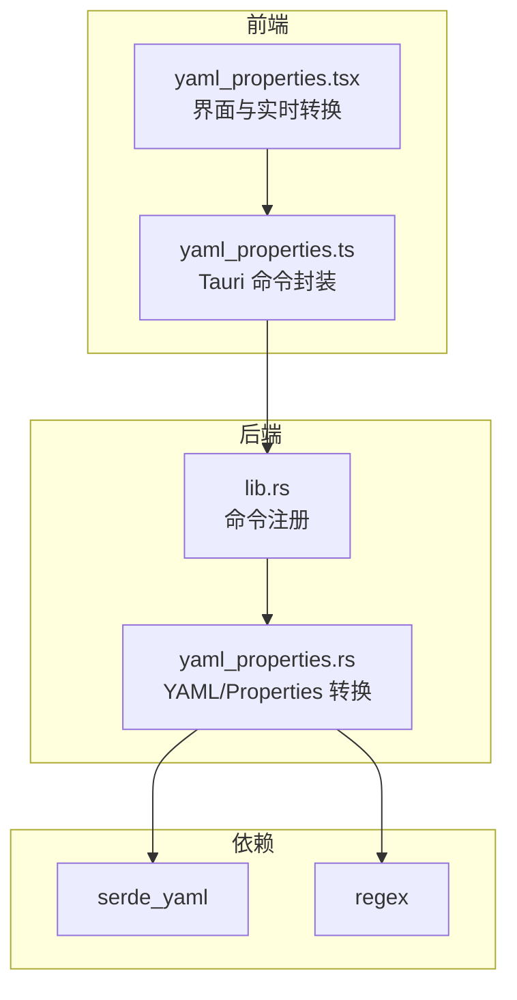
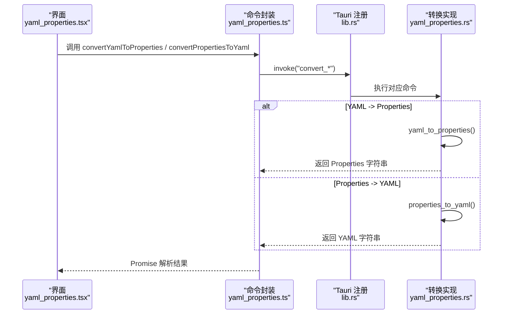
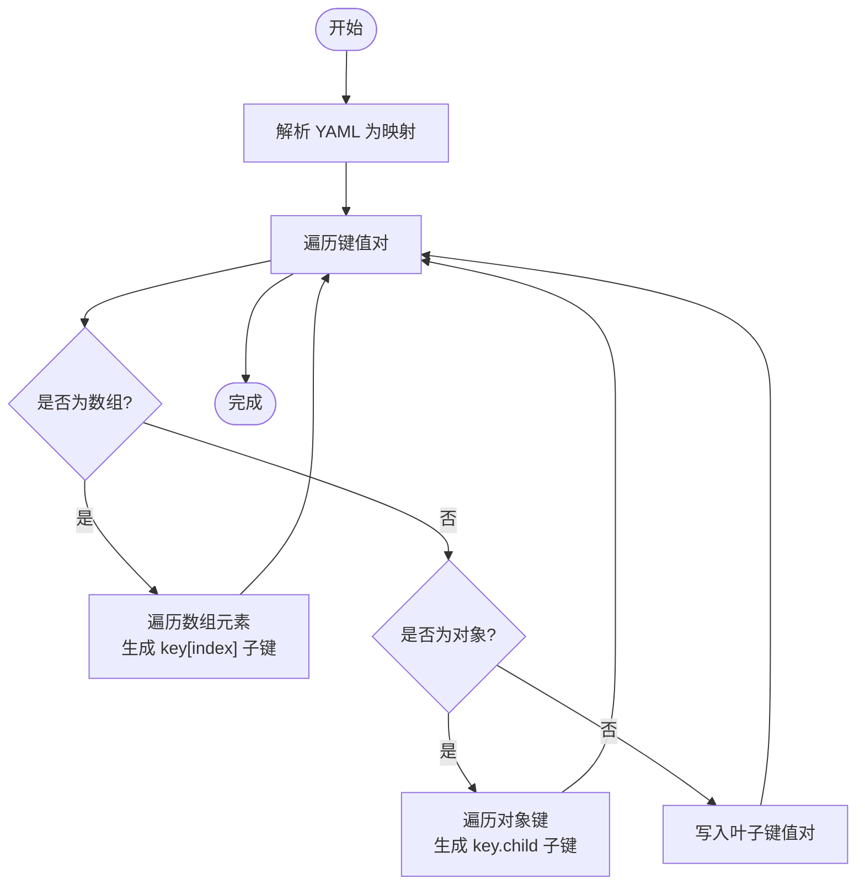
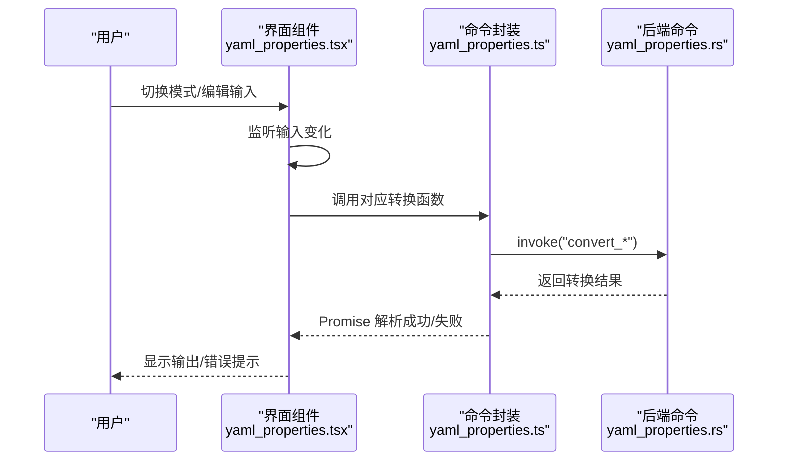
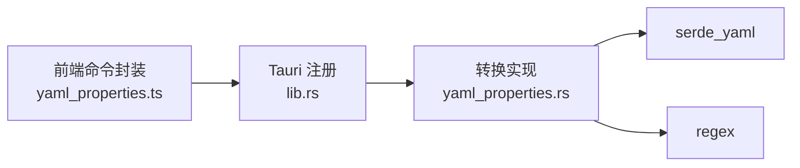

# YAML/Properties互转

<cite>
**本文引用的文件列表**
- [yaml_properties.rs](file://src-tauri/src/command/converter/yaml_properties.rs)
- [yaml_properties.tsx](file://src/view/converter/yaml_properties.tsx)
- [yaml_properties.ts](file://src/command/converter/yaml_properties.ts)
- [lib.rs](file://src-tauri/src/lib.rs)
- [Cargo.toml](file://src-tauri/Cargo.toml)
- [routes.tsx](file://src/routes.tsx)
- [json_yaml.tsx](file://src/view/converter/json_yaml.tsx)
- [README.md](file://README.md)
</cite>

## 目录
1. [简介](#简介)
2. [项目结构](#项目结构)
3. [核心组件](#核心组件)
4. [架构总览](#架构总览)
5. [详细组件分析](#详细组件分析)
6. [依赖关系分析](#依赖关系分析)
7. [性能考量](#性能考量)
8. [故障排查指南](#故障排查指南)
9. [结论](#结论)
10. [附录](#附录)

## 简介
本文件面向开发者，系统性阐述 devkimi 中“YAML/Properties 互转”功能的技术实现与使用方法。文档从 Rust 后端的解析与序列化逻辑入手，结合前端 SolidJS 的双向转换界面，说明如何将嵌套 YAML 结构映射为扁平键值对（Properties），以及如何从扁平键值对还原为 YAML 对象树；同时覆盖数组索引、键名冲突、特殊字符处理、错误提示与性能特征等关键点，并给出最佳实践与常见问题解决方案。

## 项目结构
- 前端位于 src/view/converter/yaml_properties.tsx，负责用户交互、实时转换与错误显示。
- 前端命令封装位于 src/command/converter/yaml_properties.ts，通过 Tauri invoke 调用后端命令。
- 后端位于 src-tauri/src/command/converter/yaml_properties.rs，实现 YAML 与 Properties 的双向转换。
- 命令注册在 src-tauri/src/lib.rs，供前端调用。
- 路由定义在 src/routes.tsx，将“YAML/Properties 互转”挂载到导航菜单。
- 依赖声明在 src-tauri/Cargo.toml，包含 serde_yaml、regex 等关键库。

图表来源
- [yaml_properties.tsx](file://src/view/converter/yaml_properties.tsx#L1-L111)
- [yaml_properties.ts](file://src/command/converter/yaml_properties.ts#L1-L11)
- [lib.rs](file://src-tauri/src/lib.rs#L1-L57)
- [yaml_properties.rs](file://src-tauri/src/command/converter/yaml_properties.rs#L1-L199)
- [Cargo.toml](file://src-tauri/Cargo.toml#L1-L69)

章节来源
- [routes.tsx](file://src/routes.tsx#L166-L189)
- [README.md](file://README.md#L38-L42)

## 核心组件
- 后端命令
  - convert_yaml_to_properties：将 YAML 字符串解析为 Properties 键值对字符串。
  - convert_properties_to_yaml：将 Properties 键值对字符串解析为 YAML 字符串。
- 关键算法
  - 展平映射：将嵌套结构映射为扁平键，数组使用方括号索引，对象使用点号分隔。
  - 还原映射：根据扁平键路径重建对象树，自动扩展数组与对象。
  - 值类型推断：布尔、整数、浮点、字符串的识别与还原。
- 错误模型
  - 包含 YAML 解析错误、标签值不支持、键非字符串、数组索引非法、期望序列或映射、空键等。

章节来源
- [yaml_properties.rs](file://src-tauri/src/command/converter/yaml_properties.rs#L1-L199)

## 架构总览
下图展示了从前端到后端的调用链路与数据流。

图表来源
- [yaml_properties.tsx](file://src/view/converter/yaml_properties.tsx#L1-L111)
- [yaml_properties.ts](file://src/command/converter/yaml_properties.ts#L1-L11)
- [lib.rs](file://src-tauri/src/lib.rs#L1-L57)
- [yaml_properties.rs](file://src-tauri/src/command/converter/yaml_properties.rs#L1-L199)

## 详细组件分析

### 后端：YAML/Properties 转换实现
- 展平映射（YAML -> Properties）
  - 递归遍历 YAML 根映射，遇到：
    - Null/Bool/Number/String：直接写入键值对。
    - Sequence：为每个元素生成形如 key[index] 的子键。
    - Mapping：为每个键生成形如 key.child 的子键。
    - Tagged：抛出不支持错误。
  - 生成的键值对按字典序排序，保证输出稳定。
- 还原映射（Properties -> YAML）
  - 将每条键拆分为路径片段，片段要么是普通键，要么是形如 [index] 的数组索引。
  - 按路径逐层插入：
    - 若当前层级不是数组/映射，先强制转换为相应容器。
    - 数组索引自动扩展，必要时填充占位值。
    - 最后一层写入原始值（布尔/数字/字符串）。
- 值类型推断
  - 字符串 "true"/"false" -> 布尔。
  - 可解析为整数/有限浮点 -> 数字。
  - 其他 -> 字符串。
- 错误处理
  - YAML 解析失败、键非字符串、标签值、数组索引非法、期望序列/映射、空键等。

图表来源
- [yaml_properties.rs](file://src-tauri/src/command/converter/yaml_properties.rs#L20-L60)

章节来源
- [yaml_properties.rs](file://src-tauri/src/command/converter/yaml_properties.rs#L1-L199)

### 前端：双向转换界面
- 模式切换
  - YAML -> Properties 或 Properties -> YAML 切换。
- 实时转换
  - 输入变化即触发转换，输出即时更新；错误以字符串形式显示。
- 编辑器语言模式
  - 输入/输出分别使用 YAML/Properties 语法高亮。
- 操作按钮
  - 提供复制与保存操作按钮，便于导出结果。

图表来源
- [yaml_properties.tsx](file://src/view/converter/yaml_properties.tsx#L1-L111)
- [yaml_properties.ts](file://src/command/converter/yaml_properties.ts#L1-L11)
- [yaml_properties.rs](file://src-tauri/src/command/converter/yaml_properties.rs#L1-L199)

章节来源
- [yaml_properties.tsx](file://src/view/converter/yaml_properties.tsx#L1-L111)

### 与同类转换器的对比参考
- 与 JSON/YAML 互转界面对比
  - 两者均采用“模式切换 + 实时转换”的一致交互模式，便于用户理解与迁移使用。
  - YAML/Properties 互转在键命名上引入数组索引与点号分隔，需注意键冲突与可读性。

章节来源
- [json_yaml.tsx](file://src/view/converter/json_yaml.tsx#L1-L83)

## 依赖关系分析
- Rust 依赖
  - serde_yaml：YAML 解析与序列化。
  - regex：键路径解析（识别普通键与数组索引）。
- 前端依赖
  - @tauri-apps/api：通过 invoke 调用后端命令。
- 命令注册
  - 在 lib.rs 中显式注册 convert_yaml_to_properties 与 convert_properties_to_yaml，供前端调用。

图表来源
- [yaml_properties.ts](file://src/command/converter/yaml_properties.ts#L1-L11)
- [lib.rs](file://src-tauri/src/lib.rs#L1-L57)
- [yaml_properties.rs](file://src-tauri/src/command/converter/yaml_properties.rs#L1-L199)
- [Cargo.toml](file://src-tauri/Cargo.toml#L1-L69)

章节来源
- [Cargo.toml](file://src-tauri/Cargo.toml#L1-L69)
- [lib.rs](file://src-tauri/src/lib.rs#L1-L57)

## 性能考量
- 时间复杂度
  - 展平映射：O(N)，N 为 YAML 中键值对数量（序列与映射按元素计数）。
  - 还原映射：O(K log K + M)，K 为键数量（排序 O(K log K)，插入 O(M)，M 为键路径总步数）。
- 空间复杂度
  - 展平映射：O(N)。
  - 还原映射：O(M)（存储中间路径与容器）。
- I/O 与序列化
  - YAML/Properties 的序列化与反序列化开销与数据规模线性相关。
- 并发与稳定性
  - 前端使用异步 Promise，避免阻塞 UI；错误统一捕获并反馈给用户。

[本节为一般性性能讨论，无需特定文件来源]

## 故障排查指南
- 常见错误与定位
  - YAML 解析失败：检查输入是否为合法 YAML（缩进、冒号、引号等）。
  - 标签值不支持：YAML 中的自定义标签值会被拒绝，建议移除或转换为标准类型。
  - 键非字符串：映射键必须为字符串，否则报错；请确保 YAML 键为字符串类型。
  - 数组索引非法：键路径中的 [index] 必须为非负整数；请检查索引格式。
  - 期望序列/映射：当路径中出现数组索引但当前位置并非数组，或出现对象键但当前位置并非映射时会报错。
  - 空键：键路径为空会导致错误；请检查键的命名与分隔符。
- 前端错误显示
  - 前端在转换失败时将错误信息以字符串形式显示在输出区域，便于快速定位问题。
- 建议排查步骤
  - 先在 YAML/Properties 互转界面进行最小化复现，逐步缩小问题范围。
  - 使用 JSON/YAML 互转作为对照，验证输入是否符合预期。
  - 检查键命名是否包含特殊字符或保留字符，必要时添加引号或转义。

章节来源
- [yaml_properties.rs](file://src-tauri/src/command/converter/yaml_properties.rs#L190-L199)
- [yaml_properties.tsx](file://src/view/converter/yaml_properties.tsx#L27-L38)

## 结论
YAML/Properties 互转功能通过清晰的键命名规则（点号分隔对象、方括号索引数组）与稳健的类型推断，在前后端之间实现了高效、稳定的双向转换。前端提供实时预览与错误提示，后端提供严格的错误模型与可预测的输出顺序。遵循本文的转换规则与最佳实践，可在工程实践中安全地进行配置文件的跨格式迁移与维护。

[本节为总结性内容，无需特定文件来源]

## 附录

### 转换规则与边界情况
- 嵌套结构到扁平键
  - 对象：key.child1.child2=value
  - 数组：key[0]=value0；多级嵌套时同样适用。
- 特殊字符与转义
  - YAML 键若包含特殊字符，建议使用引号包裹；Properties 键中若包含空格、等号等，建议使用引号包裹。
- 键名冲突
  - 当对象键与数组索引同名时，需注意 YAML 键必须为字符串；Properties 键中避免使用保留字符。
- 编码兼容性
  - 输入输出均为 UTF-8 文本；建议统一使用 UTF-8 编码，避免乱码。
- 性能特征
  - 大体量配置文件建议分块处理或离线转换，避免长时间 UI 卡顿。

[本节为一般性指导，无需特定文件来源]

### 实际使用示例（流程说明）
- 示例一：YAML -> Properties
  - 输入：包含对象与数组的 YAML。
  - 输出：扁平键值对，数组使用方括号索引，对象使用点号分隔。
- 示例二：Properties -> YAML
  - 输入：扁平键值对，包含数组索引与对象路径。
  - 输出：还原后的 YAML 对象树，自动扩展缺失的中间节点。
- 注意事项
  - 键路径必须合法且可解析；非法路径将导致错误。
  - 布尔/数值在还原时会恢复为原类型，字符串保持原样。

[本节为概念性示例，无需特定文件来源]

### 最佳实践
- 键命名
  - 使用清晰、稳定的键名，避免使用保留字符；必要时使用引号包裹。
- 数组处理
  - 显式指定连续数组索引，避免稀疏数组导致的空洞；必要时补全中间项。
- 类型一致性
  - 在 Properties 中尽量明确布尔/数值，减少类型推断歧义。
- 可读性
  - 保持键路径简洁，避免过深嵌套；必要时拆分为多个配置文件。
- 错误处理
  - 在集成环境中捕获并记录错误，向用户提供可操作的修复建议。

[本节为一般性指导，无需特定文件来源]