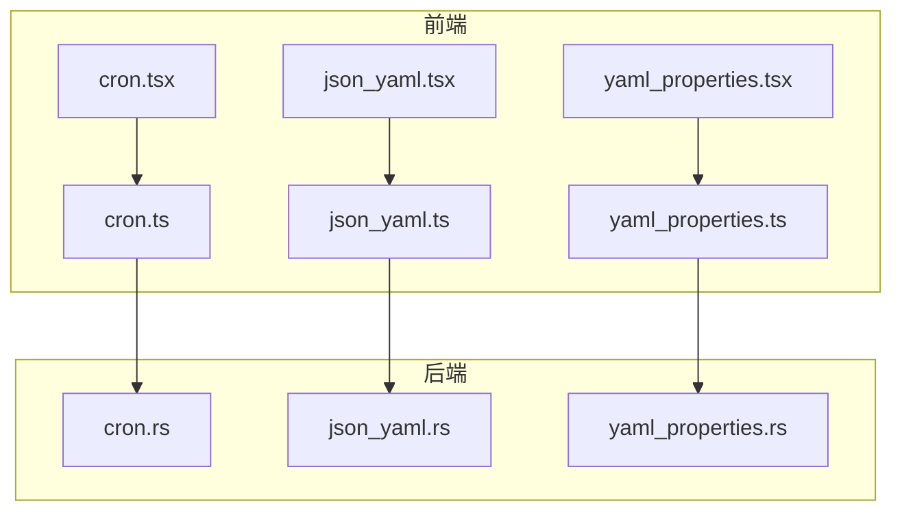
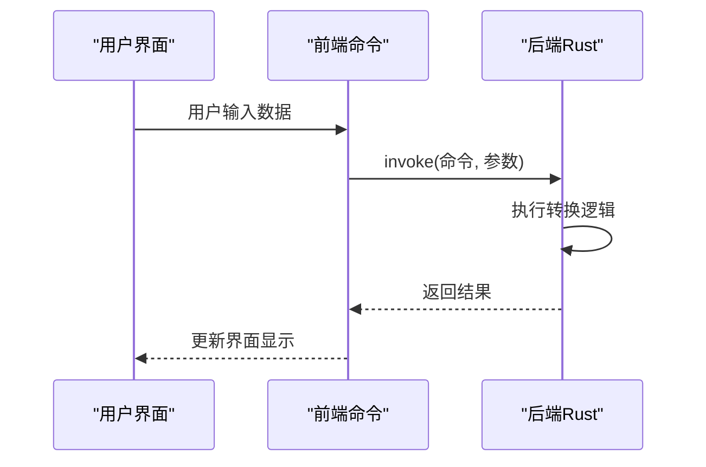
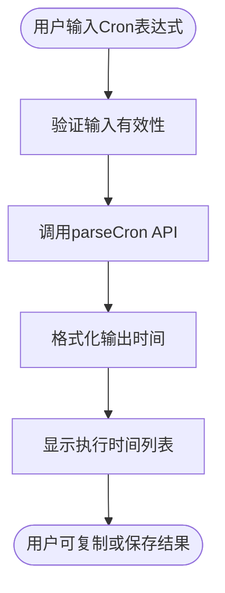
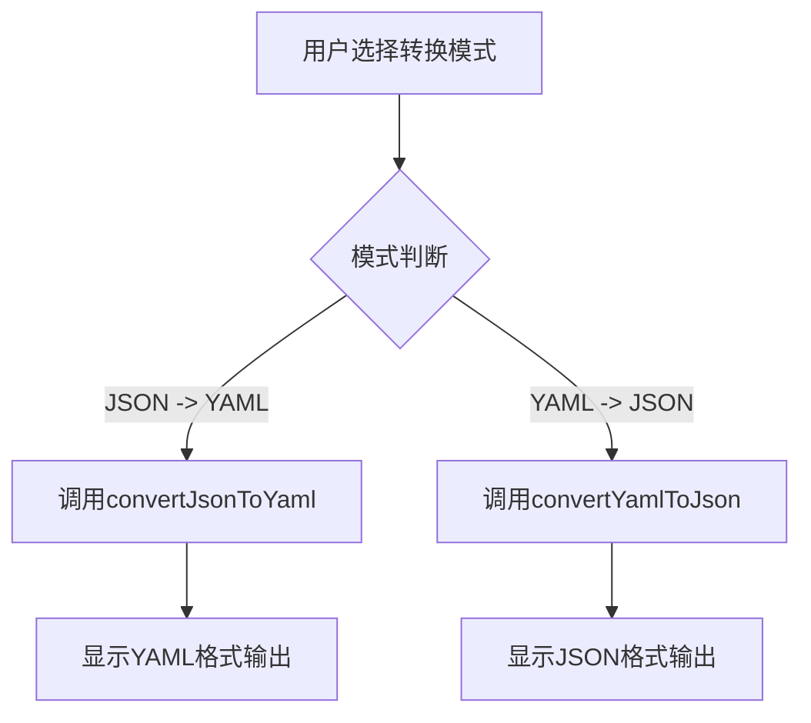
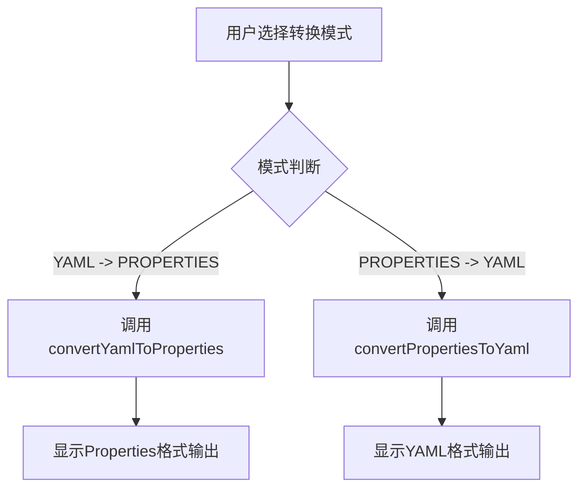
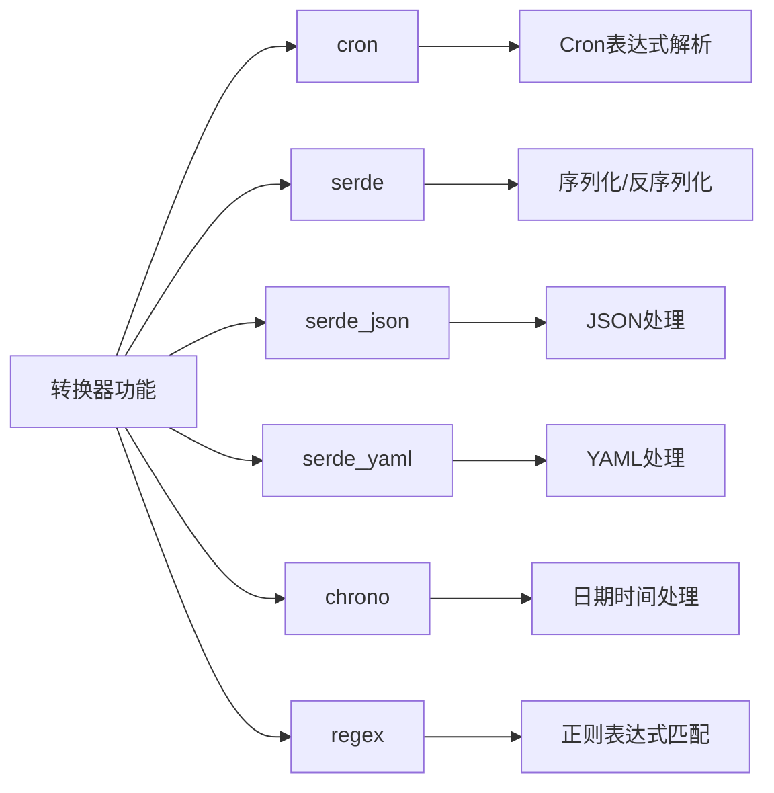

# 转换器

<cite>
**本文档中引用的文件**  
- [cron.ts](file://src/command/converter/cron.ts)
- [json_yaml.ts](file://src/command/converter/json_yaml.ts)
- [yaml_properties.ts](file://src/command/converter/yaml_properties.ts)
- [cron.tsx](file://src/view/converter/cron.tsx)
- [json_yaml.tsx](file://src/view/converter/json_yaml.tsx)
- [yaml_properties.tsx](file://src/view/converter/yaml_properties.tsx)
- [cron.rs](file://src-tauri/src/command/converter/cron.rs)
- [json_yaml.rs](file://src-tauri/src/command/converter/json_yaml.rs)
- [yaml_properties.rs](file://src-tauri/src/command/converter/yaml_properties.rs)
- [Cargo.toml](file://src-tauri/Cargo.toml)
</cite>

## 目录
1. [简介](#简介)
2. [项目结构](#项目结构)
3. [核心组件](#核心组件)
4. [架构概述](#架构概述)
5. [详细组件分析](#详细组件分析)
6. [依赖分析](#依赖分析)
7. [性能考虑](#性能考虑)
8. [故障排除指南](#故障排除指南)
9. [结论](#结论)

## 简介
devkimi转换器功能提供三种核心数据格式转换能力：Cron表达式解析、JSON/YAML互转和YAML/Properties互转。该功能采用Tauri框架构建，前端使用SolidJS实现用户界面，后端使用Rust语言处理核心转换逻辑，确保高性能和安全性。文档将深入解析各转换功能的技术实现、前后端交互机制、API接口说明、错误处理策略和性能特征，为开发者提供完整的实现细节和最佳实践。

## 项目结构
转换器功能的代码分布在前端和后端两个主要目录中。前端代码位于`src/view/converter/`和`src/command/converter/`目录，负责用户界面展示和前端逻辑处理。后端Rust代码位于`src-tauri/src/command/converter/`目录，实现核心转换算法。前后端通过Tauri的`invoke`机制进行异步通信。

**图示来源**  
- [cron.tsx](file://src/view/converter/cron.tsx#L1-L93)
- [json_yaml.tsx](file://src/view/converter/json_yaml.tsx#L1-L107)
- [yaml_properties.tsx](file://src/view/converter/yaml_properties.tsx#L1-L111)
- [cron.ts](file://src/command/converter/cron.ts#L1-L8)
- [json_yaml.ts](file://src/command/converter/json_yaml.ts#L1-L12)
- [yaml_properties.ts](file://src/command/converter/yaml_properties.ts#L1-L12)

**本节来源**  
- [src/view/converter/](file://src/view/converter/)
- [src/command/converter/](file://src/command/converter/)
- [src-tauri/src/command/converter/](file://src-tauri/src/command/converter/)

## 核心组件
转换器功能的核心组件包括三个独立的转换模块：Cron表达式解析器、JSON/YAML转换器和YAML/Properties转换器。每个模块都遵循相同的架构模式：前端视图组件处理用户交互，前端命令模块封装Tauri调用，后端Rust实现执行实际转换逻辑。这种分层架构确保了代码的可维护性和可扩展性。

**本节来源**  
- [cron.ts](file://src/command/converter/cron.ts#L3-L5)
- [json_yaml.ts](file://src/command/converter/json_yaml.ts#L3-L9)
- [yaml_properties.ts](file://src/command/converter/yaml_properties.ts#L3-L9)
- [cron.rs](file://src-tauri/src/command/converter/cron.rs#L6-L16)
- [json_yaml.rs](file://src-tauri/src/command/converter/json_yaml.rs#L3-L13)
- [yaml_properties.rs](file://src-tauri/src/command/converter/yaml_properties.rs#L8-L18)

## 架构概述
转换器功能采用前后端分离的架构设计，前端负责用户界面和交互逻辑，后端负责数据处理和转换算法。前后端通过Tauri框架提供的安全RPC机制进行通信。这种架构充分利用了Rust语言在系统编程和数据处理方面的优势，同时保持了前端开发的灵活性和响应性。

**图示来源**  
- [cron.tsx](file://src/view/converter/cron.tsx#L21-L30)
- [cron.ts](file://src/command/converter/cron.ts#L3-L5)
- [cron.rs](file://src-tauri/src/command/converter/cron.rs#L6-L16)

## 详细组件分析

### Cron表达式解析器分析
Cron表达式解析器允许用户输入Cron表达式并生成相应的计划执行时间列表。前端提供配置选项，包括输出格式和计划数量，用户输入Cron表达式后，系统会实时生成并显示未来的执行时间。

#### 前端实现
前端使用SolidJS的响应式系统，当用户修改Cron表达式、输出格式或计划数量时，自动触发重新计算。界面提供复制、保存和重新生成按钮，增强用户体验。

**图示来源**  
- [cron.tsx](file://src/view/converter/cron.tsx#L21-L30)
- [cron.ts](file://src/command/converter/cron.ts#L3-L5)

**本节来源**  
- [cron.tsx](file://src/view/converter/cron.tsx#L1-L93)
- [cron.ts](file://src/command/converter/cron.ts#L1-L8)
- [cron.rs](file://src-tauri/src/command/converter/cron.rs#L6-L16)

### JSON/YAML互转分析
JSON/YAML互转功能提供双向数据格式转换，支持JSON转YAML和YAML转JSON。用户可以通过开关选择转换方向，系统会根据选择自动调整输入和输出的语法高亮。

#### 前端实现
前端使用`Show`组件根据转换模式动态切换编辑器的语言模式和占位符文本。当输入内容变化时，自动触发相应的转换函数并更新输出结果。

**图示来源**  
- [json_yaml.tsx](file://src/view/converter/json_yaml.tsx#L27-L35)
- [json_yaml.ts](file://src/command/converter/json_yaml.ts#L3-L9)

**本节来源**  
- [json_yaml.tsx](file://src/view/converter/json_yaml.tsx#L1-L107)
- [json_yaml.ts](file://src/command/converter/json_yaml.ts#L1-L12)
- [json_yaml.rs](file://src-tauri/src/command/converter/json_yaml.rs#L3-L13)

### YAML/Properties互转分析
YAML/Properties互转功能支持YAML与Java Properties格式之间的双向转换。该功能需要处理嵌套结构和特殊字符，确保数据在不同格式间的准确转换。

#### 前端实现
前端界面与JSON/YAML转换器类似，使用开关选择转换方向，并根据模式动态调整编辑器的语法高亮和占位符。

**图示来源**  
- [yaml_properties.tsx](file://src/view/converter/yaml_properties.tsx#L27-L38)
- [yaml_properties.ts](file://src/command/converter/yaml_properties.ts#L3-L9)

**本节来源**  
- [yaml_properties.tsx](file://src/view/converter/yaml_properties.tsx#L1-L111)
- [yaml_properties.ts](file://src/command/converter/yaml_properties.ts#L1-L12)
- [yaml_properties.rs](file://src-tauri/src/command/converter/yaml_properties.rs#L8-L18)

## 依赖分析
转换器功能依赖多个Rust crate来实现核心功能。这些依赖在`Cargo.toml`文件中明确定义，确保了版本兼容性和构建可重现性。

**图示来源**  
- [Cargo.toml](file://src-tauri/Cargo.toml#L20-L43)
- [cron.rs](file://src-tauri/src/command/converter/cron.rs#L1-L3)
- [json_yaml.rs](file://src-tauri/src/command/converter/json_yaml.rs#L1-L2)
- [yaml_properties.rs](file://src-tauri/src/command/converter/yaml_properties.rs#L1-L4)

**本节来源**  
- [Cargo.toml](file://src-tauri/Cargo.toml#L20-L43)
- [cron.rs](file://src-tauri/src/command/converter/cron.rs#L1-L22)
- [json_yaml.rs](file://src-tauri/src/command/converter/json_yaml.rs#L1-L19)
- [yaml_properties.rs](file://src-tauri/src/command/converter/yaml_properties.rs#L1-L199)

## 性能考虑
转换器功能在设计时充分考虑了性能因素。后端使用Rust语言实现，确保了高效的内存管理和执行速度。对于Cron表达式解析，使用`cron` crate的迭代器模式，避免一次性生成大量数据。对于JSON/YAML转换，利用`serde`系列crate的零拷贝特性，减少内存分配。YAML/Properties转换中，使用正则表达式预编译和BTreeMap保持键的有序性，优化了转换效率。

**本节来源**  
- [cron.rs](file://src-tauri/src/command/converter/cron.rs#L10-L14)
- [json_yaml.rs](file://src-tauri/src/command/converter/json_yaml.rs#L5-L6)
- [yaml_properties.rs](file://src-tauri/src/command/converter/yaml_properties.rs#L62-L76)

## 故障排除指南
转换器功能实现了完善的错误处理机制，能够捕获并报告各种转换错误。常见问题及解决方案包括：

- **Cron表达式语法错误**：检查Cron表达式格式是否正确，确保有6或7个字段
- **JSON/YAML格式错误**：验证输入数据的语法正确性，确保括号和引号匹配
- **Properties键为空**：确保Properties文件中的每个键值对都有有效的键名
- **数组索引无效**：检查YAML中的数组索引是否为非负整数

错误信息会通过前端界面显示，帮助用户快速定位和解决问题。

**本节来源**  
- [cron.rs](file://src-tauri/src/command/converter/cron.rs#L18-L21)
- [json_yaml.rs](file://src-tauri/src/command/converter/json_yaml.rs#L15-L18)
- [yaml_properties.rs](file://src-tauri/src/command/converter/yaml_properties.rs#L190-L198)

## 结论
devkimi转换器功能通过前后端协同工作，提供了高效、可靠的Cron表达式解析、JSON/YAML互转和YAML/Properties互转能力。前端使用SolidJS实现响应式用户界面，后端利用Rust语言和成熟的crate生态系统确保转换的准确性和性能。该架构设计合理，代码结构清晰，易于维护和扩展。开发者可以基于此模式实现其他数据格式转换功能，进一步丰富应用的功能集。