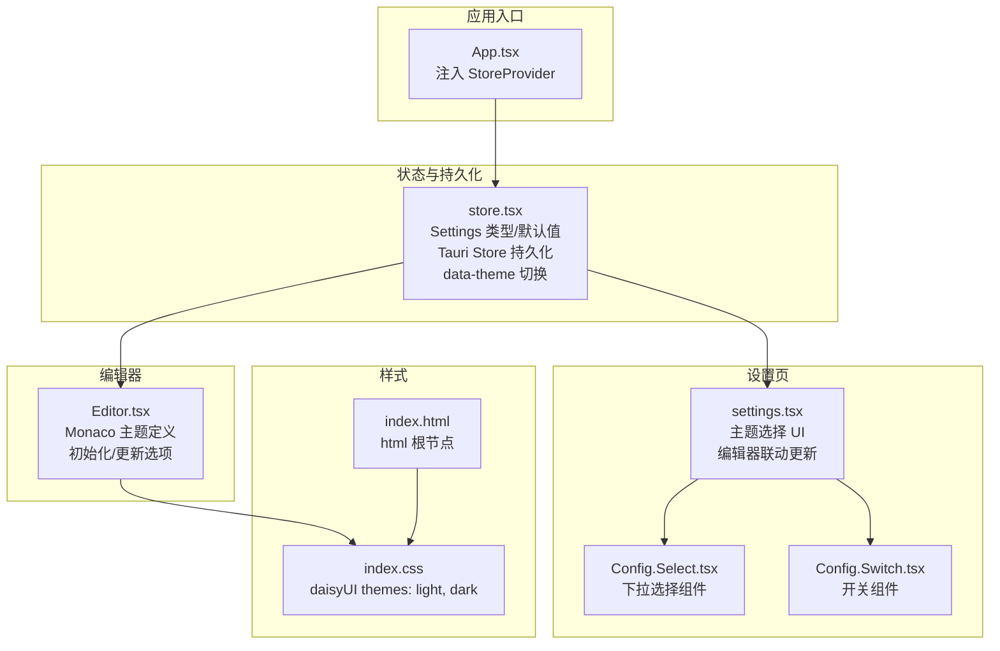
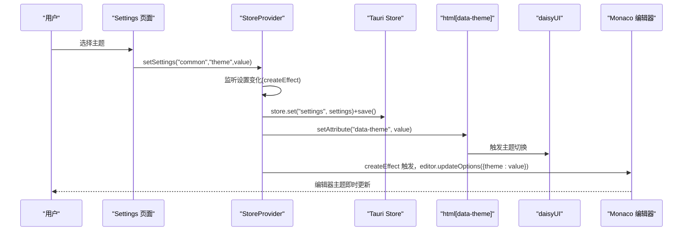
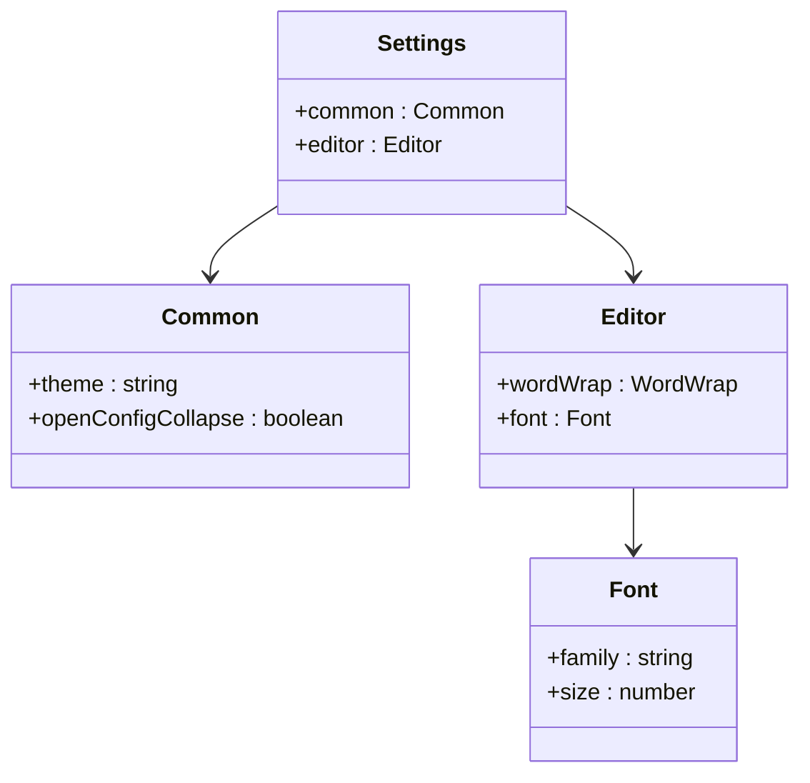
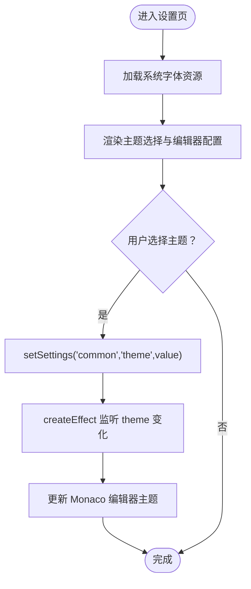
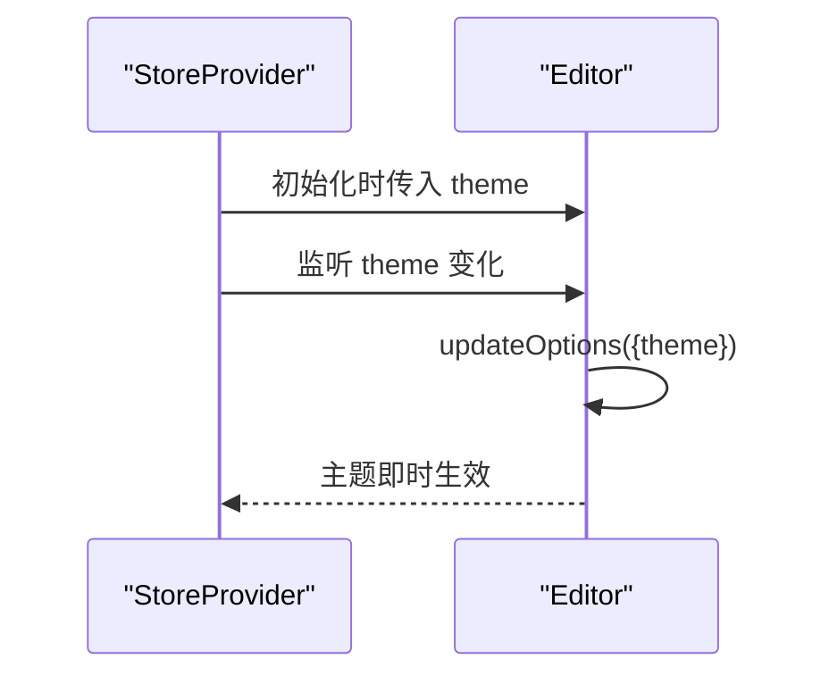
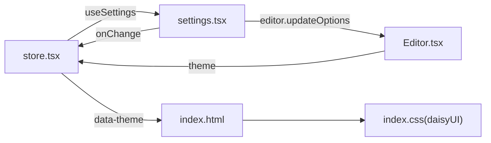

# 主题配置

<cite>
**本文引用的文件**
- [src/store.tsx](file://src/store.tsx)
- [src/view/settings.tsx](file://src/view/settings.tsx)
- [src/component/Editor.tsx](file://src/component/Editor.tsx)
- [src/index.css](file://src/index.css)
- [src/App.tsx](file://src/App.tsx)
- [src/component/Config/Select.tsx](file://src/component/Config/Select.tsx)
- [src/component/Config/Switch.tsx](file://src/component/Config/Switch.tsx)
- [index.html](file://index.html)
</cite>

## 目录
1. [简介](#简介)
2. [项目结构](#项目结构)
3. [核心组件](#核心组件)
4. [架构总览](#架构总览)
5. [详细组件分析](#详细组件分析)
6. [依赖关系分析](#依赖关系分析)
7. [性能考量](#性能考量)
8. [故障排查指南](#故障排查指南)
9. [结论](#结论)
10. [附录：自定义主题与最佳实践](#附录自定义主题与最佳实践)

## 简介
本文件围绕 devkimi 应用的主题配置进行系统化文档化，重点解析以下方面：
- 主题模式（light/dark）在状态层的定义与持久化实现
- Settings 页面中主题切换 UI 的交互流程与联动效果
- 主题配置对应用界面样式的影响范围（背景色、文字颜色、组件外观）
- 主题配置的读取、更新与本地存储（Tauri Store）的技术细节
- 自定义主题的扩展方法与最佳实践

## 项目结构
主题配置涉及的核心文件与职责如下：
- 状态与持久化：src/store.tsx
- 设置页 UI：src/view/settings.tsx
- 编辑器主题与样式：src/component/Editor.tsx
- 全局样式与 daisyUI 主题：src/index.css
- 应用入口与 Provider 注入：src/App.tsx
- 设置页配置组件：src/component/Config/Select.tsx、src/component/Config/Switch.tsx
- HTML 根节点与主题属性：index.html

图表来源
- [src/App.tsx](file://src/App.tsx#L1-L47)
- [src/store.tsx](file://src/store.tsx#L1-L88)
- [src/view/settings.tsx](file://src/view/settings.tsx#L1-L122)
- [src/component/Config/Select.tsx](file://src/component/Config/Select.tsx#L1-L30)
- [src/component/Config/Switch.tsx](file://src/component/Config/Switch.tsx#L1-L24)
- [src/component/Editor.tsx](file://src/component/Editor.tsx#L1-L139)
- [src/index.css](file://src/index.css#L1-L17)
- [index.html](file://index.html#L1-L15)

章节来源
- [src/store.tsx](file://src/store.tsx#L1-L88)
- [src/view/settings.tsx](file://src/view/settings.tsx#L1-L122)
- [src/component/Editor.tsx](file://src/component/Editor.tsx#L1-L139)
- [src/index.css](file://src/index.css#L1-L17)
- [src/App.tsx](file://src/App.tsx#L1-L47)
- [src/component/Config/Select.tsx](file://src/component/Config/Select.tsx#L1-L30)
- [src/component/Config/Switch.tsx](file://src/component/Config/Switch.tsx#L1-L24)
- [index.html](file://index.html#L1-L15)

## 核心组件
- Settings 类型与默认值：定义了主题字段 common.theme 的可选值为 "light" 或 "dark"，并提供默认值。
- StoreProvider：负责加载与保存设置，监听设置变更并通过 data-theme 属性切换全局主题。
- Settings 页面：提供主题选择 UI，绑定 common.theme 并联动编辑器主题。
- Monaco 编辑器：内置 light/dark 两种主题，初始化时使用当前主题，后续随设置更新而动态切换。
- daisyUI 主题：通过 CSS 插件启用 light/dark 两套主题，配合 data-theme 生效。

章节来源
- [src/store.tsx](file://src/store.tsx#L1-L88)
- [src/view/settings.tsx](file://src/view/settings.tsx#L1-L122)
- [src/component/Editor.tsx](file://src/component/Editor.tsx#L1-L139)
- [src/index.css](file://src/index.css#L1-L17)

## 架构总览
主题配置的端到端流程如下：
- 应用启动时，StoreProvider 在挂载阶段加载本地存储的设置；若无则使用默认值。
- 用户在设置页选择主题后，通过 setSettings 更新 common.theme。
- StoreProvider 的副作用监听到设置变化，将 settings 写回本地存储，并将 data-theme 设置到 html 根节点。
- daisyUI 基于 data-theme 自动切换组件样式。
- Monaco 编辑器初始化时读取当前主题，随后根据设置变化动态更新主题。

图表来源
- [src/view/settings.tsx](file://src/view/settings.tsx#L1-L122)
- [src/store.tsx](file://src/store.tsx#L1-L88)
- [src/component/Editor.tsx](file://src/component/Editor.tsx#L1-L139)
- [src/index.css](file://src/index.css#L1-L17)
- [index.html](file://index.html#L1-L15)

## 详细组件分析

### 状态模型与持久化（store.tsx）
- 数据结构
  - Settings.common.theme：字符串枚举，支持 "light"、"dark"
  - Settings.common.openConfigCollapse：布尔值，控制设置页默认展开
  - Settings.editor：包含字体家族、字号、自动换行等编辑器配置
- 默认值
  - common.theme 默认为 "dark"
  - common.openConfigCollapse 默认为 true
- 加载与保存
  - onMount 阶段通过 Tauri Store 加载 "settings" 键，若不存在则回退默认值
  - createEffect 监听设置变化，写入 store.json 并保存
- 主题切换
  - 另一个 createEffect 将 settings.common.theme 同步到 html 的 data-theme 属性，驱动 daisyUI 主题切换

图表来源
- [src/store.tsx](file://src/store.tsx#L1-L88)

章节来源
- [src/store.tsx](file://src/store.tsx#L1-L88)

### 设置页主题切换（settings.tsx）
- UI 组件
  - 主题选择：Config.Select，选项来源于常量数组 ["light","dark"]
  - 开关：Config.Switch 控制配置区域默认展开
- 交互逻辑
  - 选择主题后，通过 setSettings("common","theme",value) 更新状态
  - createEffect 监听 settings.common.theme，同步更新已注册的 Monaco 编辑器主题
  - 字体、字号、自动换行等编辑器配置也通过 createEffect 联动更新

图表来源
- [src/view/settings.tsx](file://src/view/settings.tsx#L1-L122)
- [src/component/Config/Select.tsx](file://src/component/Config/Select.tsx#L1-L30)

章节来源
- [src/view/settings.tsx](file://src/view/settings.tsx#L1-L122)
- [src/component/Config/Select.tsx](file://src/component/Config/Select.tsx#L1-L30)
- [src/component/Config/Switch.tsx](file://src/component/Config/Switch.tsx#L1-L24)

### Monaco 编辑器主题（Editor.tsx）
- 主题定义
  - 内置 light/dark 两种主题，分别设置编辑器背景色等
- 初始化与更新
  - 初始化时从 settings.common.theme 读取主题
  - createEffect 监听 settings.common.theme 并调用 updateOptions({ theme })
- 与 daisyUI 的关系
  - daisyUI 作用于页面组件；Monaco 主题独立于 daisyUI，但两者共同决定整体观感

图表来源
- [src/component/Editor.tsx](file://src/component/Editor.tsx#L1-L139)
- [src/store.tsx](file://src/store.tsx#L1-L88)

章节来源
- [src/component/Editor.tsx](file://src/component/Editor.tsx#L1-L139)

### 全局样式与 daisyUI（index.css）
- daisyUI 启用 light/dark 两套主题
- 通过 html 根节点的 data-theme 属性驱动 daisyUI 主题切换
- index.html 中的 html 标签作为根节点，承载 data-theme

章节来源
- [src/index.css](file://src/index.css#L1-L17)
- [index.html](file://index.html#L1-L15)

## 依赖关系分析
- StoreProvider 依赖 Tauri Store 进行持久化
- Settings 页面依赖 useSettings 提供的状态与 setter
- Editor 组件依赖 useSettings 获取当前主题并动态更新
- daisyUI 依赖 html 的 data-theme 属性
- Config 组件（Select/Switch）用于构建设置页 UI

图表来源
- [src/store.tsx](file://src/store.tsx#L1-L88)
- [src/view/settings.tsx](file://src/view/settings.tsx#L1-L122)
- [src/component/Editor.tsx](file://src/component/Editor.tsx#L1-L139)
- [src/index.css](file://src/index.css#L1-L17)
- [index.html](file://index.html#L1-L15)

章节来源
- [src/store.tsx](file://src/store.tsx#L1-L88)
- [src/view/settings.tsx](file://src/view/settings.tsx#L1-L122)
- [src/component/Editor.tsx](file://src/component/Editor.tsx#L1-L139)
- [src/index.css](file://src/index.css#L1-L17)
- [index.html](file://index.html#L1-L15)

## 性能考量
- 状态追踪
  - 使用 deep tracking 监听设置变化，避免不必要的重渲染
- 存储写入
  - 仅在设置变化时写入，且异步保存，减少阻塞
- 编辑器更新
  - 仅在主题变化时更新编辑器主题，避免频繁全量刷新
- 字体加载
  - 系统字体列表异步加载，不影响首屏渲染

章节来源
- [src/store.tsx](file://src/store.tsx#L1-L88)
- [src/view/settings.tsx](file://src/view/settings.tsx#L1-L122)

## 故障排查指南
- 主题未生效
  - 检查 html 根节点是否存在 data-theme 属性，以及其值是否与 settings.common.theme 一致
  - 确认 daisyUI 已正确启用 light/dark 主题
- 编辑器主题不随设置页变化
  - 确保 Settings 页面已将编辑器实例注册到数组并在 createEffect 中被遍历更新
  - 检查 Monaco 主题名称是否与内置 light/dark 匹配
- 设置未持久化
  - 确认 onMount 成功加载 store.json 中的 "settings" 键
  - 检查 createEffect 是否触发写入与保存
- 字体列表为空
  - 确认 getSystemFonts 命令可用且返回非空结果

章节来源
- [src/store.tsx](file://src/store.tsx#L1-L88)
- [src/view/settings.tsx](file://src/view/settings.tsx#L1-L122)
- [src/component/Editor.tsx](file://src/component/Editor.tsx#L1-L139)

## 结论
devkimi 的主题配置采用“状态驱动 + 本地持久化 + 主题属性切换”的设计，实现了：
- 明确的数据结构与默认值
- 即时的 UI 切换与编辑器联动
- 通过 data-theme 与 daisyUI 实现组件级主题切换
- 通过 Tauri Store 实现跨会话持久化

该方案简洁可靠，易于扩展与维护。

## 附录：自定义主题与最佳实践
- 自定义 daisyUI 主题
  - 在 index.css 中添加自定义主题配置，确保与 data-theme 对应
  - 若需覆盖变量，可在 @layer utilities 中补充
- 自定义 Monaco 主题
  - 在 Editor.tsx 中使用 defineTheme 定义新主题，并在初始化与更新路径中引用
  - 注意编辑器背景色等关键颜色与 daisyUI 主题协调
- 最佳实践
  - 保持 Settings.common.theme 的可选值与 daisyUI 主题集合一致
  - 使用 createEffect 精准监听需要更新的设置项，避免过度更新
  - 对编辑器主题更新采用批量合并策略，减少多次 updateOptions 调用
  - 为新主题提供清晰的命名与注释，便于团队协作与维护

章节来源
- [src/index.css](file://src/index.css#L1-L17)
- [src/component/Editor.tsx](file://src/component/Editor.tsx#L1-L139)
- [src/store.tsx](file://src/store.tsx#L1-L88)