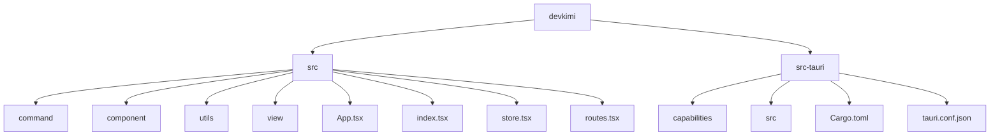
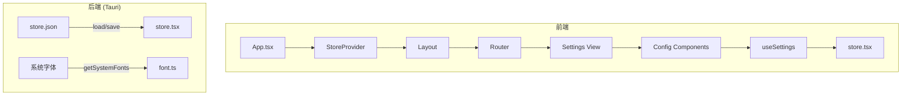
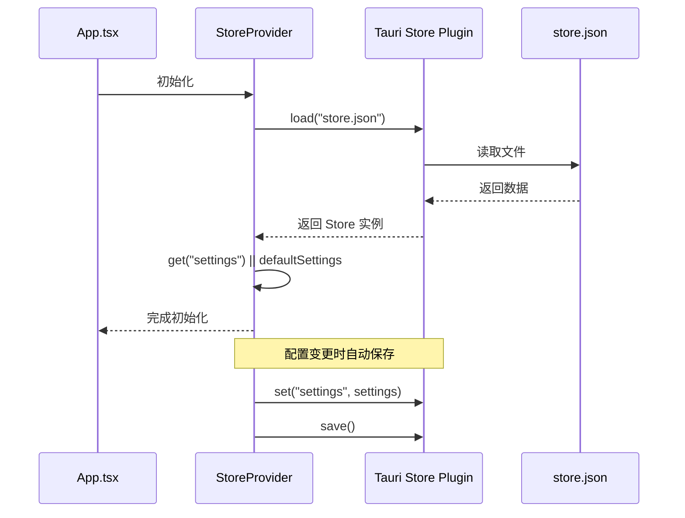
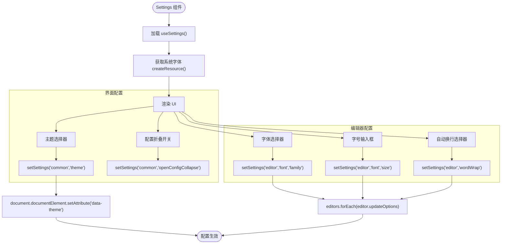

# 应用配置

<cite>
**本文档中引用的文件**  
- [store.tsx](file://src/store.tsx)
- [settings.tsx](file://src/view/settings.tsx)
- [Config/index.tsx](file://src/component/Config/index.tsx)
- [Editor.tsx](file://src/component/Editor.tsx)
- [App.tsx](file://src/App.tsx)
- [routes.tsx](file://src/routes.tsx)
- [Input.tsx](file://src/component/Config/Input.tsx)
- [Select.tsx](file://src/component/Config/Select.tsx)
- [Switch.tsx](file://src/component/Config/Switch.tsx)
- [Option.tsx](file://src/component/Config/Option.tsx)
</cite>

## 目录
1. [简介](#简介)
2. [项目结构](#项目结构)
3. [核心组件](#核心组件)
4. [架构概览](#架构概览)
5. [详细组件分析](#详细组件分析)
6. [依赖分析](#依赖分析)
7. [性能考虑](#性能考虑)
8. [故障排除指南](#故障排除指南)
9. [结论](#结论)

## 简介
本项目为 DevKimi，一个基于 Tauri 和 SolidJS 构建的桌面端开发者工具集。其核心功能包括格式化、编解码、文本处理、生成器、转换器和加解密等。本配置系统文档重点分析其状态管理机制、用户偏好设置的数据结构与持久化方案，以及配置界面的实现方式。

## 项目结构



**图示来源**  
- [store.tsx](file://src/store.tsx)
- [routes.tsx](file://src/routes.tsx)

## 核心组件

DevKimi 的核心组件包括状态管理（`store.tsx`）、路由系统（`routes.tsx`）、UI 组件库（`component/`）和视图层（`view/`）。其中，`store.tsx` 使用 `createStore` 实现了响应式状态管理，`settings.tsx` 提供了用户配置界面。

**章节来源**  
- [store.tsx](file://src/store.tsx#L1-L88)
- [settings.tsx](file://src/view/settings.tsx#L1-L122)

## 架构概览



**图示来源**  
- [App.tsx](file://src/App.tsx#L1-L47)
- [store.tsx](file://src/store.tsx#L1-L88)
- [settings.tsx](file://src/view/settings.tsx#L1-L122)

## 详细组件分析

### 状态管理机制分析

DevKimi 使用 SolidJS 的 `createStore` 实现状态管理，并通过 `@tauri-apps/plugin-store` 插件实现配置的持久化存储。

```mermaid
classDiagram
class Settings {
+common : { theme : string, openConfigCollapse : boolean }
+editor : { wordWrap : WordWrap, font : { family : string, size : number } }
}
class StoreProvider {
-store : Store | null
+settings : [Settings, SetStoreFunction]
+onMount() : void
+createEffect() : void
}
class useSettings {
+() : [Settings, SetStoreFunction]
}
StoreProvider --> Settings : "包含"
useSettings --> StoreProvider : "依赖"
```

**图示来源**  
- [store.tsx](file://src/store.tsx#L20-L39)

#### 配置数据结构与持久化

配置数据结构定义在 `Settings` 类型中，包含 `common` 和 `editor` 两个子对象。`common` 包含主题和配置折叠状态，`editor` 包含编辑器的自动换行、字体和字号设置。

持久化通过 `@tauri-apps/plugin-store` 插件实现，配置数据存储在 `store.json` 文件中。应用启动时从文件加载配置，配置变更时自动保存。



**图示来源**  
- [store.tsx](file://src/store.tsx#L45-L65)

### 配置界面实现分析

配置界面由 `settings.tsx` 实现，使用 `Config` 组件库构建用户友好的配置表单。



**图示来源**  
- [settings.tsx](file://src/view/settings.tsx#L17-L122)
- [Config/index.tsx](file://src/component/Config/index.tsx#L1-L37)

#### 配置项功能详解

| 配置项 | 功能描述 | 可选值 | 实际影响 |
|--------|----------|--------|----------|
| **主题** | 切换主界面的主题 | "light", "dark" | 修改 `document.documentElement` 的 `data-theme` 属性，触发 CSS 主题切换 |
| **配置默认展开** | 控制工具界面顶部配置区域的默认展开状态 | true, false | 控制 `Config.Card` 组件的折叠状态 |
| **编辑器字体** | 设置编辑器中显示文字的字体 | 系统字体列表 | 通过 `editor.updateOptions` 修改 Monaco 编辑器的 `fontFamily` |
| **字体大小** | 设置编辑器中显示文字的大小 | 数字（像素） | 通过 `editor.updateOptions` 修改 Monaco 编辑器的 `fontSize` |
| **自动换行** | 控制文本超过编辑器宽度时是否自动换行 | "off", "on", "wordWrapColumn", "bounded" | 通过 `editor.updateOptions` 修改 Monaco 编辑器的 `wordWrap` 选项 |

**章节来源**  
- [settings.tsx](file://src/view/settings.tsx#L53-L105)
- [store.tsx](file://src/store.tsx#L15-L34)

## 依赖分析

```mermaid
graph LR
A[settings.tsx] --> B[store.tsx]
A --> C[Config Components]
A --> D[Editor.tsx]
A --> E[font.ts]
B --> F[@tauri-apps/plugin-store]
B --> G[solid-js/store]
C --> H[tailwind-merge]
D --> I[monaco-editor]
D --> B
```

**图示来源**  
- [settings.tsx](file://src/view/settings.tsx#L9-L12)
- [store.tsx](file://src/store.tsx#L2-L10)
- [Editor.tsx](file://src/component/Editor.tsx#L2-L10)

## 性能考虑

配置系统的性能主要体现在状态更新的响应速度和持久化操作的效率上。`createStore` 提供了高效的响应式更新，`createEffect` 和 `trackStore` 确保了只有在相关配置变更时才触发保存操作，避免了不必要的 I/O 开销。

## 故障排除指南

常见问题及解决方案：

- **配置不保存**：检查 `store.json` 文件的读写权限，确保 Tauri 应用具有 `fs:allow-write-text-file` 权限。
- **主题不生效**：检查 `data-theme` 是否正确应用到 `html` 标签，确认 CSS 主题定义是否完整。
- **字体列表为空**：确认 `getSystemFonts` 命令是否正确执行，检查 Tauri 命令权限。
- **编辑器配置未更新**：确保 `editors` 数组正确收集了编辑器实例，`onSetup` 回调是否被正确调用。

**章节来源**  
- [store.tsx](file://src/store.tsx#L56-L65)
- [settings.tsx](file://src/view/settings.tsx#L30-L46)
- [src-tauri/capabilities/default.json](file://src-tauri/capabilities/default.json#L1-L24)

## 结论

DevKimi 的配置系统设计合理，采用了现代化的响应式状态管理方案，结合 Tauri 的本地存储能力，实现了用户偏好的持久化。通过组件化的方式构建配置界面，代码结构清晰，易于维护和扩展。系统充分利用了 SolidJS 的响应式特性，确保了配置变更的实时性和高效性。