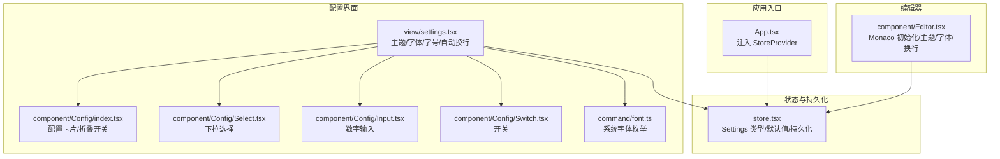
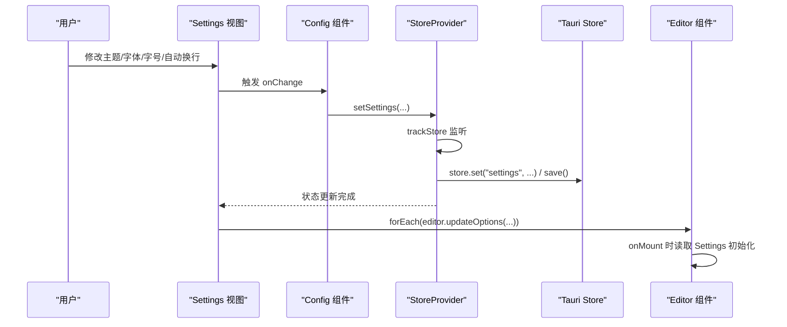
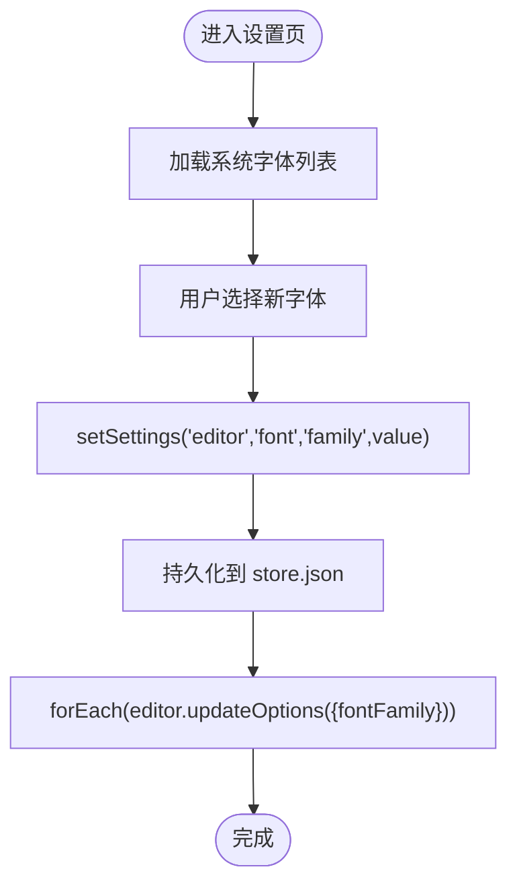
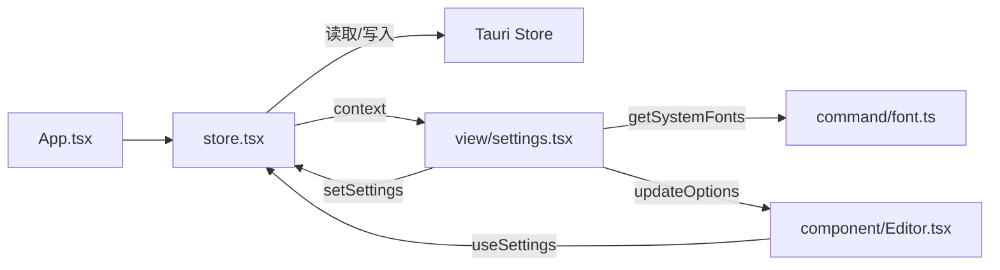

# 编辑器配置

<cite>
**本文引用的文件**
- [src/store.tsx](file://src/store.tsx)
- [src/view/settings.tsx](file://src/view/settings.tsx)
- [src/component/Config/index.tsx](file://src/component/Config/index.tsx)
- [src/component/Config/Select.tsx](file://src/component/Config/Select.tsx)
- [src/component/Config/Input.tsx](file://src/component/Config/Input.tsx)
- [src/component/Config/Switch.tsx](file://src/component/Config/Switch.tsx)
- [src/component/Editor.tsx](file://src/component/Editor.tsx)
- [src/command/font.ts](file://src/command/font.ts)
- [src/App.tsx](file://src/App.tsx)
- [src/index.css](file://src/index.css)
</cite>

## 目录
1. [简介](#简介)
2. [项目结构](#项目结构)
3. [核心组件](#核心组件)
4. [架构总览](#架构总览)
5. [详细组件分析](#详细组件分析)
6. [依赖关系分析](#依赖关系分析)
7. [性能考虑](#性能考虑)
8. [故障排查指南](#故障排查指南)
9. [结论](#结论)
10. [附录](#附录)

## 简介
本文件围绕 devkimi 应用的“编辑器配置”功能，系统性梳理了以下方面：
- 编辑器配置（字体族、字体大小、自动换行）在状态层的数据结构与持久化机制
- 基于 settings 视图组件的 UI 实现与用户交互流程
- 每个配置项的功能、可选值范围及对编辑器实际渲染的影响
- 数据读取、更新与本地存储（Tauri Store）的完整技术细节
- 自定义编辑器样式的代码示例与性能优化建议

## 项目结构
编辑器配置相关的核心文件分布如下：
- 状态与持久化：src/store.tsx
- 配置界面与交互：src/view/settings.tsx
- 配置 UI 组件库：src/component/Config/*
- 编辑器组件：src/component/Editor.tsx
- 字体资源调用：src/command/font.ts
- 应用入口与 Provider 注入：src/App.tsx
- 全局样式与主题：src/index.css

图表来源
- [src/App.tsx](file://src/App.tsx#L1-L47)
- [src/store.tsx](file://src/store.tsx#L1-L88)
- [src/view/settings.tsx](file://src/view/settings.tsx#L1-L122)
- [src/component/Config/index.tsx](file://src/component/Config/index.tsx#L1-L37)
- [src/component/Config/Select.tsx](file://src/component/Config/Select.tsx#L1-L30)
- [src/component/Config/Input.tsx](file://src/component/Config/Input.tsx#L1-L37)
- [src/component/Config/Switch.tsx](file://src/component/Config/Switch.tsx#L1-L24)
- [src/command/font.ts](file://src/command/font.ts#L1-L8)
- [src/component/Editor.tsx](file://src/component/Editor.tsx#L1-L139)

章节来源
- [src/App.tsx](file://src/App.tsx#L1-L47)
- [src/store.tsx](file://src/store.tsx#L1-L88)
- [src/view/settings.tsx](file://src/view/settings.tsx#L1-L122)
- [src/component/Config/index.tsx](file://src/component/Config/index.tsx#L1-L37)
- [src/component/Config/Select.tsx](file://src/component/Config/Select.tsx#L1-L30)
- [src/component/Config/Input.tsx](file://src/component/Config/Input.tsx#L1-L37)
- [src/component/Config/Switch.tsx](file://src/component/Config/Switch.tsx#L1-L24)
- [src/command/font.ts](file://src/command/font.ts#L1-L8)
- [src/component/Editor.tsx](file://src/component/Editor.tsx#L1-L139)

## 核心组件
- Settings 类型与默认值
  - 定义了 common 与 editor 两部分配置，包含主题、配置面板默认展开、自动换行、字体族与字号等字段
  - 默认值：主题为深色、配置默认展开、自动换行关闭、字体族为 SansSerif、字号为 14
- StoreProvider
  - 使用 Solid Store 管理 Settings 状态
  - 在 onMount 时通过 Tauri Store 加载持久化的 settings；每次状态变更后通过 trackStore 触发保存
  - 主题变更时通过 data-theme 属性切换根元素主题
- useSettings
  - 提供上下文访问器，用于在子组件中读取与更新 Settings

章节来源
- [src/store.tsx](file://src/store.tsx#L1-L88)

## 架构总览
编辑器配置的运行时交互链路如下：
- 用户在 settings 页面修改配置项
- 通过 Config 组件触发 setSettings 更新 Settings 状态
- StoreProvider 的 createEffect 监听状态变化并持久化到 Tauri Store
- 同步地，settings 页面的 createEffect 将配置映射到已存在的 Monaco 编辑器实例
- 编辑器组件在初始化时读取 Settings 并应用到 Monaco 实例

图表来源
- [src/view/settings.tsx](file://src/view/settings.tsx#L1-L122)
- [src/component/Config/index.tsx](file://src/component/Config/index.tsx#L1-L37)
- [src/store.tsx](file://src/store.tsx#L1-L88)
- [src/component/Editor.tsx](file://src/component/Editor.tsx#L1-L139)

## 详细组件分析

### 状态模型与持久化（src/store.tsx）
- 数据结构
  - Settings.common：包含 theme（主题）、openConfigCollapse（配置面板默认展开）
  - Settings.editor：包含 wordWrap（自动换行策略）、font.family（字体族）、font.size（字号）
- 默认值
  - theme: "dark"
  - openConfigCollapse: true
  - wordWrap: "off"
  - font.family: "SansSerif"
  - font.size: 14
- 持久化机制
  - onMount 时加载 store.json 中的 "settings" 键，若不存在则回退默认值
  - createEffect 结合 trackStore 监听 settings 变更，异步写入 store.set("settings", ...) 并保存
  - 主题变更时通过设置 documentElement 的 data-theme 属性即时生效

章节来源
- [src/store.tsx](file://src/store.tsx#L1-L88)

### 配置界面与交互（src/view/settings.tsx）
- 主题（common.theme）
  - 可选项："light"、"dark"
  - 影响：切换根元素 data-theme，从而影响 daisyUI 主题与编辑器主题
- 配置默认展开（common.openConfigCollapse）
  - 开关：true/false
  - 影响：控制配置卡片的折叠状态
- 字体（editor.font.family）
  - 来源：通过 getSystemFonts 异步获取系统字体列表
  - 影响：实时预览编辑器字体变化
- 字号（editor.font.size）
  - 输入类型：数字输入
  - 影响：实时预览字号变化
- 自动换行（editor.wordWrap）
  - 可选项："on"、"wordWrapColumn"、"bounded"、"off"
  - 影响：控制文本换行策略

用户交互流程（以字体为例）：

图表来源
- [src/view/settings.tsx](file://src/view/settings.tsx#L1-L122)
- [src/command/font.ts](file://src/command/font.ts#L1-L8)

章节来源
- [src/view/settings.tsx](file://src/view/settings.tsx#L1-L122)
- [src/command/font.ts](file://src/command/font.ts#L1-L8)

### 配置 UI 组件库（src/component/Config/*）
- Config.Card
  - 支持折叠/展开，受 common.openConfigCollapse 控制
  - 内部 children 通过 Solid children 渲染
- Config.Select
  - 下拉选择组件，支持 label/value 映射
- Config.Input/Config.NumberInput
  - 文本与数字输入，提供最小/最大值约束
- Config.Switch
  - 开关组件，支持 on/off 文案

章节来源
- [src/component/Config/index.tsx](file://src/component/Config/index.tsx#L1-L37)
- [src/component/Config/Select.tsx](file://src/component/Config/Select.tsx#L1-L30)
- [src/component/Config/Input.tsx](file://src/component/Config/Input.tsx#L1-L37)
- [src/component/Config/Switch.tsx](file://src/component/Config/Switch.tsx#L1-L24)

### 编辑器组件与配置联动（src/component/Editor.tsx）
- 初始化时机
  - onMount 时创建 Monaco 实例，初始选项从 Settings 读取
  - 主题：common.theme
  - 字体：editor.font.family
  - 字号：editor.font.size
  - 自动换行：editor.wordWrap
- 运行期更新
  - createEffect 监听 props.placeholder 并动态 updateOptions
  - createEffect 监听 props.value 并同步 setValue
- 主题与配置联动
  - settings 页面通过 forEach(editor.updateOptions({...})) 实时更新已存在实例
  - 编辑器内部也通过 data-theme 切换主题

章节来源
- [src/component/Editor.tsx](file://src/component/Editor.tsx#L1-L139)

### 字体资源与系统字体（src/command/font.ts）
- 通过 Tauri invoke 调用后端命令获取系统可用字体列表
- settings 页面使用 createResource 异步加载并转换为 Select 的 options

章节来源
- [src/command/font.ts](file://src/command/font.ts#L1-L8)
- [src/view/settings.tsx](file://src/view/settings.tsx#L1-L122)

### 应用入口与 Provider 注入（src/App.tsx）
- 在路由外层包裹 StoreProvider，确保所有视图可访问 Settings
- 通过 Suspense 包裹子树，保证异步资源加载期间的用户体验

章节来源
- [src/App.tsx](file://src/App.tsx#L1-L47)

### 样式与主题（src/index.css）
- 引入 daisyUI 并启用 light/dark 主题
- 根元素与容器高度/溢出控制，保证编辑器布局稳定

章节来源
- [src/index.css](file://src/index.css#L1-L17)

## 依赖关系分析
- StoreProvider 依赖
  - @tauri-apps/plugin-store：用于持久化
  - @solid-primitives/deep：trackStore 监听深层状态变化
  - Solid Store：createStore 管理 Settings
- Editor 组件依赖
  - Monaco Editor：编辑器核心
  - Tailwind Merge：类名合并
  - lodash：唯一 ID 生成
- Settings 视图依赖
  - Config 组件库：统一的表单控件
  - getSystemFonts：系统字体枚举
  - MonacoEditor 实例数组：用于批量 updateOptions

图表来源
- [src/store.tsx](file://src/store.tsx#L1-L88)
- [src/view/settings.tsx](file://src/view/settings.tsx#L1-L122)
- [src/command/font.ts](file://src/command/font.ts#L1-L8)
- [src/component/Editor.tsx](file://src/component/Editor.tsx#L1-L139)
- [src/App.tsx](file://src/App.tsx#L1-L47)

章节来源
- [src/store.tsx](file://src/store.tsx#L1-L88)
- [src/view/settings.tsx](file://src/view/settings.tsx#L1-L122)
- [src/command/font.ts](file://src/command/font.ts#L1-L8)
- [src/component/Editor.tsx](file://src/component/Editor.tsx#L1-L139)
- [src/App.tsx](file://src/App.tsx#L1-L47)

## 性能考虑
- 状态监听与保存
  - 使用 trackStore 监听深层变更，避免不必要的全量保存
  - 保存采用异步链式调用，避免阻塞 UI
- 编辑器实例更新
  - settings 页面仅对已存在的编辑器实例执行 updateOptions，减少重复创建
  - 对 placeholder、value 的 effect 仅在必要时更新，避免频繁重绘
- 字体加载
  - 系统字体通过 createResource 异步加载，避免阻塞首屏渲染
- 主题切换
  - 通过 data-theme 属性切换，无需重建编辑器即可生效

[本节为通用性能建议，不直接分析具体文件]

## 故障排查指南
- 无法读取或保存配置
  - 检查 onMount 是否成功加载 store.json 中的 "settings" 键
  - 确认 createEffect 中的 trackStore 是否触发保存
- 主题切换无效
  - 确认 documentElement 上是否正确设置了 data-theme
  - 检查 daisyUI 主题是否启用
- 字体/字号/自动换行不生效
  - 确认 settings 页面是否对现有编辑器实例调用了 updateOptions
  - 检查编辑器初始化时是否从 Settings 读取了对应选项
- 系统字体未显示
  - 确认 getSystemFonts 命令是否返回有效列表
  - 检查 createResource 是否正确渲染 options

章节来源
- [src/store.tsx](file://src/store.tsx#L1-L88)
- [src/view/settings.tsx](file://src/view/settings.tsx#L1-L122)
- [src/component/Editor.tsx](file://src/component/Editor.tsx#L1-L139)
- [src/index.css](file://src/index.css#L1-L17)

## 结论
本系统的编辑器配置通过集中状态管理与 Tauri Store 持久化，实现了主题、字体、字号与自动换行的统一配置与即时生效。settings 视图提供了直观的交互体验，Editor 组件负责将配置映射到 Monaco 实例。整体架构清晰、耦合度低、扩展性强，便于后续新增配置项与优化性能。

[本节为总结性内容，不直接分析具体文件]

## 附录

### 编辑器配置项说明与影响
- 主题（common.theme）
  - 可选值："light"、"dark"
  - 影响：切换 daisyUI 主题与编辑器背景色
- 配置默认展开（common.openConfigCollapse）
  - 可选值：布尔
  - 影响：控制配置卡片折叠状态
- 字体（editor.font.family）
  - 可选值：系统字体列表
  - 影响：改变编辑器文本字体
- 字号（editor.font.size）
  - 可选值：数字（受 NumberInput min/max 约束）
  - 影响：改变编辑器文本字号
- 自动换行（editor.wordWrap）
  - 可选值："on"、"wordWrapColumn"、"bounded"、"off"
  - 影响：控制文本换行策略

章节来源
- [src/view/settings.tsx](file://src/view/settings.tsx#L1-L122)
- [src/store.tsx](file://src/store.tsx#L1-L88)
- [src/component/Editor.tsx](file://src/component/Editor.tsx#L1-L139)

### 读取、更新与本地存储的技术细节
- 读取
  - onMount 时通过 store.load("store.json") 获取 settings；若无则使用默认值
- 更新
  - 通过 setSettings 更新 Settings；createEffect 监听并保存
  - settings 视图通过 forEach(editor.updateOptions(...)) 实时更新已有实例
- 本地存储
  - store.set("settings", ...) 后调用 save() 持久化

章节来源
- [src/store.tsx](file://src/store.tsx#L1-L88)
- [src/view/settings.tsx](file://src/view/settings.tsx#L1-L122)

### 自定义编辑器样式的代码示例（路径指引）
- 自定义 Monaco 主题颜色
  - 示例路径：[自定义主题颜色定义](file://src/component/Editor.tsx#L43-L59)
- 扩展编辑器初始化选项
  - 示例路径：[编辑器初始化选项](file://src/component/Editor.tsx#L79-L95)
- 动态更新编辑器选项
  - 示例路径：[批量更新编辑器选项](file://src/view/settings.tsx#L36-L46)

章节来源
- [src/component/Editor.tsx](file://src/component/Editor.tsx#L43-L59)
- [src/component/Editor.tsx](file://src/component/Editor.tsx#L79-L95)
- [src/view/settings.tsx](file://src/view/settings.tsx#L36-L46)