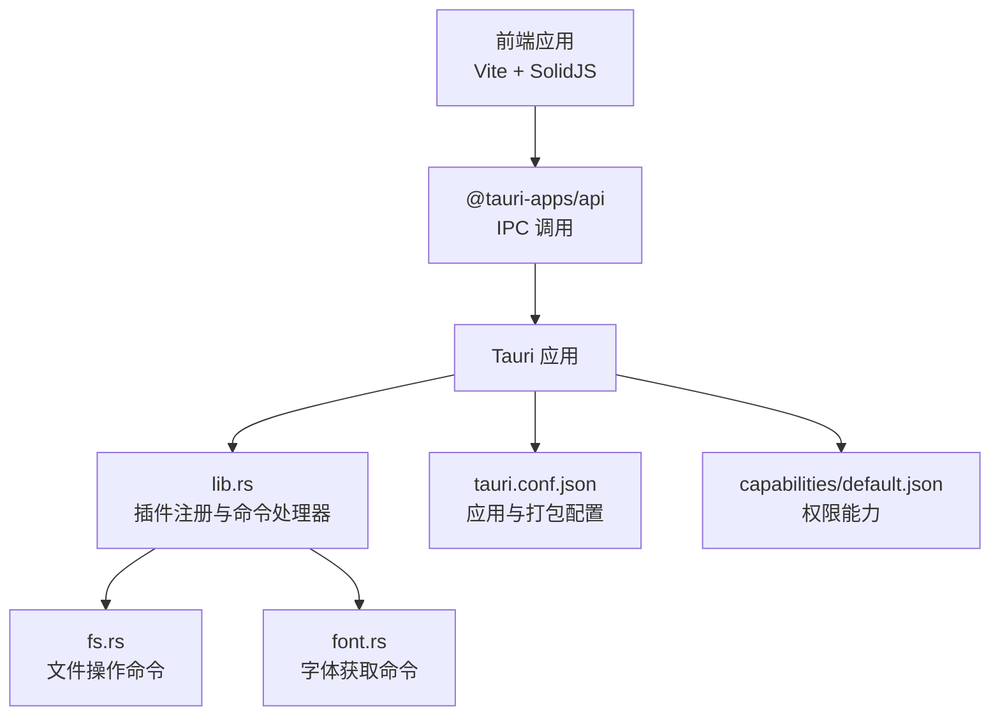
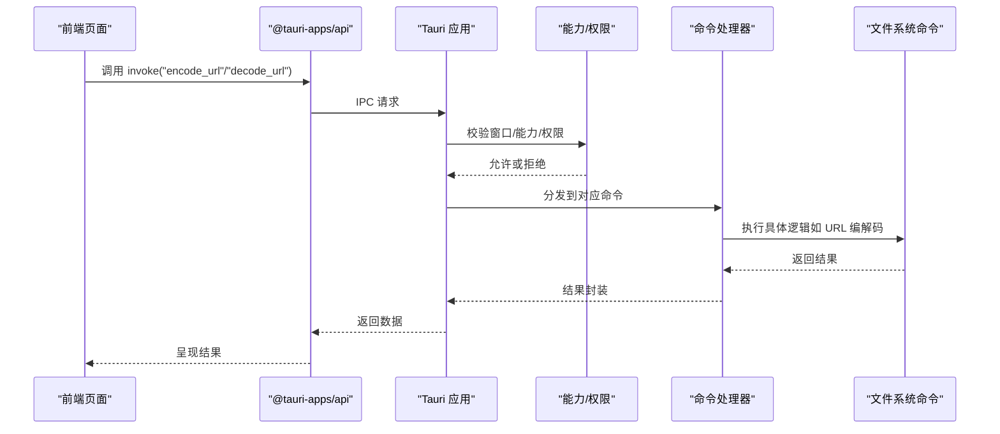
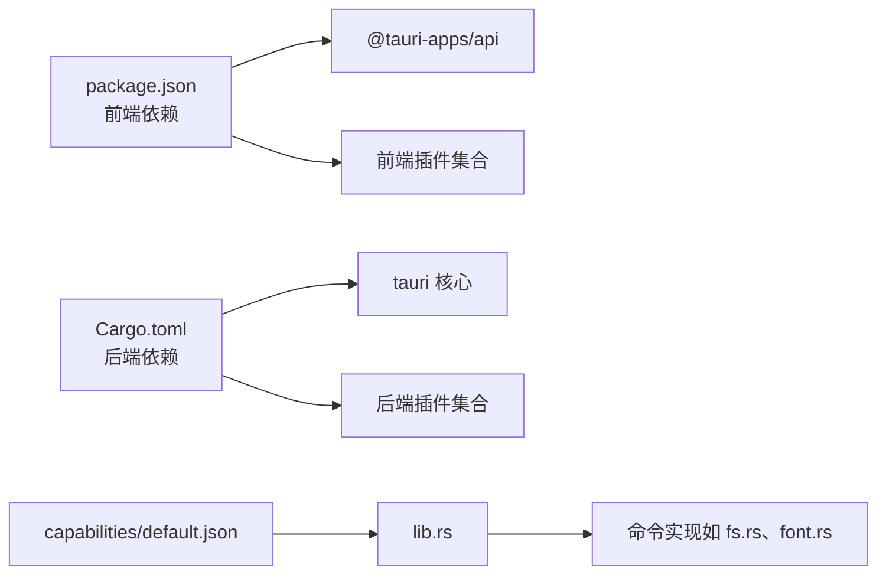

# Tauri 配置

<cite>
**本文引用的文件**
- [tauri.conf.json](file://src-tauri/tauri.conf.json)
- [Cargo.toml](file://src-tauri/Cargo.toml)
- [main.rs](file://src-tauri/src/main.rs)
- [lib.rs](file://src-tauri/src/lib.rs)
- [default.json](file://src-tauri/capabilities/default.json)
- [desktop-schema.json](file://src-tauri/gen/schemas/desktop-schema.json)
- [capabilities.json](file://src-tauri/gen/schemas/capabilities.json)
- [fs.rs](file://src-tauri/src/command/fs.rs)
- [font.rs](file://src-tauri/src/command/font.rs)
- [package.json](file://package.json)
- [build.rs](file://src-tauri/build.rs)
</cite>

## 目录
1. [简介](#简介)
2. [项目结构](#项目结构)
3. [核心组件](#核心组件)
4. [架构总览](#架构总览)
5. [详细组件分析](#详细组件分析)
6. [依赖关系分析](#依赖关系分析)
7. [性能考量](#性能考量)
8. [故障排查指南](#故障排查指南)
9. [结论](#结论)
10. [附录](#附录)

## 简介
本文件面向 devkimi 项目的 Tauri 配置，围绕 src-tauri/tauri.conf.json 的配置项进行深入解析，覆盖应用基本信息、窗口配置、安全与权限、打包与分发等维度，并结合实际代码示例路径说明如何按需定制。同时提供最佳实践与常见问题排查建议，帮助开发者在不直接粘贴代码的前提下理解并正确配置 Tauri。

## 项目结构
devkimi 采用前端（Vite + SolidJS）+ Rust 后端（Tauri）的双层结构：
- 前端：位于根目录，通过 @tauri-apps/api 调用后端命令
- 后端：位于 src-tauri，包含 Tauri 应用入口、能力与权限声明、Rust 命令实现等

图表来源
- [tauri.conf.json](file://src-tauri/tauri.conf.json#L1-L46)
- [lib.rs](file://src-tauri/src/lib.rs#L1-L57)
- [default.json](file://src-tauri/capabilities/default.json#L1-L31)
- [fs.rs](file://src-tauri/src/command/fs.rs#L1-L34)
- [font.rs](file://src-tauri/src/command/font.rs#L1-L29)

章节来源
- [tauri.conf.json](file://src-tauri/tauri.conf.json#L1-L46)
- [Cargo.toml](file://src-tauri/Cargo.toml#L1-L69)
- [lib.rs](file://src-tauri/src/lib.rs#L1-L57)
- [default.json](file://src-tauri/capabilities/default.json#L1-L31)

## 核心组件
- 应用元信息与构建：productName、version、identifier、build（前端产物、开发/构建命令）
- 窗口与界面：windows 列表、窗口尺寸与可调整性、全屏开关
- 安全与权限：CSP、资源协议作用域、能力与权限声明
- 打包与分发：bundle targets、图标清单

章节来源
- [tauri.conf.json](file://src-tauri/tauri.conf.json#L1-L46)
- [Cargo.toml](file://src-tauri/Cargo.toml#L1-L69)
- [default.json](file://src-tauri/capabilities/default.json#L1-L31)

## 架构总览
下图展示从前端调用到后端命令执行的整体流程，以及权限能力如何影响命令访问。

图表来源
- [lib.rs](file://src-tauri/src/lib.rs#L1-L57)
- [default.json](file://src-tauri/capabilities/default.json#L1-L31)
- [fs.rs](file://src-tauri/src/command/fs.rs#L1-L34)

## 详细组件分析

### 应用基本信息与构建
- 字段：productName、version、identifier、build
- 作用与影响：
  - productName/identifier：用于应用标识、安装包命名、系统菜单显示等
  - version：应用版本号，影响更新与日志输出
  - build.frontendDist：指定前端构建产物目录，打包时会被包含
  - build.devUrl：开发时前端服务地址，Tauri 开发模式会加载该地址
  - build.beforeDevCommand/build.beforeBuildCommand：开发/构建前的脚本命令，确保前端先产出 dist
- 定制建议：
  - 前端构建产物目录需与实际一致（当前为 ../dist）
  - 开发命令需与 package.json scripts 对应
- 示例路径参考：
  - [构建配置](file://src-tauri/tauri.conf.json#L6-L11)
  - [前端脚本](file://package.json#L7-L12)

章节来源
- [tauri.conf.json](file://src-tauri/tauri.conf.json#L1-L46)
- [package.json](file://package.json#L1-L43)

### 窗口配置
- 字段：windows[].title、width、height、minWidth、minHeight、resizable、fullscreen
- 作用与影响：
  - 窗口标题：主窗口标签
  - 尺寸与最小尺寸：初始窗口大小与最小可缩放范围
  - resizable：是否允许用户拖拽改变大小
  - fullscreen：是否启动时全屏
- 定制建议：
  - 若需要固定尺寸，将 minWidth/minHeight 与 width/height 设为相同值
  - 在多显示器场景下谨慎开启 fullscreen
- 示例路径参考：
  - [窗口配置](file://src-tauri/tauri.conf.json#L12-L23)

章节来源
- [tauri.conf.json](file://src-tauri/tauri.conf.json#L12-L23)

### 安全与权限
- 安全策略（CSP）：当前为 null，表示未强制 CSP；若需启用，可在生产环境设置严格策略
- 资源协议（assetProtocol）：
  - enable：启用自定义协议加载资源
  - scope：限定可访问的资源路径（当前限制为 $TEMP/**）
- 权限能力（capabilities）：
  - 通过 default.json 声明默认能力，包含窗口 main、核心权限 core:default、剪贴板读写、对话框打开/保存、文件读写、存储读写、opener 打开路径等
  - 生成的 desktop-schema.json 与 capabilities.json 提供了能力与权限的完整模式定义，可用于校验与扩展
- 定制建议：
  - 仅授予必要权限，避免使用通配符路径
  - 如需深链接或自定义协议，结合 opener 权限与系统协议注册
- 示例路径参考：
  - [安全与资源协议](file://src-tauri/tauri.conf.json#L24-L33)
  - [默认能力声明](file://src-tauri/capabilities/default.json#L1-L31)
  - [能力模式定义](file://src-tauri/gen/schemas/desktop-schema.json#L1-L120)
  - [生成的能力清单](file://src-tauri/gen/schemas/capabilities.json#L1-L1)

章节来源
- [tauri.conf.json](file://src-tauri/tauri.conf.json#L24-L33)
- [default.json](file://src-tauri/capabilities/default.json#L1-L31)
- [desktop-schema.json](file://src-tauri/gen/schemas/desktop-schema.json#L1-L120)
- [capabilities.json](file://src-tauri/gen/schemas/capabilities.json#L1-L1)

### 打包与分发
- 字段：bundle.active、bundle.targets、bundle.icon
- 作用与影响：
  - active：是否启用打包
  - targets：打包目标（当前为 all），可按平台选择
  - icon：图标清单，包含多分辨率与平台格式（PNG、ICNS、ICO）
- 定制建议：
  - 按需减少图标数量以缩短打包时间
  - 在 CI 中明确 targets，避免不必要的平台产物
- 示例路径参考：
  - [打包配置](file://src-tauri/tauri.conf.json#L34-L45)

章节来源
- [tauri.conf.json](file://src-tauri/tauri.conf.json#L34-L45)

### 插件与命令集成
- 插件注册：lib.rs 中注册了 store、opener、fs、clipboard-manager、dialog 等插件
- 命令注册：通过 generate_handler! 注册了多个命令，如文件操作、格式化、编码解码、加密等
- 运行入口：main.rs 调用 app_lib::run，最终由 lib.rs 的 run 初始化并运行
- 示例路径参考：
  - [插件与命令注册](file://src-tauri/src/lib.rs#L1-L57)
  - [应用入口](file://src-tauri/src/main.rs#L1-L7)
  - [构建入口](file://src-tauri/build.rs#L1-L4)

章节来源
- [lib.rs](file://src-tauri/src/lib.rs#L1-L57)
- [main.rs](file://src-tauri/src/main.rs#L1-L7)
- [build.rs](file://src-tauri/build.rs#L1-L4)

### 自定义协议与深链接（概念性说明）
- 当前配置未显式声明 deep link 或 custom protocol；若需支持，通常需要：
  - 在操作系统层面注册自定义协议（Windows/Android/macOS 平台注册方式不同）
  - 在能力中授予 opener:allow-open-path 或相关权限
  - 在应用内监听协议事件并处理业务逻辑
- 本仓库中 opener 插件已启用，能力中也包含 opener:allow-open-path 的白名单路径（$TEMP/**），可作为参考扩展

[本节为概念性说明，不直接分析具体文件，故无“章节来源”]

### 权限模型与最佳实践
- 能力（Capability）与权限（Permission）：
  - 能力用于分组与边界控制，决定窗口/WebView 可访问的命令集合
  - 权限以字符串形式声明，支持通配与细粒度路径限制
- 最佳实践：
  - 为不同窗口分配独立能力，降低攻击面
  - 仅授予必要权限，避免使用 $APPDATA 等敏感目录的通配路径
  - 在生产环境启用严格的 CSP
- 示例路径参考：
  - [能力与权限模式](file://src-tauri/gen/schemas/desktop-schema.json#L1-L120)
  - [默认能力清单](file://src-tauri/gen/schemas/capabilities.json#L1-L1)

章节来源
- [desktop-schema.json](file://src-tauri/gen/schemas/desktop-schema.json#L1-L120)
- [capabilities.json](file://src-tauri/gen/schemas/capabilities.json#L1-L1)

## 依赖关系分析
- 前端依赖 @tauri-apps/api 与各插件（clipboard-manager、dialog、fs、opener、store）
- 后端依赖 tauri 与各插件（tauri-plugin-clipboard-manager、tauri-plugin-dialog、tauri-plugin-fs、tauri-plugin-opener、tauri-plugin-store）
- 能力与权限通过 JSON 文件与生成的模式文件共同约束命令访问

图表来源
- [package.json](file://package.json#L1-L43)
- [Cargo.toml](file://src-tauri/Cargo.toml#L1-L69)
- [default.json](file://src-tauri/capabilities/default.json#L1-L31)
- [lib.rs](file://src-tauri/src/lib.rs#L1-L57)
- [fs.rs](file://src-tauri/src/command/fs.rs#L1-L34)
- [font.rs](file://src-tauri/src/command/font.rs#L1-L29)

章节来源
- [package.json](file://package.json#L1-L43)
- [Cargo.toml](file://src-tauri/Cargo.toml#L1-L69)
- [default.json](file://src-tauri/capabilities/default.json#L1-L31)
- [lib.rs](file://src-tauri/src/lib.rs#L1-L57)

## 性能考量
- 构建配置：
  - release profile 中启用了 LTO、优化级别与 strip，有助于减小二进制体积
- 打包配置：
  - targets 为 all，可能增加打包时间；CI 中建议按平台选择
- 建议：
  - 在开发阶段使用增量编译（profile.dev.incremental=true）
  - 控制图标数量与分辨率，避免冗余资源

章节来源
- [Cargo.toml](file://src-tauri/Cargo.toml#L60-L69)
- [tauri.conf.json](file://src-tauri/tauri.conf.json#L34-L45)

## 故障排查指南
- 前端无法加载本地资源
  - 检查 build.frontendDist 是否指向实际构建目录
  - 确认 devUrl 与本地开发服务器一致
  - 参考：[构建配置](file://src-tauri/tauri.conf.json#L6-L11)
- 窗口尺寸异常或不可调整
  - 检查 windows 配置的 width/height 与 resizable 设置
  - 参考：[窗口配置](file://src-tauri/tauri.conf.json#L12-L23)
- 权限不足导致命令失败
  - 检查 capabilities/default.json 中是否授予所需权限
  - 确认命令是否在允许的能力范围内被调用
  - 参考：[默认能力声明](file://src-tauri/capabilities/default.json#L1-L31)
- 打包产物缺失图标或平台不匹配
  - 检查 bundle.icon 清单与实际图标文件是否存在
  - 按需调整 bundle.targets
  - 参考：[打包配置](file://src-tauri/tauri.conf.json#L34-L45)
- 开发模式下控制台弹窗
  - main.rs 中设置了 windows_subsystem，发布版隐藏控制台
  - 参考：[应用入口](file://src-tauri/src/main.rs#L1-L7)

章节来源
- [tauri.conf.json](file://src-tauri/tauri.conf.json#L6-L11)
- [tauri.conf.json](file://src-tauri/tauri.conf.json#L12-L23)
- [default.json](file://src-tauri/capabilities/default.json#L1-L31)
- [tauri.conf.json](file://src-tauri/tauri.conf.json#L34-L45)
- [main.rs](file://src-tauri/src/main.rs#L1-L7)

## 结论
devkimi 的 Tauri 配置以简洁实用为主，窗口与打包配置清晰，权限通过能力文件集中管理。建议在生产环境启用 CSP、最小化授权范围，并按需裁剪打包目标与图标资源，以获得更安全、更快捷的应用体验。

## 附录
- 关键配置字段速览
  - 应用与构建：productName、version、identifier、build.frontendDist、build.devUrl、build.beforeDevCommand、build.beforeBuildCommand
  - 窗口：windows[].title、width、height、minWidth、minHeight、resizable、fullscreen
  - 安全与权限：app.security.csp、app.security.assetProtocol.enable、app.security.assetProtocol.scope、capabilities/default.json
  - 打包与分发：bundle.active、bundle.targets、bundle.icon
- 相关实现参考路径
  - [应用入口](file://src-tauri/src/main.rs#L1-L7)
  - [插件与命令注册](file://src-tauri/src/lib.rs#L1-L57)
  - [默认能力声明](file://src-tauri/capabilities/default.json#L1-L31)
  - [能力模式定义](file://src-tauri/gen/schemas/desktop-schema.json#L1-L120)
  - [生成的能力清单](file://src-tauri/gen/schemas/capabilities.json#L1-L1)
  - [文件系统命令](file://src-tauri/src/command/fs.rs#L1-L34)
  - [字体命令](file://src-tauri/src/command/font.rs#L1-L29)