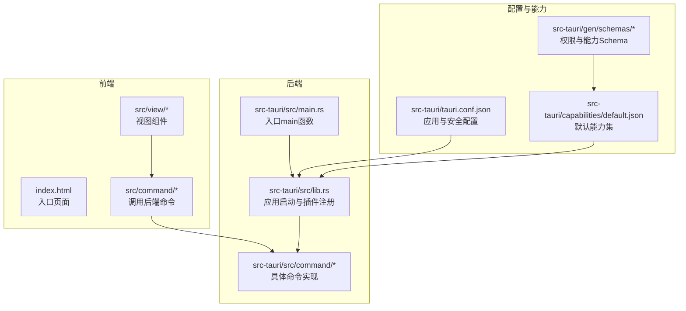
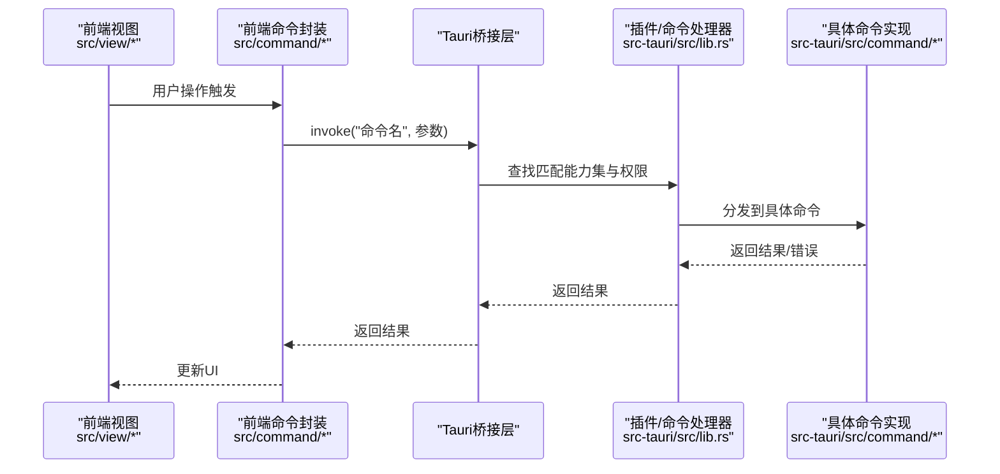
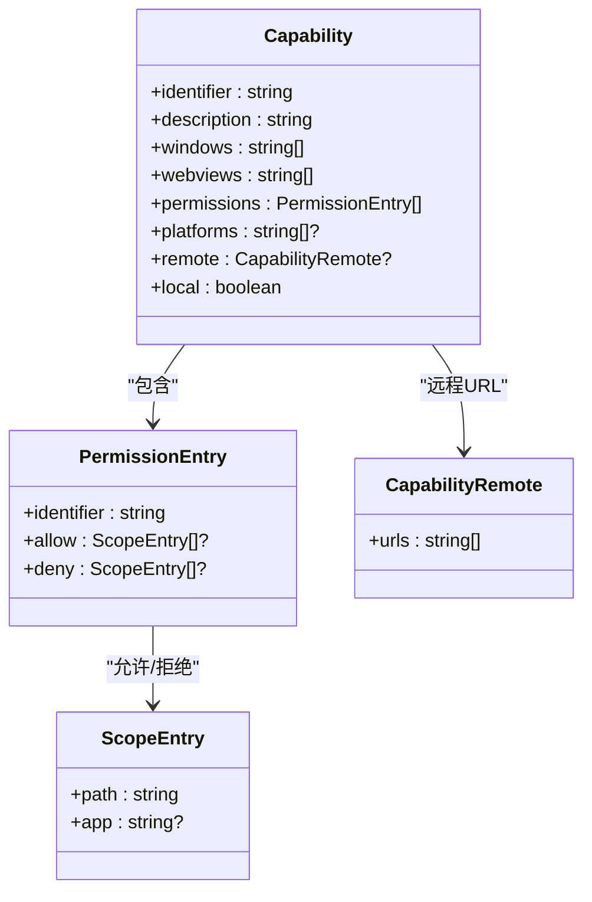
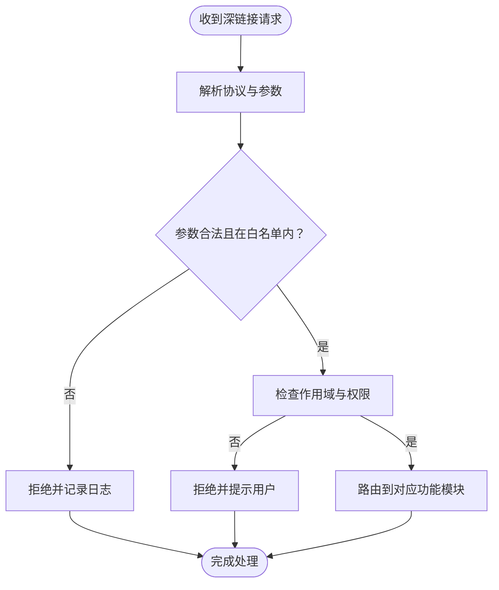
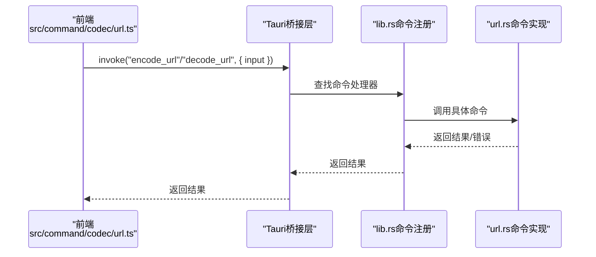
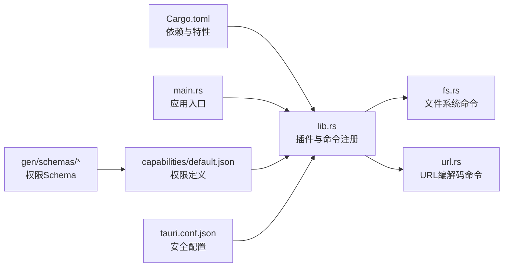

# 安全策略配置

<cite>
**本文引用的文件**
- [tauri.conf.json](file://src-tauri/tauri.conf.json)
- [default.json](file://src-tauri/capabilities/default.json)
- [lib.rs](file://src-tauri/src/lib.rs)
- [main.rs](file://src-tauri/src/main.rs)
- [Cargo.toml](file://src-tauri/Cargo.toml)
- [url.rs](file://src-tauri/src/command/codec/url.rs)
- [fs.rs](file://src-tauri/src/command/fs.rs)
- [url.ts](file://src/command/codec/url.ts)
- [url.tsx](file://src/view/codec/url.tsx)
- [desktop-schema.json](file://src-tauri/gen/schemas/desktop-schema.json)
- [windows-schema.json](file://src-tauri/gen/schemas/windows-schema.json)
</cite>

## 目录
1. [简介](#简介)
2. [项目结构](#项目结构)
3. [核心组件](#核心组件)
4. [架构总览](#架构总览)
5. [详细组件分析](#详细组件分析)
6. [依赖关系分析](#依赖关系分析)
7. [性能考量](#性能考量)
8. [故障排查指南](#故障排查指南)
9. [结论](#结论)
10. [附录](#附录)

## 简介
本文件面向devkimi项目的Tauri安全策略配置，围绕以下主题展开：
- 解析并说明tauri.conf.json中security部分（尤其是内容安全策略CSP与assetProtocol）的现状与建议
- 深入讲解API权限控制机制，包括capabilities能力集、权限标识与作用域范围
- 结合现有代码示例，演示如何为devkimi应用配置安全的CSP策略与深链接处理
- 提供最佳实践与常见漏洞防范指南，帮助开发者在不牺牲功能的前提下提升安全性

## 项目结构
devkimi采用典型的Tauri桌面应用结构：前端位于src目录，后端Rust逻辑位于src-tauri目录；构建配置集中在src-tauri/tauri.conf.json与src-tauri/Cargo.toml；能力集与权限定义位于src-tauri/capabilities与生成的JSON Schema中。

图表来源
- [tauri.conf.json](file://src-tauri/tauri.conf.json#L1-L46)
- [lib.rs](file://src-tauri/src/lib.rs#L1-L57)
- [main.rs](file://src-tauri/src/main.rs#L1-L7)
- [default.json](file://src-tauri/capabilities/default.json#L1-L31)

章节来源
- [tauri.conf.json](file://src-tauri/tauri.conf.json#L1-L46)
- [lib.rs](file://src-tauri/src/lib.rs#L1-L57)
- [main.rs](file://src-tauri/src/main.rs#L1-L7)
- [default.json](file://src-tauri/capabilities/default.json#L1-L31)

## 核心组件
- 应用安全配置（tauri.conf.json）
  - security.csp：当前为null，表示未强制设置CSP
  - security.assetProtocol：启用本地资源协议，并限定在$TEMP/**范围内
- 能力集与权限（capabilities/default.json + 生成Schema）
  - 通过permissions数组声明插件权限与作用域
  - opener:allow-open-path中对$TEMP/**进行白名单授权
- 插件与命令
  - 后端lib.rs注册了多个插件与命令处理器
  - 前端通过invoke调用后端命令（如URL编解码）

章节来源
- [tauri.conf.json](file://src-tauri/tauri.conf.json#L24-L32)
- [default.json](file://src-tauri/capabilities/default.json#L1-L31)
- [lib.rs](file://src-tauri/src/lib.rs#L1-L57)
- [url.ts](file://src/command/codec/url.ts#L1-L11)
- [url.tsx](file://src/view/codec/url.tsx#L1-L43)

## 架构总览
下图展示了从浏览器视图到Rust命令的调用链路，以及安全配置在其中的位置。

图表来源
- [url.ts](file://src/command/codec/url.ts#L1-L11)
- [url.tsx](file://src/view/codec/url.tsx#L1-L43)
- [lib.rs](file://src-tauri/src/lib.rs#L1-L57)
- [url.rs](file://src-tauri/src/command/codec/url.rs#L1-L18)

## 详细组件分析

### 组件A：内容安全策略（CSP）配置
- 当前状态
  - tauri.conf.json中security.csp为null，表示未强制设置CSP
  - 这可能导致默认浏览器策略生效，存在XSS风险
- 风险与影响
  - 缺失CSP时，前端可加载任意脚本、样式与资源，易受反射型/存储型XSS攻击
  - 对于devkimi这类工具类应用，若涉及用户输入处理（如URL编解码），更需严格限制资源来源
- 推荐配置思路
  - 仅允许内联样式/脚本（如需）或通过nonce/hashed源
  - 显式声明允许的script-src、style-src、img-src等
  - 对frame-ancestors限制为self，避免点击劫持
  - 对upgrade-insecure-requests与block-all-mixed-content按需启用
- 实施要点
  - 在开发环境与生产环境分别设置不同策略
  - 对第三方资源（如CDN）使用子资源完整性（SRI）
  - 通过tauri.conf.json的security.csp字段设置，或在构建阶段注入meta标签
- 验证建议
  - 使用浏览器开发者工具检查CSP报告头
  - 使用自动化扫描工具检测潜在XSS点位

章节来源
- [tauri.conf.json](file://src-tauri/tauri.conf.json#L24-L32)
- [url.tsx](file://src/view/codec/url.tsx#L1-L43)
- [url.ts](file://src/command/codec/url.ts#L1-L11)

### 组件B：API权限控制与能力集
- 能力集（Capability）与权限（Permission）
  - 能力集用于分组窗口与Webview，隔离IPC访问
  - 权限以“插件名:权限名”的形式声明，支持作用域扩展
- 默认能力集（default.json）
  - 包含clipboard、dialog、fs、store、opener等权限
  - opener:allow-open-path对$TEMP/**开放路径
- Schema参考
  - desktop-schema.json与windows-schema.json定义了权限与作用域的完整集合
  - 支持fs:scope-xxx系列、opener路径模式等
- 最佳实践
  - 最小权限原则：仅授予所需权限
  - 作用域最小化：尽量使用具体路径而非递归或全局范围
  - 平台差异化：针对不同平台分别配置
  - 远程内容隔离：remote.urls仅允许可信域名
- 示例路径
  - 能力集定义位置：[default.json](file://src-tauri/capabilities/default.json#L1-L31)
  - 权限与作用域Schema：[desktop-schema.json](file://src-tauri/gen/schemas/desktop-schema.json#L1-L200)、[windows-schema.json](file://src-tauri/gen/schemas/windows-schema.json#L2022-L2090)

图表来源
- [desktop-schema.json](file://src-tauri/gen/schemas/desktop-schema.json#L1-L200)
- [windows-schema.json](file://src-tauri/gen/schemas/windows-schema.json#L2022-L2090)
- [default.json](file://src-tauri/capabilities/default.json#L1-L31)

章节来源
- [default.json](file://src-tauri/capabilities/default.json#L1-L31)
- [desktop-schema.json](file://src-tauri/gen/schemas/desktop-schema.json#L1-L200)
- [windows-schema.json](file://src-tauri/gen/schemas/windows-schema.json#L2022-L2090)

### 组件C：深链接与自定义协议处理
- 当前配置
  - tauri.conf.json未显式配置deepLink
  - opener插件已启用，可通过opener:allow-open-path对$TEMP/**放行
- 深链接处理流程（概念性）
  - 注册自定义协议（如devkimi://）
  - 在Windows/Linux/macOS上注册系统级协议处理器
  - 应用启动时接收协议参数，解析并路由到对应功能
- 安全配置要点
  - 仅允许受信协议与域名
  - 对传入参数进行严格的白名单校验与转义
  - 限制可执行路径与文件操作范围
- 参考Schema
  - opener路径模式与变量列表：[windows-schema.json](file://src-tauri/gen/schemas/windows-schema.json#L2022-L2090)

图表来源
- [windows-schema.json](file://src-tauri/gen/schemas/windows-schema.json#L2022-L2090)
- [default.json](file://src-tauri/capabilities/default.json#L1-L31)

章节来源
- [tauri.conf.json](file://src-tauri/tauri.conf.json#L1-L46)
- [default.json](file://src-tauri/capabilities/default.json#L1-L31)
- [windows-schema.json](file://src-tauri/gen/schemas/windows-schema.json#L2022-L2090)

### 组件D：命令与调用链的安全性
- 前端调用
  - 通过invoke调用后端命令（如encode_url/decode_url）
- 后端处理
  - lib.rs注册命令处理器，实际逻辑在src-tauri/src/command/*中
  - 命令返回值与错误通过统一错误宏处理
- 安全建议
  - 对输入参数进行长度、格式与字符集校验
  - 对可能被注入的字符串进行转义或HTML实体编码
  - 对文件系统操作限制在受控目录（如$TEMP）

图表来源
- [url.ts](file://src/command/codec/url.ts#L1-L11)
- [lib.rs](file://src-tauri/src/lib.rs#L1-L57)
- [url.rs](file://src-tauri/src/command/codec/url.rs#L1-L18)

章节来源
- [url.ts](file://src/command/codec/url.ts#L1-L11)
- [lib.rs](file://src-tauri/src/lib.rs#L1-L57)
- [url.rs](file://src-tauri/src/command/codec/url.rs#L1-L18)

## 依赖关系分析
- 构建与运行
  - Cargo.toml声明tauri与各插件版本，启用protocol-asset特性
  - lib.rs注册插件与命令，main.rs负责启动
- 安全依赖
  - capabilities/default.json与生成Schema共同决定权限边界
  - tauri.conf.json的security.csp与assetProtocol影响资源加载策略

图表来源
- [Cargo.toml](file://src-tauri/Cargo.toml#L1-L70)
- [lib.rs](file://src-tauri/src/lib.rs#L1-L57)
- [main.rs](file://src-tauri/src/main.rs#L1-L7)
- [fs.rs](file://src-tauri/src/command/fs.rs#L1-L34)
- [url.rs](file://src-tauri/src/command/codec/url.rs#L1-L18)
- [default.json](file://src-tauri/capabilities/default.json#L1-L31)
- [desktop-schema.json](file://src-tauri/gen/schemas/desktop-schema.json#L1-L200)

章节来源
- [Cargo.toml](file://src-tauri/Cargo.toml#L1-L70)
- [lib.rs](file://src-tauri/src/lib.rs#L1-L57)
- [main.rs](file://src-tauri/src/main.rs#L1-L7)
- [default.json](file://src-tauri/capabilities/default.json#L1-L31)

## 性能考量
- CSP对性能的影响
  - 过度严格的CSP会增加资源加载失败与重试成本
  - 建议在开发环境宽松、生产环境收紧
- 权限范围与I/O开销
  - 作用域越广，权限检查与路径解析成本越高
  - 将文件操作限制在$TEMP等临时目录，减少跨分区I/O
- 插件启用策略
  - 仅启用必要插件，避免不必要的IPC开销

## 故障排查指南
- CSP相关问题
  - 症状：脚本/样式/图片加载失败
  - 排查：检查CSP头与浏览器控制台报告；确认script-src/style-src是否包含必需来源
- 权限不足
  - 症状：调用命令失败或弹出权限对话
  - 排查：核对capabilities/default.json中对应权限与作用域；确认命令是否在能力集中
- 深链接无法打开
  - 症状：系统无法识别自定义协议
  - 排查：确认系统协议注册、tauri.conf.json中deepLink配置、opener作用域范围

章节来源
- [tauri.conf.json](file://src-tauri/tauri.conf.json#L1-L46)
- [default.json](file://src-tauri/capabilities/default.json#L1-L31)
- [lib.rs](file://src-tauri/src/lib.rs#L1-L57)

## 结论
devkimi当前的安全配置在权限与资源协议方面具备一定基础，但缺少强制性的CSP策略。建议立即：
- 在生产环境为security.csp设置严格的策略，限制脚本与资源来源
- 保持能力集最小化，作用域精确到具体路径
- 对深链接处理进行协议白名单与参数校验
- 持续审计命令与文件系统操作，确保输入验证与输出转义到位

## 附录

### 最佳实践清单
- CSP
  - 开发：允许必要的内联与eval（如需），生产：禁止内联与eval
  - 仅允许可信CDN与自有资源
  - 设置frame-ancestors为self
- 权限控制
  - 仅授予必要插件与命令
  - 使用fs:scope-xxx精确限制文件系统访问
  - opener路径使用$TEMP等受限目录
- 深链接
  - 仅允许受信协议与域名
  - 参数白名单与严格校验
- 错误处理
  - 使用统一错误宏，避免泄露内部信息
  - 记录异常但不暴露敏感细节

### 常见漏洞与防范
- XSS
  - 输入校验与输出转义
  - CSP限制脚本来源
- 权限滥用
  - 最小权限与作用域最小化
  - 定期审计capabilities/default.json
- 深链接劫持
  - 协议白名单与参数校验
  - 限制可执行路径与文件操作范围