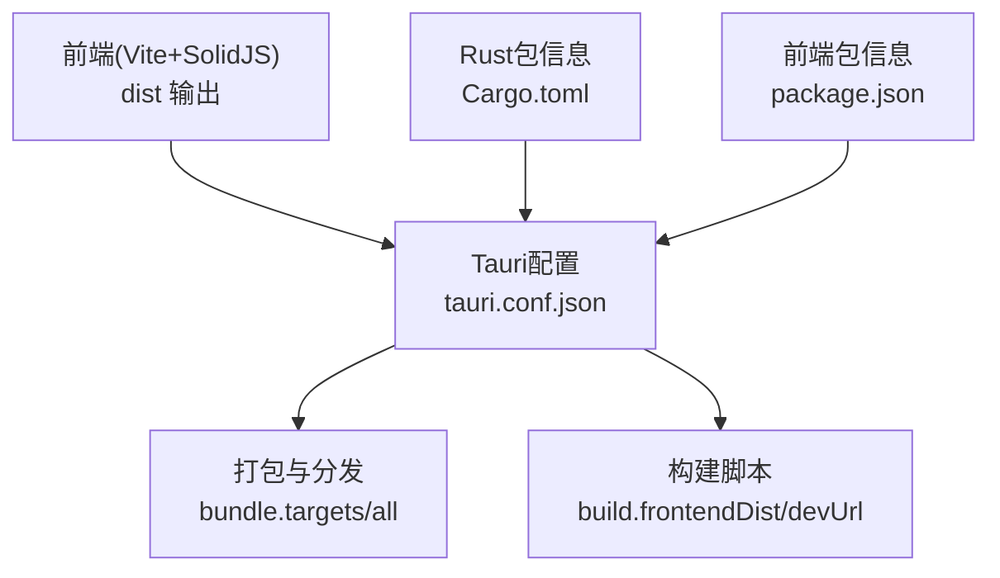
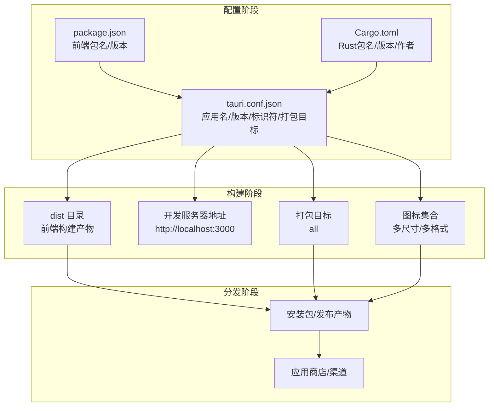
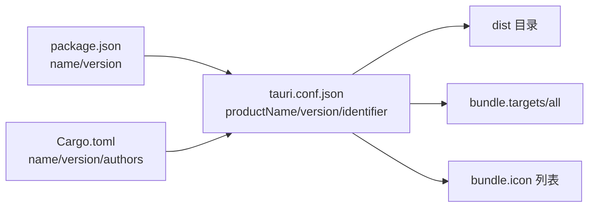

# 应用元数据配置

<cite>
**本文引用的文件**
- [src-tauri/tauri.conf.json](file://src-tauri/tauri.conf.json)
- [package.json](file://package.json)
- [src-tauri/Cargo.toml](file://src-tauri/Cargo.toml)
- [README.md](file://README.md)
</cite>

## 目录
1. [简介](#简介)
2. [项目结构](#项目结构)
3. [核心组件](#核心组件)
4. [架构总览](#架构总览)
5. [详细组件分析](#详细组件分析)
6. [依赖关系分析](#依赖关系分析)
7. [性能考量](#性能考量)
8. [故障排查指南](#故障排查指南)
9. [结论](#结论)
10. [附录](#附录)

## 简介
本文件聚焦于devkimi项目中Tauri应用的“元数据”配置，特别是位于src-tauri/tauri.conf.json中的package相关字段（应用名称、版本、标识符等）。我们将系统梳理这些元数据字段的作用、在打包与分发流程中的影响，并结合仓库现有配置给出最佳实践建议（如版本号语义化、图标与标识符规范等），帮助开发者在不同平台上正确显示与识别应用。

## 项目结构
devkimi采用Tauri + SolidJS的双层架构：
- 前端：Vite + SolidJS，产物输出至dist目录
- 后端：Rust（Tauri）负责原生能力与打包，配置集中在src-tauri/tauri.conf.json
- 元数据来源：
  - Tauri配置：src-tauri/tauri.conf.json（包含应用名、版本、标识符、打包目标等）
  - 前端包信息：package.json（包含name/version等）
  - Rust包信息：src-tauri/Cargo.toml（包含name/version/description/authors等）

图表来源
- [src-tauri/tauri.conf.json](file://src-tauri/tauri.conf.json#L1-L46)
- [package.json](file://package.json#L1-L43)
- [src-tauri/Cargo.toml](file://src-tauri/Cargo.toml#L1-L20)

章节来源
- [src-tauri/tauri.conf.json](file://src-tauri/tauri.conf.json#L1-L46)
- [package.json](file://package.json#L1-L43)
- [src-tauri/Cargo.toml](file://src-tauri/Cargo.toml#L1-L20)

## 核心组件
本节围绕Tauri配置文件中的元数据字段进行深入解析，明确其职责与影响范围。

- 应用名称（productName）
  - 作用：作为应用在系统中的显示名称，用于窗口标题、系统任务栏、Dock/开始菜单等处的呈现。
  - 在devkimi中，该值为“devkimi”，与前端包名一致，有助于统一品牌认知。
  - 影响：直接影响用户界面的可见性与识别度；在某些平台（如Windows）也会影响安装包的显示名称。

- 版本（version）
  - 作用：应用的版本号，用于区分不同发布版本，便于更新与回滚。
  - 在devkimi中，Tauri配置的version为“0.1.1”，而前端package.json的version为“0.1.1-dev”。两者不一致可能导致“版本不一致”的问题。
  - 影响：版本号参与打包产物命名、更新检测、渠道分发策略等；建议前后端保持一致或建立清晰的同步机制。

- 标识符（identifier）
  - 作用：应用的唯一标识符，通常采用反向域名格式（reverse-DNS），用于区分同一开发者下的不同应用。
  - 在devkimi中，identifier为“io.github.sodekim.devkimi”，符合常见规范。
  - 影响：影响应用在系统中的唯一性、签名与分发（如App Store、Microsoft Store）、以及跨平台兼容性。

- 默认分发目标（bundle.targets）
  - 作用：指定打包的目标平台集合，例如“all”表示为所有可用平台生成安装包。
  - 在devkimi中，targets被设置为“all”，意味着构建时会尝试为当前工具链支持的所有平台生成安装包。
  - 影响：决定最终产物数量与体积；若目标平台过多，可能增加构建时间与资源消耗。

- 前端构建入口（build.frontendDist）
  - 作用：指向前端构建产物的目录，Tauri在打包时会将该目录内的静态资源嵌入到应用中。
  - 在devkimi中，frontendDist为“../dist”，与Vite默认输出路径一致。
  - 影响：若路径不匹配，会导致打包后应用无法加载前端资源。

- 开发时前端地址（build.devUrl）
  - 作用：开发模式下，Tauri加载的前端开发服务器地址。
  - 在devkimi中，devUrl为“http://localhost:3000”，与Vite开发服务器一致。
  - 影响：若端口冲突或网络不可达，开发体验会受影响。

- 图标集合（bundle.icon）
  - 作用：为不同平台提供合适的图标尺寸，确保在各平台（Windows、macOS、Linux）上均能正确显示。
  - 在devkimi中，提供了多种尺寸与格式的图标文件路径。
  - 影响：图标缺失或尺寸不当会导致应用在系统托盘、开始菜单、Dock等处显示异常。

章节来源
- [src-tauri/tauri.conf.json](file://src-tauri/tauri.conf.json#L1-L46)
- [package.json](file://package.json#L1-L43)
- [src-tauri/Cargo.toml](file://src-tauri/Cargo.toml#L1-L20)

## 架构总览
下图展示了元数据配置在应用生命周期中的关键位置与影响范围。

图表来源
- [src-tauri/tauri.conf.json](file://src-tauri/tauri.conf.json#L1-L46)
- [package.json](file://package.json#L1-L43)
- [src-tauri/Cargo.toml](file://src-tauri/Cargo.toml#L1-L20)

## 详细组件分析

### 组件A：应用名称与版本一致性
- 问题现状
  - Tauri配置中的应用名称与版本分别为“devkimi”和“0.1.1”
  - 前端package.json中的name/version分别为“devkimi”和“0.1.1-dev”
  - 这种不一致可能导致用户在系统中看到“版本不一致”的提示，或在自动更新/渠道分发时产生混淆
- 建议
  - 建立统一的版本管理策略：在发布前统一前后端版本号，或在CI中校验一致性
  - 若需区分开发/预发布状态，可在版本后缀中体现（如“0.1.1-dev”），但需确保与Tauri配置保持一致
- 影响范围
  - 用户体验：版本不一致会降低可信度
  - 自动化：CI/CD流水线需要增加版本一致性检查

章节来源
- [src-tauri/tauri.conf.json](file://src-tauri/tauri.conf.json#L1-L46)
- [package.json](file://package.json#L1-L43)

### 组件B：标识符与平台兼容性
- 说明
  - identifier采用反向域名格式，有利于在不同平台（Windows/macOS/Linux）上保持唯一性
  - 建议使用稳定的组织域或个人域，避免与他人重复
- 最佳实践
  - 使用稳定的顶级域名（如io.github.sodekim）
  - 保持identifier与仓库域名一致，便于溯源
- 影响范围
  - 安装包签名与分发（如商店/企业分发）
  - 多实例隔离与权限边界

章节来源
- [src-tauri/tauri.conf.json](file://src-tauri/tauri.conf.json#L1-L46)

### 组件C：打包目标与图标清单
- 说明
  - targets设置为“all”，表示为所有可用平台生成安装包
  - bundle.icon提供了多尺寸与多格式图标，覆盖Windows、macOS等主流平台
- 建议
  - 在CI中按需选择目标平台，减少构建时间
  - 确保每种平台都有对应尺寸的图标，避免模糊或拉伸
- 影响范围
  - 构建时间与产物体积
  - 平台商店审核通过率（图标质量与尺寸合规）

章节来源
- [src-tauri/tauri.conf.json](file://src-tauri/tauri.conf.json#L1-L46)

### 组件D：开发与构建入口
- 说明
  - build.frontendDist指向dist目录，与Vite默认输出一致
  - build.devUrl指向本地开发服务器，便于联调
- 建议
  - 在团队协作中约定统一的前端构建命令与端口
  - 如需自定义输出目录，需同步修改devUrl与frontendDist
- 影响范围
  - 开发效率与联调体验
  - CI构建稳定性

章节来源
- [src-tauri/tauri.conf.json](file://src-tauri/tauri.conf.json#L1-L46)
- [package.json](file://package.json#L1-L43)

## 依赖关系分析
- 前端与后端的耦合点
  - 前端构建产物路径（dist）与Tauri配置的frontendDist必须一致
  - 开发服务器地址（devUrl）与前端开发脚本需匹配
- 版本一致性
  - 前端package.json与Tauri配置的version应保持一致，或在CI中强制校验
- 平台目标
  - bundle.targets决定打包产物数量，需根据实际需求裁剪

图表来源
- [src-tauri/tauri.conf.json](file://src-tauri/tauri.conf.json#L1-L46)
- [package.json](file://package.json#L1-L43)
- [src-tauri/Cargo.toml](file://src-tauri/Cargo.toml#L1-L20)

章节来源
- [src-tauri/tauri.conf.json](file://src-tauri/tauri.conf.json#L1-L46)
- [package.json](file://package.json#L1-L43)
- [src-tauri/Cargo.toml](file://src-tauri/Cargo.toml#L1-L20)

## 性能考量
- 构建时间
  - targets为“all”会显著增加构建时间与资源消耗，建议在CI中按平台矩阵拆分构建
- 产物体积
  - 多平台图标与资源会增大安装包体积，建议仅保留必要尺寸与格式
- 开发体验
  - devUrl与本地端口需稳定，避免频繁重启导致的联调成本上升

## 故障排查指南
- 症状：打包后应用无法加载前端资源
  - 排查要点：确认build.frontendDist与实际dist目录一致
  - 参考路径：[src-tauri/tauri.conf.json](file://src-tauri/tauri.conf.json#L1-L46)
- 症状：开发模式无法访问前端
  - 排查要点：确认build.devUrl与Vite开发服务器端口一致
  - 参考路径：[src-tauri/tauri.conf.json](file://src-tauri/tauri.conf.json#L1-L46)
- 症状：版本不一致导致更新异常
  - 排查要点：核对package.json与tauri.conf.json中的version是否一致
  - 参考路径：[package.json](file://package.json#L1-L43)、[src-tauri/tauri.conf.json](file://src-tauri/tauri.conf.json#L1-L46)
- 症状：图标显示异常或缺失
  - 排查要点：确认bundle.icon中包含目标平台所需尺寸与格式
  - 参考路径：[src-tauri/tauri.conf.json](file://src-tauri/tauri.conf.json#L1-L46)

章节来源
- [src-tauri/tauri.conf.json](file://src-tauri/tauri.conf.json#L1-L46)
- [package.json](file://package.json#L1-L43)

## 结论
devkimi项目在Tauri配置中已具备较为完整的元数据骨架：应用名称、版本、标识符、打包目标、开发与构建入口、图标清单均已配置。当前的主要风险在于前端与Tauri配置的版本不一致，以及targets为“all”可能带来的构建开销。建议在团队内建立统一的版本管理与CI校验机制，并根据实际分发需求裁剪打包目标，以提升开发效率与发布质量。

## 附录

### 元数据字段与影响一览
- productName
  - 作用：应用显示名称
  - 影响：窗口标题、系统菜单、商店展示
  - 参考路径：[src-tauri/tauri.conf.json](file://src-tauri/tauri.conf.json#L1-L46)
- version
  - 作用：应用版本号
  - 影响：更新检测、渠道分发、用户感知
  - 参考路径：[src-tauri/tauri.conf.json](file://src-tauri/tauri.conf.json#L1-L46)、[package.json](file://package.json#L1-L43)
- identifier
  - 作用：应用唯一标识符
  - 影响：签名与分发、跨平台唯一性
  - 参考路径：[src-tauri/tauri.conf.json](file://src-tauri/tauri.conf.json#L1-L46)
- bundle.targets
  - 作用：打包目标平台集合
  - 影响：产物数量与体积、构建时间
  - 参考路径：[src-tauri/tauri.conf.json](file://src-tauri/tauri.conf.json#L1-L46)
- build.frontendDist
  - 作用：前端构建产物目录
  - 影响：打包是否包含前端资源
  - 参考路径：[src-tauri/tauri.conf.json](file://src-tauri/tauri.conf.json#L1-L46)
- build.devUrl
  - 作用：开发服务器地址
  - 影响：开发联调体验
  - 参考路径：[src-tauri/tauri.conf.json](file://src-tauri/tauri.conf.json#L1-L46)
- bundle.icon
  - 作用：平台图标清单
  - 影响：系统菜单与商店展示质量
  - 参考路径：[src-tauri/tauri.conf.json](file://src-tauri/tauri.conf.json#L1-L46)

### 最佳实践清单
- 版本号语义化
  - 建议遵循语义化版本规范（主.次.补丁），并在预发布场景使用后缀（如-dev、-beta）
  - 发布前统一前后端版本，或在CI中强制校验
- 标识符规范
  - 使用稳定的反向域名格式，避免与他人重复
  - 与仓库域名保持一致，便于溯源
- 打包目标裁剪
  - 在CI中按平台矩阵拆分构建，减少构建时间
  - 仅保留目标平台所需的图标尺寸与格式
- 开发与构建入口
  - 团队内约定统一的前端构建命令与端口
  - 如需自定义输出目录，需同步修改devUrl与frontendDist

章节来源
- [src-tauri/tauri.conf.json](file://src-tauri/tauri.conf.json#L1-L46)
- [package.json](file://package.json#L1-L43)
- [src-tauri/Cargo.toml](file://src-tauri/Cargo.toml#L1-L20)
- [README.md](file://README.md#L1-L122)