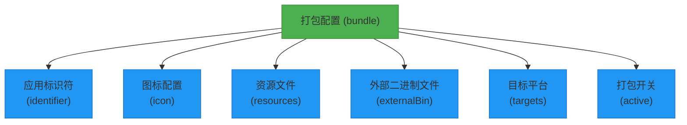
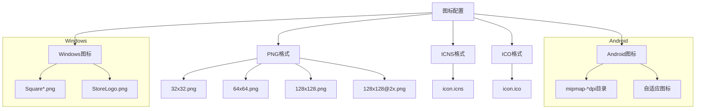
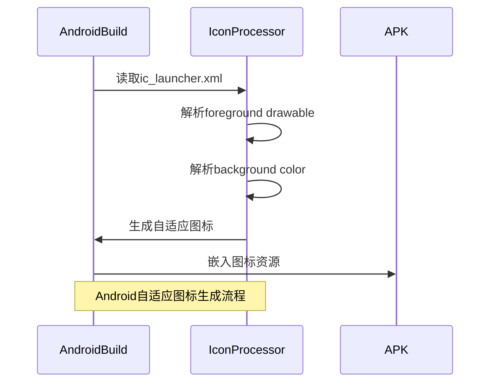
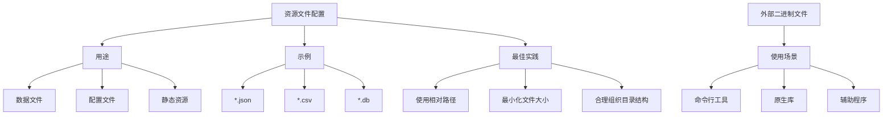
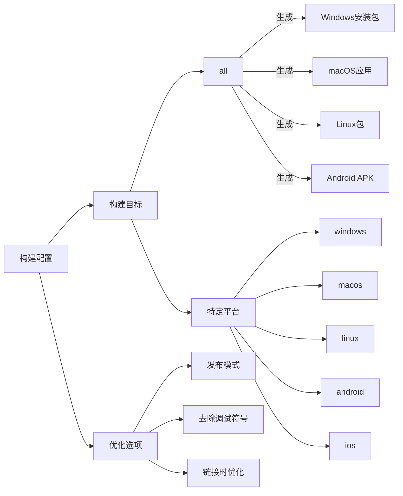
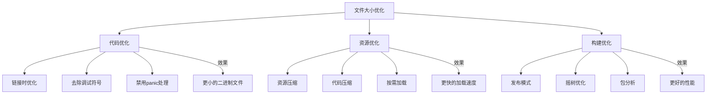
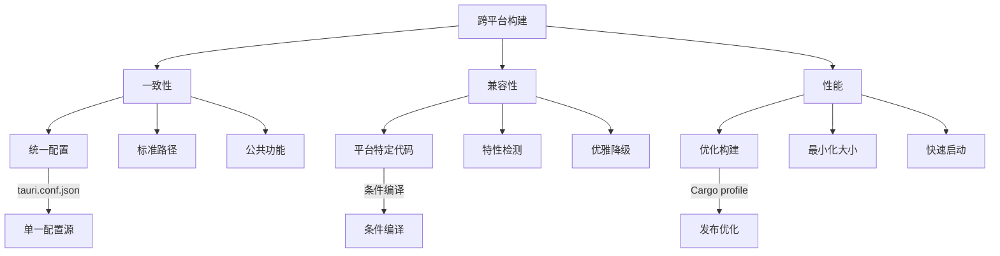

# 打包与分发配置

<cite>
**本文档引用的文件**  
- [tauri.conf.json](file://src-tauri/tauri.conf.json)
- [Cargo.toml](file://src-tauri/Cargo.toml)
- [package.json](file://package.json)
- [build.rs](file://src-tauri/build.rs)
- [icons](file://src-tauri/icons)
</cite>

## 目录
1. [简介](#简介)
2. [项目结构](#项目结构)
3. [核心打包配置](#核心打包配置)
4. [应用标识符配置](#应用标识符配置)
5. [图标配置详解](#图标配置详解)
6. [资源与外部二进制文件](#资源与外部二进制文件)
7. [目标平台构建配置](#目标平台构建配置)
8. [最佳实践与优化建议](#最佳实践与优化建议)
9. [结论](#结论)

## 简介
本文档详细解析devkimi项目的Tauri打包配置，重点分析`tauri.conf.json`文件中`bundle`部分的各项配置。文档涵盖应用标识符、图标、资源、外部二进制文件和目标平台等关键配置项，提供跨平台构建的最佳实践，确保生成的安装包符合各平台的发布标准。

## 项目结构
devkimi项目采用Tauri框架构建，前端使用SolidJS和Vite，后端使用Rust。项目结构清晰，前端代码位于`src`目录，Tauri相关配置和Rust代码位于`src-tauri`目录。打包配置主要集中在`tauri.conf.json`文件中，图标资源集中存放在`src-tauri/icons`目录。

**Section sources**
- [tauri.conf.json](file://src-tauri/tauri.conf.json#L1-L46)
- [Cargo.toml](file://src-tauri/Cargo.toml#L1-L70)

## 核心打包配置
`tauri.conf.json`文件中的`bundle`部分是打包配置的核心，控制着应用的打包行为和输出格式。该部分配置决定了应用的标识符、图标、资源文件以及目标平台等关键属性。



**Diagram sources**
- [tauri.conf.json](file://src-tauri/tauri.conf.json#L34-L45)

**Section sources**
- [tauri.conf.json](file://src-tauri/tauri.conf.json#L34-L45)

## 应用标识符配置
应用标识符（identifier）是应用的唯一标识，遵循反向域名格式。在devkimi项目中，标识符配置为`io.github.sodekim.devkimi`，确保了在全球范围内的唯一性。这个标识符在不同平台的安装包中都保持一致，对于应用的更新和管理至关重要。

```mermaid
classDiagram
class BundleConfig {
+active : boolean
+targets : string
+icon : string[]
+identifier : string
}
note right of BundleConfig
应用标识符必须是全局唯一的
推荐使用反向域名格式
如：io.github.sodekim.devkimi
end note
```

**Diagram sources**
- [tauri.conf.json](file://src-tauri/tauri.conf.json#L5)

**Section sources**
- [tauri.conf.json](file://src-tauri/tauri.conf.json#L5)

## 图标配置详解
devkimi项目的图标配置充分考虑了多平台兼容性，提供了多种格式和尺寸的图标文件。配置中包含了PNG、ICNS（macOS）和ICO（Windows）格式，确保在不同操作系统上都能显示高质量的图标。

### 多平台图标支持


**Diagram sources**
- [tauri.conf.json](file://src-tauri/tauri.conf.json#L37-L43)
- [icons](file://src-tauri/icons)

**Section sources**
- [tauri.conf.json](file://src-tauri/tauri.conf.json#L37-L43)
- [icons](file://src-tauri/icons)

### Android图标配置
Android平台使用自适应图标系统，通过XML文件定义前景和背景。devkimi项目配置了`ic_launcher.xml`定义自适应图标结构，并通过`ic_launcher_background.xml`设置背景颜色为白色。



**Diagram sources**
- [src-tauri/icons/android/mipmap-anydpi-v26/ic_launcher.xml](file://src-tauri/icons/android/mipmap-anydpi-v26/ic_launcher.xml#L1-L5)
- [src-tauri/icons/android/values/ic_launcher_background.xml](file://src-tauri/icons/android/values/ic_launcher_background.xml#L1-L4)

## 资源与外部二进制文件
虽然当前配置中未显式定义资源和外部二进制文件，但Tauri提供了相应的配置项来包含额外的文件。`resources`配置项可用于包含应用运行所需的额外文件，而`externalBin`可用于嵌入外部可执行文件。



**Diagram sources**
- [tauri.conf.json](file://src-tauri/tauri.conf.json)

**Section sources**
- [tauri.conf.json](file://src-tauri/tauri.conf.json)

## 目标平台构建配置
`targets`配置项控制着应用的构建目标平台。在devkimi项目中，配置为`"all"`，表示将为所有支持的平台生成安装包。开发者也可以指定特定平台，如`["windows", "macos"]`，以优化构建时间和资源使用。



**Diagram sources**
- [tauri.conf.json](file://src-tauri/tauri.conf.json#L36)
- [Cargo.toml](file://src-tauri/Cargo.toml#L61-L69)

**Section sources**
- [tauri.conf.json](file://src-tauri/tauri.conf.json#L36)
- [Cargo.toml](file://src-tauri/Cargo.toml#L61-L69)

## 最佳实践与优化建议
### 文件大小优化
devkimi项目在`Cargo.toml`中配置了多项优化选项，包括LTO（链接时优化）、strip（去除调试符号）和panic=abort（禁用panic处理程序），这些配置显著减小了最终二进制文件的大小。



**Diagram sources**
- [Cargo.toml](file://src-tauri/Cargo.toml#L64-L69)

### 跨平台构建注意事项


**Diagram sources**
- [tauri.conf.json](file://src-tauri/tauri.conf.json)
- [Cargo.toml](file://src-tauri/Cargo.toml)

**Section sources**
- [Cargo.toml](file://src-tauri/Cargo.toml#L61-L69)
- [tauri.conf.json](file://src-tauri/tauri.conf.json)

## 结论
devkimi项目的Tauri打包配置体现了现代桌面应用开发的最佳实践。通过合理的标识符设置、全面的图标支持和优化的构建配置，确保了应用在各平台上的高质量发布。建议开发者在配置打包选项时，充分考虑多平台兼容性，优化文件大小，并遵循Tauri官方的最佳实践指南。