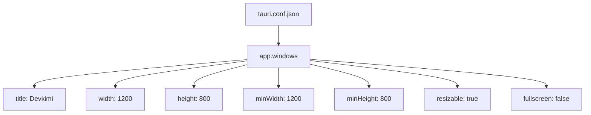
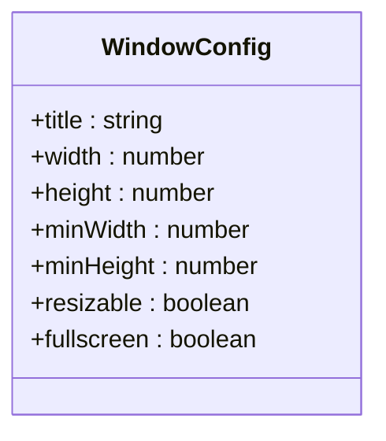

# 窗口配置

<cite>
**本文档中引用的文件**  
- [tauri.conf.json](file://src-tauri/tauri.conf.json)
- [windows-schema.json](file://src-tauri/gen/schemas/windows-schema.json)
- [desktop-schema.json](file://src-tauri/gen/schemas/desktop-schema.json)
- [Cargo.toml](file://src-tauri/Cargo.toml)
- [main.rs](file://src-tauri/src/main.rs)
</cite>

## 目录
1. [简介](#简介)
2. [窗口配置概述](#窗口配置概述)
3. [核心窗口属性详解](#核心窗口属性详解)
4. [窗口行为与用户体验](#窗口行为与用户体验)
5. [跨平台兼容性与最佳实践](#跨平台兼容性与最佳实践)
6. [结论](#结论)

## 简介
devkimi 是一个基于 Tauri 框架构建的桌面应用程序，其窗口行为通过 `tauri.conf.json` 文件中的配置进行定义。本文档深入解析该文件中 `windows` 数组内的所有配置项，详细说明每个属性对用户体验的影响，并提供定制窗口行为的最佳实践。

**Section sources**
- [tauri.conf.json](file://src-tauri/tauri.conf.json#L1-L46)

## 窗口配置概述
在 devkimi 项目中，Tauri 窗口的主要配置位于 `src-tauri/tauri.conf.json` 文件的 `app.windows` 数组中。当前配置定义了一个主窗口，其关键属性包括标题、尺寸、最小尺寸、可调整大小和全屏状态。



**Diagram sources**
- [tauri.conf.json](file://src-tauri/tauri.conf.json#L13-L23)

**Section sources**
- [tauri.conf.json](file://src-tauri/tauri.conf.json#L13-L23)

## 核心窗口属性详解
devkimi 应用的窗口配置包含多个关键属性，每个属性都对应用的外观和行为产生直接影响。

### 尺寸与布局属性
窗口的尺寸属性决定了应用启动时的初始大小和用户可调整的最小范围。

- **宽度 (width)**: 设置为 `1200`，定义了窗口的初始宽度（单位：像素）。
- **高度 (height)**: 设置为 `800`，定义了窗口的初始高度（单位：像素）。
- **最小宽度 (minWidth)**: 设置为 `1200`，限制了窗口可缩小到的最小宽度。
- **最小高度 (minHeight)**: 设置为 `800`，限制了窗口可缩小到的最小高度。

当 `minWidth` 和 `minHeight` 与 `width` 和 `height` 相等时，意味着窗口在启动后不能被用户缩小，从而创建了一个固定最小尺寸的界面，确保内容在小屏幕上仍可正常显示。

**Section sources**
- [tauri.conf.json](file://src-tauri/tauri.conf.json#L16-L19)

### 可调整性与可见性
这些属性控制用户与窗口交互的基本能力。

- **可调整 (resizable)**: 设置为 `true`，允许用户通过拖动窗口边缘来调整其大小。如果设置为 `false`，则窗口将变为固定尺寸，用户无法调整。
- **可见性 (visible)**: 虽然在当前配置中未显式定义，但默认为 `true`，表示窗口在创建后立即显示。
- **全屏 (fullscreen)**: 设置为 `false`，表示应用启动时不进入全屏模式。

**Section sources**
- [tauri.conf.json](file://src-tauri/tauri.conf.json#L20-L21)

### 标题栏与内部URL
- **标题 (title)**: 设置为 `"Devkimi"`，这是显示在窗口顶部标题栏中的文本。
- **标题栏样式 (titleBarStyle)**: 在当前配置中未定义。Tauri 支持 `visible`（显示标准标题栏）和 `hidden`（隐藏标题栏，创建无边框窗口）等选项。若要创建无边框窗口，可添加 `"titleBarStyle": "hidden"`。
- **内部URL (internalUrl)**: 未在配置中指定，Tauri 默认加载前端构建产物（由 `build.frontendDist` 指定，即 `../dist`）。



**Diagram sources**
- [tauri.conf.json](file://src-tauri/tauri.conf.json#L15-L22)

## 窗口行为与用户体验
窗口配置直接影响用户的交互体验。在 devkimi 中，将最小尺寸设置为与初始尺寸相同，确保了用户界面在任何情况下都不会因过度缩小而变得不可用，这对于包含复杂工具和编辑器的应用尤为重要。

### 创建无边框窗口
要创建现代感的无边框窗口，可以在 `tauri.conf.json` 中添加 `titleBarStyle` 配置：
```json
{
  "app": {
    "windows": [
      {
        "title": "Devkimi",
        "width": 1200,
        "height": 800,
        "minWidth": 800,
        "minHeight": 600,
        "resizable": true,
        "fullscreen": false,
        "titleBarStyle": "hidden"
      }
    ]
  }
}
```
这将隐藏原生标题栏，开发者需要使用前端代码（如 CSS）实现自定义的拖拽区域和关闭/最小化按钮。

### 固定尺寸窗口
通过将 `resizable` 设置为 `false`，可以创建一个完全固定尺寸的窗口，防止用户调整大小，确保布局的完整性。

**Section sources**
- [tauri.conf.json](file://src-tauri/tauri.conf.json#L13-L23)
- [desktop-schema.json](file://src-tauri/gen/schemas/desktop-schema.json#L3275-L3278)

## 跨平台兼容性与最佳实践
Tauri 的窗口配置在 Windows、macOS 和 Linux 上具有一致的行为，但开发者仍需注意一些最佳实践。

### 最佳实践
1. **合理设置最小尺寸**: 确保 `minWidth` 和 `minHeight` 足够大，以容纳所有关键 UI 元素。
2. **谨慎使用无边框窗口**: 虽然美观，但需要额外工作来实现拖拽和系统按钮，且可能影响无障碍访问。
3. **利用权限系统**: Tauri 的权限系统（在 `capabilities/default.json` 中定义）可以精细控制窗口操作，如 `core:window:allow-maximize` 允许最大化操作。

### 依赖分析
devkimi 的窗口功能依赖于 Tauri 核心库和其构建系统。

```mermaid
graph TB
A[Tauri CLI] --> B[tauri.conf.json]
B --> C[Tauri Core]
C --> D[前端 (Vite)]
C --> E[Rust 后端]
E --> F[tauri-build]
F --> G[最终可执行文件]
```

**Diagram sources**
- [Cargo.toml](file://src-tauri/Cargo.toml#L49)
- [tauri.conf.json](file://src-tauri/tauri.conf.json#L1)
- [build.rs](file://src-tauri/build.rs#L1-L3)

**Section sources**
- [Cargo.toml](file://src-tauri/Cargo.toml#L49)
- [main.rs](file://src-tauri/src/main.rs#L4-L6)

## 结论
devkimi 项目的窗口配置通过 `tauri.conf.json` 文件进行集中管理，提供了对窗口外观和行为的精细控制。通过合理配置 `width`、`height`、`minWidth`、`minHeight`、`resizable` 和 `titleBarStyle` 等属性，开发者可以创建既美观又实用的用户界面。遵循最佳实践并考虑跨平台兼容性，可以确保应用在不同操作系统上提供一致且优质的用户体验。