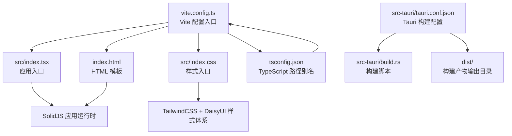
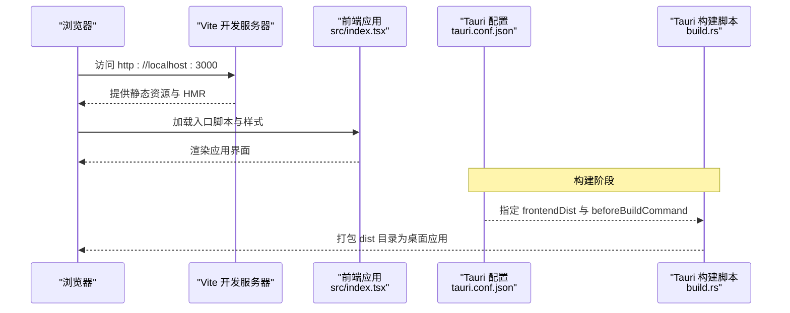
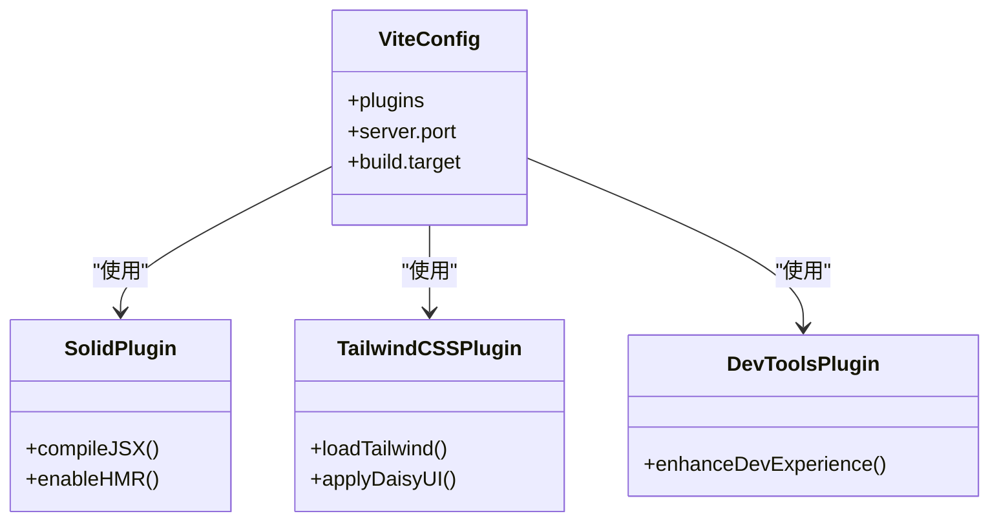
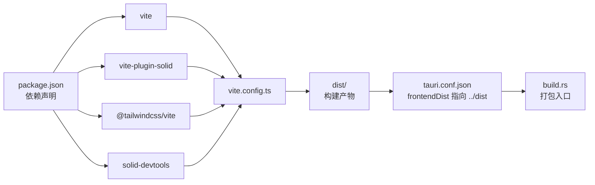
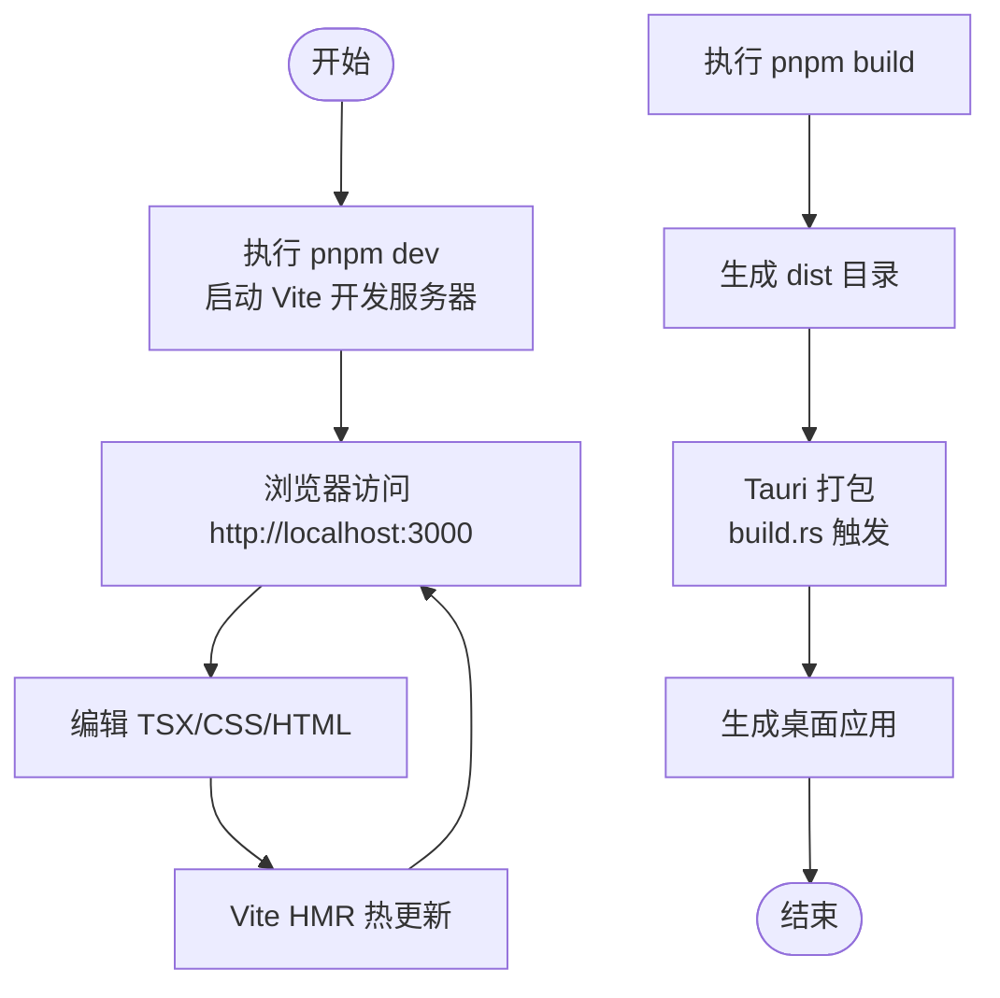

# Vite 配置

<cite>
**本文引用的文件**
- [vite.config.ts](file://vite.config.ts)
- [package.json](file://package.json)
- [tsconfig.json](file://tsconfig.json)
- [index.html](file://index.html)
- [src/index.tsx](file://src/index.tsx)
- [src/index.css](file://src/index.css)
- [src-tauri/tauri.conf.json](file://src-tauri/tauri.conf.json)
- [src-tauri/build.rs](file://src-tauri/build.rs)
</cite>

## 目录
1. [简介](#简介)
2. [项目结构](#项目结构)
3. [核心组件](#核心组件)
4. [架构总览](#架构总览)
5. [详细组件分析](#详细组件分析)
6. [依赖关系分析](#依赖关系分析)
7. [性能考量](#性能考量)
8. [故障排查指南](#故障排查指南)
9. [结论](#结论)
10. [附录](#附录)

## 简介
本文件系统性梳理 devkimi 项目中的 Vite 构建配置，重点围绕以下方面展开：
- 开发服务器设置：端口与 Tauri 集成的 devUrl 对齐
- 构建选项：目标语言版本与产物特性
- 插件配置：SolidJS、TailwindCSS、DaisyUI、solid-devtools 的作用与组合方式
- 路径别名：TypeScript 路径映射与 CSS 中的 @plugin 使用
- 与 Tauri 的集成：前端开发服务器、打包输出与后端构建流程的衔接
- 扩展实践：如何添加新插件、配置环境变量、优化构建性能
- 常见问题与排错建议

## 项目结构
devkimi 采用 Vite + SolidJS + TailwindCSS + DaisyUI 的现代前端技术栈，并通过 Tauri 将 Web 前端打包为桌面应用。Vite 配置位于仓库根目录，配合 Tauri 配置实现一体化开发体验。

图表来源
- [vite.config.ts](file://vite.config.ts#L1-L15)
- [src/index.tsx](file://src/index.tsx#L1-L37)
- [src/index.css](file://src/index.css#L1-L17)
- [index.html](file://index.html#L1-L18)
- [tsconfig.json](file://tsconfig.json#L1-L25)
- [src-tauri/tauri.conf.json](file://src-tauri/tauri.conf.json#L1-L46)
- [src-tauri/build.rs](file://src-tauri/build.rs#L1-L3)

章节来源
- [vite.config.ts](file://vite.config.ts#L1-L15)
- [package.json](file://package.json#L1-L43)
- [tsconfig.json](file://tsconfig.json#L1-L25)
- [index.html](file://index.html#L1-L18)
- [src-tauri/tauri.conf.json](file://src-tauri/tauri.conf.json#L1-L46)

## 核心组件
- Vite 配置入口：集中定义插件、开发服务器、构建目标等
- SolidJS 插件：提供 JSX 编译、热更新与开发工具支持
- TailwindCSS 插件：在 Vite 中原生加载 TailwindCSS，结合 CSS 文件中的 @plugin 声明启用 DaisyUI
- solid-devtools 插件：开发期调试增强
- Tauri 集成：通过 tauri.conf.json 的 devUrl 与前端开发端口保持一致，实现联调

章节来源
- [vite.config.ts](file://vite.config.ts#L1-L15)
- [package.json](file://package.json#L13-L25)
- [src-tauri/tauri.conf.json](file://src-tauri/tauri.conf.json#L6-L11)

## 架构总览
下图展示了从浏览器到 Tauri 应用的请求链路，以及 Vite 在开发与构建阶段的角色。

图表来源
- [vite.config.ts](file://vite.config.ts#L8-L13)
- [src-tauri/tauri.conf.json](file://src-tauri/tauri.conf.json#L6-L11)
- [src-tauri/build.rs](file://src-tauri/build.rs#L1-L3)

## 详细组件分析

### Vite 配置概览
- 插件列表：devtools、solidPlugin、tailwindcss
- 开发服务器：端口 3000
- 构建目标：esnext
- 未显式配置代理、路径别名、构建输出目录等，遵循 Vite 默认行为

章节来源
- [vite.config.ts](file://vite.config.ts#L1-L15)

### 插件配置详解
- solid-devtools
  - 作用：提供 SolidJS 开发期调试能力，便于在浏览器中查看组件树与状态
  - 集成方式：作为第一个插件加载，确保其在编译链早期生效
  - 参考路径：[vite.config.ts](file://vite.config.ts#L1-L15)
- vite-plugin-solid
  - 作用：为 SolidJS 提供 JSX 编译、SSR 支持与热更新
  - 与 TypeScript 的关系：TypeScript 配置中保留 JSX 并指定 jsxImportSource，避免重复处理
  - 参考路径：[vite.config.ts](file://vite.config.ts#L1-L15)，[package.json](file://package.json#L13-L25)，[tsconfig.json](file://tsconfig.json#L1-L25)
- @tailwindcss/vite
  - 作用：在 Vite 中原生加载 TailwindCSS，结合 CSS 文件中的 @plugin 声明启用 DaisyUI
  - 参考路径：[vite.config.ts](file://vite.config.ts#L1-L15)，[src/index.css](file://src/index.css#L1-L17)

章节来源
- [vite.config.ts](file://vite.config.ts#L1-L15)
- [package.json](file://package.json#L13-L25)
- [tsconfig.json](file://tsconfig.json#L1-L25)
- [src/index.css](file://src/index.css#L1-L17)

### 开发服务器与 Tauri 集成
- 开发服务器端口：3000
- Tauri 配置 devUrl：http://localhost:3000
- 一致性：两者保持一致，确保 Tauri 启动时能正确访问前端开发服务器
- 参考路径：[vite.config.ts](file://vite.config.ts#L8-L10)，[src-tauri/tauri.conf.json](file://src-tauri/tauri.conf.json#L6-L11)

章节来源
- [vite.config.ts](file://vite.config.ts#L8-L10)
- [src-tauri/tauri.conf.json](file://src-tauri/tauri.conf.json#L6-L11)

### 构建选项与输出
- 构建目标：esnext
  - 影响：产物更贴近现代浏览器特性，减少转译开销；需关注目标环境兼容性
  - 参考路径：[vite.config.ts](file://vite.config.ts#L11-L13)
- 输出目录：未显式配置，默认为 dist
  - Tauri 配置 frontendDist 指向 ../dist，构建后由 Tauri 打包
  - 参考路径：[src-tauri/tauri.conf.json](file://src-tauri/tauri.conf.json#L6-L11)

章节来源
- [vite.config.ts](file://vite.config.ts#L11-L13)
- [src-tauri/tauri.conf.json](file://src-tauri/tauri.conf.json#L6-L11)

### 路径别名与模块解析
- TypeScript 路径别名：~/* 映射到 ./src/*
  - 作用：在 TS/TSX 中使用统一的相对路径前缀，提升可读性与可维护性
  - 参考路径：[tsconfig.json](file://tsconfig.json#L19-L23)
- CSS 中的 @plugin 别名：TailwindCSS 与 DaisyUI 通过 @plugin 声明启用
  - 参考路径：[src/index.css](file://src/index.css#L1-L17)

章节来源
- [tsconfig.json](file://tsconfig.json#L19-L23)
- [src/index.css](file://src/index.css#L1-L17)

### HTML 入口与应用挂载
- HTML 模板：包含基础 meta、主题色、favicon 与根节点
- 入口脚本：通过 script 引入前端入口文件
- 应用挂载：入口 TSX 中将 App 渲染到 #root
- 参考路径：[index.html](file://index.html#L1-L18)，[src/index.tsx](file://src/index.tsx#L1-L37)

章节来源
- [index.html](file://index.html#L1-L18)
- [src/index.tsx](file://src/index.tsx#L1-L37)

### 类图：插件与配置的关系

图表来源
- [vite.config.ts](file://vite.config.ts#L1-L15)

## 依赖关系分析
- Vite 版本与插件生态：Vite 7.x 与 vite-plugin-solid、@tailwindcss/vite 协同工作
- TypeScript 与 JSX：保留 JSX 并指定 jsxImportSource，避免与插件重复处理
- Tauri 构建链路：Vite 构建 -> dist -> Tauri 打包

图表来源
- [package.json](file://package.json#L13-L25)
- [vite.config.ts](file://vite.config.ts#L1-L15)
- [src-tauri/tauri.conf.json](file://src-tauri/tauri.conf.json#L6-L11)
- [src-tauri/build.rs](file://src-tauri/build.rs#L1-L3)

章节来源
- [package.json](file://package.json#L13-L25)
- [vite.config.ts](file://vite.config.ts#L1-L15)
- [src-tauri/tauri.conf.json](file://src-tauri/tauri.conf.json#L6-L11)
- [src-tauri/build.rs](file://src-tauri/build.rs#L1-L3)

## 性能考量
- 构建目标选择
  - 当前为 esnext，有利于减少转译成本，但需评估目标运行环境的兼容性
  - 若需兼容旧版浏览器，可考虑调整为更保守的目标（例如 es2020）
- 插件顺序
  - devtools 放在首位，有助于尽早介入编译链，减少后续插件的额外开销
- CSS 体积控制
  - TailwindCSS 与 DaisyUI 的按需引入与主题切换策略会影响最终体积
  - 建议在生产构建中启用 Tree Shaking 与 CSS 压缩（Vite 默认开启）
- 开发体验
  - HMR 与 solid-devtools 的组合能显著提升迭代效率
- Tauri 打包
  - 构建完成后由 Tauri 统一打包，注意 dist 目录大小与资源加载性能

[本节为通用性能建议，不直接分析具体文件]

## 故障排查指南
- 端口冲突
  - 现象：开发服务器无法启动
  - 排查：确认 3000 端口未被占用；若冲突，可在 Vite 配置中修改端口
  - 参考路径：[vite.config.ts](file://vite.config.ts#L8-L10)
- Tauri 无法访问前端开发服务器
  - 现象：Tauri 启动后白屏或资源加载失败
  - 排查：检查 tauri.conf.json 的 devUrl 是否与 Vite 端口一致
  - 参考路径：[vite.config.ts](file://vite.config.ts#L8-L10)，[src-tauri/tauri.conf.json](file://src-tauri/tauri.conf.json#L6-L11)
- 样式未生效
  - 现象：Tailwind 或 DaisyUI 组件样式缺失
  - 排查：确认 CSS 文件中 @plugin 声明正确；检查 @tailwindcss/vite 插件已启用
  - 参考路径：[src/index.css](file://src/index.css#L1-L17)，[vite.config.ts](file://vite.config.ts#L1-L15)
- 路径别名无效
  - 现象：导入报错或 IDE 无法解析别名
  - 排查：确认 tsconfig.json 中的路径映射；确保编辑器使用同一 tsconfig
  - 参考路径：[tsconfig.json](file://tsconfig.json#L19-L23)
- 构建产物为空或路径错误
  - 现象：Tauri 打包失败
  - 排查：确认 dist 目录存在且包含构建产物；检查 tauri.conf.json 的 frontendDist
  - 参考路径：[src-tauri/tauri.conf.json](file://src-tauri/tauri.conf.json#L6-L11)

章节来源
- [vite.config.ts](file://vite.config.ts#L8-L13)
- [src-tauri/tauri.conf.json](file://src-tauri/tauri.conf.json#L6-L11)
- [src/index.css](file://src/index.css#L1-L17)
- [tsconfig.json](file://tsconfig.json#L19-L23)

## 结论
devkimi 的 Vite 配置简洁而聚焦：以 SolidJS 为核心，结合 TailwindCSS 与 DaisyUI 实现现代化 UI 架构，并通过 solid-devtools 提升开发体验。与 Tauri 的集成通过端口与构建目录的约定实现无缝衔接。当前配置未涉及代理、路径别名与输出目录的显式定制，遵循 Vite 默认行为；如需扩展，可参考“附录”的实践建议进行增量配置。

[本节为总结性内容，不直接分析具体文件]

## 附录

### 常见扩展实践（不含代码片段，仅提供路径与思路）
- 添加新的 Vite 插件
  - 在插件数组中追加新插件实例；注意插件顺序可能影响编译结果
  - 参考路径：[vite.config.ts](file://vite.config.ts#L1-L15)
- 配置环境变量
  - 在项目根目录新增 .env* 文件；Vite 会自动注入 import.meta.env 下的变量
  - 参考路径：[vite.config.ts](file://vite.config.ts#L1-L15)
- 自定义构建输出目录
  - 在 build.rollupOptions.output.dir 中指定自定义目录；或通过命令行参数覆盖
  - 参考路径：[vite.config.ts](file://vite.config.ts#L11-L13)
- 配置代理（开发时跨域）
  - 在 server.proxy 中添加代理规则，匹配后端接口域名
  - 参考路径：[vite.config.ts](file://vite.config.ts#L8-L10)
- 优化构建性能
  - 调整 build.target 以平衡兼容性与体积；启用压缩与分包策略
  - 参考路径：[vite.config.ts](file://vite.config.ts#L11-L13)
- 与 Tauri 的进一步联动
  - 在 beforeDevCommand/beforeBuildCommand 中加入预处理脚本
  - 参考路径：[src-tauri/tauri.conf.json](file://src-tauri/tauri.conf.json#L6-L11)

### 关键流程图：开发与构建时序

图表来源
- [vite.config.ts](file://vite.config.ts#L8-L13)
- [src-tauri/tauri.conf.json](file://src-tauri/tauri.conf.json#L6-L11)
- [src-tauri/build.rs](file://src-tauri/build.rs#L1-L3)