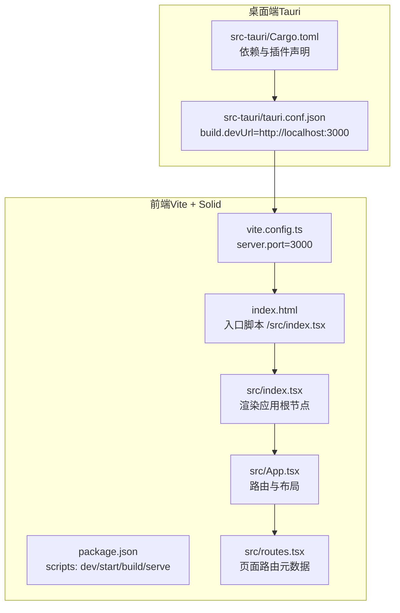
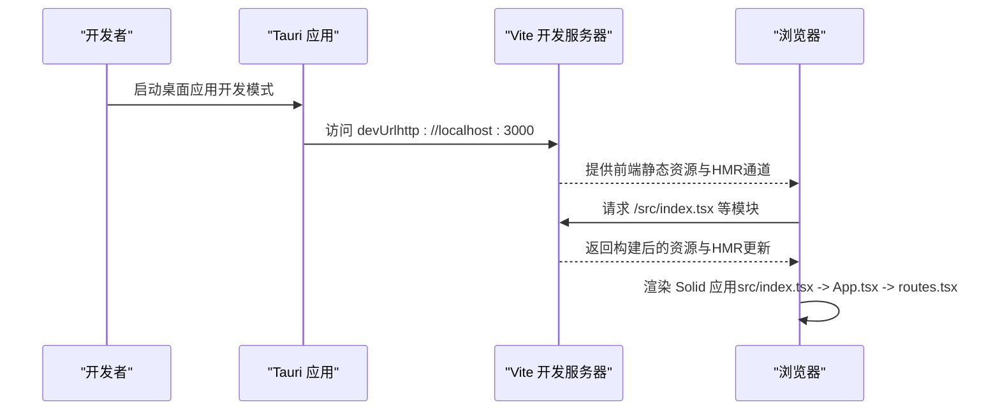
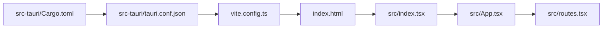

# 开发服务器配置

<cite>
**本文引用的文件**
- [vite.config.ts](file://vite.config.ts)
- [package.json](file://package.json)
- [src-tauri/tauri.conf.json](file://src-tauri/tauri.conf.json)
- [index.html](file://index.html)
- [src/index.tsx](file://src/index.tsx)
- [src/App.tsx](file://src/App.tsx)
- [src/routes.tsx](file://src/routes.tsx)
- [src/view/network/http.tsx](file://src/view/network/http.tsx)
- [src-tauri/Cargo.toml](file://src-tauri/Cargo.toml)
</cite>

## 目录
1. [简介](#简介)
2. [项目结构](#项目结构)
3. [核心组件](#核心组件)
4. [架构总览](#架构总览)
5. [详细组件分析](#详细组件分析)
6. [依赖关系分析](#依赖关系分析)
7. [性能考量](#性能考量)
8. [故障排查指南](#故障排查指南)
9. [结论](#结论)
10. [附录](#附录)

## 简介
本文件聚焦于devkimi项目中Vite开发服务器的配置与行为，结合Tauri桌面应用的集成方式，系统性说明以下主题：
- Vite开发服务器端口设置、热重载（HMR）机制与跨域代理配置现状
- 前后端在开发模式下的通信路径与集成点
- 如何自定义开发服务器行为（修改端口、启用HTTPS、配置代理）
- 常见问题诊断与解决方案（端口冲突、HMR失效、代理配置错误）

## 项目结构
devkimi采用前端（Vite + Solid + Tailwind）+ 桌面端（Tauri）的双层架构。Vite负责本地开发与构建，Tauri负责打包为桌面应用并在开发时通过devUrl指向Vite开发服务器。

图表来源
- [vite.config.ts](file://vite.config.ts#L1-L15)
- [package.json](file://package.json#L1-L43)
- [index.html](file://index.html#L1-L18)
- [src/index.tsx](file://src/index.tsx#L1-L37)
- [src/App.tsx](file://src/App.tsx#L1-L47)
- [src/routes.tsx](file://src/routes.tsx#L1-L242)
- [src-tauri/tauri.conf.json](file://src-tauri/tauri.conf.json#L1-L46)
- [src-tauri/Cargo.toml](file://src-tauri/Cargo.toml#L1-L70)

章节来源
- [vite.config.ts](file://vite.config.ts#L1-L15)
- [package.json](file://package.json#L1-L43)
- [src-tauri/tauri.conf.json](file://src-tauri/tauri.conf.json#L1-L46)

## 核心组件
- Vite开发服务器：当前仅配置了默认端口3000，未启用HTTPS与代理；HMR默认开启但未显式配置。
- Tauri开发配置：通过devUrl固定指向本地3000端口，确保桌面应用在开发时加载前端资源。
- 前端入口与路由：index.html挂载/src/index.tsx，App.tsx基于路由元数据动态生成页面路由。

章节来源
- [vite.config.ts](file://vite.config.ts#L1-L15)
- [src-tauri/tauri.conf.json](file://src-tauri/tauri.conf.json#L1-L46)
- [index.html](file://index.html#L1-L18)
- [src/index.tsx](file://src/index.tsx#L1-L37)
- [src/App.tsx](file://src/App.tsx#L1-L47)
- [src/routes.tsx](file://src/routes.tsx#L1-L242)

## 架构总览
下图展示了开发模式下Tauri与Vite的交互流程：Tauri启动后通过devUrl访问Vite开发服务器，Vite提供静态资源与HMR支持，前端应用在浏览器中运行。

图表来源
- [src-tauri/tauri.conf.json](file://src-tauri/tauri.conf.json#L1-L46)
- [vite.config.ts](file://vite.config.ts#L1-L15)
- [index.html](file://index.html#L1-L18)
- [src/index.tsx](file://src/index.tsx#L1-L37)
- [src/App.tsx](file://src/App.tsx#L1-L47)
- [src/routes.tsx](file://src/routes.tsx#L1-L242)

## 详细组件分析

### Vite开发服务器配置（vite.config.ts）
- 端口：server.port=3000，这是当前默认且固定的开发端口。
- 插件：已启用solid-plugin与@tailwindcss/vite，以及solid-devtools的Vite插件，用于开发期调试与样式支持。
- HMR：未显式配置，遵循Vite默认行为（通常启用）。
- HTTPS：未启用，当前为HTTP开发服务。
- 代理：未配置代理规则，若需要跨域请求需手动添加。

建议的扩展配置（不直接粘贴代码，仅给出路径参考）：
- 修改端口：在server对象中调整port字段。
- 启用HTTPS：在server对象中添加https相关选项。
- 配置代理：在server对象中添加proxy字段，按需映射到后端服务地址。
- HMR行为微调：可在server.hmr下添加host、port、overlay等选项以改善开发体验。

章节来源
- [vite.config.ts](file://vite.config.ts#L1-L15)

### Tauri开发集成（tauri.conf.json）
- devUrl：固定为http://localhost:3000，确保Tauri在开发时始终从该地址加载前端资源。
- beforeDevCommand：执行pnpm dev，作为Tauri开发前的前置命令，自动启动Vite。
- 前端产物目录：frontendDist指向../dist，与Vite默认输出一致。

章节来源
- [src-tauri/tauri.conf.json](file://src-tauri/tauri.conf.json#L1-L46)

### 前端入口与路由（index.html、src/index.tsx、src/App.tsx、src/routes.tsx）
- index.html：定义根节点id为root，并引入/src/index.tsx作为入口模块。
- src/index.tsx：在开发环境下校验root元素存在，随后渲染App。
- src/App.tsx：基于路由元数据routeMetas动态生成路由树，配合@solidjs/router实现页面导航。
- src/routes.tsx：集中管理所有页面的元信息（标签、图标、路径、懒加载组件等）。

章节来源
- [index.html](file://index.html#L1-L18)
- [src/index.tsx](file://src/index.tsx#L1-L37)
- [src/App.tsx](file://src/App.tsx#L1-L47)
- [src/routes.tsx](file://src/routes.tsx#L1-L242)

### 网络请求组件（示例：HTTP客户端）
- src/view/network/http.tsx：提供HTTP方法选择、URL输入、请求/响应标签页等UI，用于演示网络请求场景。
- 在开发模式下，若需要向后端服务发起请求，可结合Vite代理或Tauri后端能力进行联调。

章节来源
- [src/view/network/http.tsx](file://src/view/network/http.tsx#L1-L105)

### Tauri后端能力（Cargo.toml）
- 依赖中包含tauri与多个插件（如fs、dialog、opener、store等），这些能力可通过Tauri命令在桌面端调用。
- 若前端需要与桌面端通信，可使用@tauri-apps/api提供的invoke等接口，结合Tauri后端命令实现。

章节来源
- [src-tauri/Cargo.toml](file://src-tauri/Cargo.toml#L1-L70)

## 依赖关系分析
- Vite与Tauri的耦合点：devUrl固定指向本地3000端口，保证开发时的稳定联调。
- 前端与路由：App.tsx依赖routes.tsx提供的路由元数据，index.html与src/index.tsx负责应用挂载。
- 插件链路：vite.config.ts中插件顺序影响构建与开发体验（solid-devtools、solid-plugin、tailwindcss）。

图表来源
- [vite.config.ts](file://vite.config.ts#L1-L15)
- [index.html](file://index.html#L1-L18)
- [src/index.tsx](file://src/index.tsx#L1-L37)
- [src/App.tsx](file://src/App.tsx#L1-L47)
- [src/routes.tsx](file://src/routes.tsx#L1-L242)
- [src-tauri/tauri.conf.json](file://src-tauri/tauri.conf.json#L1-L46)
- [src-tauri/Cargo.toml](file://src-tauri/Cargo.toml#L1-L70)

## 性能考量
- 默认端口3000在多数环境中可用，避免端口冲突可考虑调整server.port。
- HMR默认启用，若遇到频繁刷新或卡顿，可尝试在server.hmr中微调overlay与host等选项。
- 代理配置不当可能导致请求超时或跨域失败，应确保代理路径与目标服务一致。
- 构建目标target设为esnext，有助于利用现代浏览器特性，但需关注兼容性与打包体积。

章节来源
- [vite.config.ts](file://vite.config.ts#L1-L15)
- [package.json](file://package.json#L1-L43)

## 故障排查指南

### 端口冲突
现象：启动Vite时报端口被占用。
排查要点：
- 检查是否已有进程占用了3000端口。
- 在vite.config.ts中修改server.port为其他可用端口。
- 确认Tauri的devUrl仍与新端口保持一致。

章节来源
- [vite.config.ts](file://vite.config.ts#L1-L15)
- [src-tauri/tauri.conf.json](file://src-tauri/tauri.conf.json#L1-L46)

### HMR失效或刷新异常
现象：保存代码后页面未热更新或出现白屏。
排查要点：
- 确认Vite默认HMR已启用（无需额外配置）。
- 检查浏览器控制台是否存在跨域或CORS错误。
- 若使用代理，确认代理规则正确且目标服务可达。
- 在复杂路由场景下，确保入口模块与路由配置无语法错误。

章节来源
- [vite.config.ts](file://vite.config.ts#L1-L15)
- [src/index.tsx](file://src/index.tsx#L1-L37)
- [src/App.tsx](file://src/App.tsx#L1-L47)
- [src/routes.tsx](file://src/routes.tsx#L1-L242)

### 代理配置错误
现象：前端向后端发起请求时出现跨域或404。
排查要点：
- 在vite.config.ts的server对象中添加proxy规则，将特定路径转发至后端服务。
- 确认代理路径前缀与前端请求前缀一致。
- 若后端服务变更，同步更新代理目标地址与路径。

章节来源
- [vite.config.ts](file://vite.config.ts#L1-L15)

### HTTPS与安全策略
现象：某些浏览器策略或安全限制导致资源加载失败。
排查要点：
- 在vite.config.ts的server对象中启用https相关选项。
- 若使用自签名证书，注意浏览器提示与信任问题。
- 结合Tauri的安全策略（如assetProtocol）评估资源加载范围。

章节来源
- [vite.config.ts](file://vite.config.ts#L1-L15)
- [src-tauri/tauri.conf.json](file://src-tauri/tauri.conf.json#L1-L46)

## 结论
devkimi项目当前的开发服务器配置简洁明确：默认端口3000、HMR默认启用、未配置代理与HTTPS。Tauri通过固定devUrl与前置命令实现了稳定的开发联调。若需增强开发体验或满足特定业务需求，可在现有基础上按需扩展端口、HTTPS与代理配置，并保持与Tauri devUrl的一致性。

## 附录

### 自定义开发服务器行为（操作指引）
- 修改端口号：在vite.config.ts的server对象中调整port字段。
- 启用HTTPS：在vite.config.ts的server对象中添加https相关选项。
- 配置代理：在vite.config.ts的server对象中添加proxy字段，映射到后端服务。
- HMR微调：在vite.config.ts的server.hmr中添加host/port/overlay等选项。

章节来源
- [vite.config.ts](file://vite.config.ts#L1-L15)
- [src-tauri/tauri.conf.json](file://src-tauri/tauri.conf.json#L1-L46)