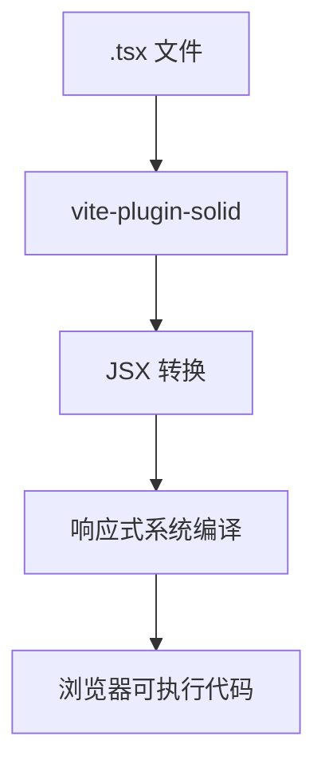
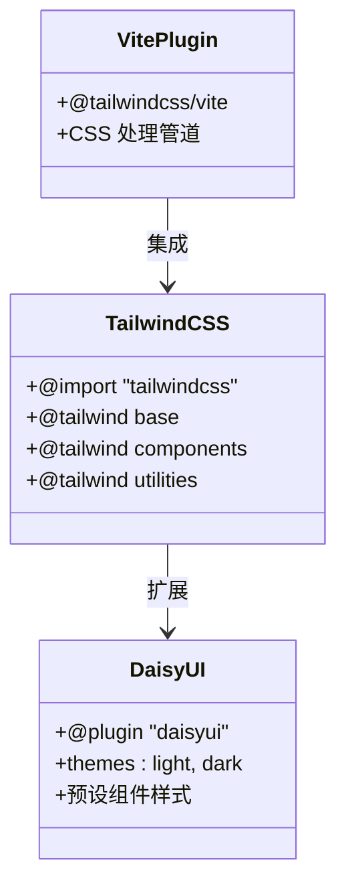
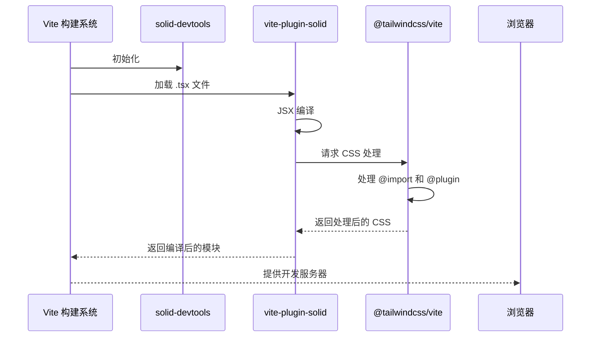

# 插件配置

<cite>
**本文档中引用的文件**  
- [vite.config.ts](file://vite.config.ts)
- [package.json](file://package.json)
- [src/index.css](file://src/index.css)
- [src/App.tsx](file://src/App.tsx)
- [src/component/Container.tsx](file://src/component/Container.tsx)
- [src/view/home.tsx](file://src/view/home.tsx)
</cite>

## 目录
1. [简介](#简介)
2. [核心插件配置](#核心插件配置)
3. [SolidJS 插件集成](#solidjs-插件集成)
4. [TailwindCSS 与 DaisyUI 集成](#tailwindcss-与-daisyui-集成)
5. [插件协作关系分析](#插件协作关系分析)
6. [插件配置最佳实践](#插件配置最佳实践)
7. [常见问题与调试技巧](#常见问题与调试技巧)
8. [结论](#结论)

## 简介

devkimi 是一个基于 Tauri 和 SolidJS 构建的多功能开发者工具集，其前端构建依赖于 Vite。本项目通过 Vite 插件系统实现了 SolidJS 支持、TailwindCSS 样式处理以及开发调试工具的集成。`vite.config.ts` 文件中的 `plugins` 数组定义了项目构建过程中使用的核心插件，包括 `solid-devtools`、`vite-plugin-solid` 和 `@tailwindcss/vite`。

这些插件共同支撑了项目的现代前端开发体验，提供了高效的开发服务器、热更新、CSS 原子化样式处理以及 UI 组件库支持。本文档将详细分析这些插件的配置方式、功能作用及相互协作机制。

**Section sources**
- [vite.config.ts](file://vite.config.ts#L1-L14)
- [README.md](file://README.md#L6-L49)

## 核心插件配置

devkimi 项目在 `vite.config.ts` 中配置了三个核心 Vite 插件：

```ts
plugins: [devtools(), solidPlugin(), tailwindcss()]
```

这三个插件按顺序执行，分别负责开发调试增强、SolidJS 框架支持和 TailwindCSS 样式处理。插件的加载顺序至关重要，确保了 SolidJS 组件能够正确解析并应用 TailwindCSS 类名。

- **solid-devtools/vite**: 提供 SolidJS 开发者工具支持，增强组件调试能力
- **vite-plugin-solid**: 支持 SolidJS 组件的编译与热更新
- **@tailwindcss/vite**: 集成 TailwindCSS 到 Vite 构建流程中

这些插件通过 ES 模块导入的方式引入，并在 `defineConfig` 中注册到 `plugins` 数组中，构成了项目的基础构建能力。

**Section sources**
- [vite.config.ts](file://vite.config.ts#L7-L7)

## SolidJS 插件集成

`vite-plugin-solid` 是 devkimi 项目中用于支持 SolidJS 框架的核心插件。该插件使得 Vite 能够正确解析 `.tsx` 文件中的 SolidJS 语法，并提供 JSX 转换、组件热更新（HMR）等关键功能。

在项目中，`solidPlugin()` 被直接添加到插件数组中，采用默认配置即可满足需求。SolidJS 作为一种细粒度响应式的 JavaScript 库，其组件在编译时被转换为高效的原生 JavaScript 代码，这得益于 `vite-plugin-solid` 对编译流程的深度集成。

项目中的 `App.tsx` 和 `home.tsx` 等文件均使用 SolidJS 的 `createSignal`、`Suspense` 等特性，验证了插件的正确集成和运行。



**Diagram sources**
- [vite.config.ts](file://vite.config.ts#L3-L3)
- [src/App.tsx](file://src/App.tsx#L1-L47)

**Section sources**
- [vite.config.ts](file://vite.config.ts#L3-L3)
- [src/App.tsx](file://src/App.tsx#L1-L47)

## TailwindCSS 与 DaisyUI 集成

TailwindCSS 通过 `@tailwindcss/vite` 插件集成到 Vite 构建系统中。该项目还使用了 DaisyUI 作为 TailwindCSS 的组件化扩展，提供了丰富的预设 UI 组件和主题支持。

在 `src/index.css` 中，通过 `@import` 和 `@plugin` 语法引入了 TailwindCSS 的核心指令：

```css
@import "tailwindcss";
@plugin "@tailwindcss/typography";
@plugin "daisyui" {
  themes: light, dark;
}
```

此配置启用了 DaisyUI 并预设了 light 和 dark 两种主题模式，与项目中通过 Tauri 实现的主题切换功能相呼应。`tailwind-merge` 工具也被用于组件中（如 `Container.tsx`），以安全地合并 TailwindCSS 类名，避免样式冲突。

DaisyUI 的集成使得项目能够快速构建美观的 UI 界面，如按钮、容器等组件均使用了 `btn`、`bg-base-100` 等 DaisyUI 预设类名。



**Diagram sources**
- [src/index.css](file://src/index.css#L1-L7)
- [src/component/Container.tsx](file://src/component/Container.tsx#L3-L3)

**Section sources**
- [vite.config.ts](file://vite.config.ts#L1-L1)
- [src/index.css](file://src/index.css#L1-L7)
- [package.json](file://package.json#L17-L17)

## 插件协作关系分析

devkimi 项目中的 Vite 插件形成了一个协同工作的生态系统：

1. **solid-devtools** 在开发阶段提供组件树可视化和状态调试功能
2. **vite-plugin-solid** 负责 SolidJS 组件的编译和 HMR
3. **@tailwindcss/vite** 处理 CSS 样式生成和优化

这些插件按照特定顺序执行，确保了 SolidJS 组件中的 TailwindCSS 类名能够被正确处理。构建流程中，TypeScript 文件首先由 `vite-plugin-solid` 处理，然后 CSS 文件由 `@tailwindcss/vite` 处理，最终生成优化的静态资源。



**Diagram sources**
- [vite.config.ts](file://vite.config.ts#L1-L7)

**Section sources**
- [vite.config.ts](file://vite.config.ts#L1-L14)

## 插件配置最佳实践

### 添加新插件

1. 使用 pnpm 安装插件：`pnpm add -D plugin-name`
2. 在 `vite.config.ts` 中导入插件
3. 将插件实例添加到 `plugins` 数组中

### 配置插件选项

对于需要配置的插件，应传递配置对象：

```ts
plugins: [
  devtools({ /* 配置选项 */ }),
  solidPlugin({ /* 配置选项 */ }),
  tailwindcss({ /* 配置选项 */ })
]
```

### 处理插件冲突

1. 注意插件加载顺序，通常框架插件在前，CSS 插件在后
2. 避免重复处理同一类文件
3. 使用 `enforce: 'pre'` 或 `enforce: 'post'` 控制执行时机

### 性能优化

- 将开发专用插件（如 devtools）限制在开发环境
- 合理配置插件的 include/exclude 规则
- 定期更新插件版本以获取性能改进

**Section sources**
- [vite.config.ts](file://vite.config.ts#L1-L14)
- [package.json](file://package.json#L13-L24)

## 常见问题与调试技巧

### 插件未生效

**问题**：TailwindCSS 类名未生成  
**解决方案**：
1. 确认 `@tailwindcss/vite` 已正确安装
2. 检查 `src/index.css` 是否包含 `@import "tailwindcss"`
3. 验证 `vite.config.ts` 中插件已注册

### 样式冲突

**问题**：DaisyUI 样式与其他库冲突  
**解决方案**：
1. 使用 `tailwind-merge` 合并类名
2. 在 `daisyui` 配置中调整主题优先级
3. 使用 `!important` 或更高特异性选择器

### HMR 失效

**问题**：SolidJS 组件修改后未热更新  
**解决方案**：
1. 检查 `vite-plugin-solid` 是否正确配置
2. 确保组件使用了正确的响应式语法
3. 重启开发服务器

### 主题切换异常

**问题**：light/dark 主题切换不生效  
**解决方案**：
1. 检查 `index.css` 中是否正确配置了 daisyui 主题
2. 验证 HTML 根元素是否设置了正确的 data-theme 属性
3. 确认主题切换逻辑是否正确更新了 DOM

**Section sources**
- [src/index.css](file://src/index.css#L5-L7)
- [src/component/Container.tsx](file://src/component/Container.tsx#L3-L3)
- [vite.config.ts](file://vite.config.ts#L1-L14)

## 结论

devkimi 项目通过精心配置的 Vite 插件系统，成功集成了 SolidJS、TailwindCSS 和 DaisyUI 等现代前端技术栈。`vite.config.ts` 中的插件配置简洁而高效，体现了现代前端构建的最佳实践。

插件之间的协作关系清晰，SolidJS 提供响应式能力，TailwindCSS 提供原子化样式，DaisyUI 提供组件化 UI，三者结合打造了高效、美观的开发者工具界面。通过遵循本文档中的最佳实践，可以确保插件系统的稳定性和可维护性，为项目的持续发展奠定坚实基础。