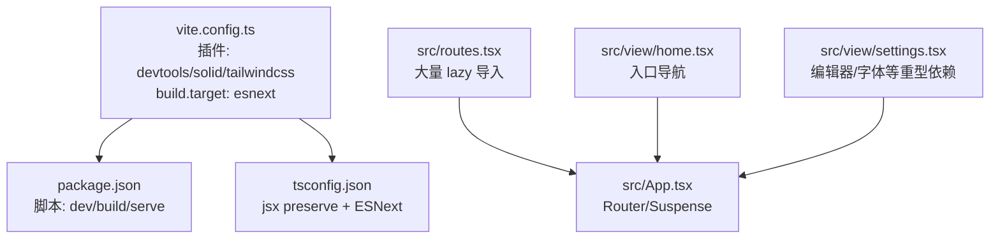
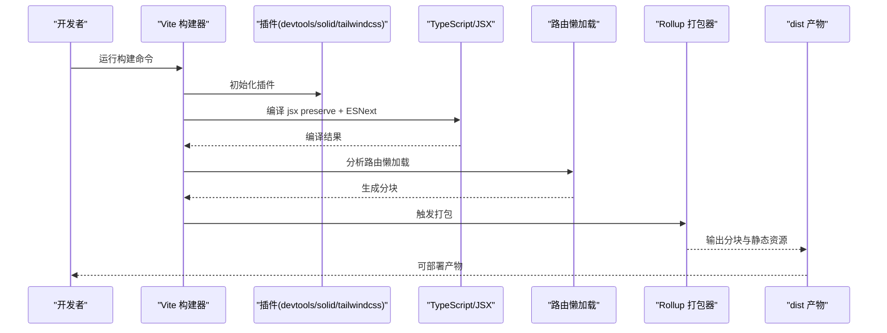
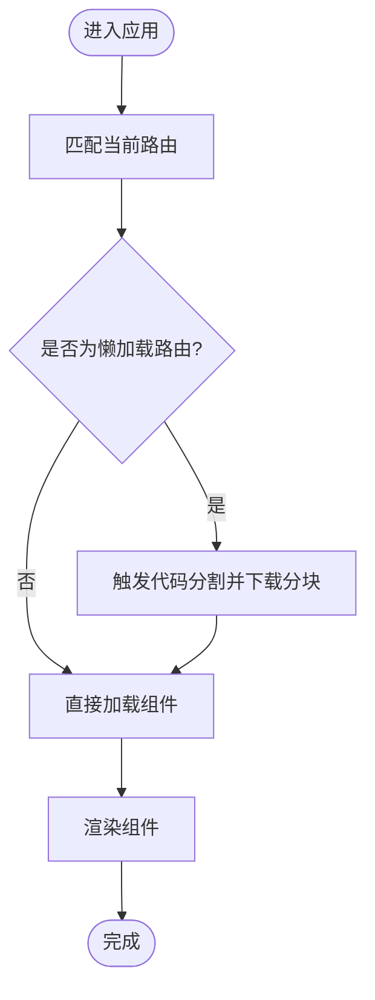
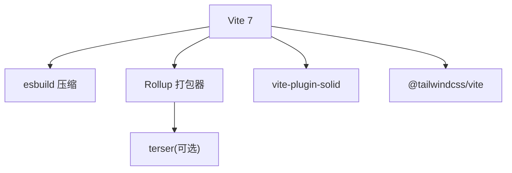

# 构建优化配置

<cite>
**本文引用的文件**
- [vite.config.ts](file://vite.config.ts)
- [package.json](file://package.json)
- [tsconfig.json](file://tsconfig.json)
- [src/routes.tsx](file://src/routes.tsx)
- [src/App.tsx](file://src/App.tsx)
- [src/view/settings.tsx](file://src/view/settings.tsx)
- [src/view/home.tsx](file://src/view/home.tsx)
- [pnpm-lock.yaml](file://pnpm-lock.yaml)
</cite>

## 目录
1. [简介](#简介)
2. [项目结构](#项目结构)
3. [核心组件](#核心组件)
4. [架构总览](#架构总览)
5. [详细组件分析](#详细组件分析)
6. [依赖分析](#依赖分析)
7. [性能考量](#性能考量)
8. [故障排查指南](#故障排查指南)
9. [结论](#结论)
10. [附录](#附录)

## 简介
本文件聚焦于 devkimi 项目的构建优化配置，系统性分析 vite.config.ts 中 build 对象的现状与可优化点，结合项目实际（路由懒加载、TailwindCSS 插件、SolidJS 生态）给出生产环境优化策略与实操建议，帮助在保证功能完整性的前提下降低打包体积、提升构建与运行性能。

## 项目结构
devkimi 使用 Vite + SolidJS + TailwindCSS + Tauri 的组合。前端路由采用动态导入实现按需加载；构建配置当前仅设置了目标为 ESNext，未启用压缩、代码分割、静态资源处理等生产优化项。整体结构清晰，便于进行针对性优化。

图表来源
- [vite.config.ts](file://vite.config.ts#L1-L15)
- [package.json](file://package.json#L1-L43)
- [tsconfig.json](file://tsconfig.json#L1-L20)
- [src/routes.tsx](file://src/routes.tsx#L1-L242)
- [src/App.tsx](file://src/App.tsx#L1-L47)
- [src/view/home.tsx](file://src/view/home.tsx#L1-L47)
- [src/view/settings.tsx](file://src/view/settings.tsx#L1-L122)

章节来源
- [vite.config.ts](file://vite.config.ts#L1-L15)
- [package.json](file://package.json#L1-L43)
- [tsconfig.json](file://tsconfig.json#L1-L20)
- [src/routes.tsx](file://src/routes.tsx#L1-L242)
- [src/App.tsx](file://src/App.tsx#L1-L47)
- [src/view/home.tsx](file://src/view/home.tsx#L1-L47)
- [src/view/settings.tsx](file://src/view/settings.tsx#L1-L122)

## 核心组件
- 构建配置入口：vite.config.ts
  - 当前 build 仅设置 target 为 ESNext，未显式配置压缩、产物目录、代码分割、静态资源处理等生产优化项。
- 路由与懒加载：src/routes.tsx 大量使用 lazy 导入，天然形成按需加载与代码分割基础。
- 类型与编译：tsconfig.json 保持 jsx preserve 并指向 ESNext，利于现代浏览器与 Tree Shaking。
- 依赖与版本：package.json 指定 Vite 7、Solid 插件、TailwindCSS 插件；pnpm-lock.yaml 显示 esbuild、terser 等工具可用。

章节来源
- [vite.config.ts](file://vite.config.ts#L1-L15)
- [src/routes.tsx](file://src/routes.tsx#L1-L242)
- [tsconfig.json](file://tsconfig.json#L1-L20)
- [package.json](file://package.json#L1-L43)
- [pnpm-lock.yaml](file://pnpm-lock.yaml#L1158-L1211)

## 架构总览
从构建视角看，devkimi 的前端构建链路如下：
- Vite 读取 vite.config.ts，加载 devtools/solid/tailwindcss 插件
- 依据 tsconfig.json 的 jsx preserve 与 ESNext 目标，配合 Solid 插件进行编译
- 路由层的 lazy 导入触发 Rollup 代码分割
- 产物输出至 dist（Vite 默认），可通过 build.rollupOptions 进一步优化

图表来源
- [vite.config.ts](file://vite.config.ts#L1-L15)
- [src/routes.tsx](file://src/routes.tsx#L1-L242)
- [tsconfig.json](file://tsconfig.json#L1-L20)

## 详细组件分析

### 构建配置现状与优化建议（vite.config.ts）
- 现状
  - 仅设置 build.target 为 ESNext，未开启压缩、产物目录、代码分割策略、静态资源处理等生产优化。
- 建议新增或调整项（不直接贴出代码，仅给出路径与要点）
  - 输出目录：通过 build.outDir 指向明确的 dist 目录，便于 CI/CD 与部署。
  - 压缩与最小化：启用 build.rollupOptions.output.manualChunks 或使用默认分块策略，并确保生产模式下的压缩生效（Vite 7 默认使用 esbuild 压缩）。
  - 代码分割：利用现有 lazy 导入，结合 build.rollupOptions.manualChunks 对关键页面（如编辑器、多工具页面）进行手动分块，减少首屏体积。
  - 静态资源处理：通过 build.assetsDir 控制静态资源目录；通过 build.assetsInlineLimit 控制内联阈值，平衡请求数与单文件大小。
  - 产物清理：在构建前清理旧产物，避免历史文件残留。
- 影响评估
  - 以上调整将显著降低首屏加载体积，提升交互响应速度；同时改善缓存命中率与 CDN 效率。

章节来源
- [vite.config.ts](file://vite.config.ts#L1-L15)

### 路由懒加载与代码分割（src/routes.tsx）
- 现状
  - 多个子路由使用 lazy 导入，天然形成按需加载与分块。
- 优化建议
  - 将重型页面（如编辑器、加密工具）单独分块，避免非关键路径阻塞首屏。
  - 对高频但体量较小的工具页面，可考虑合并为公共分块，减少请求数。
  - 在 App 层使用 Suspense 提升用户体验，避免空白等待。
- 性能收益
  - 首屏仅加载必要路由与组件，显著缩短白屏时间；用户访问特定工具时再加载对应分块。

图表来源
- [src/routes.tsx](file://src/routes.tsx#L1-L242)
- [src/App.tsx](file://src/App.tsx#L1-L47)

章节来源
- [src/routes.tsx](file://src/routes.tsx#L1-L242)
- [src/App.tsx](file://src/App.tsx#L1-L47)

### 类型与编译配置（tsconfig.json）
- 现状
  - jsx preserve + ESNext，利于现代浏览器与 Tree Shaking。
- 建议
  - 保持 jsx preserve 不变，确保 Solid 插件正确处理 JSX。
  - 如需进一步 Tree Shaking，可在生产构建时确保外部依赖均为 ESM 并移除未使用导出。

章节来源
- [tsconfig.json](file://tsconfig.json#L1-L20)

### 重型页面与依赖（src/view/settings.tsx）
- 现状
  - 使用 monaco-editor、系统字体查询等重型依赖，通常出现在设置页。
- 优化建议
  - 将设置页独立为分块，避免首屏加载。
  - 对 monaco-editor 的语言包按需加载，减少初始体积。
  - 字体列表异步加载，避免阻塞主线程。

章节来源
- [src/view/settings.tsx](file://src/view/settings.tsx#L1-L122)

### 入口与导航（src/view/home.tsx）
- 现状
  - 作为首页聚合入口，点击后跳转到具体工具页。
- 优化建议
  - 首页本身尽量轻量化，仅保留必要的导航按钮与图标。
  - 对图标库按需引入，避免全量打包。

章节来源
- [src/view/home.tsx](file://src/view/home.tsx#L1-L47)

## 依赖分析
- Vite 与生态
  - Vite 7 已内置 esbuild 压缩与现代打包能力；terser 可选，用于替代压缩器或额外优化。
  - Solid 插件负责 JSX 编译与刷新机制；TailwindCSS 插件负责样式提取与优化。
- 锁定文件提示
  - pnpm-lock.yaml 显示 terser、rollup、esbuild 等工具存在，可按需启用压缩与自定义分块策略。

图表来源
- [pnpm-lock.yaml](file://pnpm-lock.yaml#L1158-L1211)
- [pnpm-lock.yaml](file://pnpm-lock.yaml#L1983-L1996)

章节来源
- [pnpm-lock.yaml](file://pnpm-lock.yaml#L1158-L1211)
- [pnpm-lock.yaml](file://pnpm-lock.yaml#L1983-L1996)

## 性能考量
- 构建阶段
  - 启用压缩与分块，减少产物体积与请求数。
  - 使用 lazy 导入与 Suspense，优化首屏体验。
  - 控制静态资源内联阈值，平衡请求数与缓存友好性。
- 运行阶段
  - 首屏仅加载必要路由与组件，其他页面按需加载。
  - 对重型依赖（如编辑器）延迟加载，避免阻塞。
  - 使用现代浏览器目标（ESNext）与 Tree Shaking，减少冗余代码。

[本节为通用指导，无需列出具体文件来源]

## 故障排查指南
- 构建失败或产物异常
  - 确认 Vite 与插件版本兼容（参考 pnpm-lock.yaml 中的 peerDependencies 与版本范围）。
  - 若启用 terser，请检查 terser 是否与当前 esbuild 配置冲突。
- 首屏过慢
  - 检查是否存在未懒加载的重型页面或依赖。
  - 评估分块策略，确保关键路径最小化。
- 资源加载问题
  - 检查 build.assetsDir 与 publicDir 配置，避免资源路径错误。
  - 确保静态资源内联阈值合理，避免过大内联导致首屏阻塞。

章节来源
- [pnpm-lock.yaml](file://pnpm-lock.yaml#L1158-L1211)

## 结论
devkimi 的现有配置已具备良好的基础：ESNext 目标、路由懒加载与 TailwindCSS 插件。生产优化的关键在于补齐构建配置（输出目录、压缩、分块、静态资源处理），并结合现有 lazy 导入策略进一步细化分块粒度。通过这些调整，可以在不牺牲功能的前提下显著降低打包体积与首屏加载时间，提升整体性能与用户体验。

[本节为总结性内容，无需列出具体文件来源]

## 附录
- 实际优化案例（步骤级，不含代码）
  - 步骤一：在构建配置中添加输出目录与压缩开关，确保生产模式下启用压缩。
  - 步骤二：基于现有 lazy 导入，使用 manualChunks 将重型页面（如设置页）拆分为独立分块。
  - 步骤三：对静态资源设置合理的内联阈值，减少请求数并提升缓存命中。
  - 步骤四：在路由层统一使用 Suspense，优化用户等待体验。
  - 步骤五：对比优化前后产物体积与首屏加载时间，持续迭代分块策略。

[本节为方法论与流程建议，无需列出具体文件来源]