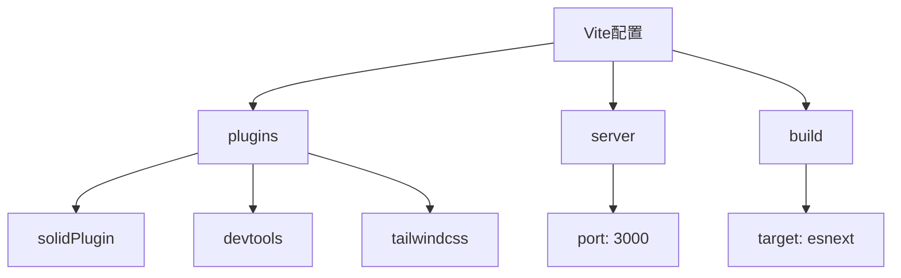
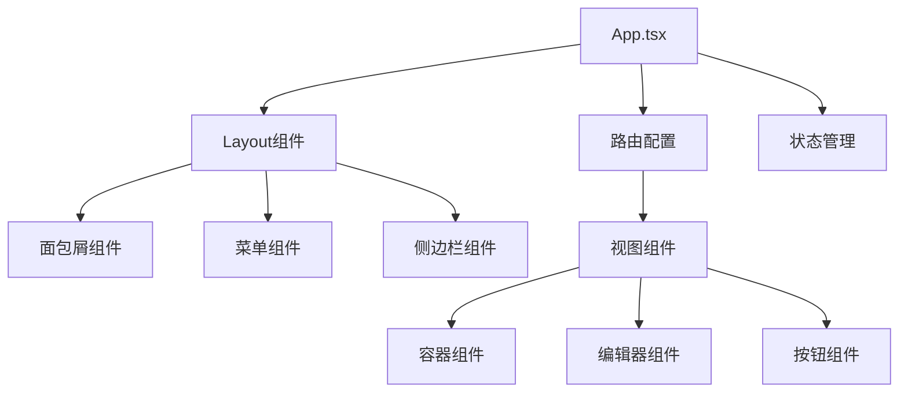

# 路径别名配置

<cite>
**本文档中引用的文件**  
- [vite.config.ts](file://vite.config.ts)
- [tsconfig.json](file://tsconfig.json)
- [App.tsx](file://src/App.tsx)
- [routes.tsx](file://src/routes.tsx)
</cite>

## 目录
1. [简介](#简介)
2. [项目结构分析](#项目结构分析)
3. [路径别名配置现状](#路径别名配置现状)
4. [Vite与TypeScript配置分析](#vite与typescript配置分析)
5. [导入模式分析](#导入模式分析)
6. [建议的路径别名配置](#建议的路径别名配置)
7. [配置最佳实践](#配置最佳实践)
8. [常见问题与解决方案](#常见问题与解决方案)
9. [结论](#结论)

## 简介
本文档详细分析devkimi项目的模块导入配置情况，重点研究Vite和TypeScript中的路径别名配置。通过分析项目结构和现有配置，我们发现项目当前未使用路径别名，而是采用相对路径导入方式。本文档将解释如何配置路径别名以提高代码可读性和维护性，并提供具体的配置建议。

## 项目结构分析
devkimi项目采用功能模块化组织结构，主要目录包括：
- `src/command`：命令处理逻辑
- `src/component`：UI组件
- `src/utils`：工具函数
- `src/view`：视图组件
- `src-tauri`：Tauri应用后端

项目结构清晰，按功能划分模块，但目前未配置路径别名来简化模块导入。

**Section sources**
- [project_structure](file://project_structure)

## 路径别名配置现状
经过全面分析，发现devkimi项目当前**未配置任何路径别名**。项目中的模块导入全部使用相对路径，例如：
- `import Layout from "./component/Layout"`
- `import { RouteMeta, routeMetas } from "./routes"`
- `import Container from "../component/Container"`

这种导入方式虽然可行，但当项目规模增大或目录层级较深时，会导致导入路径冗长且容易出错。

**Section sources**
- [App.tsx](file://src/App.tsx#L4)
- [view/text/jsonpath.tsx](file://src/view/text/jsonpath.tsx#L2)
- [component/Layout/Menu.tsx](file://src/component/Layout/Menu.tsx#L5)

## Vite与TypeScript配置分析
### Vite配置分析
检查`vite.config.ts`文件，发现当前配置中**没有resolve.alias配置**：



**Diagram sources**
- [vite.config.ts](file://vite.config.ts#L1-L14)

### TypeScript配置分析
`tsconfig.json`文件中**没有paths配置**，这意味着TypeScript编译器不会处理任何路径别名：

```json
{
  "compilerOptions": {
    "jsx": "preserve",
    "jsxImportSource": "solid-js",
    "target": "ESNext",
    "allowSyntheticDefaultImports": true,
    "esModuleInterop": true,
    "isolatedModules": true,
    "module": "ESNext",
    "moduleResolution": "bundler",
    "noEmit": true,
    "strict": true,
    "types": [
      "vite/client"
    ]
  }
}
```

**Diagram sources**
- [tsconfig.json](file://tsconfig.json#L1-L20)

## 导入模式分析
通过分析项目中的导入语句，可以总结出以下模式：



所有导入都使用相对路径，没有使用任何别名前缀（如@/）。这种模式在小型项目中可行，但随着项目增长，维护成本会增加。

**Section sources**
- [App.tsx](file://src/App.tsx#L1-L47)
- [routes.tsx](file://src/routes.tsx#L1-L200)
- [view/home.tsx](file://src/view/home.tsx#L2)

## 建议的路径别名配置
为了提高代码可读性和维护性，建议添加以下路径别名配置：

### Vite配置修改
在`vite.config.ts`中添加resolve.alias配置：

```mermaid
flowchart TD
A[添加路径别名] --> B[@/components]
A --> C[@/views]
A --> D[@/utils]
A --> E[@/commands]
B --> F[指向src/component]
C --> G[指向src/view]
D --> H[指向src/utils]
E --> I[指向src/command]
```

### TypeScript配置修改
在`tsconfig.json`中添加paths配置：

```json
{
  "compilerOptions": {
    "paths": {
      "@/*": ["src/*"],
      "@components/*": ["src/component/*"],
      "@views/*": ["src/view/*"],
      "@utils/*": ["src/utils/*"],
      "@commands/*": ["src/command/*"]
    }
  }
}
```

**Section sources**
- [vite.config.ts](file://vite.config.ts)
- [tsconfig.json](file://tsconfig.json)

## 配置最佳实践
### 添加路径别名的步骤
1. **修改vite.config.ts**：在defineConfig中添加resolve.alias配置
2. **修改tsconfig.json**：在compilerOptions中添加paths配置
3. **重启开发服务器**：使Vite配置生效
4. **重启TypeScript语言服务**：使类型检查正确识别别名

### 推荐的别名配置
```typescript
resolve: {
  alias: {
    '@': path.resolve(__dirname, 'src'),
    '@components': path.resolve(__dirname, 'src/component'),
    '@views': path.resolve(__dirname, 'src/view'),
    '@utils': path.resolve(__dirname, 'src/utils'),
    '@commands': path.resolve(__dirname, 'src/command'),
    '@stores': path.resolve(__dirname, 'src/store')
  }
}
```

### 使用示例
配置后，可以使用简洁的导入方式：
```typescript
// 之前
import Layout from "./component/Layout";
import { parseJsonPath } from "../../command/text/jsonpath";

// 之后
import Layout from "@components/Layout";
import { parseJsonPath } from "@commands/text/jsonpath";
```

**Section sources**
- [vite.config.ts](file://vite.config.ts)
- [tsconfig.json](file://tsconfig.json)

## 常见问题与解决方案
### 问题1：TypeScript无法识别别名
**症状**：编辑器显示"无法找到模块"错误
**解决方案**：
- 确保tsconfig.json中配置了paths
- 重启IDE或编辑器的TypeScript语言服务
- 检查路径是否正确，注意大小写敏感性

### 问题2：Vite构建失败
**症状**：构建时出现"模块未找到"错误
**解决方案**：
- 确保vite.config.ts中配置了resolve.alias
- 检查路径是否使用path.resolve()正确解析
- 确认Vite插件顺序正确

### 问题3：别名不生效
**症状**：开发服务器运行但别名未被替换
**解决方案**：
- 重启Vite开发服务器
- 清除浏览器缓存
- 检查配置文件语法是否正确

### 问题4：路径解析错误
**症状**：出现意外的路径解析结果
**解决方案**：
- 使用绝对路径而非相对路径定义别名
- 避免别名冲突（如同时定义@和@components）
- 测试各种导入场景确保一致性

**Section sources**
- [vite.config.ts](file://vite.config.ts)
- [tsconfig.json](file://tsconfig.json)

## 结论
虽然devkimi项目当前未使用路径别名，但通过分析项目结构和导入模式，我们建议添加适当的路径别名配置以提高代码质量和可维护性。配置路径别名需要同时修改Vite和TypeScript的配置文件，确保开发环境和类型检查都能正确识别别名。实施路径别名后，项目将获得更简洁的导入语句、更好的代码可读性以及更强的重构能力。