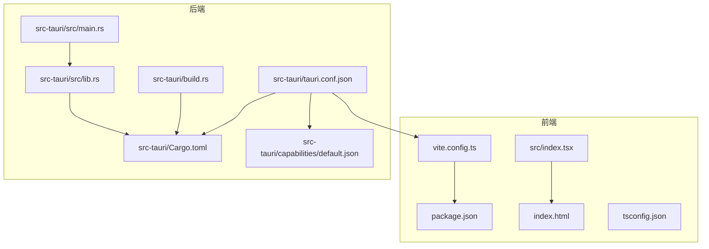
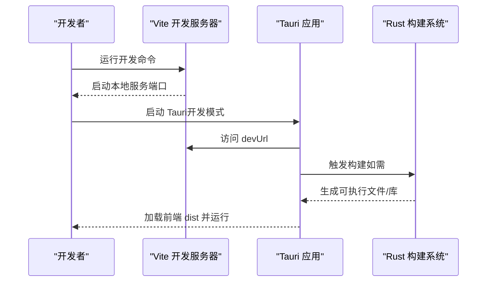
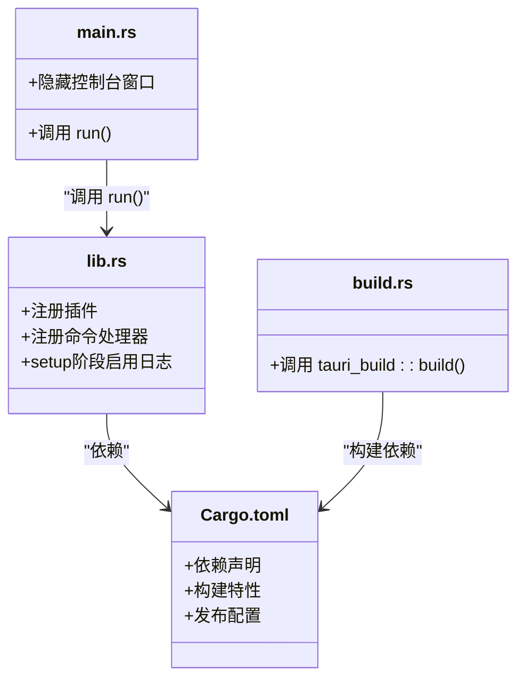
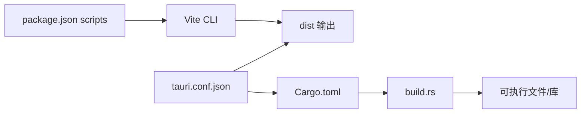

# 构建配置

<cite>
**本文引用的文件**
- [src-tauri/tauri.conf.json](file://src-tauri/tauri.conf.json)
- [vite.config.ts](file://vite.config.ts)
- [package.json](file://package.json)
- [src-tauri/Cargo.toml](file://src-tauri/Cargo.toml)
- [src-tauri/build.rs](file://src-tauri/build.rs)
- [src-tauri/src/lib.rs](file://src-tauri/src/lib.rs)
- [src-tauri/src/main.rs](file://src-tauri/src/main.rs)
- [src-tauri/capabilities/default.json](file://src-tauri/capabilities/default.json)
- [index.html](file://index.html)
- [tsconfig.json](file://tsconfig.json)
- [src/index.tsx](file://src/index.tsx)
</cite>

## 目录
1. [简介](#简介)
2. [项目结构](#项目结构)
3. [核心组件](#核心组件)
4. [架构总览](#架构总览)
5. [详细组件分析](#详细组件分析)
6. [依赖关系分析](#依赖关系分析)
7. [性能考量](#性能考量)
8. [故障排查指南](#故障排查指南)
9. [结论](#结论)
10. [附录](#附录)

## 简介
本文件系统化梳理 devkimi 项目的构建配置，重点覆盖以下方面：
- Tauri 配置文件 tauri.conf.json 的应用元数据、窗口设置、安全策略与打包选项
- Vite 前端构建配置 vite.config.ts 的插件、开发服务器与构建目标
- Tauri 与 Vite 的集成机制与工作流
- 能力与权限配置（capabilities）对 API 权限的约束
- 最佳实践与常见问题解决方案

## 项目结构
devkimi 采用“前端（Vite + Solid + Tailwind）+ 后端（Tauri + Rust）”的双层架构。前端负责用户界面与交互逻辑，后端通过 Tauri 暴露系统级能力与命令接口，二者通过 tauri.conf.json 中的构建与开发 URL 配置进行衔接。

图表来源
- [vite.config.ts](file://vite.config.ts#L1-L15)
- [package.json](file://package.json#L1-L43)
- [src/index.tsx](file://src/index.tsx#L1-L37)
- [index.html](file://index.html#L1-L18)
- [tsconfig.json](file://tsconfig.json#L1-L25)
- [src-tauri/tauri.conf.json](file://src-tauri/tauri.conf.json#L1-L46)
- [src-tauri/Cargo.toml](file://src-tauri/Cargo.toml#L1-L69)
- [src-tauri/build.rs](file://src-tauri/build.rs#L1-L4)
- [src-tauri/src/lib.rs](file://src-tauri/src/lib.rs#L1-L57)
- [src-tauri/src/main.rs](file://src-tauri/src/main.rs#L1-L7)
- [src-tauri/capabilities/default.json](file://src-tauri/capabilities/default.json#L1-L31)

章节来源
- [vite.config.ts](file://vite.config.ts#L1-L15)
- [package.json](file://package.json#L1-L43)
- [src-tauri/tauri.conf.json](file://src-tauri/tauri.conf.json#L1-L46)
- [src-tauri/Cargo.toml](file://src-tauri/Cargo.toml#L1-L69)
- [src-tauri/build.rs](file://src-tauri/build.rs#L1-L4)
- [src-tauri/src/lib.rs](file://src-tauri/src/lib.rs#L1-L57)
- [src-tauri/src/main.rs](file://src-tauri/src/main.rs#L1-L7)
- [src-tauri/capabilities/default.json](file://src-tauri/capabilities/default.json#L1-L31)
- [index.html](file://index.html#L1-L18)
- [tsconfig.json](file://tsconfig.json#L1-L25)
- [src/index.tsx](file://src/index.tsx#L1-L37)

## 核心组件
- 前端构建与开发服务器：由 Vite 提供，包含 Solid 插件、TailwindCSS 插件与开发工具插件；开发服务器默认端口为 3000；构建目标为 ESNext。
- 应用元数据与打包：Tauri 配置定义产品名称、版本、标识符、构建前后命令、开发 URL、窗口尺寸与最小尺寸、是否可调整、全屏状态、安全策略（CSP 为空、资源协议启用并限定临时目录范围）、打包目标与图标集。
- 能力与权限：通过 capabilities/default.json 为默认能力分配窗口与权限集合，明确允许的剪贴板读写、对话框打开/保存、文件系统读写/复制、存储读写/获取/条目查询以及临时目录路径开放等。
- Rust 后端与 CLI 集成：通过 Cargo.toml 声明依赖与构建特性，build.rs 调用 tauri_build::build() 完成构建流程；lib.rs 注册插件与命令处理器；main.rs 在发布模式下隐藏控制台窗口并调用 run()。

章节来源
- [vite.config.ts](file://vite.config.ts#L1-L15)
- [src-tauri/tauri.conf.json](file://src-tauri/tauri.conf.json#L1-L46)
- [src-tauri/capabilities/default.json](file://src-tauri/capabilities/default.json#L1-L31)
- [src-tauri/Cargo.toml](file://src-tauri/Cargo.toml#L1-L69)
- [src-tauri/build.rs](file://src-tauri/build.rs#L1-L4)
- [src-tauri/src/lib.rs](file://src-tauri/src/lib.rs#L1-L57)
- [src-tauri/src/main.rs](file://src-tauri/src/main.rs#L1-L7)

## 架构总览
Tauri 与 Vite 的集成通过 tauri.conf.json 的 build 字段实现：前端在本地开发时由 Vite 提供 devUrl，构建产物输出到 dist 目录，Tauri 在开发与生产阶段分别执行 beforeDevCommand 和 beforeBuildCommand，最终将 dist 作为前端分发目录挂载到应用中。

图表来源
- [src-tauri/tauri.conf.json](file://src-tauri/tauri.conf.json#L6-L11)
- [vite.config.ts](file://vite.config.ts#L8-L13)
- [src-tauri/build.rs](file://src-tauri/build.rs#L1-L4)
- [src-tauri/Cargo.toml](file://src-tauri/Cargo.toml#L1-L69)

## 详细组件分析

### Tauri 配置（tauri.conf.json）
- 应用元数据
  - 产品名称与版本：用于安装包与应用标识
  - 标识符：用于区分不同应用或版本
- 构建与开发
  - 前端分发目录：指向根目录下的 dist
  - 开发 URL：本地 Vite 服务地址
  - 开发前命令：执行前端开发脚本
  - 构建前命令：执行前端构建脚本
- 窗口设置
  - 标题、初始宽高、最小宽高、是否可调整、是否全屏
- 安全策略
  - 内容安全策略（CSP）：当前为空，表示不强制 CSP
  - 资源协议：启用 asset 协议，限制访问范围为临时目录
- 打包选项
  - 目标平台：全部平台
  - 图标集：多分辨率与平台图标

章节来源
- [src-tauri/tauri.conf.json](file://src-tauri/tauri.conf.json#L1-L46)

### Vite 配置（vite.config.ts）
- 插件链
  - Solid 插件：支持 Solid JSX 语法与热更新
  - TailwindCSS 插件：集成 Tailwind 工具链
  - 开发工具插件：提供 Solid Devtools 支持
- 开发服务器
  - 默认端口：3000
- 构建目标
  - 目标语言：ESNext，便于利用现代浏览器特性与 Tree-shaking

章节来源
- [vite.config.ts](file://vite.config.ts#L1-L15)

### TypeScript 配置（tsconfig.json）
- JSX 处理：保留 JSX 并指定导入来源为 solid-js
- 目标与模块：ESNext 与 ESNext 模块
- 路径映射：@/* 映射到 src/*
- 类型检查：严格模式与 Vite 类型声明

章节来源
- [tsconfig.json](file://tsconfig.json#L1-L25)

### HTML 入口（index.html）
- 基础 meta 信息与主题色
- 根节点容器与入口脚本加载

章节来源
- [index.html](file://index.html#L1-L18)

### 前端入口（src/index.tsx）
- 渲染入口：将 App 组件挂载到根节点
- 开发校验：确保根元素存在
- 可选快捷键与右键菜单禁用示例（注释）

章节来源
- [src/index.tsx](file://src/index.tsx#L1-L37)

### Rust 后端（src-tauri）
- 构建脚本：build.rs 调用 tauri_build::build() 完成构建
- 依赖与特性：Cargo.toml 声明 Tauri 与各插件依赖及发布配置
- 应用入口：lib.rs 注册插件与命令处理函数，并在 debug 模式下启用日志插件
- 主程序：main.rs 在发布模式下隐藏控制台窗口并启动应用

图表来源
- [src-tauri/src/lib.rs](file://src-tauri/src/lib.rs#L1-L57)
- [src-tauri/src/main.rs](file://src-tauri/src/main.rs#L1-L7)
- [src-tauri/build.rs](file://src-tauri/build.rs#L1-L4)
- [src-tauri/Cargo.toml](file://src-tauri/Cargo.toml#L1-L69)

章节来源
- [src-tauri/build.rs](file://src-tauri/build.rs#L1-L4)
- [src-tauri/Cargo.toml](file://src-tauri/Cargo.toml#L1-L69)
- [src-tauri/src/lib.rs](file://src-tauri/src/lib.rs#L1-L57)
- [src-tauri/src/main.rs](file://src-tauri/src/main.rs#L1-L7)

### 能力与权限（capabilities/default.json）
- 能力标识与描述
- 关联窗口：main
- 权限集合：
  - 剪贴板读写
  - 对话框打开/保存
  - 文件系统读写与复制
  - 存储读写/获取/条目查询
  - 路径开放：临时目录通配符范围

章节来源
- [src-tauri/capabilities/default.json](file://src-tauri/capabilities/default.json#L1-L31)

## 依赖关系分析
- 前端依赖
  - Vite、Solid、TailwindCSS、Solid Devtools、TypeScript
  - Tauri API 与各类插件（剪贴板、对话框、文件系统、存储、打开器）
- 后端依赖
  - Tauri 核心与插件生态（日志、剪贴板、对话框、文件系统、存储、打开器）
  - Rust 生态库（编码解码、加密、格式化、图像处理、正则表达式等）
- 构建链路
  - package.json scripts 调用 Vite CLI
  - tauri.conf.json 指定前端分发目录与开发 URL
  - Cargo.toml 与 build.rs 驱动 Rust 构建

图表来源
- [package.json](file://package.json#L1-L43)
- [vite.config.ts](file://vite.config.ts#L1-L15)
- [src-tauri/tauri.conf.json](file://src-tauri/tauri.conf.json#L6-L11)
- [src-tauri/Cargo.toml](file://src-tauri/Cargo.toml#L1-L69)
- [src-tauri/build.rs](file://src-tauri/build.rs#L1-L4)

章节来源
- [package.json](file://package.json#L1-L43)
- [src-tauri/tauri.conf.json](file://src-tauri/tauri.conf.json#L6-L11)
- [src-tauri/Cargo.toml](file://src-tauri/Cargo.toml#L1-L69)
- [src-tauri/build.rs](file://src-tauri/build.rs#L1-L4)

## 性能考量
- 前端构建目标
  - ESNext 目标可获得更优的 Tree-shaking 与现代浏览器特性支持，但需注意兼容性与打包体积
- 发布配置（Rust）
  - 启用 LTO、单代码单元、优化级别为“s”以优先减小二进制体积
  - 释放模式下移除调试符号，提升运行时性能
- 开发体验
  - 开发服务器端口固定为 3000，避免端口冲突
  - Solid Devtools 提升调试效率

章节来源
- [vite.config.ts](file://vite.config.ts#L1-L15)
- [src-tauri/Cargo.toml](file://src-tauri/Cargo.toml#L60-L69)

## 故障排查指南
- 开发时无法访问前端
  - 确认 Vite 开发服务器端口与 tauri.conf.json 的 devUrl 一致
  - 确认 beforeDevCommand 正确执行前端开发脚本
- 构建失败或产物缺失
  - 检查 beforeBuildCommand 是否成功生成 dist
  - 确认 frontendDist 指向正确的 dist 目录
- 权限不足导致功能异常
  - 检查 capabilities/default.json 中的权限声明是否覆盖所需 API
  - 若需要访问特定路径，确认路径范围是否正确
- 资源协议访问受限
  - 当前资源协议仅允许临时目录范围，若访问其他路径需调整范围或改用其他方案
- 发布模式控制台窗口问题
  - 确认 main.rs 中已启用 windows_subsystem 并在非调试断言下隐藏控制台

章节来源
- [src-tauri/tauri.conf.json](file://src-tauri/tauri.conf.json#L6-L11)
- [src-tauri/capabilities/default.json](file://src-tauri/capabilities/default.json#L1-L31)
- [src-tauri/src/main.rs](file://src-tauri/src/main.rs#L1-L7)

## 结论
devkimi 的构建配置清晰地分离了前端与后端职责：Vite 负责快速迭代与现代化前端体验，Tauri 负责系统级能力与跨平台打包。通过 tauri.conf.json 的统一配置，前端开发与后端构建得以无缝衔接。配合 capabilities 的权限管理与 Cargo 的发布优化，项目在开发效率与运行性能之间取得平衡。

## 附录
- 修改配置的最佳实践
  - 前端：优先通过 Vite 插件扩展能力，保持 ESNext 目标以获得更好 Tree-shaking；如需兼容旧环境，可考虑引入 polyfill 或调整目标
  - 后端：在 Cargo.toml 中按需启用插件特性，发布配置遵循“体积优先”的策略；如需更高性能，可将优化级别调整为 3
  - 安全：谨慎放宽资源协议范围；权限声明应遵循最小授权原则
- 常见问题
  - 端口冲突：修改 Vite 开发服务器端口或停止占用进程
  - 权限不足：根据功能需求补充 capabilities 权限
  - 打包体积过大：检查第三方依赖与静态资源，启用压缩与按需加载