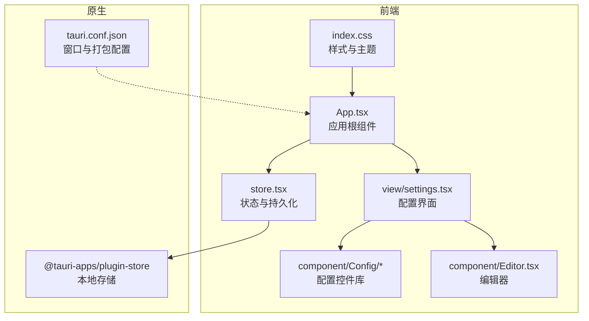
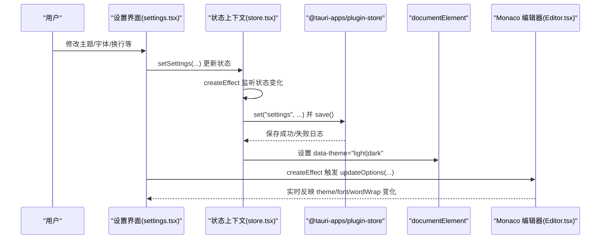
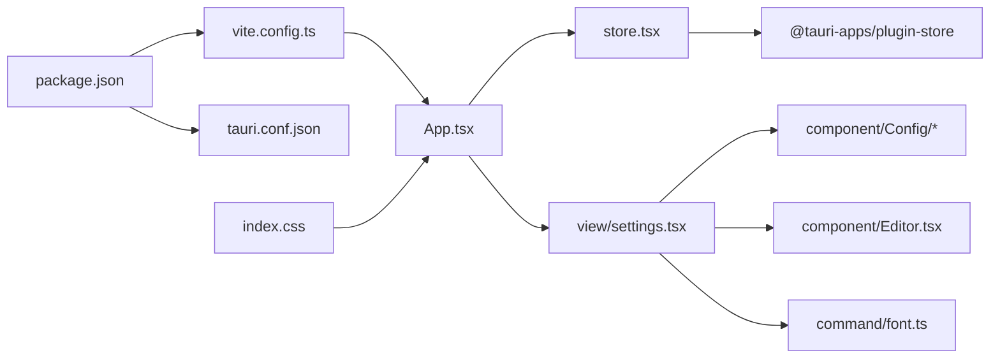

# 配置说明

<cite>
**本文引用的文件**
- [src/store.tsx](file://src/store.tsx)
- [src/view/settings.tsx](file://src/view/settings.tsx)
- [src-tauri/tauri.conf.json](file://src-tauri/tauri.conf.json)
- [vite.config.ts](file://vite.config.ts)
- [package.json](file://package.json)
- [src/component/Config/index.tsx](file://src/component/Config/index.tsx)
- [src/component/Config/Option.tsx](file://src/component/Config/Option.tsx)
- [src/component/Config/Select.tsx](file://src/component/Config/Select.tsx)
- [src/component/Config/Switch.tsx](file://src/component/Config/Switch.tsx)
- [src/component/Editor.tsx](file://src/component/Editor.tsx)
- [src/command/font.ts](file://src/command/font.ts)
- [src/index.css](file://src/index.css)
- [src/App.tsx](file://src/App.tsx)
- [tsconfig.json](file://tsconfig.json)
</cite>

## 目录
1. [简介](#简介)
2. [项目结构](#项目结构)
3. [核心组件](#核心组件)
4. [架构总览](#架构总览)
5. [详细组件分析](#详细组件分析)
6. [依赖关系分析](#依赖关系分析)
7. [性能考虑](#性能考虑)
8. [故障排查指南](#故障排查指南)
9. [结论](#结论)
10. [附录](#附录)

## 简介
本文件面向开发者与高级用户，系统性说明 devkimi 的配置体系：主题配置、编辑器配置与其他可定制选项的实现方式。文档以 store.tsx 的状态管理与 settings.tsx 的 UI 实现为核心，解释配置数据的存储、读取与更新机制；同时说明 Tauri 原生配置（tauri.conf.json）与前端构建配置（vite.config.ts）的作用与修改方法，帮助用户完成外观与行为的完整自定义。

## 项目结构
devkimi 采用前端（Solid + Vite）+ Tauri 桌面端的双层架构：
- 前端负责 UI、状态管理与配置界面；
- Tauri 负责窗口、打包与原生能力（如本地存储插件）。

图表来源
- [src/App.tsx](file://src/App.tsx#L1-L47)
- [src/store.tsx](file://src/store.tsx#L1-L88)
- [src/view/settings.tsx](file://src/view/settings.tsx#L1-L122)
- [src-tauri/tauri.conf.json](file://src-tauri/tauri.conf.json#L1-L46)

章节来源
- [src/App.tsx](file://src/App.tsx#L1-L47)
- [src-tauri/tauri.conf.json](file://src-tauri/tauri.conf.json#L1-L46)

## 核心组件
本节聚焦配置相关的三大核心模块：状态与持久化、配置 UI、编辑器。

- 状态与持久化（store.tsx）
  - 定义 Settings 类型与默认值，提供 StoreProvider 上下文；
  - 使用 @tauri-apps/plugin-store 在应用启动时加载“settings”键，变更后自动保存；
  - 通过 createEffect 将 theme 属性同步到 documentElement 的 data-theme，驱动 daisyUI 主题切换。

- 配置 UI（view/settings.tsx）
  - 提供“界面”和“编辑器”两大卡片式配置区；
  - 界面主题支持 light/dark；配置默认展开开关影响顶部配置卡片的折叠状态；
  - 编辑器配置包含字体族、字体大小与自动换行策略，实时预览。

- 编辑器（component/Editor.tsx）
  - 基于 Monaco Editor，初始化时读取全局 theme、font.family、font.size、wordWrap；
  - 支持动态 updateOptions，随配置变化即时生效；
  - 内置 light/dark 编辑器主题，颜色来自组件内定义。

章节来源
- [src/store.tsx](file://src/store.tsx#L1-L88)
- [src/view/settings.tsx](file://src/view/settings.tsx#L1-L122)
- [src/component/Editor.tsx](file://src/component/Editor.tsx#L1-L139)

## 架构总览
下面的序列图展示了从用户在设置页修改配置，到状态持久化与界面/编辑器实时响应的完整流程。

图表来源
- [src/view/settings.tsx](file://src/view/settings.tsx#L1-L122)
- [src/store.tsx](file://src/store.tsx#L1-L88)
- [src/component/Editor.tsx](file://src/component/Editor.tsx#L1-L139)

## 详细组件分析

### 状态与持久化（store.tsx）
- 数据模型
  - Settings 结构包含 common（主题、配置卡片默认展开）与 editor（wordWrap、font.family、font.size）两部分；
  - 默认值提供开箱即用的体验：暗色主题、配置卡片默认展开、关闭自动换行、默认字体族与字号。

- 生命周期与持久化
  - onMount 异步加载 store.json 中的 settings 键，若不存在则回退默认值；
  - createEffect 使用 deep tracking，一旦 settings 发生变化，立即写入 store 并保存到磁盘；
  - 主题同步：将当前 theme 写入 documentElement 的 data-theme，使 daisyUI 主题生效。

- 关键点
  - 使用 @tauri-apps/plugin-store 的 load 与 set/save 接口；
  - 通过 trackStore 精准监听编辑器子树，避免不必要的重渲染；
  - 主题切换对整个应用生效，包括 daisyUI 组件与 Monaco 编辑器主题。

章节来源
- [src/store.tsx](file://src/store.tsx#L1-L88)

### 配置 UI（view/settings.tsx）
- 界面配置
  - 主题：下拉选择 light/dark，直接写入 common.theme；
  - 配置默认展开：开关控制顶部配置卡片的折叠状态，影响 Config.Card 的默认折叠行为。

- 编辑器配置
  - 字体：通过 getSystemFonts 获取系统可用字体列表，选择后写入 editor.font.family；
  - 字体大小：数值输入框，写入 editor.font.size；
  - 自动换行：下拉选择四种策略（on/wordWrapColumn/bounded/off），写入 editor.wordWrap；
  - 预览：内置一个 Markdown 示例编辑器，实时跟随主题与编辑器设置变化。

- 交互细节
  - createEffect 监听 theme 并批量更新已注册的编辑器实例；
  - createEffect 监听 editor 子树，按需调用 updateOptions 同步 wordWrap、fontSize、fontFamily。

章节来源
- [src/view/settings.tsx](file://src/view/settings.tsx#L1-L122)
- [src/command/font.ts](file://src/command/font.ts#L1-L8)

### 编辑器组件（component/Editor.tsx）
- 初始化与主题
  - onMount 创建 Monaco 实例，初始选项从全局 settings 读取；
  - 内置 light/dark 两种编辑器主题，颜色来自组件内定义；
  - 通过 updateOptions 动态调整 theme、fontSize、fontFamily、wordWrap。

- 事件与清理
  - 订阅内容变化回调（onChange），并在组件卸载时 dispose 实例，避免内存泄漏。

章节来源
- [src/component/Editor.tsx](file://src/component/Editor.tsx#L1-L139)

### 配置控件库（component/Config/*）
- 卡片与选项
  - Card：封装折叠/展开逻辑，默认受 common.openConfigCollapse 控制；
  - Option：统一的选项布局，左侧图标+标题+描述，右侧为具体控件；
  - Select/Switch/Input/NumberInput：基础控件，配合 setSettings 使用。

- 设计要点
  - 通过 useSettings 注入全局状态，所有控件均以路径式更新（如 "common","theme"）；
  - 使用 twMerge 合并 Tailwind 类名，确保样式一致性。

章节来源
- [src/component/Config/index.tsx](file://src/component/Config/index.tsx#L1-L37)
- [src/component/Config/Option.tsx](file://src/component/Config/Option.tsx#L1-L27)
- [src/component/Config/Select.tsx](file://src/component/Config/Select.tsx#L1-L30)
- [src/component/Config/Switch.tsx](file://src/component/Config/Switch.tsx#L1-L24)

### 主题与样式（index.css）
- daisyUI 主题
  - 通过 @plugin "daisyui" 启用 light/dark 主题；
  - 全局 HTML/BODY/root 高度与溢出控制，保证布局稳定。

- 与 store 的联动
  - documentElement 的 data-theme 由 store.tsx 设置，daisyUI 主题随之切换；
  - 编辑器主题由 Editor.tsx 内置 light/dark 主题驱动。

章节来源
- [src/index.css](file://src/index.css#L1-L17)
- [src/store.tsx](file://src/store.tsx#L60-L78)
- [src/component/Editor.tsx](file://src/component/Editor.tsx#L43-L59)

## 依赖关系分析
- 前端依赖
  - @tauri-apps/plugin-store：提供本地 JSON 存储能力；
  - @tauri-apps/api：用于调用 Tauri 原生命令（如 getSystemFonts）；
  - monaco-editor：代码编辑器；
  - daisyui/tailwindcss：UI 组件与样式系统。

- 构建与开发
  - vite.config.ts：启用 solid-plugin、tailwindcss 插件与 devtools；
  - package.json：脚本与依赖声明。

- 原生配置
  - tauri.conf.json：定义窗口尺寸、最小尺寸、安全策略、打包图标等。

图表来源
- [package.json](file://package.json#L1-L43)
- [vite.config.ts](file://vite.config.ts#L1-L15)
- [src-tauri/tauri.conf.json](file://src-tauri/tauri.conf.json#L1-L46)
- [src/App.tsx](file://src/App.tsx#L1-L47)
- [src/store.tsx](file://src/store.tsx#L1-L88)
- [src/view/settings.tsx](file://src/view/settings.tsx#L1-L122)
- [src/component/Config/index.tsx](file://src/component/Config/index.tsx#L1-L37)
- [src/component/Editor.tsx](file://src/component/Editor.tsx#L1-L139)
- [src/command/font.ts](file://src/command/font.ts#L1-L8)
- [src/index.css](file://src/index.css#L1-L17)

章节来源
- [package.json](file://package.json#L1-L43)
- [vite.config.ts](file://vite.config.ts#L1-L15)
- [src-tauri/tauri.conf.json](file://src-tauri/tauri.conf.json#L1-L46)

## 性能考虑
- 状态监听粒度
  - 使用 deep tracking 仅监听 editor 子树，减少无关重渲染；
  - 对 theme 的监听在 StoreProvider 内部集中处理，避免重复计算。

- 编辑器更新
  - 批量更新已注册编辑器实例，避免逐个实例重建；
  - 通过 updateOptions 动态调整，无需销毁/重建编辑器。

- 构建目标
  - Vite 目标设为 esnext，有利于现代浏览器优化与 Tree Shaking；
  - Tailwind 与 daisyUI 通过插件引入，按需生成样式。

章节来源
- [src/store.tsx](file://src/store.tsx#L55-L78)
- [src/view/settings.tsx](file://src/view/settings.tsx#L30-L46)
- [vite.config.ts](file://vite.config.ts#L1-L15)

## 故障排查指南
- 配置未保存或丢失
  - 确认 StoreProvider 已包裹应用根组件；
  - 检查 @tauri-apps/plugin-store 是否正确安装与初始化；
  - 查看控制台保存日志，确认 set/save 是否抛错。

- 主题不生效
  - 确认 documentElement 上 data-theme 已被设置；
  - 检查 daisyUI 是否启用 light/dark 主题；
  - 确认编辑器主题与应用主题一致（Editor.tsx 内置 light/dark）。

- 编辑器字体不更新
  - 确认 settings.editor.font.family 已写入；
  - 检查 createEffect 是否触发 updateOptions；
  - 确认 getSystemFonts 返回的字体名称与系统一致。

- 系统字体不可用
  - 确认 Tauri 原生命令 get_system_fonts 已实现并返回有效列表；
  - 检查 Tauri 安全策略与权限配置。

章节来源
- [src/store.tsx](file://src/store.tsx#L55-L78)
- [src/view/settings.tsx](file://src/view/settings.tsx#L20-L35)
- [src/component/Editor.tsx](file://src/component/Editor.tsx#L90-L115)
- [src/command/font.ts](file://src/command/font.ts#L1-L8)

## 结论
devkimi 的配置体系以 store.tsx 为中心，结合 settings.tsx 的直观 UI 与 Editor.tsx 的实时反馈，实现了主题、字体与编辑器行为的完整可定制。通过 Tauri 的本地存储插件与原生配置，用户可以轻松地持久化个性化设置，并获得一致的桌面端体验。建议在扩展新配置项时遵循现有模式：定义类型、提供 UI 控件、使用 setSettings 路径式更新、并在需要时添加持久化与主题联动。

## 附录

### 配置项一览与说明
- 界面配置
  - 主题：可选值 light/dark；作用于 daisyUI 与编辑器主题；
  - 配置默认展开：布尔值；控制顶部配置卡片的默认折叠状态。

- 编辑器配置
  - 字体：字符串；系统字体名称；
  - 字体大小：数字；像素单位；
  - 自动换行：可选值 on/wordWrapColumn/bounded/off；决定文本换行策略。

章节来源
- [src/store.tsx](file://src/store.tsx#L20-L39)
- [src/view/settings.tsx](file://src/view/settings.tsx#L51-L118)

### Tauri 原生配置（tauri.conf.json）说明
- 应用元信息与构建
  - productName/version/identifier：应用名称、版本与标识符；
  - build：前端产物目录、开发服务器地址、构建前命令；
- 窗口与安全
  - app.windows：窗口尺寸、最小尺寸、是否可调整大小、是否全屏；
  - app.security：CSP 策略、资源协议与访问范围；
- 打包
  - bundle.targets：打包目标（all 表示多平台）；icons：图标清单。

章节来源
- [src-tauri/tauri.conf.json](file://src-tauri/tauri.conf.json#L1-L46)

### 前端构建配置（vite.config.ts）说明
- 插件
  - solid-plugin：Solid 开发与构建支持；
  - tailwindcss：Tailwind CSS 插件；
  - devtools：Solid Devtools（开发环境）。
- 服务器与目标
  - server.port：开发服务器端口；
  - build.target：构建目标为 esnext。

章节来源
- [vite.config.ts](file://vite.config.ts#L1-L15)

### TypeScript 配置（tsconfig.json）说明
- JSX 处理：保留 JSX 并指定 jsxImportSource 为 solid-js；
- 模块解析：bundler；
- 严格模式：开启；
- 类型声明：包含 vite/client。

章节来源
- [tsconfig.json](file://tsconfig.json#L1-L21)

### 自定义指南（实践步骤）
- 修改主题
  - 在设置界面选择 light 或 dark；
  - 若需新增主题，可在 store.tsx 中扩展主题枚举并在 daisyUI 与 Editor.tsx 中补充对应主题定义。

- 自定义字体
  - 在设置界面选择系统字体；
  - 若需限制可选字体，可在 settings.tsx 中过滤 getSystemFonts 返回值。

- 调整编辑器行为
  - 调整字体大小与自动换行策略；
  - 如需更多编辑器选项，可在 Editor.tsx 初始化与 updateOptions 中添加更多参数。

- 原生窗口与打包
  - 调整 tauri.conf.json 中窗口宽高与最小尺寸；
  - 修改 bundle.targets 以适配特定平台；
  - 如需自定义图标，替换 icons 目录下的图标文件并更新配置。

章节来源
- [src/view/settings.tsx](file://src/view/settings.tsx#L51-L118)
- [src/component/Editor.tsx](file://src/component/Editor.tsx#L78-L95)
- [src-tauri/tauri.conf.json](file://src-tauri/tauri.conf.json#L12-L33)