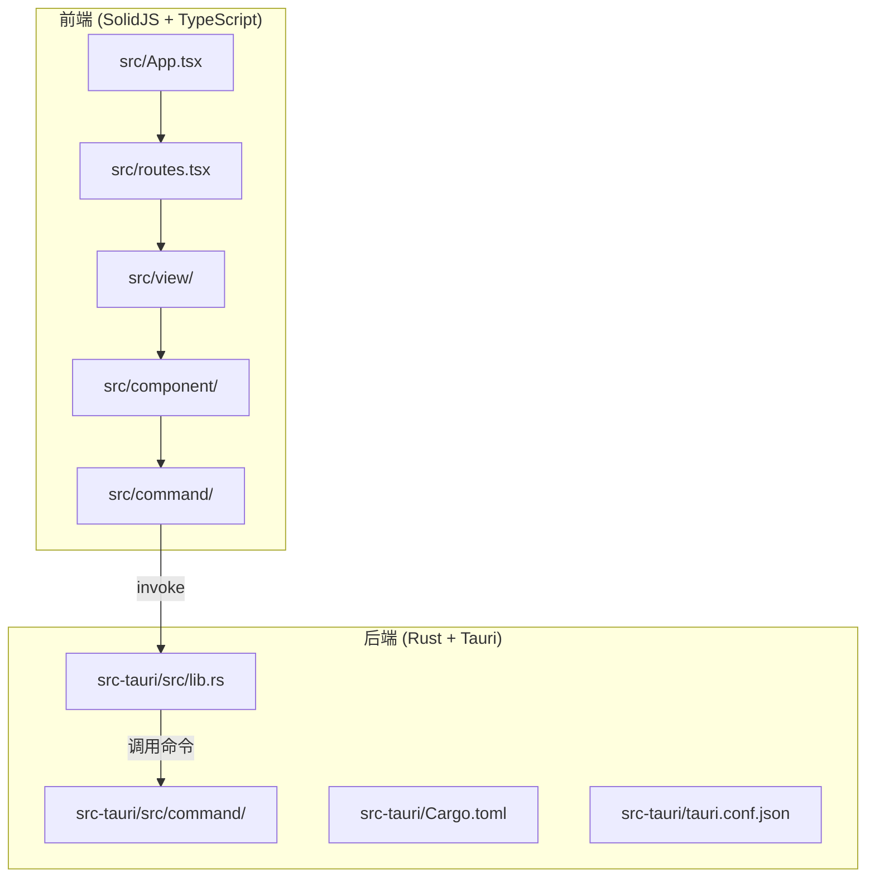
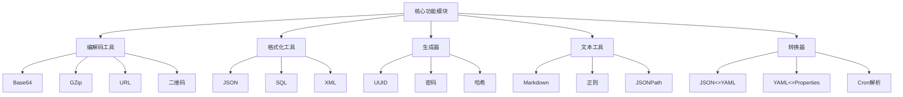
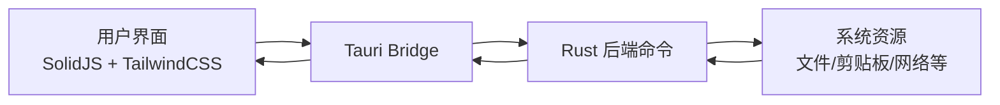
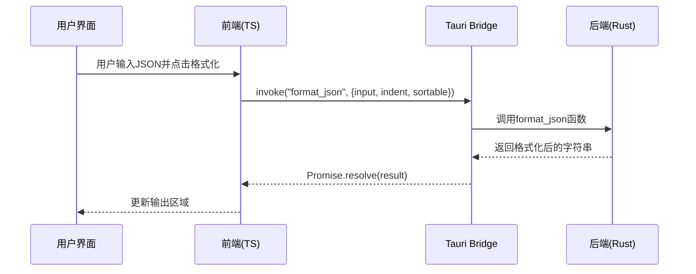
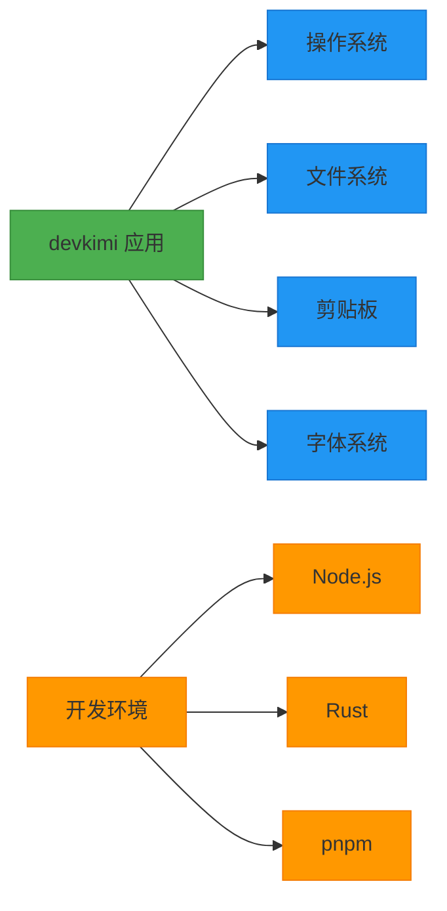

# 项目概述

<cite>
**本文档中引用的文件**  
- [README.md](file://README.md)
- [package.json](file://package.json)
- [Cargo.toml](file://src-tauri/Cargo.toml)
- [tauri.conf.json](file://src-tauri/tauri.conf.json)
- [App.tsx](file://src/App.tsx)
- [routes.tsx](file://src/routes.tsx)
- [json.tsx](file://src/view/formatter/json.tsx)
- [base64_text.tsx](file://src/view/codec/base64_text.tsx)
- [uuid.tsx](file://src/view/generator/uuid.tsx)
- [markdown.tsx](file://src/view/text/markdown.tsx)
- [json_yaml.tsx](file://src/view/converter/json_yaml.tsx)
- [lib.rs](file://src-tauri/src/lib.rs)
- [json.ts](file://src/command/formatter/json.ts)
- [base64_text.ts](file://src/command/codec/base64_text.ts)
- [uuid.ts](file://src/command/generate/uuid.ts)
- [markdown.ts](file://src/command/text/markdown.ts)
- [json_yaml.ts](file://src/command/converter/json_yaml.ts)
- [mod.rs](file://src-tauri/src/command/mod.rs)
</cite>

## 目录
1. [简介](#简介)
2. [项目结构](#项目结构)
3. [核心功能模块](#核心功能模块)
4. [技术架构](#技术架构)
5. [前后端交互机制](#前后端交互机制)
6. [典型使用场景](#典型使用场景)
7. [系统边界与依赖](#系统边界与依赖)
8. [总结](#总结)

## 简介

devkimi 是一个基于 Tauri 框架构建的多功能桌面开发者工具集，旨在为开发人员提供一套轻量级、跨平台且高效的实用工具。该项目灵感来源于 DevToys，结合了现代前端框架 SolidJS 与系统级语言 Rust 的优势，实现了高性能的本地计算能力与流畅的用户界面体验。

作为一款开发者友好型工具平台，devkimi 集成了编解码、格式化、生成器、文本处理和转换器等五大核心功能模块，覆盖了日常开发中的常见需求。无论是前端工程师、后端开发者还是运维人员，都可以通过该工具快速完成数据处理任务，提升工作效率。

项目采用 TypeScript 和 Rust 双语言开发，前端使用 SolidJS 实现响应式 UI，后端通过 Tauri 调用 Rust 编写的原生命令，确保安全性与性能。整体设计遵循模块化原则，便于功能扩展与维护。

**Section sources**
- [README.md](file://README.md#L6-L122)

## 项目结构

devkimi 的项目结构清晰地划分为前端与后端两个主要部分，分别位于 `src` 和 `src-tauri` 目录中。

前端代码（`src/`）采用组件化设计，包含通用 UI 组件、功能视图、路由配置和状态管理：
- `component/`：存放可复用的 UI 组件，如按钮、输入框、布局容器等
- `view/`：按功能模块组织的页面组件，每个子目录对应一个工具类别
- `routes.tsx`：定义应用的路由结构与导航菜单
- `App.tsx`：应用的根组件，负责初始化路由与全局状态

后端代码（`src-tauri/`）基于 Rust 构建，通过 Tauri 提供安全的系统调用接口：
- `src/command/`：实现各类工具功能的 Rust 命令函数
- `Cargo.toml`：Rust 项目的依赖与构建配置
- `tauri.conf.json`：Tauri 应用的配置文件，定义窗口属性、安全策略等

这种前后端分离的架构使得前端专注于用户体验，而后端则处理计算密集型任务，充分发挥各自技术栈的优势。



**Diagram sources**
- [README.md](file://README.md#L94-L114)
- [App.tsx](file://src/App.tsx#L1-L47)
- [lib.rs](file://src-tauri/src/lib.rs#L1-L57)

**Section sources**
- [README.md](file://README.md#L94-L114)
- [App.tsx](file://src/App.tsx#L1-L47)

## 核心功能模块

devkimi 提供了五大功能模块，涵盖开发者日常工作中常见的数据处理需求：

### 编解码工具 (Codec)
支持多种数据格式的编码与解码操作，包括：
- Base64 文本与图片的相互转换
- GZip 压缩与解压缩
- URL 编码与解码
- 二维码生成与解析

### 格式化工具 (Formatter)
提供结构化数据的美化功能：
- JSON 格式化（支持缩进与排序）
- SQL 语句格式化
- XML 格式化

### 生成器 (Generator)
快速生成常用开发所需内容：
- UUID 生成（支持 v1/v4/v7 版本）
- 密码生成（可配置长度与字符集）
- 哈希值生成（支持 MD5、SHA1、SHA256 等算法）

### 文本工具 (Text)
增强文本处理能力：
- Markdown 实时预览
- 正则表达式测试
- JSONPath 查询支持

### 转换器 (Converter)
实现不同数据格式之间的互转：
- JSON 与 YAML 相互转换
- YAML 与 Properties 文件互转
- Cron 表达式解析与可视化

每个功能模块都设计为独立的视图组件，用户可以通过侧边栏菜单快速切换，操作界面简洁直观，降低了学习成本。



**Diagram sources**
- [README.md](file://README.md#L16-L42)
- [routes.tsx](file://src/routes.tsx#L39-L218)

**Section sources**
- [README.md](file://README.md#L16-L42)
- [routes.tsx](file://src/routes.tsx#L39-L218)

## 技术架构

devkimi 采用 Tauri 框架构建桌面应用，结合 SolidJS 前端与 Rust 后端，形成高效的技术栈组合。

### 前端技术栈
- **SolidJS**：高性能的响应式前端框架，语法类似 React 但性能更优
- **Vite**：现代化构建工具，提供极速的开发服务器启动与热更新
- **TailwindCSS + DaisyUI**：实用优先的 CSS 框架与组件库，实现美观且一致的 UI 风格
- **TypeScript**：提供类型安全，增强代码可维护性

### 后端技术栈
- **Rust**：系统级编程语言，保证内存安全与高性能
- **Tauri**：轻量级桌面应用框架，使用 Web 技术构建前端，Rust 构建后端
- **Cargo**：Rust 的包管理与构建系统

### 架构优势
1. **安全性**：Tauri 默认禁用危险 API，通过显式声明的方式暴露功能
2. **性能**：Rust 编写的命令执行效率高，适合计算密集型任务
3. **体积小**：相比 Electron，Tauri 应用体积更小，启动更快
4. **跨平台**：支持 Windows、macOS 和 Linux

项目通过 `@tauri-apps/api` 提供的 `invoke` 机制实现前后端通信，前端调用命名命令，后端 Rust 函数处理并返回结果。



**Diagram sources**
- [README.md](file://README.md#L45-L49)
- [package.json](file://package.json#L1-L43)
- [Cargo.toml](file://src-tauri/Cargo.toml#L1-L69)

**Section sources**
- [README.md](file://README.md#L43-L49)
- [package.json](file://package.json#L1-L43)
- [Cargo.toml](file://src-tauri/Cargo.toml#L1-L69)

## 前后端交互机制

devkimi 的前后端通过 Tauri 提供的命令调用机制进行通信，形成清晰的职责分离。

### 通信流程
1. 前端组件通过 `@tauri-apps/api/core` 的 `invoke` 函数调用命名命令
2. Tauri 运行时将请求转发给对应的 Rust 命令函数
3. Rust 函数执行具体逻辑并返回结果
4. 前端通过 Promise 接收结果并更新 UI

### 示例：JSON 格式化
```ts
// 前端调用
const formatJson = async (input: string, indent: string, sortable: boolean) => {
  return invoke<string>("format_json", { input, indent, sortable });
};
```

```rs
// 后端注册
tauri::generate_handler![
    command::formatter::json::format_json,
    // ...其他命令
]
```

### 命令注册
在 `src-tauri/src/lib.rs` 中，所有可用命令通过 `invoke_handler` 集中注册，确保只有明确声明的功能才能被前端调用，增强了安全性。

这种设计模式不仅提高了性能（复杂计算在原生层完成），还保证了代码的可维护性与扩展性。新增功能只需在前后端分别添加对应模块，并在 `lib.rs` 中注册即可。



**Diagram sources**
- [json.ts](file://src/command/formatter/json.ts#L1-L8)
- [lib.rs](file://src-tauri/src/lib.rs#L11-L43)

**Section sources**
- [json.ts](file://src/command/formatter/json.ts#L1-L8)
- [base64_text.ts](file://src/command/codec/base64_text.ts#L1-L18)
- [uuid.ts](file://src/command/generate/uuid.ts#L1-L18)
- [lib.rs](file://src-tauri/src/lib.rs#L11-L43)

## 典型使用场景

devkimi 的设计贴近实际开发工作流，以下是几个典型使用场景：

### API 开发调试
开发者在处理 RESTful API 时，经常需要对 JSON 请求体进行格式化或验证。通过 JSON 格式化工具，可以快速美化混乱的 JSON 数据，并启用排序功能以便对比字段差异。

### 配置文件转换
在微服务架构中，配置文件常需在 JSON、YAML 和 Properties 格式间转换。使用 JSON/YAML 转换器，可一键完成格式互转，避免手动修改带来的错误。

### 安全测试
生成强密码或哈希值用于安全测试。密码生成器支持自定义长度与字符集，哈希工具支持多种算法，满足不同场景需求。

### 文档编写
编写技术文档时，使用 Markdown 预览功能可实时查看渲染效果，提升写作效率。同时支持正则表达式测试，方便验证文本匹配规则。

### 数据编码
在 Web 开发中，Base64 编码常用于嵌入图片或传输二进制数据。Base64 工具支持文本与图片的双向转换，二维码功能还可将链接或文本生成可扫描的二维码。

这些场景体现了 devkimi 作为开发者工具集的实用性与便捷性，帮助开发者专注于核心任务而非繁琐的数据处理。

**Section sources**
- [README.md](file://README.md#L16-L42)
- [routes.tsx](file://src/routes.tsx#L39-L218)

## 系统边界与依赖

devkimi 作为一个独立的桌面应用，其系统边界清晰，依赖明确。

### 外部依赖
- **Node.js**：用于前端构建与开发服务器
- **Rust Toolchain**：用于编译后端代码
- **pnpm**：包管理器，管理前端依赖

### 内部依赖
- **Tauri 插件**：
  - `tauri-plugin-fs`：文件系统访问
  - `tauri-plugin-clipboard-manager`：剪贴板操作
  - `tauri-plugin-dialog`：文件对话框
  - `tauri-plugin-store`：本地存储
- **Rust Crate**：
  - `serde`：序列化/反序列化
  - `base64`、`flate2`：编解码功能
  - `uuid`、`rand`：生成器功能
  - `regex`、`cron`：文本处理

### 系统边界
devkimi 主要作为本地工具运行，不依赖外部服务器。所有数据处理均在本地完成，保障用户数据隐私与安全。通过 Tauri 的安全模型，仅在必要时请求系统权限（如文件读写），遵循最小权限原则。



**Diagram sources**
- [Cargo.toml](file://src-tauri/Cargo.toml#L20-L58)
- [package.json](file://package.json#L13-L42)

**Section sources**
- [Cargo.toml](file://src-tauri/Cargo.toml#L20-L58)
- [package.json](file://package.json#L13-L42)
- [tauri.conf.json](file://src-tauri/tauri.conf.json#L1-L46)

## 总结

devkimi 是一个功能丰富、架构清晰的开发者工具集，充分利用了 Tauri 框架的优势，将 SolidJS 的响应式 UI 与 Rust 的高性能计算相结合，为开发者提供了一套高效、安全、跨平台的桌面工具解决方案。

项目通过模块化设计组织五大功能类别，每个工具都针对实际开发需求进行了优化。前后端分离的架构确保了良好的可维护性与扩展性，而 Tauri 提供的安全模型则保障了本地数据处理的隐私性。

对于初学者，devkimi 提供了直观易用的界面，降低了使用门槛；对于经验丰富的开发者，则可通过其开放的架构进行定制与扩展。随着功能的不断完善，devkimi 有望成为开发者日常工作中不可或缺的生产力工具。

**Section sources**
- [README.md](file://README.md#L6-L122)
- [package.json](file://package.json#L1-L43)
- [Cargo.toml](file://src-tauri/Cargo.toml#L1-L69)