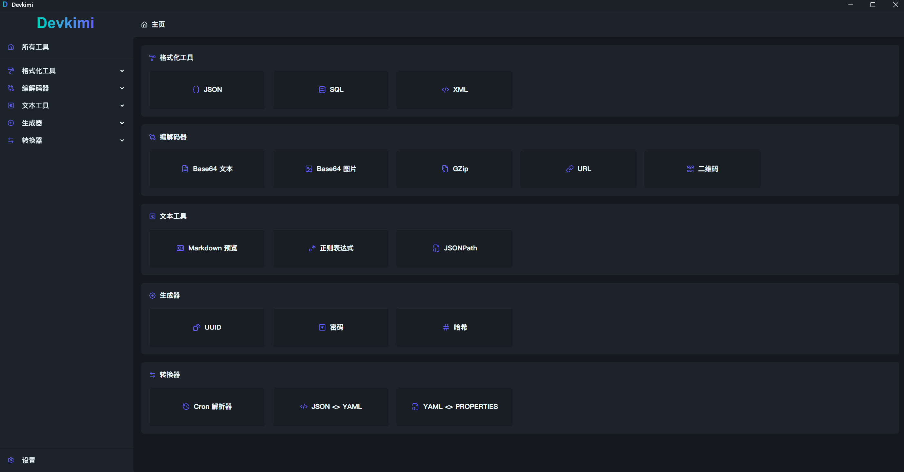

# devkimi


[](https://github.com/sodekim/devkimi)

devkimi 是一个基于 Tauri 和 SolidJS 构建的多功能开发者工具集，提供各种常用的开发辅助工具。项目灵感来自于 [DevToys](https://github.com/DevToys-app/DevToys.git)。

## 界面截图



## 功能特性

devkimi 包含以下六大功能模块：

### 🔄 编解码工具 (Codec)
- Base64 文本编解码
- Base64 图片编解码
- GZip 压缩与解压缩
- URL 编解码
- 二维码生成与解析

### 🎨 格式化工具 (Formatter)
- JSON 格式化
- SQL 格式化
- XML 格式化

### ⚡ 生成器 (Generator)
- UUID 生成
- 密码生成
- 哈希生成 (支持 MD5, SHA1, SHA256 等)

### 📝 文本工具 (Text)
- Markdown 预览
- 正则表达式测试
- JSONPath 查询

### 🔁 转换器 (Converter)
- Cron 表达式解析
- JSON/YAML 互转
- YAML/Properties 互转

### 🔐 加密 & 解密 (Crypto)
- RSA 加密/解密（支持 PKCS#1、PKCS#8 格式）
- SM2 加密/解密（支持 PEM、Hex 格式）
- SM4 加密/解密（支持多种分组模式）
- AES 加密/解密（支持 128/192/256 位密钥）
- DES/3DES 加密/解密

## 技术栈

- **前端框架**: [SolidJS](https://www.solidjs.com/)
- **构建工具**: [Vite](https://vitejs.dev/)
- **桌面应用框架**: [Tauri](https://tauri.app/)
- **样式库**: [TailwindCSS](https://tailwindcss.com/) + [DaisyUI](https://daisyui.com/)
- **语言**: TypeScript + Rust
- **包管理器**: pnpm

## 下载

- [GitHub Releases](https://github.com/sodekim/devkimi/releases)

## 快速开始

### 环境要求

- Node.js (推荐 LTS 版本)
- Rust (推荐最新稳定版)
- pnpm

### 安装依赖

```bash
pnpm install
```

### 开发模式

```bash
# 启动开发服务器
pnpm dev

# 或者直接使用 Tauri 启动桌面应用
pnpm tauri dev
```

### 构建应用

```bash
# 构建前端资源
pnpm build

# 构建桌面应用
pnpm tauri build
```

## 项目结构

```
.
├── src/                 # 前端源码
│   ├── components/      # 通用组件
│   ├── command/         # Tauri 命令封装
│   ├── view/            # 功能页面
│   │   ├── codec/       # 编解码工具
│   │   ├── formatter/   # 格式化工具
│   │   ├── generator/   # 生成器
│   │   ├── text/        # 文本工具
│   │   ├── converter/   # 转换器
│   │   ├── crypto/      # 加密解密工具
│   │   └── settings.tsx # 设置页面
│   ├── routes.tsx       # 路由配置
│   └── App.tsx          # 应用入口
├── src-tauri/           # Tauri 后端
│   ├── src/
│   │   └── command/     # Rust 命令实现
│   ├── Cargo.toml       # Rust 依赖配置
│   └── tauri.conf.json  # Tauri 配置
├── package.json         # 前端依赖配置
└── vite.config.ts       # Vite 配置
```

## 许可证

[MIT](LICENSE)

## 贡献

欢迎提交 Issue 和 Pull Request 来帮助改进 devkimi。